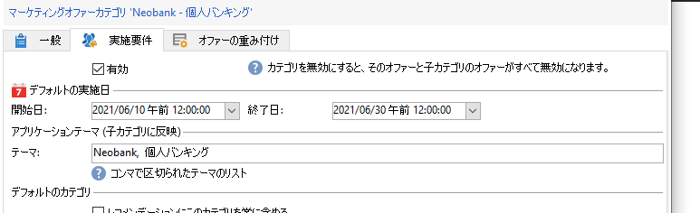
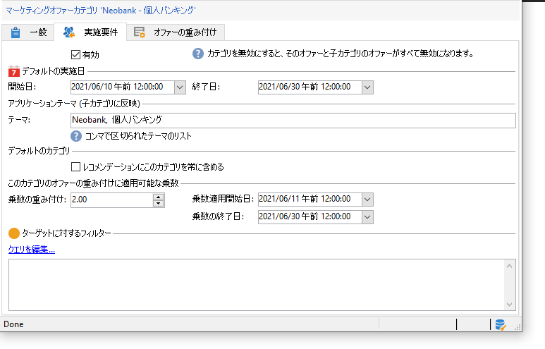

# オファーカタログの作成

**オファーマネージャ**&#x200B;として、オファーカタログの作成はお客様の責任で行います。

オファーカタログは、既存の単一の環境に関連付けられます。 このカタログ内のオファーは、この同じ環境で指定されたスペースにのみ関連付けることができます。

オファーを作成する前に、まず、一連のオファーのすべての特性(適格性、ターゲットの制約、プレゼンテーションルール)を含む[環境](interaction-env.md)を指定し、それらのスペースのリストと共にカテゴリに分類する必要があります。

## オファーカテゴリの作成{#creating-offer-categories}

オファーは、カテゴリ/サブカテゴリに分類されます。 カテゴリは&#x200B;**[!UICONTROL デザイン]**&#x200B;環境ーに作成され、含まれるオファーが承認されると自動的に&#x200B;**[!UICONTROL ライブ]**&#x200B;環境ーに展開されます（つまり、使用可能になります）。 **[!UICONTROL Design]**&#x200B;環境には、すべてのオファーを受け取るためのデフォルトのカテゴリが含まれています。 サブカテゴリを作成すると、カタログオファーに階層を追加できます。

各カテゴリに対して、**適格性の日付**&#x200B;を定義できます。これは、カテゴリに含まれるオファーをターゲットに提示する期間です。 また、カテゴリの重み付けを調整して、オファーの表示に優先順位を付けることもできます。

新しいカテゴリを作成するには、次の手順に従います。

1. **[!UICONTROL オファーカタログー]**&#x200B;フォルダーへのブラウザー。

   

1. 右クリックし、ドロップダウンリストから「**[!UICONTROL 新しい「オファーカテゴリ」フォルダーを作成]**」を選択します。

   

1. カテゴリの名前を変更します。「**[!UICONTROL 一般]**」タブを使用して、後でラベルを編集することもできます。

   

   >[!NOTE]
   >
   >これらの手順を、作成するカテゴリの数だけ繰り返します。

   その後、必要に応じて次の操作を実行します。

   * 「**[!UICONTROL 実施要件]**」タブで、実施日を割り当てます。

      

   * 「**[!UICONTROL テーマ]**」フィールドで、このカテゴリからオファーを選択するのに使用できるキーワードを入力します。

      

      >[!NOTE]
      >
      >オファーエンジンの呼び出し時には、テーマやカテゴリがパラメーターに合致した部分のみがカタログから選択されます。

   * 「**[!UICONTROL 乗数の重み付け]**」フィールドを使用して、一定期間、カテゴリのオファーの重み付けを一時的に「増加」させます。

      

カテゴリに含まれるオファーのダッシュボードでは、実施要件ルールの概要を確認できます。表示するには、オファーの「**[!UICONTROL スケジュールおよび実施要件ルール]**」リンクをクリックします。

## 代替追加カテゴリ

すべての受信者がオファーの提案を受け取れるように、システムで 1 つまたは様々なオファーカテゴリをレコメンデーションに追加できます。

これらのフォールバックオファーは、低い（ヌル以外の）重み付けを持つ必要があります。これにより、高い重み付けオファーが適格でない場合にのみ考慮されます。

また、レコメンデーションに必ず含められるよう、バックアップオファーにはプレゼンテーションルールが何も適用されていない状態にしておく必要があります。これは、提案の間に、より高い重み付けオファーが利用できない場合、受信者はこのカテゴリから少なくとも1つのオファーを受け取ることを意味します。

レコメンデーションにフォールバックカテゴリを含めるには、次の手順に従います。

1. オファーカタログを参照します。
1. 「**[!UICONTROL Eligibility]**」タブをクリックし、「**[!UICONTROL 常にこのカテゴリをrecommendations]**&#x200B;に含める」オプションを選択します。
1. 「**[!UICONTROL 保存]**」をクリックします。

   

