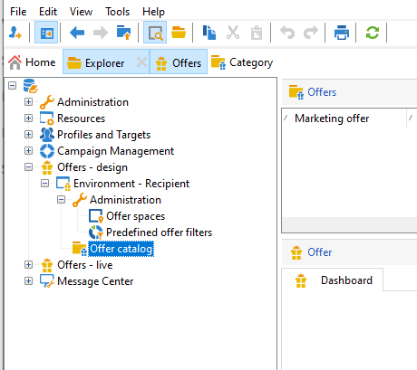
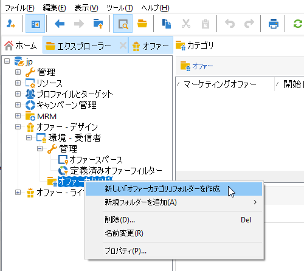
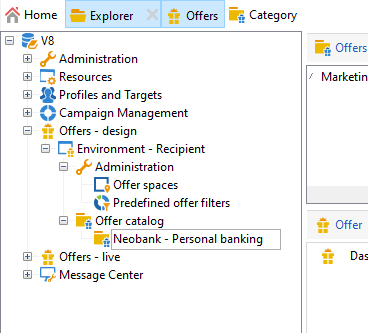
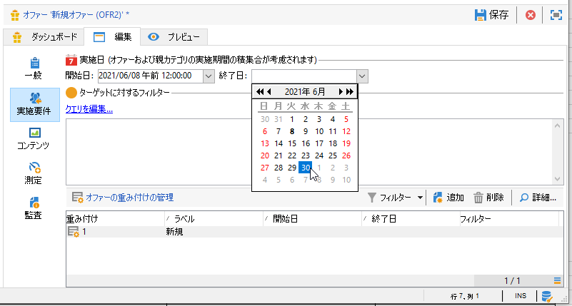
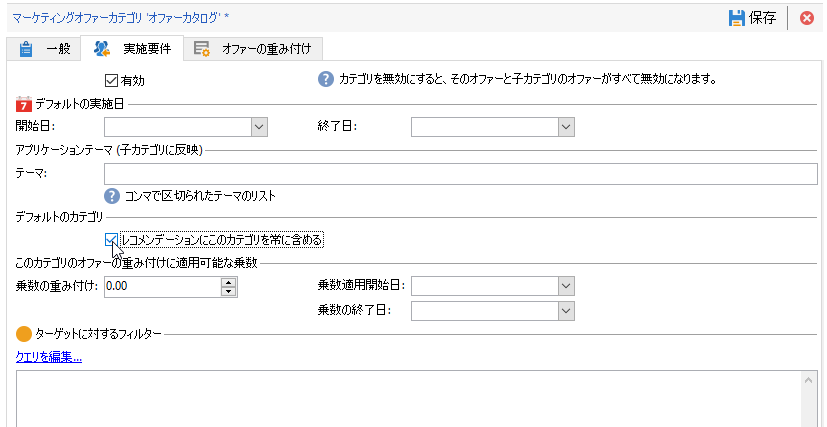

# オファーカタログの作成

**オファーマネージャー**&#x200B;は、オファーカタログの作成を担当します。

オファーカタログは、1つの既存の環境に関連付けられます。 このカタログ内のオファーは、この同じ環境で指定されたスペースにのみ関連付けることができます。

オファーを作成する前に、まず、一連のオファーのすべての特性（実施要件、ターゲットに対する制約、プレゼンテーションルール）をカテゴリに分類し、スペースのリストと共に含む[環境](interaction-env.md)を指定する必要があります。

## オファーカテゴリの作成{#creating-offer-categories}

オファーは、カテゴリ/サブカテゴリに整理されます。 カテゴリは&#x200B;**[!UICONTROL デザイン]**&#x200B;環境で作成され、含まれるオファーが承認されると、自動的に&#x200B;**[!UICONTROL ライブ]**&#x200B;環境にデプロイされます（つまり、利用可能になります）。 **[!UICONTROL デザイン]**&#x200B;環境には、すべてのオファーを受け取るデフォルトのカテゴリが含まれています。 サブカテゴリを作成すると、カタログオファーに階層を追加できます。

各カテゴリに対して、**実施日**&#x200B;を定義できます。この期間は、カテゴリに含まれるオファーをターゲットに提示できる期間です。 また、カテゴリの重み付けを調整して、オファーのプレゼンテーションを優先することもできます。

新しいカテゴリを作成するには、次の手順に従います。

1. **[!UICONTROL オファーカタログ]**&#x200B;フォルダーのブラウザー。

   

1. 右クリックし、ドロップダウンリストから「**[!UICONTROL 新しい「オファーカテゴリ」フォルダーを作成]**」を選択します。

   

1. カテゴリの名前を変更します。「**[!UICONTROL 一般]**」タブを使用して、後でラベルを編集することもできます。

   

   >[!NOTE]
   >
   >これらの手順を、作成するカテゴリの数だけ繰り返します。

   その後、必要に応じて次の操作を実行します。

   * 「**[!UICONTROL 実施要件]**」タブで、実施日を割り当てます。

      

   * **[!UICONTROL クエリを編]** 集して、オファーターゲットにフィルターを適用します。

   * 実施要件ルールの概要を表示するには、オファー&#x200B;]**の「**[!UICONTROL &#x200B;スケジュールおよび実施要件ルール」リンクをクリックします。

## フォールバックカテゴリの追加

すべての受信者がオファーの提案を受け取れるように、システムで 1 つまたは様々なオファーカテゴリをレコメンデーションに追加できます。

これらのフォールバックオファーは、重み付けが大きいオファーが実施要件を満たさない場合にのみ考慮されるように、重み付けが小さい（ただしnull以外の）必要があります。

また、レコメンデーションに必ず含められるよう、バックアップオファーにはプレゼンテーションルールが何も適用されていない状態にしておく必要があります。つまり、提案中に、重み付けの大きいオファーがない場合、受信者は、このカテゴリから少なくとも1つのオファーを受け取ります。

レコメンデーションにフォールバックカテゴリを含めるには、次の手順に従います。

1. オファーカタログを参照します。
1. 「**[!UICONTROL 実施要件]**」タブをクリックし、「**[!UICONTROL レコメンデーションにこのカテゴリを常に含める]**」オプションを選択します。
1. 「**[!UICONTROL 保存]**」をクリックします。

   

