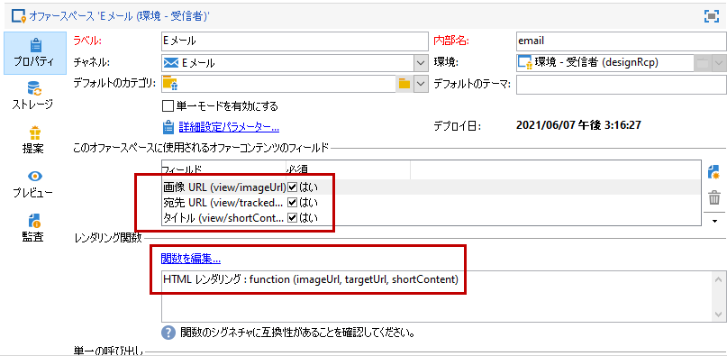
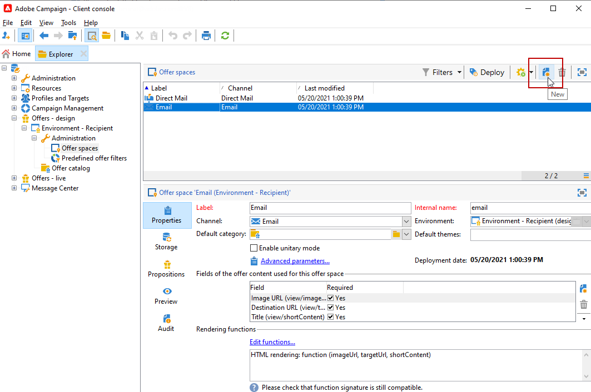
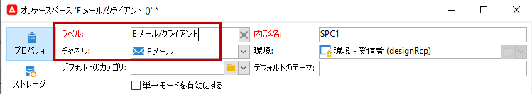
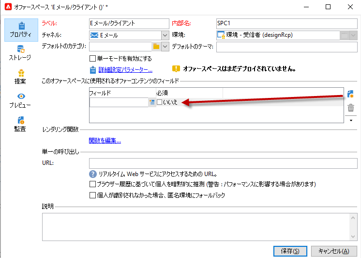
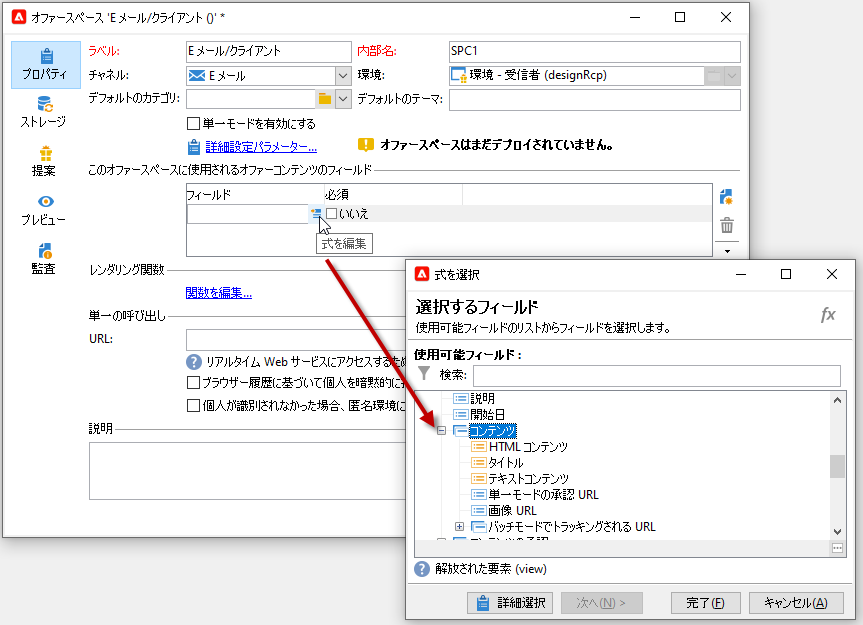
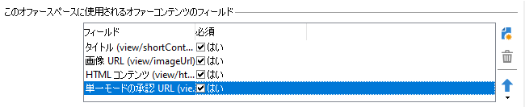
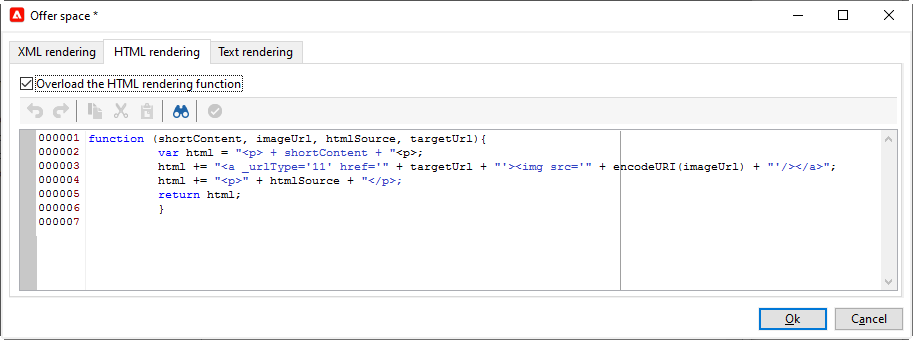
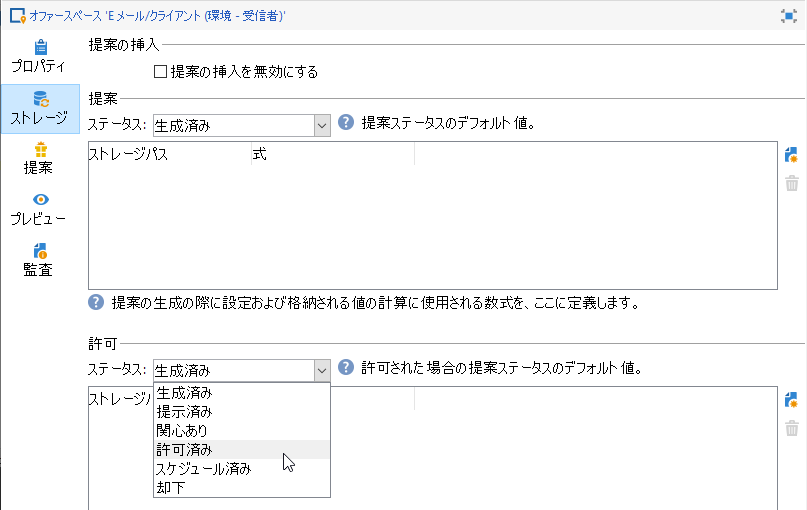
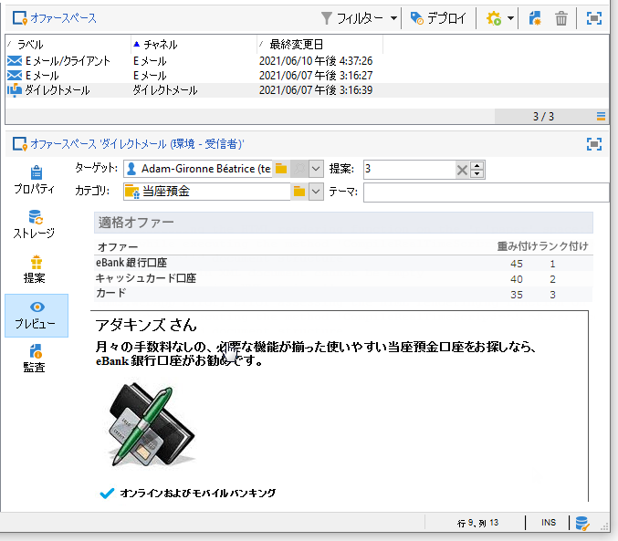
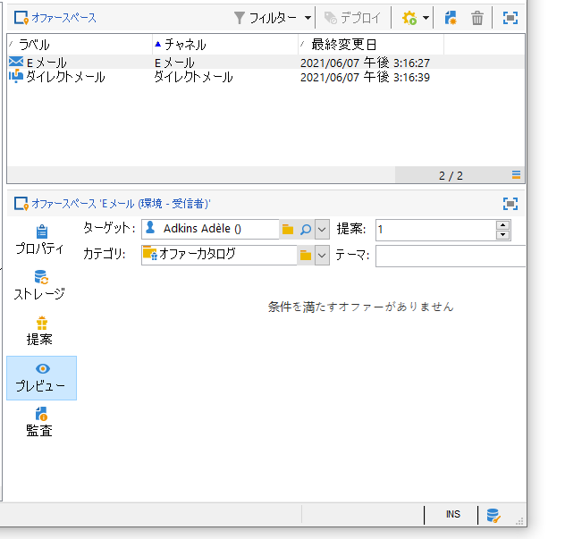

# オファースペースの作成{#creating-offer-spaces}

オファーカタログのコンテンツは、オファースペースに設定します。 デフォルトでは、コンテンツに含めることができるフィールドは、**[!UICONTROL タイトル]**、**[!UICONTROL 宛先 URL]**、**[!UICONTROL 画像 URL]**、**[!UICONTROL HTML コンテンツ]**&#x200B;および&#x200B;**[!UICONTROL テキストコンテンツ]**&#x200B;です。フィールドの順序は、オファースペースで設定します。

**技術管理者**&#x200B;は、デザイン環境にオファースペースを作成できます。 オファースペースのサブフォルダーにアクセスできる必要があります。 オファーを作成すると、オファーの承認時に、これらのオファースペースがライブ環境に自動的に複製されます。

HTMLレンダリングは、レンダリング関数を使用して作成されます。 レンダリング関数で定義するフィールドの順序は、コンテンツに設定した順序と同じである必要があります。



新しいオファースペースを作成するには、次の手順に従います。

1. オファースペースのリストで、「**[!UICONTROL 新規]**」をクリックします。

   

1. 使用するチャネルを選択して、オファースペースのラベルを変更します。

   

1. 「**[!UICONTROL 単一モードを有効にする]**」オプションをオンにします

1. **[!UICONTROL コンテンツフィールド]**&#x200B;ウィンドウに移動して、「**[!UICONTROL 追加]**」をクリックします。

   

1. **[!UICONTROL コンテンツ]**&#x200B;ノードに移動して、フィールドを「**[!UICONTROL タイトル]**」、「**[!UICONTROL 画像 URL]**」、「**[!UICONTROL HTML コンテンツ]**」、「**[!UICONTROL 宛先 URL]**」の順に選択します。

   

1. 各フィールドの「**[!UICONTROL 必須]**」オプションをオンにして、必須フィールドにします。

   >[!NOTE]
   >
   >このオプションはプレビューで使用され、パブリッシュ時にオファースペースが無効になります（必須フィールドの1つがオファーにない場合）。 ただし、既にオファースペース上でオファーがライブになっている場合は、これらの条件は考慮されません。

   

1. 「**[!UICONTROL 関数を編集]**」をクリックし、レンダリング関数を作成します。

   これは、オファースペース上にオファー表示域を生成するために使用される関数です。形式には、次のものがあります。HTMLまたはテキスト。

   **注意**  - XML形式は、一時的に使用できないインバウンドインタラクションに制限されます。[詳細情報](../start/capability-matrix.md#gs-unavailable-features)

   ]

1. 「**[!UICONTROL HTML レンダリング]**」タブに移動して、「**[!UICONTROL HTML レンダリング関数をオーバーロード]**」を選択します。
1. レンダリング関数を挿入します。

   

## オファーの提案ステータス {#offer-proposition-statuses}

オファーの提案ステータスは、ターゲット母集団とのインタラクションに応じて異なります。 キャンペーンインタラクションモジュールには、ライフサイクル全体を通じてオファーの提案に適用できる値のセットが付属しています。 オファーの提案が作成され承認される際にステータスが変化するように、プラットフォームを設定する必要があります。

>[!NOTE]
>
>ステータスの更新は、**非同期**&#x200B;プロセスです。 更新処理は、1 時間ごとにトリガーされるトラッキングワークフローによって実行されます。

### オファーステータスリスト{#status-list}

利用可能なオファーのステータスは次のとおりです。

* **[!UICONTROL 許可済み]**
* **[!UICONTROL スケジュール済み]**
* **[!UICONTROL 生成済み]**
* **[!UICONTROL 関心あり]**
* **[!UICONTROL 提示済み]**
* **[!UICONTROL 却下]**

これらの値は、デフォルトでは適用されません。設定する必要があります。

>[!NOTE]
>
>「送信済み」ステータスの配信にオファーがリンクされると、そのオファーの提案のステータスは自動的に「提示済み」に変更されます。

### 提案作成時のオファーステータス{#configuring-the-status-when-the-proposition-is-created}

オファーの提案が&#x200B;**作成**&#x200B;されると、そのステータスが更新されます。

**[!UICONTROL デザイン]**&#x200B;環境では、各オファースペースに対して、オファーレポートに表示する情報に応じて、提案の作成時に適用するステータスを設定します。

それには、次の手順に従います。

1. 目的のスペースの「**[!UICONTROL ストレージ]**」タブに移動します。
1. 提案の作成時に適用するステータスを選択します。

   

### 提案承認時のオファーステータス{#configuring-the-status-when-the-proposition-is-accepted}

オファーの提案が&#x200B;**承認された**&#x200B;ら、デフォルトで提供される値の1つを使用して、提案の新しいステータスを設定します。 受信者がオファーのリンクをクリックすると、更新が適用されます。

それには、次の手順に従います。

1. 目的のスペースの「**[!UICONTROL ストレージ]**」タブに移動します。
1. 提案が承認されたときに提案に適用するステータスを選択します。

   

<!--
**Inbound interaction**

The **[!UICONTROL Storage]** tab lets you define statuses for **proposed** and **accepted** offer propositions only. For inbound interaction, the status of offer propositions should be specified directly in the URL for calling the offer engine, rather than through the interface. This way, you will be able to specify which status to apply in other cases, for example if an offer proposition is rejected.

```
<BASE_URL>?a=UpdateStatus&p=<PRIMARY_KEY_OF_THE_PROPOSITION>&st=<NEW_STATUS_OF_THE_PROPOSITION>&r=<REDIRECT_URL>
```

For instance, the proposition (identifier **40004**) that matches the **Home insurance** offer displayed on the **Neobank** site contains the following URL:

```
<BASE_URL>?a=UpdateStatus&p=<40004>&st=<3>&r=<"http://www.neobank.com/insurance/subscribe.html">
```

As soon as a visitor clicks the offer, and therefore the URL, the **[!UICONTROL Accepted]** status (value **3**) is applied to the proposition and the visitor is redirected to a new page of the **Neobank** site to take out the insurance contract.

>[!NOTE]
>
>If you want to specify another status in the url (for example if an offer proposition is rejected), use the value corresponding to the desired status. Example: **[!UICONTROL Rejected]** = "5", **[!UICONTROL Presented]** = "1" and so on.
>
>Statuses and their values can be retrieved in the **[!UICONTROL Offer propositions (nms)]** data schema. For more on this, refer to [this page](../../configuration/using/data-schemas.md).

**Outbound interaction**
-->

配信にリンクが含まれる場合、オファーの提案に&#x200B;**[!UICONTROL 関心あり]**&#x200B;ステータスを自動的に適用できます。 単に **_urlType=&quot;11&quot;** という値をリンクに付加します。

```
<a _urlType="11" href="<DEST_URL>">Link inserted into the delivery</a>
```

## スペースごとのオファーのプレビュー {#offer-preview-per-space}

「**[!UICONTROL プレビュー]**」タブで、選択した方法で受信者が受ける資格があるオファーを表示できます。 次の例では、受信者は、郵便経由のオファー提案 3 件の実施要件を満たしています。



受信者にオファーを受ける資格がない場合は、プレビュー画面が表示されます。



<!--
The preview can ignore contexts when they are restricted to a space. This is the case when the interaction schema has been extended to add fields referenced in a space using an inbound channel (for more on this, refer to Extension example.
-->
