# オファーの作成

オファーを作成するには、次の手順に従います。

1. 「**[!UICONTROL キャンペーン]**」タブを参照し、「**[!UICONTROL オファー]**」リンクをクリックします。

1. 「**[!UICONTROL 作成]**」ボタンをクリックします。

1. ラベルを変更し、オファーが属するカテゴリを選択します。

1. 「**[!UICONTROL 保存]**」をクリックして、オファーを作成します。

   オファーが、プラットフォームで利用できるようになり、コンテンツを設定できるようになります。

## 適格性の設定

「**[!UICONTROL 適格性]**」タブを使用して、次の項目を定義できるようになりました。

* オファーの適格期間。 [詳細情報](#eligibility-period)
* オファーターゲット母集団のフィルター。 [詳細情報](#filters-on-the-target)
* オファー重み付け。 [詳細情報](#offer-weight)

### オファー適格期間{#eligibility-period}

オファーの&#x200B;**[!UICONTROL Eligibility]**&#x200B;タブで、オファーの適格性の期間を定義します。 ドロップダウンリストを使用して、カレンダーの開始と終了日を選択します。

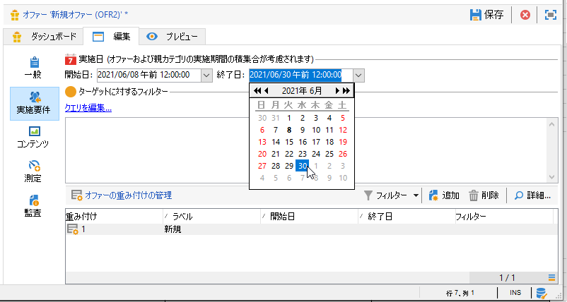

この期間を超えると、オファーは選択されません。 また、オファーカテゴリの実施日も設定されている場合は、最も厳しい制限期間が適用されます。

### ターゲット追加のフィルター{#filters-on-the-target}

オファーの&#x200B;**[!UICONTROL Eligibility]**&#x200B;タブで、オファーターゲットにフィルターを適用します。

フィルターを適用するには、「**[!UICONTROL クエリを編集]**」リンクをクリックし、適用するフィルターを選択します

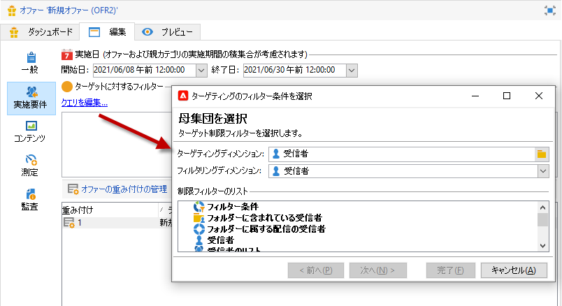

定義済みフィルターが既にある場合は、ユーザーフィルターのリストから選択できます。[詳細情報](interaction-predefined-filters.md)。

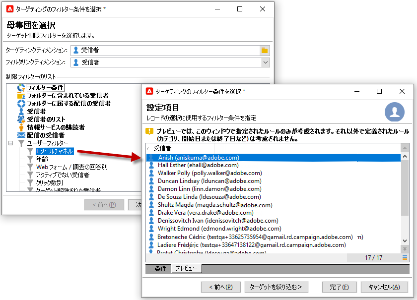

### オファー重み付けを設定{#offer-weight}

ターゲットが複数のオファーの実施要件を満たす場合のために、エンジンにどのオファーを選択させるかの条件を設定するには、オファーに重み付けを 1 つまたは複数割り当てます。また、必要に応じてターゲットにフィルターを適用したり、重み付けを適用するオファースペースを制限したりすることもできます。エンジンは、重み付けの小さいオファーよりも大きいオファーを優先して選択します。

例えば、期間、特定のターゲット、さらにはオファースペースを区別するために、同じオファーに複数の重み付けを設定できます。

例えば、コンタクト先の年齢が 18 歳から 25 歳までの場合は重み付け A を適用し、25 歳を超える場合は重み付け B を適用できます。または、夏の間ずっと有効なオファーについて、7 月には重み付け A を適用し、8 月には重み付け B を適用できます。

>[!NOTE]
>
>オファーに割り当てた重み付けの値を、そのオファーが属するカテゴリのパラメーターに従って一時的に修正させることもできます。[詳細情報](interaction-offer-catalog.md#creating-offer-categories)。

オファーの重み付けを作成するには、次の手順に従います。

1. オファーの「**[!UICONTROL Eligibility]**」タブで、「**[!UICONTROL 追加]**」をクリックします。

   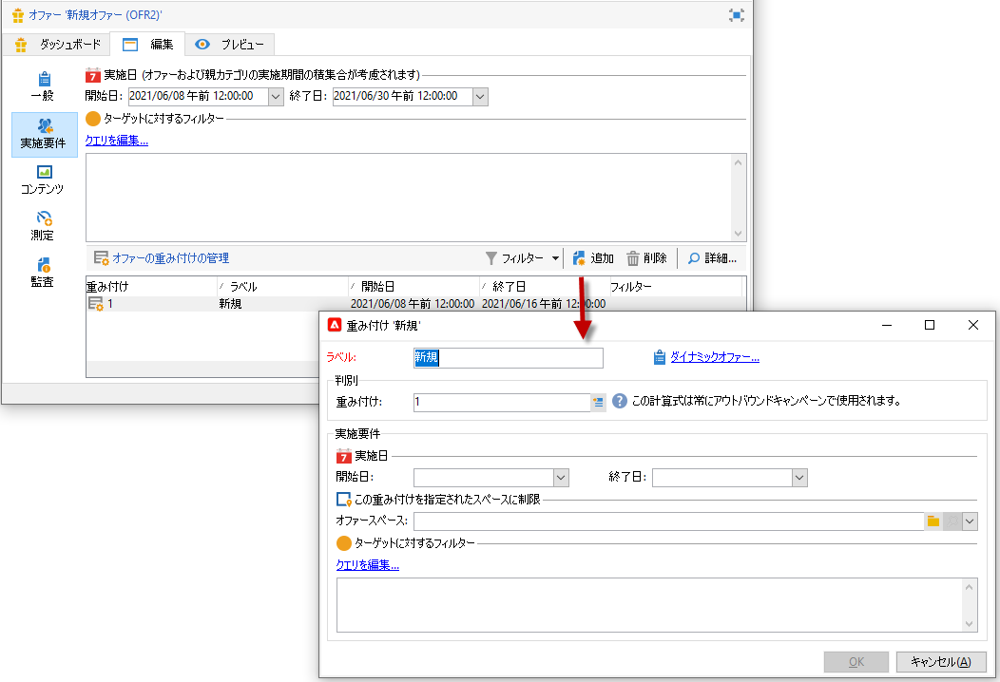

1. ラベルを変更し、重み付けを割り当てます。デフォルト値は 1 です。

   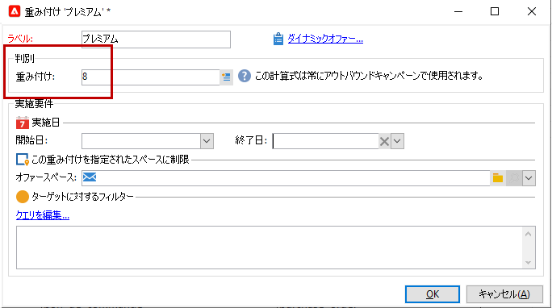

   >[!CAUTION]
   >
   >値を入力しない場合、重み付けは 0 になり、ターゲットがそのオファーの実施要件を満たすとは判断されなくなります。

1. 特定の期間を対象にして重み付けを適用するには、実施日を定義します。

   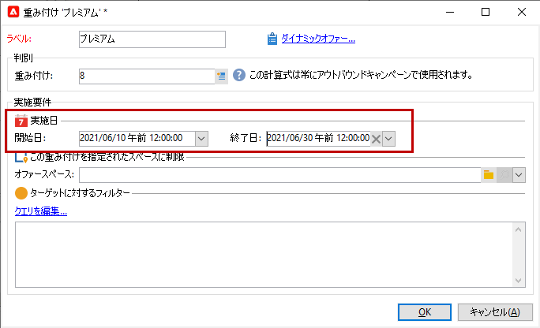

1. 必要に応じて、重み付けを特定のオファースペースに制限します。

   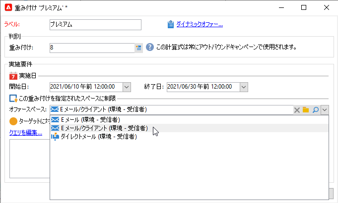

1. ターゲットにフィルターを適用します。

   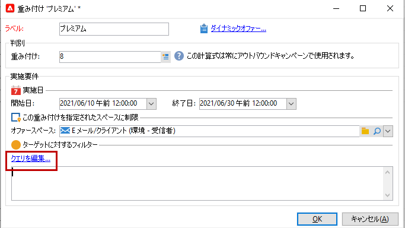

1. 「**[!UICONTROL OK]**」をクリックして重み付けを保存します。

   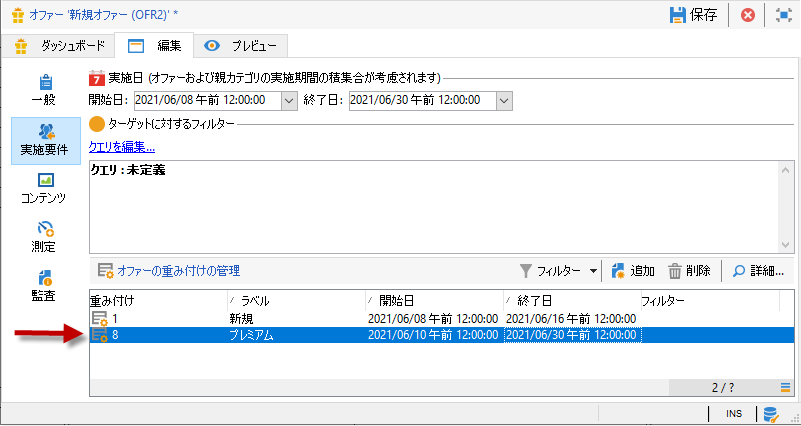

   >[!NOTE]
   >
   >選択されたオファーに関して、複数の重み付けの実施要件を満たすターゲットには、それらのうち最大の重み付けが適用されます。オファーエンジンの呼び出し時、1 つのオファーが選択される回数は、1 つのコンタクト先あたり最大 1 回です。

### オファーの適格要件ルールの概要 {#a-summary-of-offer-eligibility-rules}

設定が完了すると、実施要件ルールの概要をオファーダッシュボードで利用できるようになります。

概要を表示するには、「**[!UICONTROL スケジュールおよび実施要件ルール]**」リンクをクリックします。

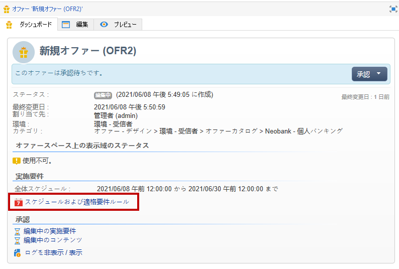

## オファーコンテンツの作成{#creating-the-offer-content}

「**[!UICONTROL コンテンツ]**」タブを使用して、オファーの内容を定義します。

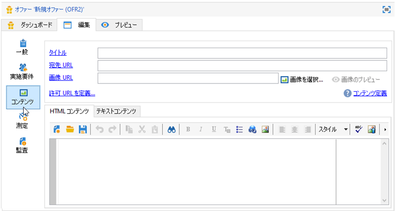

1. オファーコンテンツの様々なパラメーターを定義します。

   * **[!UICONTROL タイトル]**：オファーに表示させるタイトルを指定します。警告：これは、「**[!UICONTROL 一般]**」タブで定義されるオファーのラベルとは異なります。
   * **[!UICONTROL 宛先 URL]**：オファーの URL を指定します。&quot;http://&quot;または&quot;https://&quot;と開始する必要があります。
   * **[!UICONTROL 画像 URL]**：オファーの画像を示す URL またはアクセスパスを指定します。
   * **[!UICONTROL HTML コンテンツ]**／**[!UICONTROL テキストコンテンツ]**：オファーの本文を、目的のタブに入力します。トラッキングを生成するには、**[!UICONTROL HTML コンテンツ]**&#x200B;が、`<div>` タイプの要素に含めることができる HTML 要素で構成されている必要があります。例えば、HTML ページ内の `<table>` 要素の結果は次のようになります。

   ```
      <div> 
       <table>
        <tr>
         <th>Month</th>
         <th>Savings</th>   
        </tr>   
        <tr>    
         <td>January</td>
         <td>$100</td>   
        </tr> 
       </table> 
      </div>
   ```

   [このセクション](interaction-offer-spaces.md#configuring-the-status-when-the-proposition-is-accepted)で受け入れURLを定義する方法を説明します。

   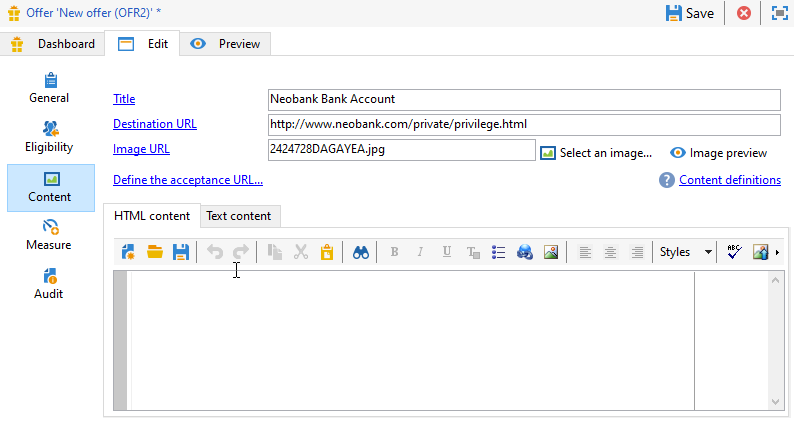

   オファースペースの設定時に定義された必須フィールドを確認するには、「**[!UICONTROL コンテンツ定義]**」リンクをクリックします。[詳細情報](interaction-offer-spaces.md)。

   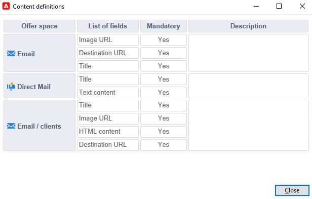

   この例では、オファーには、タイトル、画像、HTML コンテンツ、宛先 URL を含める必要があります。

## オファーのプレビュー{#previewing-the-offer}

オファーのコンテンツが設定されたら、オファーが受信者に表示されるとおりにプレビューできます。

手順は次のとおりです。

1. 「**[!UICONTROL プレビュー]**」タブをクリックします。

   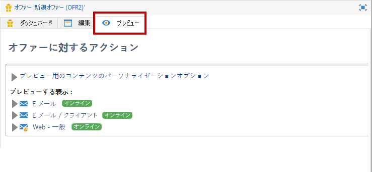

1. 表示したいオファーの表示域を選択します。

   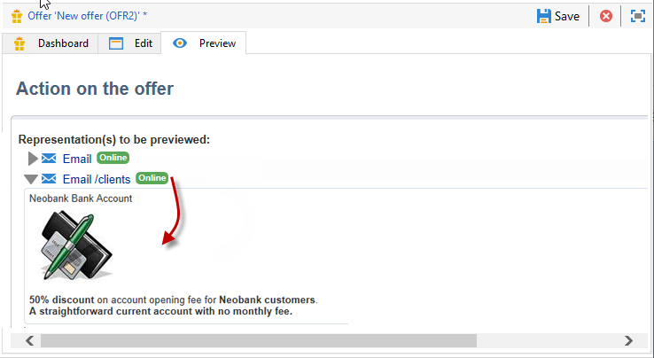

1. オファーコンテンツがパーソナライズされている場合、パーソナライゼーションを表示するオファーターゲットを選択します。

   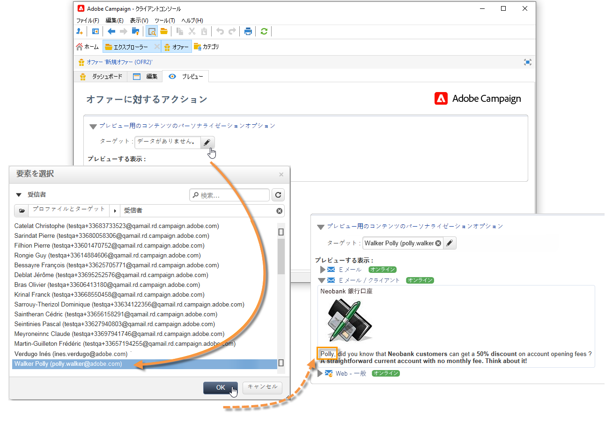

<!--

## Create a hypothesis on an offer {#creating-a-hypothesis-on-an-offer}

You can create hypotheses on your offer propositions. This lets you determine the impact of your offers on purchases carried out for the product concerned.

>[!NOTE]
>
>These hypotheses are carried out via Response Manager. Please check your license agreement.

Hypotheses carried out on an offer proposition are referenced in their **[!UICONTROL Measure]** tab.

Creating hypotheses is detailed in [this page](../../campaign/using/about-response-manager.md).

-->

## オファーの承認と有効化{#approve-offers}

これで、オファーを承認してアクティブ化し、**ライブ**&#x200B;環境で使用できるようにすることができます。

:arrow_upper_right:詳しくは、[Campaign Classicドキュメント](https://experienceleague.adobe.com/docs/campaign-classic/using/managing-offers/managing-an-offer-catalog/approving-and-activating-an-offer.html?lang=en#approving-offer-content)を参照してください

## オファープレゼンテーションの管理{#offer-presentation}

キャンペーンを使用すると、プレゼンテーションルールを使用してオファーの提案の流れを制御できます。 キャンペーンの操作に固有のこれらのルールは、**タイポロジルール**&#x200B;です。 タイポロジルールを利用すると、既に受信者に送信された提案の履歴に基づいてオファーを除外できます。ルールは環境内で参照されます。.

:arrow_upper_right:詳しくは、[Campaign Classicドキュメント](https://experienceleague.adobe.com/docs/campaign-classic/using/managing-offers/managing-an-offer-catalog/managing-offer-presentation.html?lang=en#managing-offers)を参照してください

## オファーシミュレーション

シミュレーションモジュールを使用すると、提案を受信者に送信する前に、1 つのカテゴリまたは環境に属するオファーの配分をテストできます。

シミュレーションでは、オファーとそのプレゼンテーションルールに以前適用したコンテキストと実施要件ルールを考慮に入れています。 ターゲットの受信者はシミュレーションの影響を受けないので、これにより、実際にオファーを使用したり、ターゲットを拡大または縮小したりしなくても、オファーの提案の様々なバージョンをテストして調整できます。

:arrow_upper_right:オファーのシミュレーションについて詳しくは、[Campaign Classicドキュメント](https://experienceleague.adobe.com/docs/campaign-classic/using/managing-offers/simulating-offers/about-offers-simulation.htm)を参照してください
