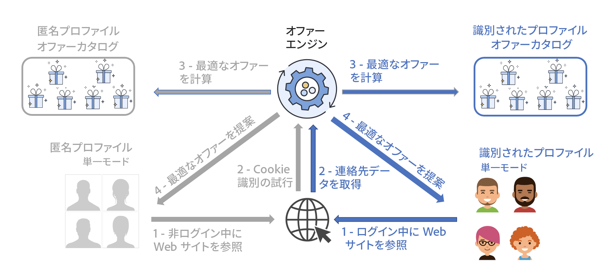

# 最適なオファーを提示{#interaction-present-offers}

オファーは、 [インバウンドチャネルまたはアウトバウンドチャネル](interaction-architecture.md#interaction-types). この章では、インバウンドチャネルについていくつかの具体的な機能を説明します。

オファーがオファーエンジンによって選択されるようにするには、承認され、ライブ環境で利用できる必要があります。

 詳しくは、[Campaign Classic v7 ドキュメント](https://experienceleague.adobe.com/docs/campaign-classic/using/managing-offers/managing-an-offer-catalog/approving-and-activating-an-offer.html?lang=ja#approving-offer-content)を参照してください。

インバウンドコンタクト先の場合、ページを閲覧しているユーザーは Web サイトで識別できます。 オファーエンジンは、識別されたプロファイルと匿名プロファイルに対して、異なるオファーを表示します。

インバウンドチャネルでオファーを提示できるようにする前に、オファーを提示する場所にオファーエンジン呼び出しを設定する必要があります。 インバウンドインタラクションでは、ほとんどの場合、これは Web ページです。

>[!NOTE]
>
>インバウンドインタラクションの場合、1 つ以上のオファーを提示および更新するようにオファーエンジンを具体的に設定する必要があります。
>
>また、オファースペースで単一モードを有効にする必要があります。詳しくは、[このページ](interaction-offer-spaces.md)を参照してください。
