# オファーの送信

オファーがオファーエンジンによって選択されるためには、承認済みで、**ライブ**&#x200B;環境で使用できます。 [詳細情報](interaction-offer.md#approve-offers)

送信通信チャネルを介したオファー提示は、ダイレクトメール、電子メール、またはモバイル配信を介して行う。 また、トランザクションメッセージング(Message Center)でユニタリモードを使用することもできます。

## オファーを配信に挿入{#offer-into-a-delivery}

配信にオファーの提案を挿入するには、次の手順に従います。

1. 配信ウィンドウで、**オファー**&#x200B;アイコンをクリックします。

   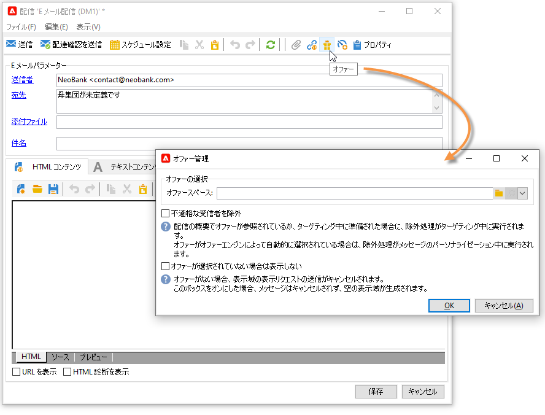

1. オファー環境に合致するスペースを選択します。

   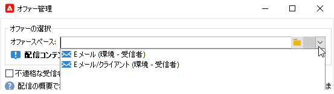

1. エンジンによるオファー選択を調整するには、提示するオファーが含まれるカテゴリを選択するか、1 つまたは複数のテーマを選択します。制限のオーバーロードを避けるために、これらのフィールドは一度に 1 つのみ使用することをお勧めします。

   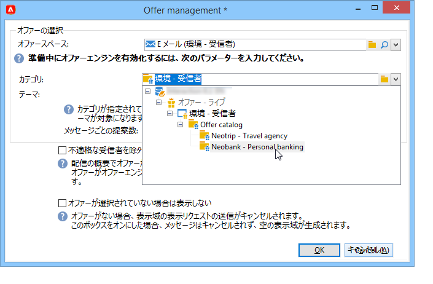

   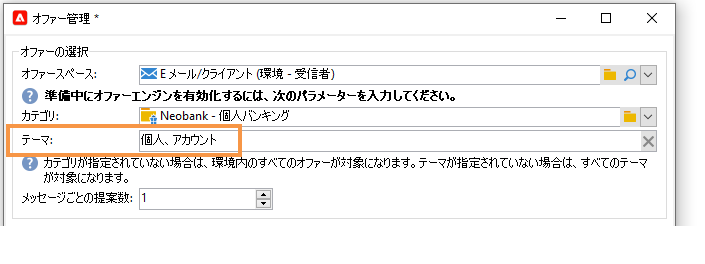

1. 配信の本文に挿入するオファーの数を指定します。

   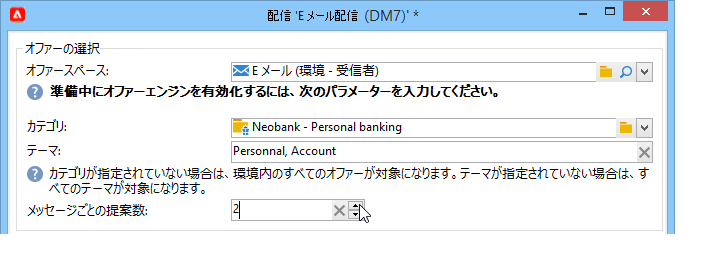

1. 必要に応じて、「**[!UICONTROL 不適格な受信者を除外]**」オプションを選択します。[詳細情報](#parameters-for-calling-offer-engine)。

   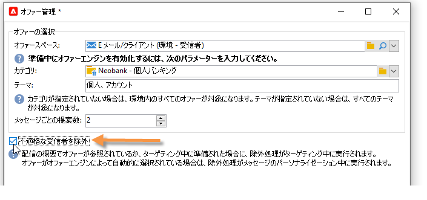

1. 必要に応じて、「**[!UICONTROL オファーが選択されていない場合は何も表示しない]**」オプションを選択します。 [詳細情報](#parameters-for-calling-offer-engine)。

   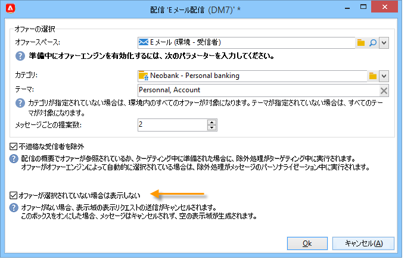

1. 差し込み印刷フィールドを使用して、配信コンテンツにプロパティを挿入します。 使用可能な提案の数は、エンジンの呼び出しがどのように設定されているかによって異なります。また、提案の順序は、オファーの優先順位によって異なります。

   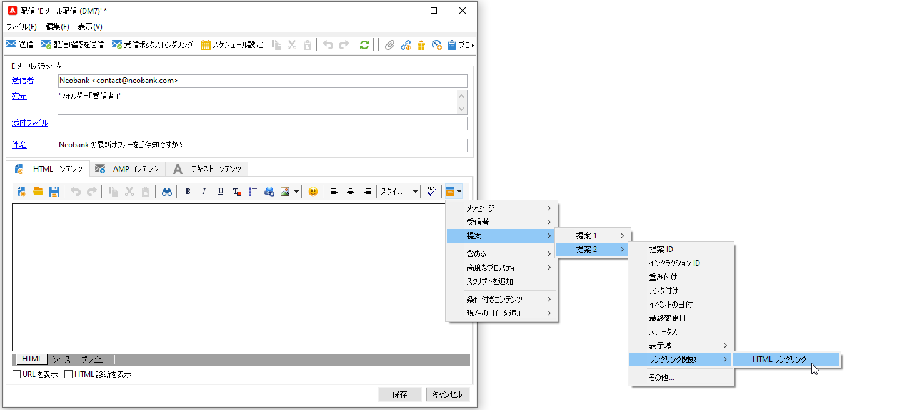

1. コンテンツを完成させ、配信をテストして送信します。

   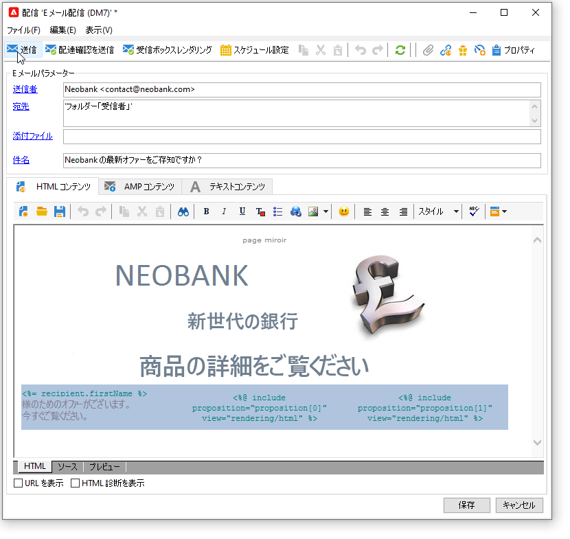

### オファーエンジンのパラメーター{#parameters-for-calling-offer-engine}

* **[!UICONTROL スペース]**：オファーエンジンを有効化するために選択する必要がある、オファー環境のスペース。
* **[!UICONTROL カテゴリ]**：オファーが分類される特定のフォルダー。カテゴリが指定されてない場合、テーマが選択されていない限り、その環境に含まれるすべてのオファーがオファーエンジンによって考慮されます。
* **[!UICONTROL テーマ]**：カテゴリの上流で定義されたキーワード。これらはフィルターとして機能し、カテゴリのセットで選択することで、提示されるオファーの数を調整できます。
* **[!UICONTROL 提案数]**：エンジンによって返される、配信の本文に挿入可能なオファーの数。メッセージに挿入されなくても、オファーは生成されますが、提示はされません。
* **[!UICONTROL 不適格な受信者を除外]**：このオプションを使用すると、オファーの実施要件を満たさない受信者の除外を有効または無効にすることができます。実施要件を満たす提案の数は、リクエストされた提案数よりも少ないことがあります。このボックスをオンにすると、十分な提案が揃わない受信者が配信から除外されます。オフにすると、そのような受信者は、除外はされませんが、リクエストされた数の提案を受け取ることはできません。
* **[!UICONTROL オファーが選択されていない場合は表示しない]**：このオプションを使用すると、提案の 1 つが存在しない場合に、どのようにメッセージを処理するかを選択できます。このボックスをオンにすると、見つからない提案の表示域が表示されず、その提案に関するコンテンツは、メッセージに表示されません。このボックスをオフにすると、送信中にメッセージ自体がキャンセルされ、受信者は、すべてのメッセージを受信しなくなります。

## ワークフローでのオファーの送信

ワークフローアクティビティの中には、オファーの表示方法を定義できるものもあります。

* エンリッチメント
* オファーエンジン
* オファー（セル別）

### エンリッチメント {#enrichment}

**エンリッチメント**&#x200B;アクティビティを使用すると、配信受信者のオファーにオファーやリンクを追加できます。

:arrow_upper_right:エンリッチメントアクティビティについて詳しくは、[Campaign Classicドキュメント](https://experienceleague.adobe.com/docs/campaign-classic/using/automating-with-workflows/targeting-activities/enrichment.html)を参照してください

例えば、配信の前に受信者クエリ用のデータをエンリッチメントできます。

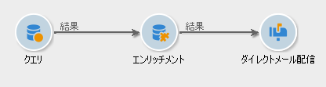

オファー提案を指定するには、2 つの方法があります。

* オファーまたはオファーエンジンの呼び出しを指定する。
* オファーへのリンクを参照する。

#### オファーまたはオファーエンジン{#specifying-an-offer-or-a-call-to-the-offer-engine}への呼び出しを指定

**クエリ**&#x200B;アクティビティの設定後：

1. 追加&#x200B;**エンリッチメント**&#x200B;アクティビティを開きます。
1. 「**[!UICONTROL エンリッチメント]**」タブで、「**[!UICONTROL データを追加]**」を選択します。
1. 追加するデータタイプで「**[!UICONTROL オファーの提案]**」を選択します。

   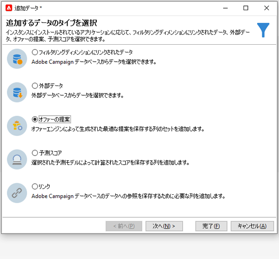

1. 追加される提案の識別子とラベルを指定します。
1. オファーの選択を指定します。これには、次の 2 つのオプションを使用できます。

   * **[!UICONTROL カテゴリ内で最適なオファーを検索]**：このオプションをオンにして、オファーエンジン呼び出しパラメーター（オファースペース、カテゴリまたはテーマ、コンタクト日、保持するオファーの数）を指定します。エンジンは、これらのパラメーターに基づいて、追加するオファーを自動的に計算します。「**[!UICONTROL カテゴリ]**」フィールドと「**[!UICONTROL テーマ]**」フィールドは、両方同時には使用せず、どちらか一方のみ入力することをお勧めします。

      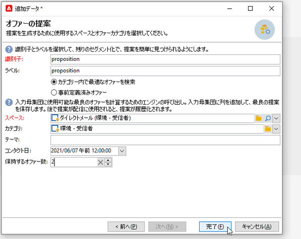

   * **[!UICONTROL 事前定義済みオファー]**：このオプションをオンにして、オファースペース、特定のオファーおよびコンタクト日を指定し、オファーエンジンを呼び出すことなく、追加するオファーを直接設定します。

      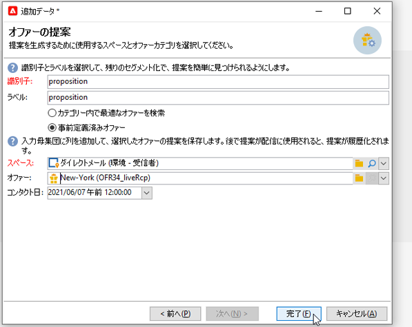

1. 次に、選択したチャネルに対応する配信アクティビティを設定します。[詳細情報](#offer-into-a-delivery)。

   >[!NOTE]
   >
   >プレビュー可能な提案の数は、配信で直接実行された設定ではなく、エンリッチメントアクティビティで実行された設定によって決まります。

#### オファーへのリンクの参照{#referencing-a-link-to-an-offer}

また、**エンリッチメント**&#x200B;アクティビティ内のオファーへのリンクを参照することもできます。

それには、次の手順に従います。

1. アクティビティの「**[!UICONTROL エンリッチメント]**」タブで「**[!UICONTROL データを追加]**」を選択します。
1. 追加するデータのタイプを選択するウィンドウで、「**[!UICONTROL リンク]**」を選択します。
1. 設定するリンクのタイプとターゲットを選択します。この場合、ターゲットはオファースキーマです。

   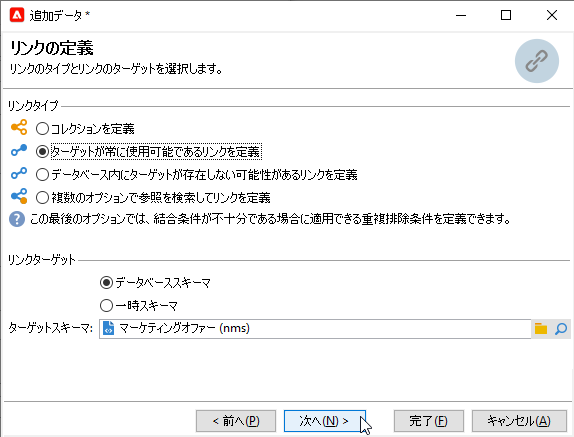

1. エンリッチメントアクティビティのインバウンドテーブルデータ（ここでは受信者テーブル）とオファーテーブルとの結合を指定します。例えば、オファーコードを受信者にリンクできます。

   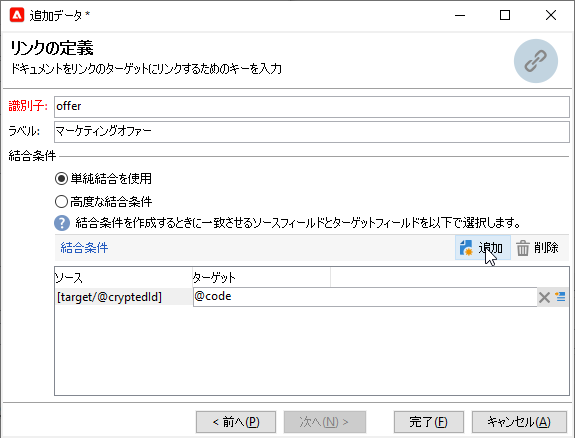

1. 次に、選択したチャネルに対応する配信アクティビティを設定します。[詳細情報](#offer-into-a-delivery)。

   >[!NOTE]
   >
   >プレビュー可能な提案の数は、配信で実行された設定によって決まります。

#### オファーのランクと重み付け{#storing-offer-rankings-and-weights}

デフォルトでは、**エンリッチメント**&#x200B;アクティビティを使用してオファーを配信する場合、ランクとその重み付けは提案テーブルに保存されません。

>[!NOTE]
>
>「**[!UICONTROL オファーエンジン]**」アクティビティは、デフォルトではこの情報を格納しませんが、

次の方法でこの情報を保存することができます。

1. エンリッチメントアクティビティ内で、クエリの後、配信アクティビティの前に、オファーエンジンの呼び出しを作成します。[詳細情報](../../interaction/using/integrating-an-offer-via-a-workflow.md#specifying-an-offer-or-a-call-to-the-offer-engine)。
1. アクティビティのメインウィンドウで「**[!UICONTROL 追加データを編集...]**」を選択します。

   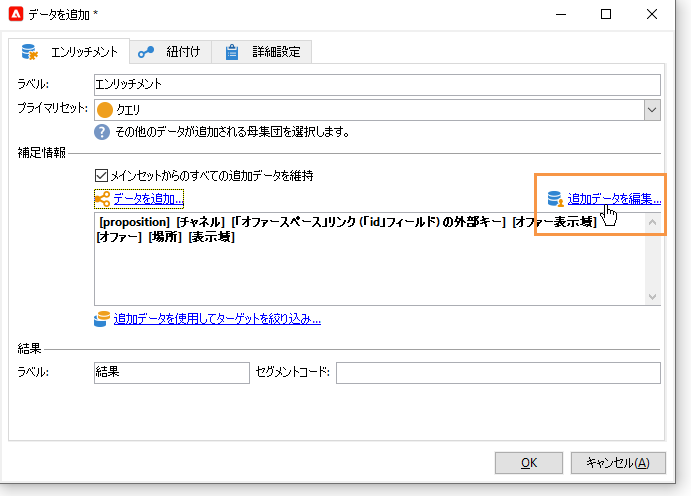

1. ランキング用に「**[!UICONTROL @rank]**」列を追加し、オファーの重み付け用に「**[!UICONTROL @weight]**」列を追加します。

   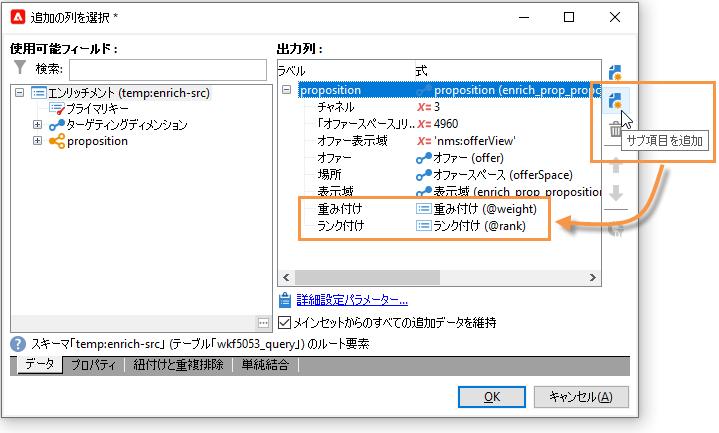

1. 追加を確認し、ワークフローを保存します。

これで、オファーのランキングと重み付けが自動的に格納されるようになります。この情報は、配信の「**[!UICONTROL オファー]**」タブに表示されます。

### オファーエンジン {#offer-engine}

「**[!UICONTROL オファーエンジン]**」アクティビティも、配信の前にオファーエンジンの呼び出しを指定できます。

:arrow_upper_right:**オファーエンジン**&#x200B;のアクティビティについて詳しくは、[Campaign Classicドキュメント](https://experienceleague.adobe.com/docs/campaign-classic/using/automating-with-workflows/targeting-activities/offer-engine.html)を参照してください

このアクティビティは、配信の前に、エンジンが計算したオファーでインバウンド母集団データを富化することにより、エンジンコールを使用する&#x200B;**エンリッチメント**&#x200B;アクティビティと同じ原則に基づいて動作します。

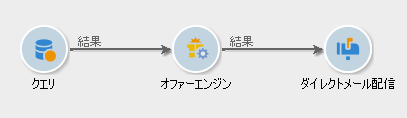

**クエリ**&#x200B;アクティビティの設定後：

1. 「**[!UICONTROL オファーエンジン]**」アクティビティを追加し、開きます。
1. 使用可能な各種フィールドに入力して、オファーエンジンパラメーター（オファースペース、カテゴリまたはテーマ、コンタクト日、保持するオファー数）への呼び出しを指定します。エンジンは、これらのパラメーターに基づいて、追加するオファーを自動的に計算します。

   >[!CAUTION]
   >
   >このアクティビティを使用する場合、配信に使用されたオファーの提案のみが格納されます。

   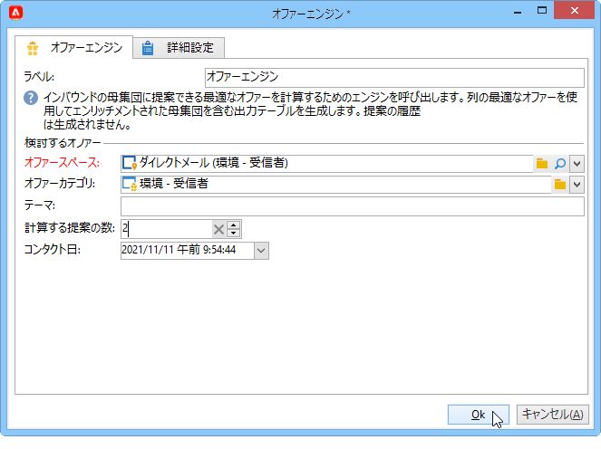

1. 次に、選択したチャネルに対応する配信アクティビティを設定します。[詳細情報](inserting-an-offer-proposition-into-a-delivery)。

### オファー（セル別） {#offers-by-cell}

「**[!UICONTROL オファー（セル別）]**」アクティビティでは、インバウンド母集団（例：クエリから）を複数のセグメントに分散させ、それらの各セグメントに提示するオファーを指定できます。

:arrow_upper_right:**セル**&#x200B;オファーの詳細については、[Campaign Classicドキュメント](https://experienceleague.adobe.com/docs/campaign-classic/using/automating-with-workflows/targeting-activities/offers-by-cell.html)を参照してください

それには、次の手順に従います。

1. ターゲットの母集団を指定したら、「**[!UICONTROL オファー（セル別）]**」アクティビティを追加して、それを開きます。
1. 「**[!UICONTROL 一般]**」タブで、オファーを提示するオファースペースを選択します。
1. 「**[!UICONTROL セル]**」タブで「**[!UICONTROL 追加]**」ボタンをクリックして、別のサブセットを指定します。

   * 適用可能なフィルタリングおよび制限ルールを使用して、サブセットの母集団を指定します。
   * サブセットに提示するオファーを選択します。利用できるオファーは、前の手順で選択したオファー環境で実施要件を満たすオファーです。

      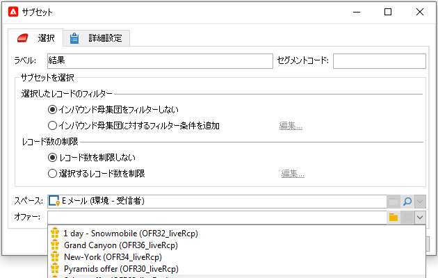

1. 次に、選択したチャネルに対応する配信アクティビティを設定します。詳しくは、[配信へのオファー提案の挿入](../../interaction/using/integrating-an-offer-via-the-wizard.md#inserting-an-offer-proposition-into-a-delivery)の節を参照してください。

<!--

## Delivering with delivery outlines {#delivering-with-delivery-outlines}

You can also present offers in a delivery using delivery outlines.

For more information on delivery outlines, refer to the Campaign - MRM guide.

1. Create a new campaign or access an existing campaign.
1. Access the delivery outlines via the campaign's **[!UICONTROL Edit]** > **[!UICONTROL Documents]** tab.
1. Add an outline then insert as many offers as you like into it by right-clicking on the outline and selecting **[!UICONTROL New]** > **[!UICONTROL Offer]**, then save the campaign.

1. Create a delivery whose delivery outlines you have access to (for example, a direct mail delivery).
1. When editing the delivery, click **[!UICONTROL Select a delivery outline]**.

   >[!NOTE]
   >
   >Depending on the type of delivery, this option can be found in the **[!UICONTROL Properties]** > **[!UICONTROL Advanced]** menu (for email deliveries for example).

1. Using the **[!UICONTROL Offers]** button, you can then configure the offer space as well as the number of offers to present in the delivery.

1. Add the propositions into the delivery body using the personalization fields (for more on this, refer to the [Inserting an offer proposition into a delivery](#inserting-an-offer-proposition-into-a-delivery) section), or in the case of a direct mail delivery, by editing the extraction file format.

   Propositions will be selected from the offers referenced in the delivery outline.

   >[!NOTE]
   >
   >Information regarding the offer rankings and weights is only saved in the proposition table if the offers are generated directly in the delivery.
-->
