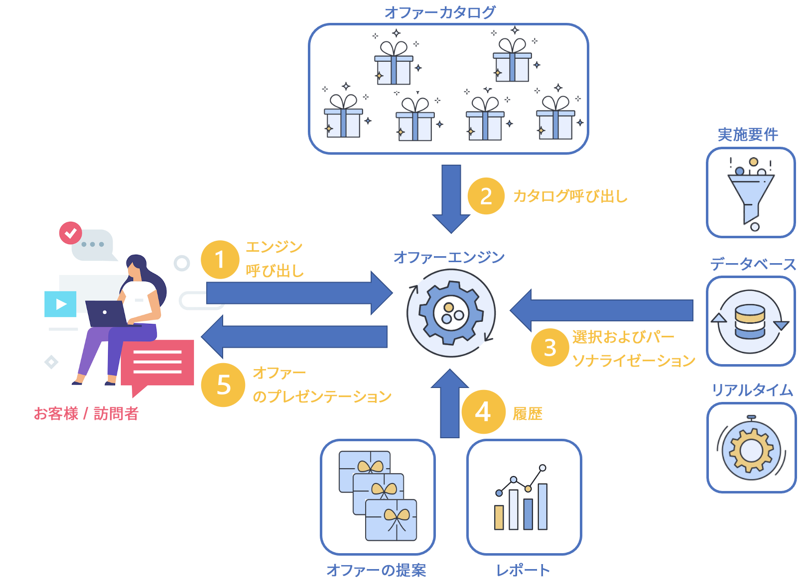

# リアルタイムインタラクションの管理

キャンペーンには **インタラクション** モジュール：特定の連絡先（顧客またはターゲット）とのインタラクション中に、1 つまたは複数の適応したオファーを提供することで、リアルタイムで応答できるようにします。 例えば、簡単な通信メッセージ、1 つまたは複数の製品やサービスの特別オファーなどです。

アウトバウンドチャネル（電子メール、ダイレクトメール、SMS）と連動するオファーカタログを作成して、特定のコンテキストで連絡先に送信する最適なオファーを選択できます。受信者に最適なオファー選択は、**適格要件ルール**&#x200B;に基づいています。 関連するオファーの中からどのオファーを選択するかは、優先度ルールを用いて決定されます。オファーのプレゼンテーションルールでは連絡先とのやり取りの履歴が考慮されるので、同じ連絡先に同じオファーが繰り返し送信されることはありません。

インタラクションではオファーのカタログを作成して管理することができ、カタログにリンクされた実施要件ルールとアプリケーションテーマを設定することもできます。様々なレンダリング関数を活用することで、選択したチャネルに応じてオファーコンテンツをパーソナライズできます。最後に、シミュレーションモジュールを使用してオファー表示域の影響を計算できます。

最初に、顧客と会社の間で通信チャネルを介してコンタクトが発生します。web サイト（アウトバウンドインタラクション）、e メール、SMS、プッシュ通知（インバウンドインタラクション）にすることができます。 [詳細情報](#interaction-types)

この連絡先は、オファーエンジンを呼び出します。 (1)

オファーエンジンの呼び出しが発生すると、提案のオファー設定の数に応じて、1 つまたは複数のオファーがオファーカタログから選択されます。 (2)

次に、実施要件ルールが適用されます。最適なオファーは、実施要件ルール、オファーの開始日と終了日、プロファイルデータ、お客様のリアルタイム動作に基づいて選択されます。 (3)

プロファイルの提案履歴は、選択がおこなわれると更新され、提示されるオファーの重複を避けるためです。 (4)

最後に、最適なオファーがターゲットに提案されます。 (5)

## オファーの概要

主な開始手順を以下に示します。

### プラットフォームの設定

開始する前に、Campaign **管理者**&#x200B;として、デザイン環境で次のタスクを実行していることを確認してください。

1. ユーザープロファイルを作成します。[詳細](interaction-operators.md)
1. （オプション）ターゲティングディメンションごとにオファー環境を作成します。[詳細情報](interaction-env.md)
1. 各環境のタイポロジルールを作成します。[詳細](interaction-offer.md#offer-presentation)
1. 各環境のオファースペースを作成し、レンダリング関数を設定します。[詳細](interaction-offer-spaces.md)
スペースが識別モードで単一のチャネルによって定義される場合は、このスペースの詳細なパラメーターを指定する必要があります。

   >[!NOTE]
   >
   >スペースが特定モードの単一チャネルで定義されている場合は、このスペースの詳細設定パラメーターを指定する必要があります。

1. 1 つまたは複数のオファーを提示および更新するために、インバウンドインタラクション向けのオファーエンジンを設定します。

   様々な統合モードについて詳しくは、 [この節](interaction-present-offers.md).

   >[!NOTE]
   >
   >インバウンド Web チャネルにスペースを作成する場合、オファーが表示されるサイトに対しても設定が必要です。

### オファーカタログの作成と公開 {#managing-the-offer-catalog-}

**オファーマネージャー**&#x200B;は、次のタスクを実行する必要があります。

1. デザイン環境でオファーカテゴリを作成します。[詳細](interaction-offer-catalog.md#creating-offer-categories)
1. デザイン環境でオファーを作成します。[詳細](interaction-offer.md)
1. 1 つ以上のスペース上でオファーを承認および公開し、ライブ環境で配信マネジャーがオファーを利用できるようにします。[詳細](interaction-offer.md#approve-offers)

### オファーカタログの活用 {#using-the-offer-catalog-}

**配信マネジャー**&#x200B;は、次のタスクを実行する必要があります。

1. キャンペーンを作成します。
1. キャンペーンまたは配信でオファーを参照します。 [詳細情報](interaction-send-offers.md)。

## 用語集

始める前に、オファー固有の用語と関連ガイダンスを確認してください。

* **環境**：オファーカタログとフック（オファースペース）を含むセット。ターゲティングディメンションごとに 1 つの環境を作成する必要があります。環境には次の 2 つのタイプがあります。

   * **デザイン環境**：オファーを作成し、タイポロジルール（特定のターゲットユーザーにどのオファーを提示し、どのオファーを提示しないかを決定するルール）を定義する環境。この環境では、オファーの対象となる個人のテーブルと、オファーの提案をすべて保存するためのテーブルの定義もおこないます。**[!UICONTROL デザイン環境]**&#x200B;ノードにはオファースペースのサブフォルダー、定義済みフィルターおよびオファーカテゴリが含まれています。**[!UICONTROL デザイン環境]**&#x200B;ごとに、対応する読み取り専用の&#x200B;**[!UICONTROL 実稼働環境]**&#x200B;が 1 つずつ存在します。実稼働環境は同じ&#x200B;**[!UICONTROL デザイン環境]**&#x200B;から生成されます。
   * **ライブ環境**：**[!UICONTROL デザイン環境]**&#x200B;にリンクされた環境。実稼働環境には、**[!UICONTROL デザイン環境]**&#x200B;でコンテンツと実施要件の承認を受けた読み取り専用のオファーが含まれています。これらのオファーの中から Web サイトで提示するオファーやメッセージに挿入するオファーが選択されます。

* **オファースペース**：オファーを公開する場所を定義するフォルダー。スペースの定義では、使用するチャネルの指定、スペースを単一モードで使用できるようにするかの指定（デフォルトでは、バッチモードでのみ使用可能）、レンダリング関数を使用したオファーのコンテンツの作成、提示するオファーの中からの特定のオファーの指定をおこなうことができます。スペースは、チャネルとオファーエンジンの間のインターフェイスです。

   >[!CAUTION]
   >
   >オファースペースは通信チャネルではなく、チャネル上の特定の公開場所に一致します。例えば、Web サイト上で公開されるオファーの場合は、同じページ内で 2 つのスペースを使用することができます。その場合は、同じチャネルに対して 2 つのスペースを定義します。
   >
   >スペースの定義は仕様内でおこない、プロジェクトの進行中は変更しないようにする必要があります。

* **オファーカタログ**：Adobe Campaign で定義され、インタラクション中に選択できるオファーのセット。カタログは階層構造を持ち、1 つのカテゴリに対して 1 つのノードが作成されます。
* **カテゴリ**：環境内のオファーカタログにリンクされたフォルダー。オファーはその特性、実施日およびアプリケーションテーマに基づいて各フォルダーに整理されます。カテゴリにはサブカテゴリを含めることができます。サブカテゴリには親カテゴリの特質がすべて継承されます。各カテゴリでは複数のオファーで共有される実施要件ルールを定義できます。
* **アプリケーションテーマ**：カテゴリで定義されるキーワード。このキーワードでオファーの選択範囲を 1 つまたは 2 つのカテゴリに制限することにより、インバウンドチャネルまたはアウトバウンドチャネルで提示されるオファーにフィルターを適用することができます。

   >[!NOTE]
   >
   >親カテゴリで指定されているテーマは子カテゴリに継承されます。

* **実施要件ルール**：有効期間、ターゲットおよび重み付けに関して環境、カテゴリまたはオファーに適用される制約。実施要件ルールを使用すると、ターゲットとなる連絡先に適したオファーを提示できるようになります。

   環境に適用される実施要件ルールには、オファーおよびターゲティングの対象とするユーザーに適用されるプレゼンテーションルールが含まれます。

   カテゴリに適用される実施要件ルールでは、カテゴリの有効期限、アプリケーションテーマおよびターゲティングの対象とするユーザーを指定できます。また、特定の期間に乗数の重み付けを適用することもできます。これにより異なるカテゴリに属するオファーに同じルールを適用できるようになるので、オファーの管理が容易になります。

   オファーに適用される実施要件ルールでは、オファーの有効期限およびターゲティングの対象とするユーザーを指定できます。

* **アービトラージ**：環境上で表示されるオファー（適格なオファー）の選択。アービトラージの原則により、各オファーはカテゴリ、オファーおよびコンテキストオファーで定義されている基準に基づいた優先順にランク付けされます。
* **連絡先**：インバンドインタラクションを発信した連絡先。連絡先はエンジンでの通話処理の際にターゲティングディメンションに関連付けられます。連絡先には次の 2 つのタイプがあります。

   * **[!UICONTROL 識別された連絡先]**：チャネル上で自主的に身元識別をおこなった連絡先。アウトバウンドインタラクションの場合、連絡先は自動的に識別されます。
   * **[!UICONTROL 匿名連絡先]**：チャネルを通じて自主的に登録はしていないものの Cookie を通じて暗黙的に推測された連絡先。この用語はインバンドインタラクションに対してのみ使用されます。

      >[!NOTE]
      >
      >識別されていない匿名コンタクトは訪問者ターゲティングディメンションに関連付けられます。

* **アウトバウンドインタラクション**:（E メールやダイレクトメールの配信に使用される）連絡先リストからオファーエンジンへの呼び出し。 各連絡先に同じルールとプロセスが適用されます。通常、このタイプのインタラクションはバッチモードで処理されます。
* **インバンドインタラクション**：チャネル上の連絡先のアクションによって開始された着信呼び出しに続くインタラクション。通常、このタイプのインタラクションは単一モードで処理されます。
* **バッチモード**：バッチモードでは、連絡先のグループごとに最適なオファーを選択できます。すべての連絡先グループに実施要件ルールと優先順位付けルールが適用されます。通常、このモードはアウトバウンドインタラクションでのみ使用します。
* **単一モード**：一度に 1 つの連絡先のみが処理されます。通常、このモードはインバンドインタラクションとトランザクションメッセージで使用します。
* **識別モード**：連絡先のステータスの 1 つ。

   * **[!UICONTROL 明示的]**：チャネルインターフェイスにログインしたことにより連絡先が識別されている状態。
   * **[!UICONTROL 暗黙的]**：Cookie（永続またはセッション）により連絡先が識別されている状態。このような連絡先は、匿名連絡先としても、識別された連絡先としても処理できます。
   * **[!UICONTROL 匿名]**：連絡先が識別できない状態。

* **適格なオファー**：アップストリームで定義された制約に一致し、ターゲットに一貫して提示することができるオファー。
* **プレゼンテーションルール**：オファー環境で参照されるタイポロジルール。プレゼンテーションルールでは、提案履歴を考慮して特定のオファーを除外することができます。
* **重み付け**：オファーの関連度を正確に計算し、最も関連度の高いオファーを選択するための数式。重み付けの定義はオファー内でおこないます。重み付けの順位を下げる際には適格なオファーが考慮されます。
* **レンダリング関数**：オファーで定義されている属性に基づいてオファー表示域を構築するためにオファースペースで定義される関数。レンダリング関数のモードには、HTML、XML およびテキストの 3 種類があります。
* **オファーの提案**：特定のスペース（Web サイトのバナー、E メール、SMS など）で連絡先に 1 つまたは複数のオファーを提示するアクションが実行された結果。この結果はオファーの提案テーブルに保存されます。ただし、提案の保存は必須ではありません。
* **シミュレーション**：実際にオファーを送信する前に、ターゲット受信者に提示されるオファー表示域をテストできるモジュール。
* **プレビュー**：フォルダー内で表示されるとおりのオファーのプレビュー。プレビューはオファー設定ウィンドウまたは連絡先プロファイルで使用できます。
* **定義済みフィルター**:事前定義済みのフィルタールールでは、オファーのパラメーター（オファーコードなど）を考慮に入れることができます。 定義済みフィルターはオファーを作成した後でも再利用できます。
* **オファー表示域**：オファーを表示するためにチャネルで使用される情報。オファー表示域は、オファーが表示されるスペースのレンダリング関数から作成でき、インターフェイス（HTML ブロックなど）に直接埋め込むこともできます。オファーはスペースに基づいて表示される場合があります。
* **変更プロセス**：特定の環境で有効化されるプロセスで、連絡先が明示的または暗黙的に特定されない場合に匿名環境へ通話を転送します。
