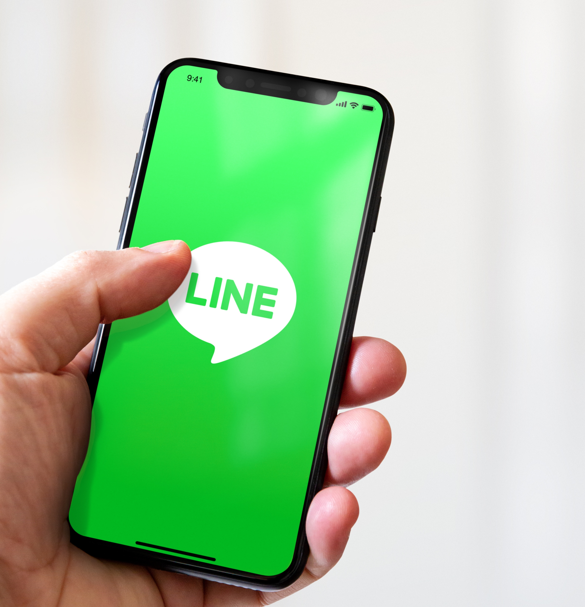

# LINE 配信の作成

LINE は、無料のインスタントメッセージ、音声およびビデオ通話用のアプリケーションで、すべてのモバイルデバイスと PC で利用できます。Adobe Campaign を使用して、LINE メッセージを送信できます。

初めて LINE 配信を作成して送信するには、Campaign Classic v7 ドキュメントで、こちらの [ エンドツーエンドのサンプル ](https://experienceleague.adobe.com/docs/campaign-classic/using/sending-messages/line-channel.html?lang=ja#example--create-and-send-a-personalized-line-message){target="_blank"} を参照してください。

{width="50%" align="left"}

詳しくは、[Campaign Classic v7 ドキュメント](https://experienceleague.adobe.com/docs/campaign-classic/using/sending-messages/line-channel.html?lang=ja){target="_blank"}を参照してください。

