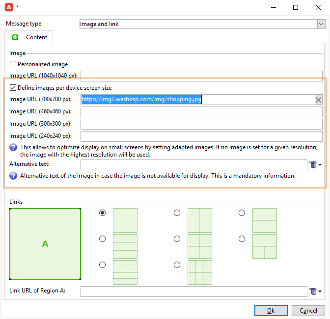

# LINE 配信の作成

LINE は、無料のインスタントメッセージ、音声およびビデオ通話用のアプリケーションで、すべてのモバイルデバイスと PC で利用できます。Adobe Campaign を使用して、LINE メッセージを送信できます。

また [!DNL LINE] は、コンシューマー向けモバイルデバイスにインストールされた [!DNL LINE] アプリでリアルタイムメッセージを送信するために、トランザクションメッセージモジュールと組み合わせることができます。詳しくは、Campaign Classic v7 ドキュメントのこの [ ページ ](https://experienceleague.adobe.com/en/docs/campaign-classic/using/transactional-messaging/configure-transactional-messaging/transactional-messaging-architecture#transactional-messaging-and-line) を参照してください。

[!DNL LINE] チャネルを使用する手順は次のとおりです。

1. [LINE チャネルの設定](#setting-up-line-channel)
1. [ 配信の作成](#creating-the-delivery)
1. [コンテンツタイプの設定](#defining-the-content)
1. [配信の監視（トラッキング、強制隔離、レポートなど）](#accessing-reports)

## LINE チャネルの設定 {#setting-up-line-channel}

[!DNL LINE] アカウントと外部アカウントを作成する前に、LINE パッケージをインスタンスにインストールする必要があります。 Adobe担当者にお問い合わせください。

まず、Adobe Campaign にリンクできるように、[!DNL LINE] アカウントを作成する必要があります。[!DNL LINE] アカウントをモバイルアプリケーションで追加したユーザーに [!DNL LINE] メッセージを送信できます。外部アカウントと [!DNL LINE] アカウントは、プラットフォームの機能管理者のみが管理できます。

[!DNL LINE] アカウントを作成して設定する方法については、[LINE デベロッパードキュメント](https://developers.line.biz/ja/)を参照してください。

### LINE サービスの作成と設定 {#configure-line-service}

[!DNL LINE] サービスを作成するには：

1. Adobe Campaign Classic のホームページから「**[!UICONTROL プロファイルとターゲット]**」タブを選択します。

1. 左側のメニューで、「**[!UICONTROL サービスと購読]**」を選択し、「**[!UICONTROL 作成]**」をクリックします。

   

1. **[!UICONTROL ラベル]**&#x200B;と&#x200B;**[!UICONTROL 内部名]**&#x200B;を新しいサービスに追加します。

1. 「**[!UICONTROL タイプ]**」ドロップダウンから「**[!UICONTROL LINE]**」を選択します。

   

1. 「**[!UICONTROL 保存]**」をクリックします。

購読とサービスの詳細については、「[購読の管理](../../start/subscriptions.md)」を参照してください。

### LINE 外部アカウントの設定 {#configure-line-external}

[!DNL LINE] サービスを作成した後、Adobe Campaign 上で [!DNL LINE] 外部アカウントを設定する必要があります。

1. **[!UICONTROL 管理]**／**[!UICONTROL プラットフォーム]**&#x200B;ツリー構造で、「**[!UICONTROL 外部アカウント]**」タブをクリックします。

1. ビルトインの **[!UICONTROL LINE V2 ルーティング]**外部アカウントを選択します。

   

1. 外部アカウントの「**[!UICONTROL LINE]**」タブをクリックし、外部アカウントの設定開始に移動します。次のフィールドに入力します。

   

   * **[!UICONTROL Channel エイリアス]**：**[!UICONTROL チャネル]**／「**[!UICONTROL 技術的設定]**」タブの [!DNL LINE] アカウント経由で提供されます。
   * **[!UICONTROL Channel ID]**：**[!UICONTROL チャネル]**／「**[!UICONTROL 基本情報パネル]**」タブの [!DNL LINE] アカウント経由で提供されます。
   * **[!UICONTROL Channel 秘密鍵]**：**[!UICONTROL チャネル]**／「**[!UICONTROL 基本情報パネル]**」タブの [!DNL LINE] アカウント経由で提供されます。
   * **[!UICONTROL アクセストークン]**：開発者ポータルの [!DNL LINE] アカウント経由で提供されるか、または「**[!UICONTROL アクセストークンを取得]**」ボタンをクリックすることで提供されます。
   * **[!UICONTROL アクセストークンの有効期限]**：アクセストークンの有効期限日を指定できます。
   * **[!UICONTROL LINE 購読サービス]**：ユーザーがどのサービスを購読するかを指定できます。

1. 設定が完了したら、「**[!UICONTROL 保存]**」をクリックします。

1. **[!UICONTROL エクスプローラー]**&#x200B;から、**[!UICONTROL 管理]**／**[!UICONTROL プロダクション]**／**[!UICONTROL テクニカルワークフロー]**／**[!UICONTROL LINE ワークフロー]**&#x200B;を選択して、**[!UICONTROL LINE V2 アクセストークンの更新（updateLineAccessToken）]**&#x200B;と&#x200B;**[!UICONTROL ブロックした LINE ユーザーを削除（deleteBlockedLineUsers）]**&#x200B;ワークフローが開始されているかどうかを確認します。

[!DNL LINE] が Adobe Campaign で設定され、LINE 配信の作成と購読者への送信を開始できます。

## LINE 配信の作成 {#creating-the-delivery}

>[!NOTE]
>
>新しい受信者に [!DNL LINE] 配信を初めて送信する場合は、利用条件と配信への同意に関する公式 LINE メッセージを追加する必要があります。公式メッセージは、[次のリンク](https://terms.line.me/OA_privacy?lang=ja)から入手できます。

[!DNL LINE] 配信を作成するには、次の手順に従う必要があります。

1. 「**[!UICONTROL キャンペーン]**」タブで、「**[!UICONTROL 配信]**」を選択し、「**[!UICONTROL 作成]**」ボタンをクリックします。

   

1. **[!UICONTROL LINE V2 配信]**&#x200B;配信テンプレートを選択します。

   

1. **[!UICONTROL ラベル]**、**[!UICONTROL 配信コード]**&#x200B;および&#x200B;**[!UICONTROL 説明]**&#x200B;を設定して配信を識別します。詳しくは、[この節](../../start/create-message.md#create-the-delivery)を参照してください。

1. 「**[!UICONTROL 続行]**」をクリックして配信を作成します。

1. 配信エディターで、「**[!UICONTROL 宛先]**」を選択して [!DNL LINE] 配信の受信者をターゲットします。ターゲティングは、**[!UICONTROL 訪問者の購読（nms:visitorSub）]** に対して実行されます。

   詳しくは、[このページ](../../audiences/target-mappings.md)を参照してください。

   

1. 「**[!UICONTROL 追加]**」をクリックして、「**[!UICONTROL 配信ターゲット母集団]**」を選択します。

   

1. [!DNL LINE] 購読者を直接ターゲットするか [!DNL LINE] 購読に応じてユーザーをターゲットするかを選択し、「**[!UICONTROL 次へ]**」をクリックします。この例では、「**[!UICONTROL LINE V2 購読別]**」を選択しています。

1. 「**[!UICONTROL フォルダー]**」ドロップダウンで「**[!UICONTROL Line-V2]**」を選択し、[!DNL LINE] サービスを選択します。「**[!UICONTROL 完了]**」、「**[!UICONTROL OK]**」の順にクリックして、配信のパーソナライズを開始します。

   

1. 配信エディターで、「**[!UICONTROL 追加]**」をクリックして 1 つまたは複数のメッセージを追加し、**[!UICONTROL コンテンツタイプ]**&#x200B;を選択します。

   利用可能な様々な&#x200B;**[!UICONTROL コンテンツタイプ]**&#x200B;について詳しくは、[コンテンツタイプの定義](#defining-the-content)を参照してください。

   

1. 配信を正しく作成して設定すると、事前に定義したターゲットに送信することができます。

   配信の送信について詳しくは、[メッセージの送信](../configure-and-send.md)を参照してください。

1. メッセージを送信した後、レポートにアクセスして配信の有効性を測定します。

   [!DNL LINE] レポートの詳細については、[レポートへのアクセス](#accessing-reports)を参照してください。

## コンテンツタイプの定義 {#defining-the-content}

[!DNL LINE] 配信のコンテンツを定義するには、最初にメッセージタイプを配信に追加する必要があります。それぞれの [!DNL LINE] 配信には最大で 5 件のメッセージを含めることができます。

次の 3 つのメッセージタイプから選択できます。

* [テキストメッセージ](#configuring-a-text-message-delivery)
* [画像とリンク](#configuring-an-image-and-link-delivery)
* [ビデオメッセージ](#configuring-a-video-message-delivery)

### テキストメッセージ配信の設定 {#configuring-a-text-message-delivery}

>[!NOTE]
>
>`<%@ include option='NmsServer_URL' %>/webApp/APP3?id=<%=escapeUrl(cryptString(visitor.id))%>` の構文によって、LINE メッセージに Web アプリへのリンクを含めることができます。

**[!UICONTROL テキストメッセージ]**&#x200B;の [!DNL LINE] 配信は、テキスト形式で受信者に送信されるメッセージです。

このタイプのメッセージの設定は、メールの&#x200B;**[!UICONTROL テキスト]**&#x200B;の設定と類似しています。詳しくは、[このページ](../defining-the-email-content.md#message-content)を参照してください。

### 画像およびリンク配信の設定 {#configuring-an-image-and-link-delivery}

**[!UICONTROL 画像とリンク]**&#x200B;の [!DNL LINE] 配信は、1 つまたは複数の URL を含む可能性のある画像形式で受信者に送信されるメッセージです。

以下を使用できます。

* **[!UICONTROL パーソナライズされた画像]**

  >[!NOTE]
  >
  >**%SIZE%** 変数を使用すると、受信者のモバイルデバイスの画面サイズに応じて画像の表示を最適化できます。

  

* **[!UICONTROL デバイスの画面サイズごとの画像 URL]**

  

  「**[!UICONTROL デバイスの画面サイズごとに画像を定義]**」オプションを使用すると、様々な画像解像度を使用して、モバイルデバイス上の配信の視認性を最適化できます。同じ高さと幅の画像のみがサポートされます。

  画像は、画面サイズに従って定義できます。

   * 1040 px
   * 700 px
   * 460 px
   * 300 px
   * 240 px

  >[!CAUTION]
  >
  >1040 x 1040 px サイズは、リンクを含むすべての LINE 画像に必須です。

  次に、受信者のモバイルデバイスにポップアップ表示される代替テキストを追加する必要があります。

* **[!UICONTROL リンク]**

  「**[!UICONTROL リンク]**」セクションでは、画像を複数のクリック可能な領域に分割する様々なレイアウトから選択できます。それぞれに専用の&#x200B;**[!UICONTROL リンク URL]** を割り当てることができます。

  

### ビデオメッセージ配信の設定 {#configuring-a-video-message-delivery}

**[!UICONTROL ビデオメッセージ]** [!DNL LINE] 配信は、URL を含むビデオの形式で受信者に送信されるメッセージです。

「**[!UICONTROL プレビュー画像 URL]**」フィールドを使用すると、プレビュー画像の URL を追加できます。文字数の制限は 1000 です。ファイルサイズの上限が 1 MB の JPEG と PNG がサポートされます。

**[!UICONTROL ビデオ画像 URL]** フィールドを使用すると、文字数制限が 1000 のビデオファイルの URL を追加できます。ファイルサイズの上限が 200 MB の mp4 形式のみがサポートされます。

一部のデバイスで再生すると、幅の広いビデオや高いビデオが断ち切れる場合があります。

## レポートへのアクセス {#accessing-reports}

配信を送信した後、**[!UICONTROL エクスプローラー]**&#x200B;の&#x200B;**[!UICONTROL キャンペーン管理]**／**[!UICONTROL 配信]**&#x200B;で [!DNL LINE] レポートを表示できます。

>[!NOTE]
>
>トラッキングレポートはクリックスルー率を示しています。[!DNL LINE] では開封率は考慮されません。

[!DNL LINE] サービスレポートの場合は、「**[!UICONTROL エクスプローラー]**」タブから、**[!UICONTROL プロファイルとターゲット]**／**[!UICONTROL サービスと購読]**／**[!UICONTROL LINE-V2]** にアクセスします。次に [!DNL LINE] サービスで「**[!UICONTROL レポート]**」アイコンをクリックします。

## 例：パーソナライズされた LINE メッセージの作成と送信 {#example--create-and-send-a-personalized-line-message}

この例では、受信者に応じてパーソナライズされるデータを含んだテキストメッセージと画像を作成して設定します。

1. 「**[!UICONTROL Campaign]**」タブから「**[!UICONTROL 作成]**」ボタンをクリックして [!DNL LINE] 配信を作成します。

   

1. 「**[!UICONTROL LINE V2 配信]**」配信テンプレートを選択して、配信に名前を付けます。

   

1. 配信の設定ウィンドウで、ターゲット母集団を選択します。

   詳しくは、[ターゲット母集団の識別](../../start/create-message.md#target-population)を参照してください。

   

1. 「**[!UICONTROL 追加]**」をクリックしてメッセージを作成し、**[!UICONTROL コンテンツタイプ]**&#x200B;を選択します。

   ここでは、最初に&#x200B;**[!UICONTROL テキストメッセージ]**&#x200B;を作成します。

   

1. パーソナライズされたテキストを挿入する位置にカーソルを置き、ドロップダウンアイコンをクリックしてから、**[!UICONTROL 訪問者]**／**[!UICONTROL 名]**&#x200B;を選択します。

   

1. 画像を追加するために同じ手順を繰り返し、「**[!UICONTROL メッセージタイプ]**」ドロップダウンで「**[!UICONTROL 画像とリンク]**」を選択します。

   **[!UICONTROL 画像の URL]** を追加します。

   

1. 「**[!UICONTROL リンク]**」セクションで、画像を複数のクリック可能な領域に分割するレイアウトを選択します。

1. 画像の各領域に URL を割り当てます。

   

1. 配信を保存してから「**[!UICONTROL 送信]**」をクリックし、分析を実行してターゲットに送信します。

   配信がターゲットに送信されます。

   

