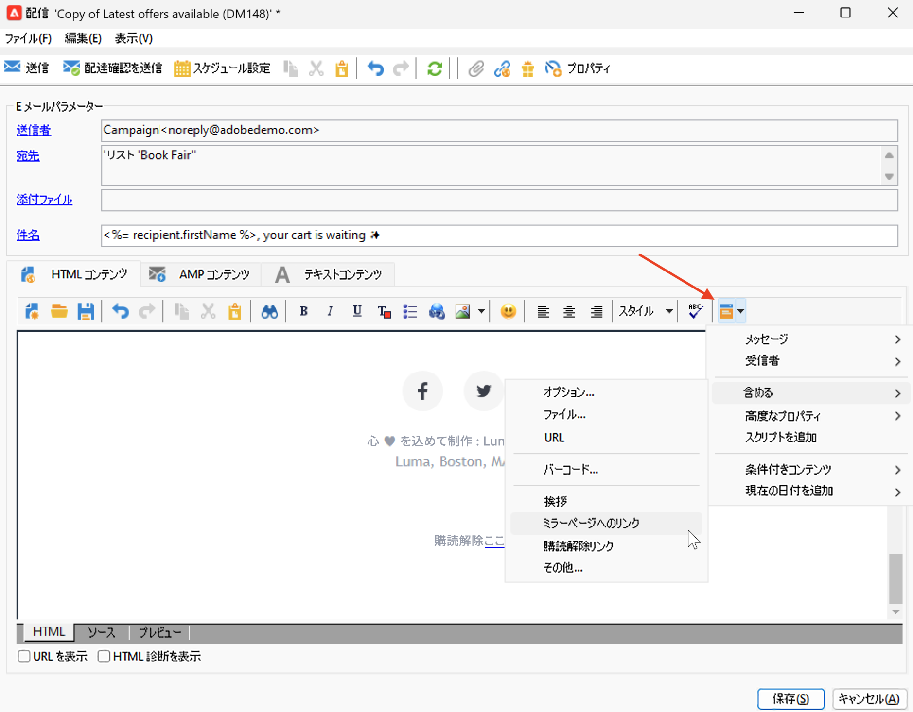
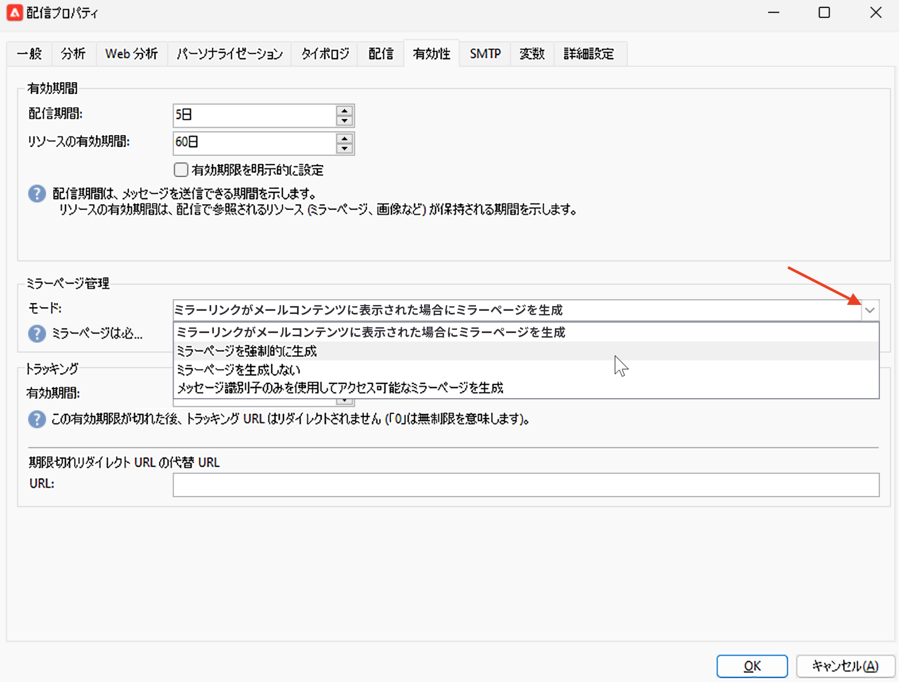
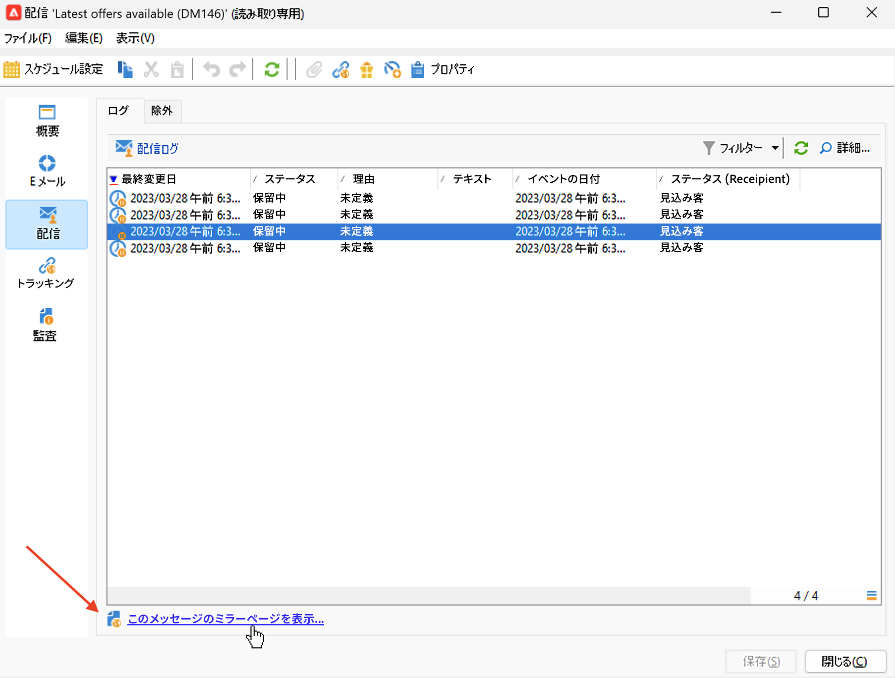

# ミラーページへのリンク{#mirror-page}

## ミラーページについて{#about-mirror-page}

ミラーページは、メールのオンラインバージョンです。

ほとんどのメールクライアントは問題なく画像をレンダリングしますが、一部のプリセットはセキュリティ上の理由から画像を表示できない場合があります。ユーザーは、例えば、レンダリングの問題や壊れた画像がインボックスで表示されようとした場合に、メールのミラーページを参照できます。アクセシビリティ上の理由からオンラインバージョンを提供したり、ソーシャル共有を促進したりすることもお勧めします。

Adobe Campaign で生成されるミラーページには、すべてのパーソナライゼーションデータが含まれます。

{width="600" align="left"}

## ミラーページへのリンクの追加{#link-to-mirror-page}

ミラーページへのリンクを挿入することをお勧めします。 このリンクには、「このメールをブラウザーに表示」や「これをオンラインで読む」などがあります。多くの場合、メールのヘッダーまたはフッターに配置されています。

Adobe Campaign では、専用の&#x200B;**パーソナライゼーションブロック**&#x200B;を使用して、メールのコンテンツにミラーページへのリンクを挿入できます。組み込みの「**ミラーページへのリンク**」パーソナライゼーションブロックでは、`<%@ include view='MirrorPage' %>` コードをメールのコンテンツに挿入します。

{width="800" align="left"}

カスタムコンテンツブロックの挿入について詳しくは、[パーソナライゼーションブロック](personalization-blocks.md)を参照してください。

## ミラーページの生成{#mirror-page-generation}

メールコンテンツが空でない場合や、ミラーページへのリンク（別名ミラーリンク）が含まれている場合、デフォルトでは、ミラーページは Adobe Campaign によって自動的に生成されます。

メールのミラーページの生成モードを制御できます。オプションは配信プロパティで選択できます。これらのオプションにアクセスするには：

1. メールプロパティの「**[!UICONTROL 有効性]**」タブを参照します。
1. 「**ミラーページの管理**」セクションで、「**[!UICONTROL モード]**」ドロップダウンリストを確認します。

{width="800" align="left"}

デフォルトモードのほかに、次のオプションを選択できます。

* **[!UICONTROL ミラーページを強制的に生成]**：このモードを使用すると、配信にミラーページへのリンクが挿入されていなくても、ミラーページを生成します。
* **[!UICONTROL ミラーページを生成しない]**：このモードを使用すると、配信にリンクが存在する場合でも、ミラーページを生成しないようにすることができます。
* **[!UICONTROL メッセージ識別子のみを使用してアクセス可能なミラーページを生成]**：メールコンテンツにミラーページのリンクが存在しない場合、以下に示すように、配信ログウィンドウでミラーページのコンテンツにアクセスできるようにするには、このオプションを使用します。

## 受信者のミラーページの確認{#mirror-page-access}

パーソナライゼーションデータを使用して、配信の特定の受信者のミラーページのコンテンツにアクセスできます。

このミラーページにアクセスするには：

1. 配信を送信したら、その配信を開きいて「**[!UICONTROL 配信]**」タブを参照します。

1. 受信者を選択し、「**[!UICONTROL このメッセージのミラーページを表示…]**」リンクをクリックします。

   {width="800" align="left"}

   ミラーページは、選択した受信者のパーソナライゼーションデータと共に、専用の画面に表示されます。

