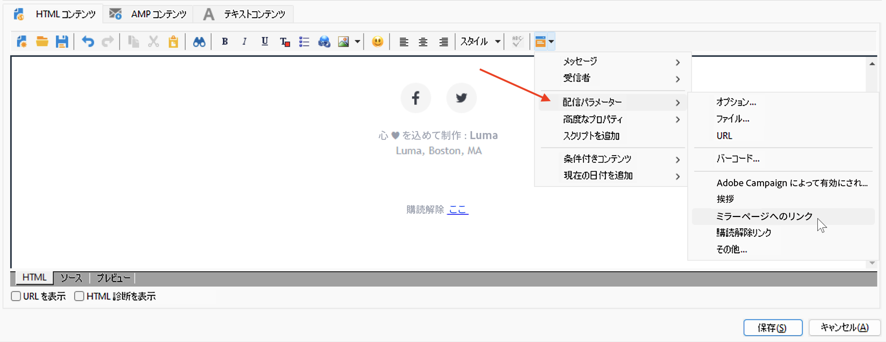
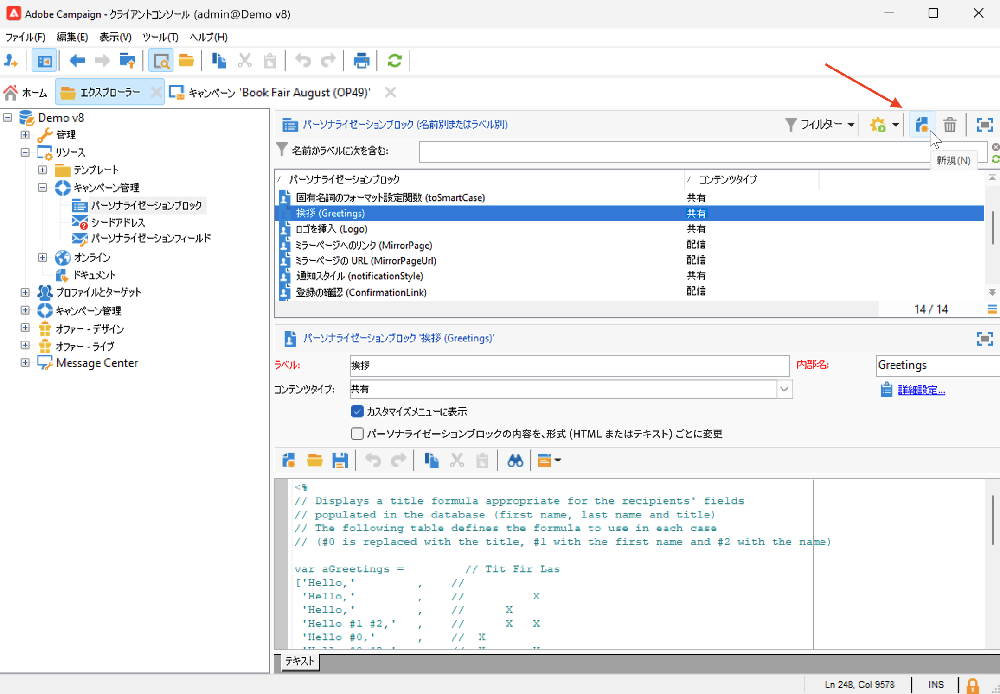
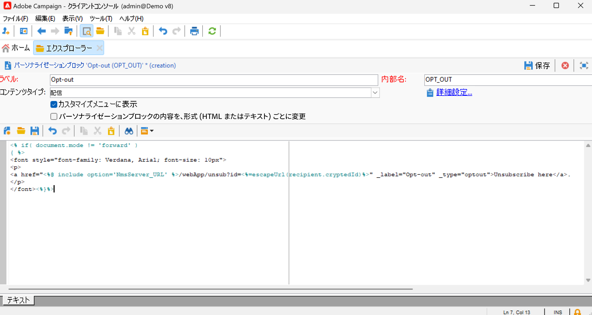

# パーソナライゼーションブロックの使用{#personalization-blocks}

パーソナライゼーションブロックは、配信に挿入できる特定のレンダリングが格納されている動的コンテンツです。例えば、ロゴ、挨拶メッセージまたはミラーページへのリンクを追加できます。

 パーソナライズされたコンテンツブロックにアクセスするには、エクスプローラーの&#x200B;**[!UICONTROL リソース／キャンペーン管理／パーソナライゼーションブロック]**&#x200B;ノードを参照します。組み込みのパーソナライゼーションブロックのリストについては、[この節](#ootb-personalization-blocks)を参照してください。

また、新しいブロックを定義して、配信のパーソナライゼーションを最適化することもできます。[詳細情報](#create-custom-personalization-blocks)。

## パーソナライゼーションブロックの挿入 {#insert-personalization-blocks}

パーソナライゼーションブロックをメッセージに挿入するには、以下の手順に従います。

1. 配信ウィザードのコンテンツエディターで、パーソナライゼーションアイコンをクリックし、**[!UICONTROL 含める]**&#x200B;メニューを選択します。
1. リストからパーソナライゼーションブロックを選択するか、 **[!UICONTROL その他…]**&#x200B;メニューをクリックして完全なリストにアクセスします。

   

1. パーソナライゼーションブロックがスクリプトとして挿入されます。パーソナライゼーションが生成されると、受信者プロファイルに自動的に適応されます。
1. 「**[!UICONTROL プレビュー]**」タブを参照し、特定の受信者に関するこのブロックのコンテンツを表示する受信者を選択します。

配信コンテンツには、パーソナライゼーションブロックのソースコードを含めることができます。そのためには、ブロックの選択時に「**[!UICONTROL ブロックの HTML ソースコードを含める]**」を選択します。

## 組み込みのパーソナライゼーションブロック {#ootb-personalization-blocks}

組み込みのパーソナライゼーションブロックは次のとおりです。

* **[!UICONTROL Adobe Campaign で実現]**：「Adobe Campaign で実現」ロゴを挿入します。
* **[!UICONTROL 固有名詞のフォーマット設定関数]**：JavaScript の **[!UICONTROL toSmartCase]** 関数を生成します。この関数は各単語の最初の文字を大文字に変更します。
* **[!UICONTROL 挨拶]**：受信者の姓名の後にコンマを付けた挨拶文を挿入します。例：「こんにちは、John Doe さん。」
* **[!UICONTROL ロゴを挿入]**：インスタンス設定で定義されているロゴを挿入します。
* **[!UICONTROL ミラーページへのリンク]**：[ミラーページ](mirror-page.md)へのリンクを挿入します。デフォルトの形式は、「このメッセージが正しく表示されない場合は、ここをクリックしてください」です。
* **[!UICONTROL ミラーページの URL]**：ミラーページの URL を挿入し、配信デザイナーがリンクを確認できるようにします。
* **[!UICONTROL 単一モードのオファー許可 URL]**：オファーを&#x200B;**[!UICONTROL 許可済み]**&#x200B;に設定できる URL を挿入します。（このブロックは、インタラクションモジュールが有効な場合に使用できます）
* **[!UICONTROL 登録の確認]**：購読を確認できるリンクを挿入します。
* **[!UICONTROL 登録リンク]**：購読リンクを挿入します。このリンクは、インスタンス設定で定義されています。デフォルトの内容は「登録するには、ここをクリックしてください。」です。
* **[!UICONTROL 登録リンク（リファラーを含む）]**：購読リンクを挿入し、訪問者と配信を識別できるようにします。このリンクは、インスタンス設定で定義されています。
* **[!UICONTROL 登録ページ URL]**：購読 URL を挿入します。
* **[!UICONTROL コンテンツメールのスタイル]**&#x200B;および&#x200B;**[!UICONTROL 通知スタイル]**：定義済みの HTML スタイルでメールを書式設定するコードを生成します。
* **[!UICONTROL 登録解除リンク]**：すべての配信を登録解除（ブロックリスト登録）できるリンクを挿入します。関連付けられているデフォルトのコンテンツは、「このメッセージが届いたのは、お客様が&#x200B;***組織名***&#x200B;または関連会社と連絡を取ったことがあるからです。***組織名***&#x200B;からメッセージを受け取らないようにするには、ここをクリックしてください。」です。

## カスタムパーソナライゼーションブロックの作成 {#create-custom-personalization-blocks}

パーソナライゼーションアイコンから挿入する、新しくパーソナライズされたコンテンツブロックを定義できます。

パーソナライゼーションブロックを作成するには、次の手順に従います。

1. Campaign エクスプローラーの&#x200B;**[!UICONTROL リソース／キャンペーン管理／パーソナライゼーションブロック]**&#x200B;フォルダーを参照します。
1. 組み込みブロックのリストの上にある「**[!UICONTROL 新規]**」をクリックします。

   

1. 次のように、パーソナライゼーションブロックの設定に入力します。

   

   * ブロックのラベルを入力します。このラベルは、パーソナライゼーションフィールドの挿入ウィンドウに表示されます。
   * **配信**&#x200B;コンテンツタイプを選択します。
   * パーソナライゼーションフィールドの挿入アイコンからこのブロックにアクセスできるよう、「**[!UICONTROL カスタマイズメニューに表示]**」オプションを有効にします。
   * 必要に応じて、「**[!UICONTROL パーソナライゼーションブロックの内容を、フォーマット（HTML またはテキスト）ごとに変更]**」オプションを有効にして、HTML メールとテキストメールの 2 つの異なるブロックを定義します。
   * パーソナライゼーションブロックのコンテンツ（HTML、テキスト、JavaScript など）を入力し、「**[!UICONTROL 保存]**」をクリックします。

保存すると、新しいパーソナライゼーションブロックが配信エディターで使用できるようになります。

## チュートリアルビデオ {#personalization-blocks-video}

次のビデオでは、動的コンテンツブロックを作成する方法と、動的コンテンツブロックを使用してメール配信のコンテンツをパーソナライズする方法について説明します。

>[!VIDEO](https://video.tv.adobe.com/v/342088?quality=12)

