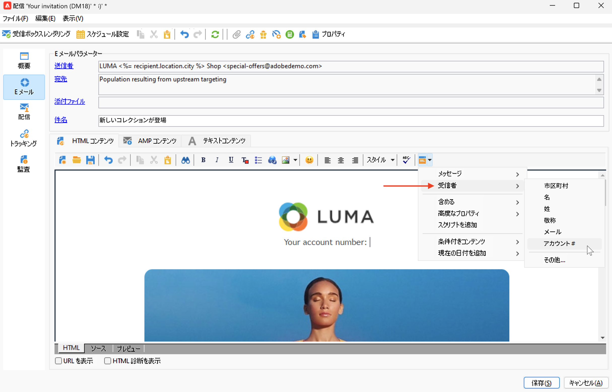
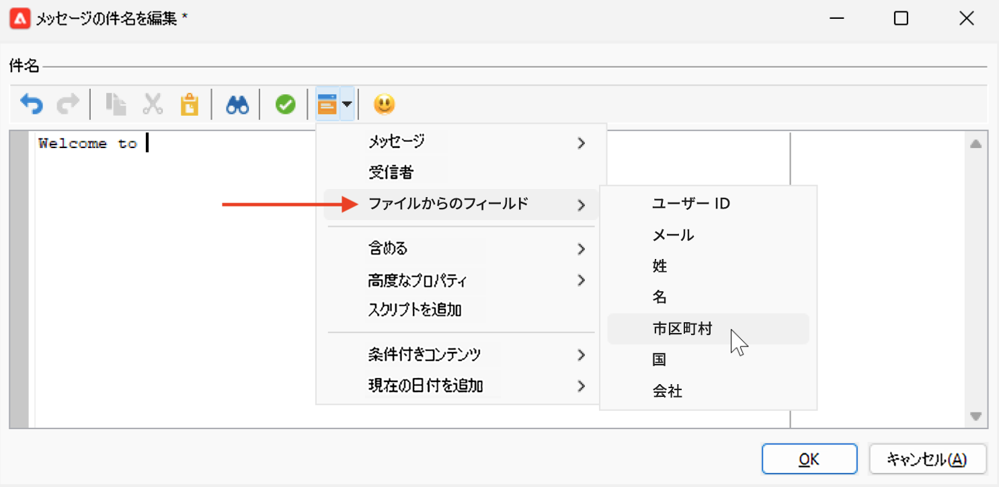
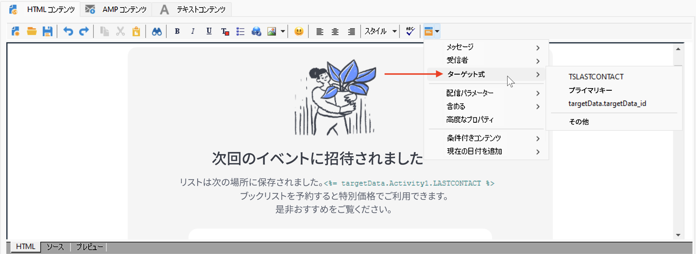

# パーソナライゼーションのデータソース{#personalization-data}

パーソナライゼーションのデータは、Campaign データベースのデータソース、外部ファイルのデータソース、外部データベースのデータソースなど、様々なタイプのソースから取得できます。

## Campaign データベースのデータソース

最も一般的なケースでは、パーソナライゼーションデータはデータベースに保存されます。例えば、「受信者パーソナライゼーションフィールド」は、受信者テーブルで定義されているすべてのフィールド、標準フィールド（通常は、姓、名、住所、市区町村、生年月日など）、またはカスタムフィールドです。

## 外部ファイルのデータソース

列で定義されたすべてのフィールドを含む外部ファイルを使用できます。このファイルは、メッセージ配信を定義する際に入力として使用します。これらのプロファイルをデータベースに挿入するかどうかを選択できます。

データソースとして使用するファイルを選択するには、メッセージ作成ウィンドウで宛先リンクを参照し、「**外部ファイルで定義**」オプションを選択します。ファイルが読み込まれたら、「**ファイルからのフィールド**」エントリから、パーソナライゼーションオプションの受信者データにアクセスします。

## FDA データソース

パーソナライゼーションデータは、[Federated Data Access](../connect/fda.md) を通じて外部テーブルから取得できます。外部データベースのデータを使用して配信のパーソナライゼーションを実行する場合は、ワークフローで使用するデータを収集して一時テーブルで利用できるようにします。

これを実行するには、ターゲティングワークフローに&#x200B;**クエリ**&#x200B;アクティビティを追加し、「**データを追加...**」リンクを使用して外部データベースを選択します。プロセスについて詳しくは、[この節](../../automation/workflow/query.md#adding-data)を参照してください。

そして、一時テーブルのデータを使用して配信をパーソナライズします。クエリアクティビティを設定したら、**ターゲット式**&#x200B;エントリから、パーソナライゼーションオプションの外部データにアクセスします。

FDA でアクセスする外部データを使用する場合は、以下に示すように、「**ワークフローを使用してパーソナライゼーションデータを準備**」オプションを使用して、専用のワークフローでメッセージのパーソナライゼーションを前処理することをお勧めします。

### パーソナライゼーションの最適化 {#optimize-personalization}

配信プロパティの「**[!UICONTROL 分析]**」タブで使用できる専用のオプション、「**[!UICONTROL ワークフローを使用してパーソナライゼーションデータを準備]**」を使用して、パーソナライゼーションを最適化できます。

このオプションを選択すると、配信の分析時に、一時テーブル内のターゲットにリンクするすべてのデータ（FDA にリンクするテーブルのデータなど）を保存するワークフローが自動的に作成、実行されます。

これにより、大量のデータを処理する場合（特にパーソナライゼーションデータが FDA を通じて外部テーブルから提供される場合）、配信分析のパフォーマンスを大幅に向上させることが可能です。[詳細情報](../connect/fda.md)。

このオプションを使用するには、以下の手順に従います。

1. キャンペーンを作成します。
1. キャンペーンの「**[!UICONTROL ターゲティングとワークフロー]**」タブで、ワークフローに&#x200B;**クエリ**&#x200B;アクティビティを追加します。
1. **[!UICONTROL メール配信]**&#x200B;アクティビティをワークフローに追加して開きます。
1. **[!UICONTROL 配信プロパティ]**&#x200B;の「**[!UICONTROL 分析]**」タブで、「**[!UICONTROL ワークフローを使用してパーソナライゼーションデータを準備]**」オプションを選択します。
1. 配信を設定し、ワークフローを開始して分析を開始します。

分析が完了すると、パーソナライゼーションデータは、分析中にオンザフライで作成された一時的なテクニカルワークフローを通じて一時テーブルに格納されます。

このワークフローは、Adobe Campaign インターフェイスには表示されません。これは、パーソナライゼーションデータを迅速に格納および処理するための単なる技術的な手段です。

分析が完了したら、ワークフローの&#x200B;**[!UICONTROL プロパティ]**&#x200B;に移動し、「**[!UICONTROL 変数]**」タブを選択します。一時テーブルの名前が表示されます。この名前を使用して SQL 呼び出しをおこなって、一時テーブルに含まれている ID を表示することができます。

## ワークフロー内のパーソナライゼーションデータ

ワークフローのコンテキストで配信を作成すると、一時的なワークフローテーブルからのデータを使用できます。ワークフローの一時ワークテーブルに保存されたデータは、パーソナライゼーションタスクに使用できます。データは、パーソナライゼーションフィールドで使用できます。

このデータは、**[!UICONTROL ターゲット式]**&#x200B;メニューでグループ化されています。詳しくは、[この節](../../automation/workflow/use-workflow-data.md#target-data)を参照してください。

