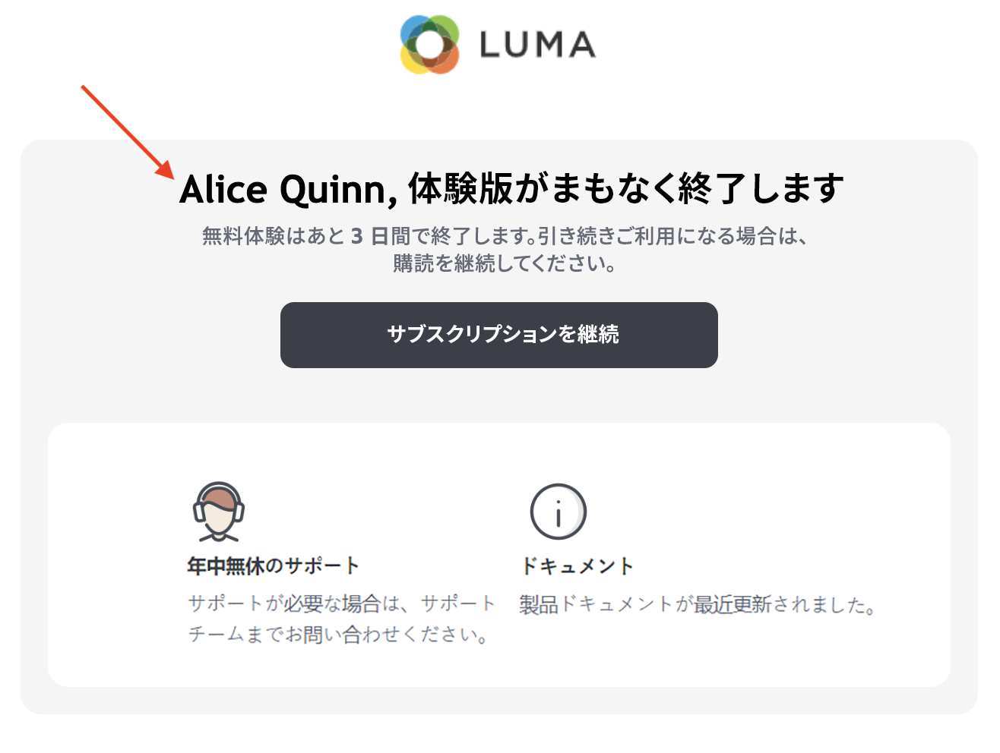
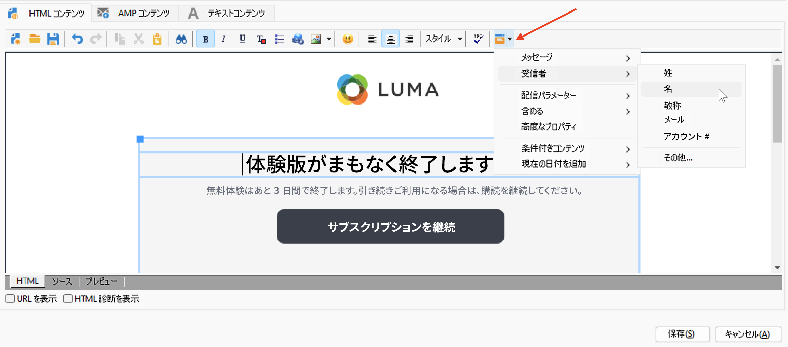
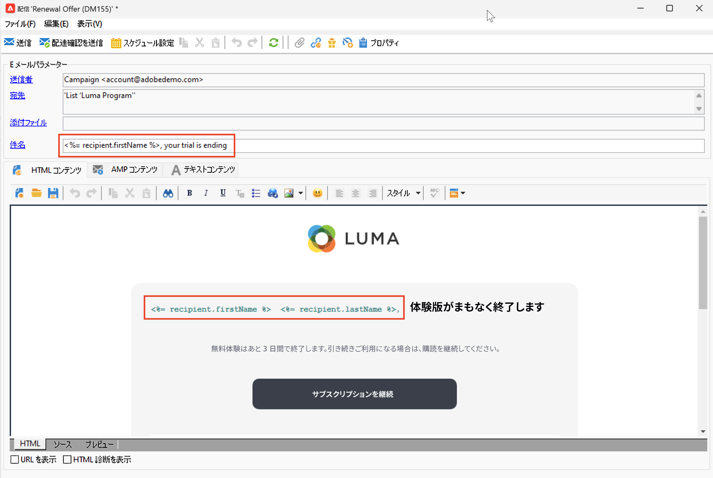

# パーソナライゼーションフィールドの追加{#personalization-fields}

パーソナライゼーションフィールドを使用して、各受信者に設定したルールに基づいて、1 対 1 でパーソナライズされたコンテンツを配信します。

パーソナライゼーションフィールドは、特定の受信者に対する配信をパーソナライズする際に使用される単一のデータフィールド参照です。実際のデータ値は、配信分析フェーズで挿入されます。

## 構文

パーソナライゼーションタグでは、常に `<%=table.field%>` 構文を使用します。

例えば、受信者テーブルに格納されている受信者の名前を挿入するには、パーソナライゼーションフィールドで `<%= recipient.lastName %>` 構文を使用します。

>[!CAUTION]
>
>パーソナライゼーションフィールドのコンテンツは、1024 文字以内にする必要があります。

## パーソナライゼーションフィールドの挿入 {#insert-a-personalization-field}

パーソナライゼーションフィールドを挿入するには、ヘッダー、件名、メッセージ本文のフィールドからアクセスできるドロップダウンアイコンをクリックします。

パーソナライゼーションフィールドが挿入され、Adobe Campaign で解釈される準備が整います。メッセージの準備中に、フィールドは所定の受信者の値に置き換えられます。

この置き換えは、「**[!UICONTROL プレビュー]**」タブでテストできます。

<!--Learn more about message preview in [this page]().-->

## ユースケース：メールの件名のパーソナライズ {#personalization-fields-uc}

以下のユースケースでは、メールの件名と本文を受信者データでパーソナライズする方法を説明します。

1. 新しい配信を作成するか、既存のメール配信を開きます。
1. **[!UICONTROL 件名]**&#x200B;リンクを参照して、メッセージの件名を編集します。
1. 「**Special offer for**」と入力し、ツールバーのボタンを使用してパーソナライゼーションフィールドを挿入します。**[!UICONTROL 受信者／タイトル]**&#x200B;を選択します。
1. 受信者の名前を挿入する操作を繰り返します。各パーソナライゼーションフィールド間にはスペースを挿入します。
1. 「**[!UICONTROL OK]**」をクリックして検証します。
1. メッセージ本文にパーソナライゼーションを挿入します。そのためには、メッセージコンテンツをクリックし、フィールド挿入ボタンをクリックします。
1. **[!UICONTROL 受信者／その他]**&#x200B;を選択します。
1. 表示する情報を含んだフィールドを選択し、「**[!UICONTROL OK]**」をクリックします。
1. 「**[!UICONTROL プレビュー]**」タブをクリックすると、パーソナライゼーションの結果が表示されます。受信者に応じたメッセージを確認するには、受信者を選択する必要があります。

## チュートリアルビデオ {#personalization-field-video}

次のビデオでは、パーソナライゼーションフィールドをメール配信の件名とコンテンツに追加する方法について説明します。

>[!VIDEO](https://video.tv.adobe.com/v/24925?quality=12)

