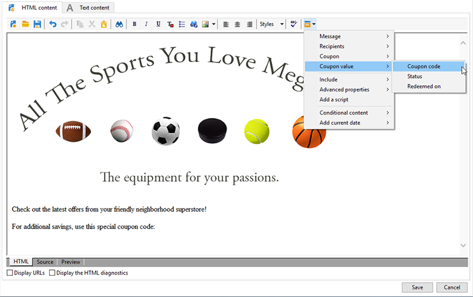
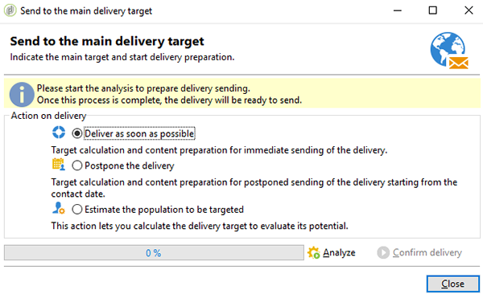

# パーソナライズされたクーポン{#personalized-coupons}

配信へのクーポンの追加は、受信者に対して、商品およびサービスの価値を高めます。Campaign クーポンモジュールを使用して、今後のマーケティングオファーに追加するためのクーポンのセットを作成できます。配信を作成する準備ができたら、適切なクーポンを割り当てます。クーポンは限定された期間のみ有効なので、割り当てたクーポンはその配信メッセージに一意にリンクされます。また、Campaign は、配信が送信される前に、メッセージ数に対して十分なクーポンがあることを確認します。

>[!AVAILABILITY]
>
>クーポン管理は、Campaign v8 のエンタープライズ（FFDA）デプロイメントのコンテキストでは使用できません。詳しくは、[Campaign v8 ドキュメント &#x200B;](../architecture/enterprise-deployment.md) を参照してください。

クーポン管理は、インストールする必要があるパッケージに依存します。クーポン管理があることを確認するには、**[!UICONTROL 管理／設定／パッケージ管理／インストールしたパッケージ]**&#x200B;をチェックします。

クーポンデータは、CSV および XML フォーマットを使用してインポートおよびエクスポートできます。[詳細情報](../../platform/using/get-started-data-import-export.md)。

## クーポンの作成 {#creating-a-coupon}

クーポン管理モジュールには、次の 2 つのクーポン作成オプションがあります。

* **匿名**：限定された受信者または受信者のリスト向けの汎用のクーポン。
* **個人**：限定された受信者向けのパーソナライズされたクーポン。

次の手順に従う前に、作成するクーポンのタイプについて確実に把握しておきます。

1. Campaign ツリーで、**[!UICONTROL リソース／キャンペーン管理／クーポン]**&#x200B;に移動します。

   

1. 「**[!UICONTROL 新規]**」ボタンをクリックします。
1. 「**[!UICONTROL ラベル]**」フィールドに、クーポンの名前を入力します。「**[!UICONTROL クーポンコード]**」に一意のコードが自動的に入力されます。コードをそのまま使用するか、新しいコードを入力することができます。

   

1. 「**[!UICONTROL 開始日]**」および「**[!UICONTROL 終了日]**」を選択して、クーポンが有効な期間を設定します。
1. 「**[!UICONTROL クーポンタイプ]**」で、「匿名」または「個人」を選択します。

   **[!UICONTROL 匿名クーポン]**：匿名クーポンは、すべての受信者で同一です。**クーポンタイプ**&#x200B;メニューで「匿名」が選択されていることを確認し、「**保存**」をクリックして、クーポンを生成します。

   **[!UICONTROL 個人クーポン]**：個人クーポンは、追加のクーポンコードでさらにパーソナライズできます。例えば、スポーツ用品店でのセール用に個人クーポンを作成するとします。しかし、受信者のリストは長く、1 つの競技に対する情熱は人それぞれです。競技（例えば、サッカー、フットボール、野球など）に基づいて個人クーポンのコード名を追加して、各コードを適切な受信者に送信できます。

   1. 「個人」を選択すると、「クーポン」という新しいタブが左下に表示されます。「**[!UICONTROL クーポン]**」タブに移動して、「**[!UICONTROL 追加]**」をクリックします。
   1. 入力を促すポップアップウィンドウが表示されたら、個人クーポンの一意のコードを入力します。
   1. 「**[!UICONTROL 保存]**」をクリックして、クーポンを生成します。

   「クーポン」タブについて詳しくは、[個人クーポンの設定](#configuring-individual-coupons)を参照してください。

   >[!NOTE]
   >
   >個人クーポンは、一括でインポートできます。インポートとエクスポートについて詳しくは、[この節](../../platform/using/get-started-data-import-export.md)を参照してください。

### 個人クーポンの設定 {#configuring-individual-coupons}

「クーポン」タブは、個人クーポンでのみ使用できます。クーポンを配信に関連付けると、「クーポン」タブに次の詳細が表示されます。

* **[!UICONTROL ステータス]**：クーポンの利用可能性。
* **[!UICONTROL 引き換え日]**：クーポンの引き換え日。
* **[!UICONTROL チャネル]**：クーポンを送信するために使用されるチャネル。
* **[!UICONTROL アドレス]**：受信者のメールアドレス。

**[!UICONTROL ステータス]**、**[!UICONTROL チャネル]**&#x200B;および&#x200B;**[!UICONTROL アドレス]**&#x200B;の値は、自動的に入力されます。ただし、**[!UICONTROL 引き換え日]**&#x200B;の値は、Campaign によって復元されません。クーポン引き換えの詳細を含むファイルをインポートすることで、入力できます。

## メール配信へのクーポンの挿入 {#inserting-a-coupon-into-an-email-delivery}

次の例では、配信をホームページから作成します。配信の作成方法について詳しくは、[この節](about-email-channel.md)を参照してください。また、ワークフローの配信にクーポンを追加することもできます。

1. **[!UICONTROL Campaigns]** に移動し、「**[!UICONTROL 配信]**」を選択します。
1. 「**[!UICONTROL 作成]**」をクリックします。

   

1. 「**[!UICONTROL ラベル]**」に名前を入力し、「**[!UICONTROL 続行]**」をクリックします。
1. 「**[!UICONTROL 宛先]**」をクリックして受信者を追加します。
1. 「**[!UICONTROL 追加]**」をクリックして、配信の受信者を選択します。受信者を選択したら、「**[!UICONTROL OK]**」をクリックして配信に戻ります。

   

1. 件名を入力し、メッセージにコンテンツを追加します。

   

1. ツールバーで、「**[!UICONTROL プロパティ]**」をクリックし、「**[!UICONTROL 詳細設定]**」タブを選択します。
1. 「**[!UICONTROL クーポン管理]**」のフォルダーアイコンをクリックします。

   

1. クーポンを選択し、「**[!UICONTROL OK]**」をクリックします。もう一度「**[!UICONTROL OK]**」をクリックします。

   

1. メッセージをクリックして、クーポンを配置する場所を選択します。

   

1. パーソナライゼーションアイコンをクリックして、クーポンのタイプに基づいて次のどちらかを選択します。

   * 匿名クーポン：**[!UICONTROL クーポン／クーポンコード]**

     

   * 個人クーポン：**[!UICONTROL クーポン値／クーポンコード]**

     

     クーポンは、割り当てた名前ではなくコードとしてメッセージに挿入されます。このコードは、Campaign 標準データモデル内で使用されます。

   

1. テストを実行して、クーポンに割り当てた名前を確認します。「**[!UICONTROL プレビュー]**」タブに移動し、「**[!UICONTROL パーソナライゼーションをテスト]**」をクリックします。テストする受信者を選択します。

   

   テストに続いて、コードではなく割り当てた名前でクーポンが表示されます。

   

1. ツールバーで、「**[!UICONTROL 送信]**」（左上）をクリックし、配信の送信方法を選択します。

   

1. 「**[!UICONTROL 分析]**」をクリックします。分析ログですべての受信者に対して十分なクーポンがあることを確認したら、「**[!UICONTROL 配信を確定]**」をクリックして送信します。

   

>[!NOTE]
>
>配信に不十分なクーポンを管理する方法について詳しくは、[不十分なクーポンの管理](#managing-insufficient-coupons)を参照してください。

配信が成功したことを確認するには：

1. **[!UICONTROL エクスプローラー／リソース／キャンペーン管理／クーポン]**&#x200B;に移動します。
1. 「**[!UICONTROL 配信]**」タブをクリックします。

   

   配信に成功している場合、ステータスに&#x200B;**[!UICONTROL 完了]**&#x200B;と表示されます。

>[!NOTE]
>
>デフォルトでは、クーポン管理モジュールは **nms:recipient** テーブルを使用します。 [詳細情報](../../configuration/using/about-data-model.md#default-recipient-table)。
>
>カスタム受信者テーブルの使用方法については、[このページ](../../configuration/using/about-custom-recipient-table.md)を参照してください。

## 不十分なクーポンの管理 {#managing-insufficient-coupons}

メッセージよりもクーポンが少ない場合、配信分析が停止します。このような場合、より多くのクーポンをインポートするか、メッセージの数を制限することができます。メッセージの数を制限する場合は、次の手順に従います。

1. メール配信ウィンドウに移動します。
1. 「**[!UICONTROL 宛先]**」をクリックします。
1. 「**[!UICONTROL ターゲットを選択]**」で、「**[!UICONTROL 除外]**」タブに移動します。

   

1. 「除外設定」セクションで、「**[!UICONTROL 編集]**」をクリックします。
1. 「**[!UICONTROL 配信数上限...メッセージ]**」に送信するメッセージの数を入力し、「**[!UICONTROL OK]**」をクリックします。配信を送信できます。

   

>[!NOTE]
>
>限られた数のクーポンを管理する場合、配信ワークフローを使用すると、条件に基づいて配信を分割できます。これは、ターゲットを制限することなく、限定された母集団にクーポンを送信する場合に適したオプションです。
