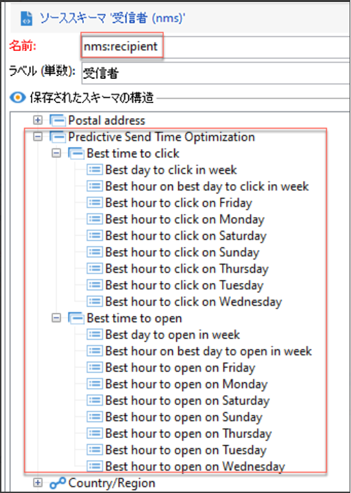

# 送信時間の最適化と予測エンゲージメントスコアリング{#optimize-message-delivery}

AI と機械学習を活用した、Adobe Campaign の送信時間最適化と予測エンゲージメントスコアリングでは、過去のエンゲージメント指標に基づいて、開封率、最適な送信時間および予想されるチャーンを分析して予測できます。

Adobe Campaign は、[予測送信時間最適化](#predictive-send)および[予測エンゲージメントスコアリング](#predictive-scoring)の 2 つの新しい機械学習モデルを備えています。これら 2 つのモデルは、より良いカスタマージャーニーの設計と提供に特化した機械学習モデルです。

>[!CAUTION]
>
>この機能は、製品の一部として標準搭載はされていません。Adobe Campaign Classic v7 または Adobe Campaign v8 を実行している Adobe Campaign Managed Cloud Services のお客様のみが利用できます。
>
>実装するには、アドビのコンサルティングサービス部門に依頼する必要があります。詳しくは、アドビ担当者にお問い合わせください。

## 予測送信時間最適化{#predictive-send}

予測送信時間最適化では、メールの開封やクリックおよびプッシュメッセージの開封に最適な送信時間を受信者プロファイルごとに予測します。 受信者プロファイルごとに、平日ごとの最適な送信時間と、最良の結果を得るうえで送信に最適な平日がスコアからわかります。

予測送信時間最適化モデルには、次の 2 つのサブモデルがあります。

* 開封数に対する予測送信時間は、開封数を最大化するために、顧客に E メールを送信する最適な時間です。

* クリック数に対する予測送信時間は、クリック数を最大化するために、顧客に E メールを送信する最適な時間です。

**モデル入力**：配信ログ、トラッキングログおよびプロファイル属性（PII 以外）

**モデル出力**：（開封数およびクリック数の観点で）メッセージの送信に最適な時間

出力の詳細：

* E メールの送信に最適な時間を、曜日ごとに 1 時間間隔で計算します（例：9:00 am、10:00 am、11:00 am）
* 該当する週の最適な曜日と時間が示されます
* 最適な時間は、開封率とクリック率を最大化するために各 1 回ずつ、合計 2 回計算されます
* 16 個のフィールドが表示されます（曜日ごとは 14 個、週全体は 2 個）。
   * 月曜日のクリック数を最適化するための E メール送信の最適な時間（0 ～ 23 の値）
   * 月曜日の開封数を最適化するための E メール送信の最適な時間（0 ～ 23 の値）
   * ...
   * 日曜日のクリック数を最適化するための E メール送信の最適な時間（0 ～ 23 の値）
   * 日曜日の開封数を最適化するための E メール送信の最適な時間（0 ～ 23 の値）
   * ...
   * 週全体の開封数を最適化するための E メール送信の最適な曜日（月曜日～日曜日）
   * 週全体の開封数を最適化するための E メール送信の最適な時間（0 ～ 23 の値）

予測送信時間最適化は、プロファイルレベルで保存されます。

>[!NOTE]
>
>有意な結果を得るには、モデルに 1 か月以上のデータが必要です。これらの予測機能は、メールチャネルとプッシュチャネルにのみ適用されます。

## 予測エンゲージメントスコアリング {#predictive-scoring}

予測エンゲージメントスコアリングでは、次回のメール送信後 7 日以内に受信者がメッセージにエンゲージする確率とオプトアウト（購読解除）する確率を予測します。これらの確率は、コンテンツとの予想されるエンゲージメントレベル（高、中、低）に応じて、さらにグループ分けされます また、これらのモデルは、顧客の登録解除リスクパーセンタイルランクも提供するので、特定の顧客のランクが他の顧客と比較してどの程度であるかを把握できます。

予測エンゲージメントスコアリングでは、次のことができます。

* **オーディエンスの選択**：クエリアクティビティを使用して、特定のメッセージでエンゲージするオーディエンスを選択できます
* **オーディエンスの除外**：クエリアクティビティを使用して、登録を解除するオーディエンスを削除できます
* **パーソナライズ**：エンゲージメントレベルに基づいてメッセージをパーソナライズします（エンゲージメントの高いユーザーとそうでないユーザーとでは、異なるメッセージを受け取ります）

このモデルでは、複数のスコアを使用して、次の項目を提示します。

* **開封エンゲージメントスコア／クリックエンゲージメントスコア**：この値は、購読者が特定のメッセージにエンゲージ（開封またはクリック）する確率と一致します。値の範囲は 0.0 ～ 1.0 です。
* **購読解除の確率**：この値は、1 件の E メールが開封された場合に、受信者が E メールチャネルから登録解除する確率を一致します。値の範囲は 0.0 ～ 1.0 です。
* **リテンションレベル**：この値では、ユーザーが「低」、「中」、「高」の 3 つのレベルにランク付けされます。「高」はサービスを利用し続ける可能性が最も高く、「低」は購読を解除する可能性が最も高くなります。
* **リテンションのパーセンタイルランク**：購読解除の確率に関するプロファイルランク。値の範囲は 0.0 ～ 1.0 です。例えば、リテンション率のランクが 0.953 の場合、この受信者はサービスを利用し続ける可能性が高く、他の受信者（全受信者の 95.3%）に比べて購読解除する可能性が低くなります。

>[!NOTE]
>
>これらの予測機能は、E メール配信にのみ適用されます。
>
>有意な結果を得るには、モデルに 1 か月以上のデータが必要です。

**モデル入力**：配信ログ、トラッキングログおよび特定のプロファイル属性

**モデル出力**：プロファイルのスコアとカテゴリを説明するプロファイル属性
