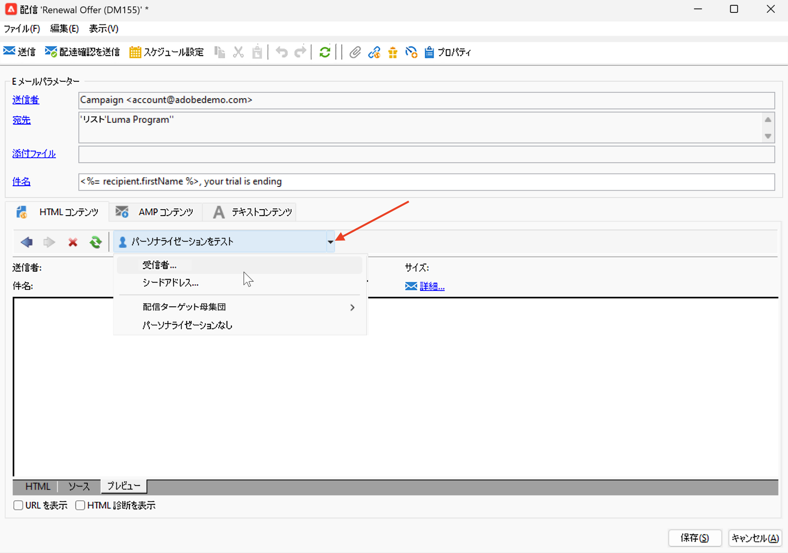
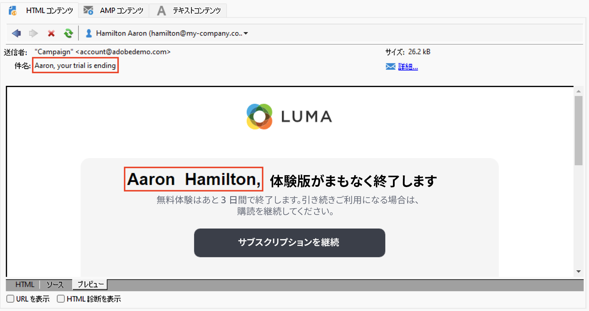
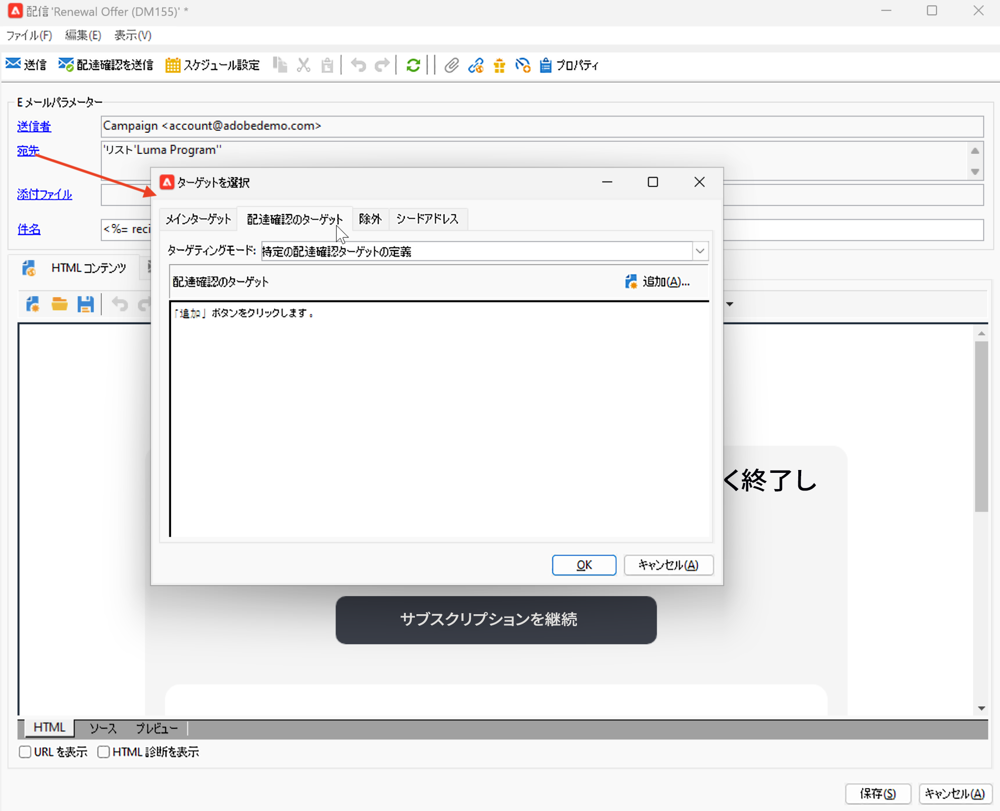
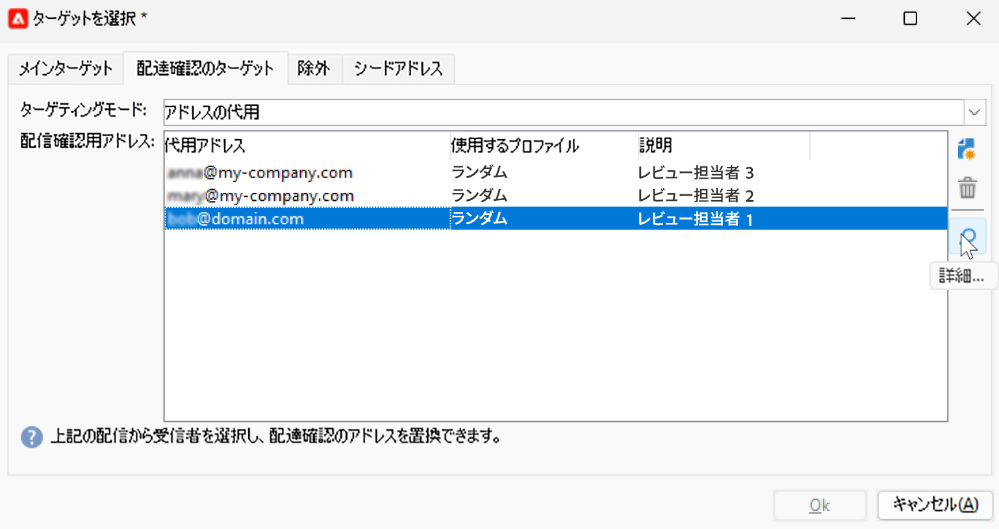
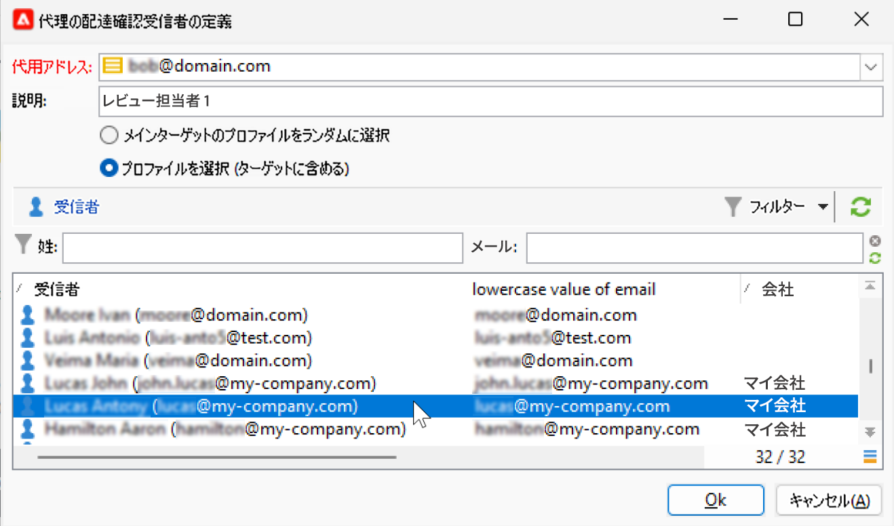
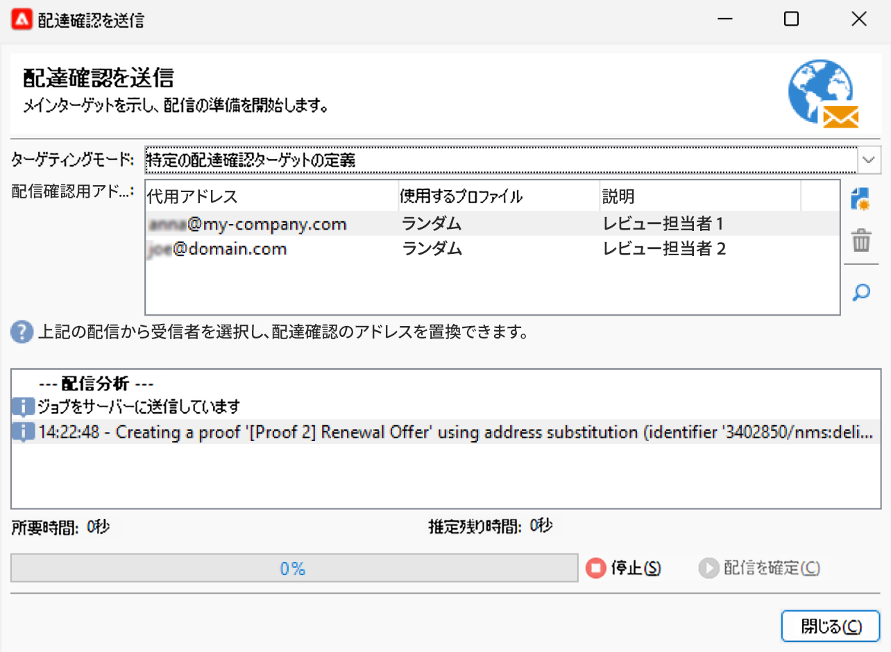
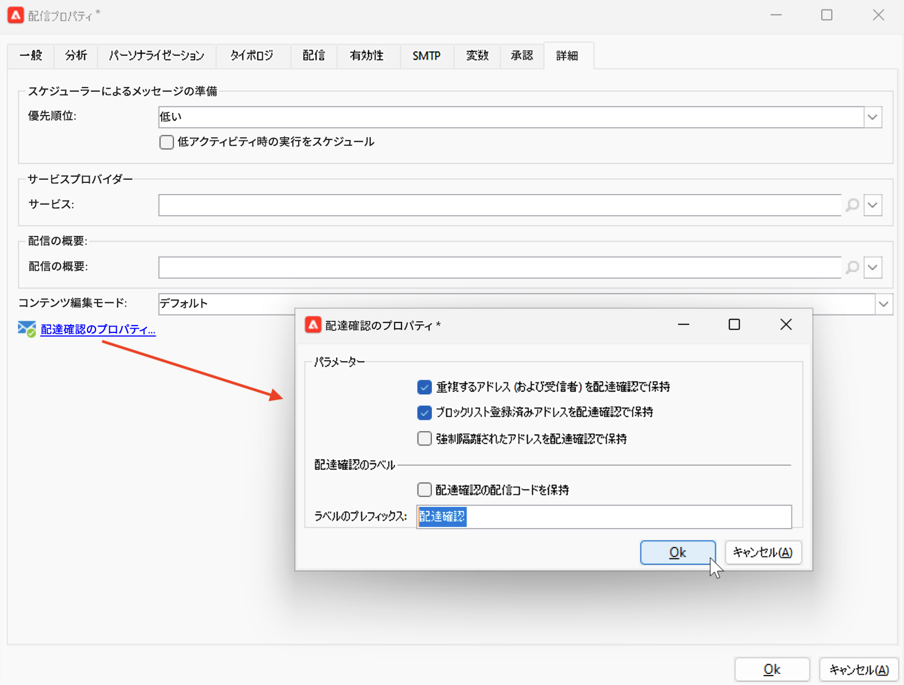

# メールのプレビューとテスト {#preview-test}

メッセージの内容を定義したら、テストプロファイルを使用してプレビューおよびテストできます。 以下を [パーソナライズされたコンテンツ](personalize.md)を使用すると、テストプロファイルデータを使用して、このコンテンツがメッセージにどのように表示されるかを確認できます。 さらに、メッセージのコンテンツやパーソナライゼーション設定でエラーが発生する可能性を検出するには、配達確認をテストプロファイルに送信します。 最新のコンテンツを検証するには、変更が加えられるたびに配達確認を送信する必要があります。

## コンテンツのプレビュー{#preview-content}

配達確認を送信する前に、配信ウィンドウの「プレビュー」セクションでメッセージの内容を確認することをお勧めします。

メッセージコンテンツをプレビューするには、次の手順に従います。

1. 次を参照： **プレビュー** 」タブをクリックします。
1. 次をクリック： **[!UICONTROL パーソナライゼーションをテスト]** ボタンをクリックして、パーソナライゼーションデータを入力するプロファイルを選択します。 データベース内の特定の受信者（シードアドレス）を選択することも、ターゲット母集団からプロファイルを選択することもできます（既に定義されている場合）。 また、パーソナライゼーションなしでコンテンツを確認することもできます。

   

1. プレビューが生成され、メッセージのレンダリングを確認できます。 メッセージプレビューでは、パーソナライズされた要素が、選択したテストプロファイルデータに置き換えられます。

   

1. 他のテストプロファイルを選択して、メッセージの各バリアントに対する E メールのレンダリングをプレビューします。

## 配達確認の送信 {#send-proofs}

配達確認を送信すると、オプトアウトリンクやミラーページ、その他のリンクの確認、メッセージの検証、画像の表示の確認、エラーの検出などをおこなうことができます。また、様々なデバイス上でデザインとレンダリングを確認することもできます。

配達確認は、メインオーディエンスにメッセージを送信する前にテストできる特定のメッセージです。 配達確認の受信者は、メッセージの承認を担当します。レンダリング、コンテンツ、パーソナライゼーション設定、設定。

### 配達確認受信者 {#proofs-recipients}

配達確認のターゲットは、配信テンプレート内で定義することも、配信に固有のターゲットとして定義することもできます。 どちらの場合も、 **[!UICONTROL 宛先]** リンクをクリックし、 **[!UICONTROL 配達確認のターゲット]** タブをクリックします。

配達確認のターゲットのタイプは、 **[!UICONTROL ターゲットモード]** 」ドロップダウンリストから選択できます。

* 以下を使用： **[!UICONTROL 特定の配達確認ターゲットの定義]** 「 」オプションを使用して、配達確認のターゲットとしてデータベース内の受信者を選択します。
* 以下を使用： **[!UICONTROL アドレスの代用]** 」オプションを使用して E メールアドレスを入力し、ターゲットの受信者データを使用してコンテンツを検証します。 代替アドレスは、手動で入力することも、ドロップダウンリストから選択することもできます。 関連する列挙は、代用アドレス (rcpAddress) です。
デフォルトでは、代用はランダムに実行されますが、メインターゲットから特定の受信者を選択する場合は、  **[!UICONTROL 詳細]** アイコン

   {width="800" align="left"}

   を選択します。 **[!UICONTROL プロファイルを選択（ターゲットに含める必要があります）]** 」オプションを選択し、受信者を選択します。

   {width="800" align="left"}

* 以下を使用： **[!UICONTROL シードアドレス]**  配達確認のターゲットとしてシードアドレスを使用するオプションを選択します。 これらのアドレスは、ファイルからインポートするか、手動で入力することができます。

   >[!NOTE]
   >
   >シードアドレスはデフォルトの受信者テーブル (nms:recipient) に属さず、別のテーブルに作成されます。 新しいデータで受信者テーブルを拡張する場合、シードアドレステーブルも同じデータで拡張する必要があります。

   シードアドレスについて詳しくは、 [Campaign Classicv7 ドキュメント](https://experienceleague.adobe.com/docs/campaign-classic/using/sending-messages/using-seed-addresses/about-seed-addresses.htmll){target="_blank"}.

* 以下を使用： **[!UICONTROL 特定のターゲットおよびシードアドレス]** シードアドレスと特定の e メールアドレスを組み合わせるオプションが追加されました。 関連する設定は、異なる 2 つのサブタブで定義します。

### 配達確認の送信{#proofs-send}

メッセージの配達確認を送信するには、次の手順に従います。

1. メッセージ定義画面で、 **[!UICONTROL 配達確認を送信]** 」ボタンをクリックします。
1. 次の **[!UICONTROL 配達確認を送信]** ウィンドウで、配達確認の受信者を確認します。
1. クリック **[!UICONTROL 分析]** ：配達確認メッセージの準備を開始します。

   {width="800" align="left"}

1. 配信の準備が完了したら、 **[!UICONTROL 配信を確定]** ：配達確認メッセージの送信を開始します。

次を参照： **[!UICONTROL 監査]** 配信の「 」タブで、配達確認のコピーの配信を確認できます。

メッセージコンテンツを変更するたびに、配達確認を送信することをお勧めします。

>[!NOTE]
>
>送信された配達確認で、ミラーページへのリンクがアクティブになっていません。 最終的なメッセージでのみアクティブ化されます。

### 配達確認のプロパティ{#proofs-properties}

配達確認のプロパティは **[!UICONTROL 詳細]** 配信プロパティウィンドウの「 」タブ 次を参照： **[!UICONTROL 配達確認のプロパティ…]** リンクを使用して、配達確認のパラメーターとラベルを定義します。 保持するオプションは次のとおりです。

* 配達確認の重複アドレス
* 配ブロックリストに加える達確認にされたアドレス
* 配達確認で強制隔離されたアドレス

デフォルトでは、配達確認メッセージは、 `Proof #N` この件に触れて `N` は、配達確認の番号です。 この数は、配達確認配信分析のたびに増分されます。 この `proof` 必要に応じて、プレフィックスを使用します。

{width="800" align="left"}

## ハウツービデオ {#video-proof}

メール配信の配達確認を送信して検証する方法を説明します。

>[!VIDEO](https://video.tv.adobe.com/v/333404)
