# プッシュ通知設を修正 {#push-notifications-config}

Campaign v8.5 では、最新の最先端テクノロジーに基づいて作成された堅牢なフレームワークを活用した、最新のプッシュ通知サービスが導入されています。このサービスは、新しいレベルのスケーラビリティを実現するように設計されており、シームレスな効率でより多くのオーディエンスに通知を届けることができます。インフラストラクチャの強化とプロセスの最適化により、より高いスケールと信頼性が期待でき、これまでにない方法でモバイルアプリユーザーと関わり、つながりを持てるようになります。

>[!AVAILABILITY]
>
> この機能は、Campaign v8.5 以降の新規のお客様のみが利用でき、選択した一連のお客様に段階的にロールアウトされます。お使いの環境が 2023年6月より前にプロビジョニングされている場合、このページは適用されないので、[このページ](push-settings.md)で詳しく説明している手順に従う必要があります。

この更新された実装のコンテキストで、Adobe Campaign でプッシュ通知を送信するには、次の手順に従います。

1. [Adobe Experience Platform データ収集でのアプリサーフェスの作成](#create-app-surface)

1. [Adobe Campaign でのアプリケーション設定](#push-config-campaign)

1. [Adobe Experience Platform データ収集でのモバイルプロパティの作成と設定](#create-mobile-property)

1. [Adobe Experience Platform Assurance 拡張機能の追加](https://developer.adobe.com/client-sdks/documentation/platform-assurance-sdk/){target="_blank"}（推奨）

1. [Campaign Classic をモバイルアプリケーションに追加](#campaign-mobile-ap)

1. [iOS と Android の両方用の配信を作成](##push-create)

>[!NOTE]
>
> 従来の FCM および APNS p12 は、データ収集ではサポートされていません。

## Adobe Experience Platform データ収集でのアプリサーフェスの作成 {#create-app-surface}

モバイルアプリケーションのプッシュ資格情報を [!DNL Adobe Experience Platform Data Collection] に追加する必要があります。

モバイルアプリのプッシュ資格情報の登録は、アドビがユーザーに代わってプッシュ通知を送信することを承認するために必要です。 以下の手順を参照してください。

1. [!DNL Adobe Experience Platform Data Collection] から、左側のパネルの「**[!UICONTROL アプリサーフェス]**」タブを選択します。

1. 「**[!UICONTROL アプリサーフェスを作成]**」をクリックして新しい設定を作成します。

   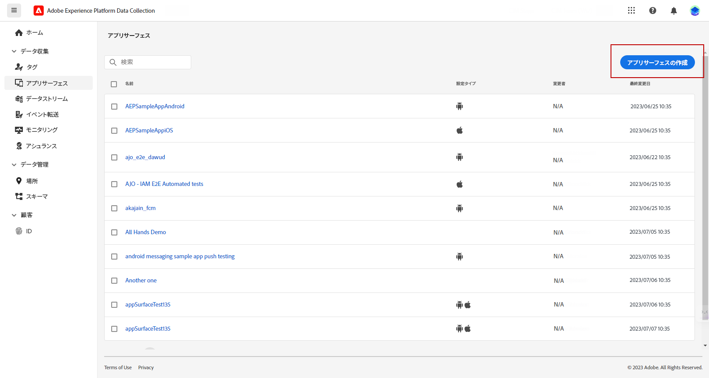

1. 設定の&#x200B;**[!UICONTROL 名前]**&#x200B;を入力します。

1. **[!UICONTROL モバイルアプリケーション設定]**&#x200B;から、オペレーティングシステムを選択します。

   * **iOS の場合**

     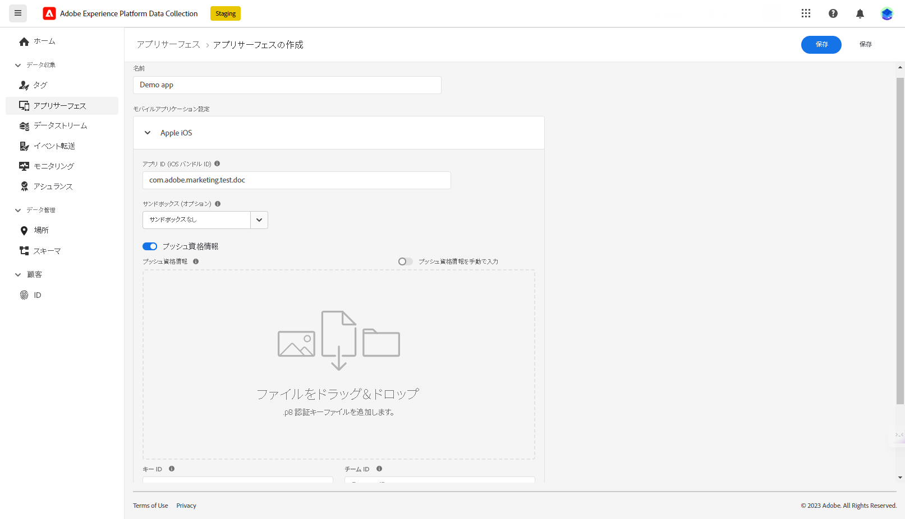

      1. 「**[!UICONTROL アプリ ID (iOS バンドル ID)]**」フィールドにモバイルアプリの&#x200B;**バンドル ID** を入力します。

         アプリのバンドル ID は、Apple 開発者アカウントの **XCode** のプライマリターゲットの「**一般**」タブで確認できます。

      1. 「**[!UICONTROL プッシュ資格情報]**」をオンにして、資格情報を追加します。

      1. .p8 Apple プッシュ通知認証キーファイルをドラッグ＆ドロップします。

         このキーは、Apple 開発者アカウントの&#x200B;**証明書**、**識別子**&#x200B;および&#x200B;**プロファイル**&#x200B;ページから取得できます。

      1. **キー ID** を入力します。これは、p8 認証キーの作成時に割り当てられる 10 文字の文字列です。

         Apple 開発者アカウントの&#x200B;**証明書**、**識別子**&#x200B;および&#x200B;**プロファイル**&#x200B;ページの「**キー**」タブにあります。

      1. **チーム ID** を入力します。これは、「**メンバーシップ**」タブの下にある文字列値です。

   * **Android の場合**

     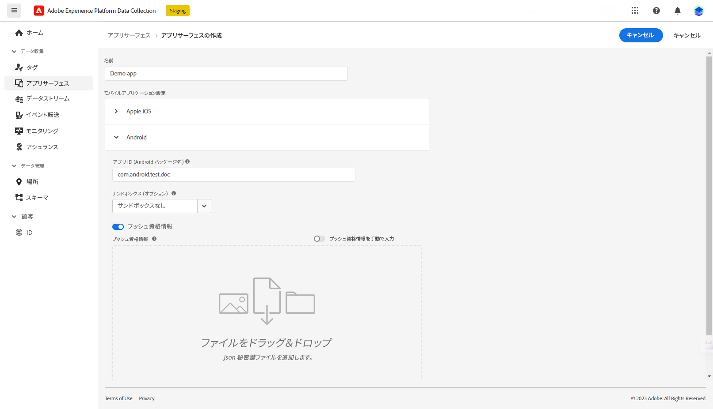

      1. **[!UICONTROL アプリ ID（Android パッケージ名）]**&#x200B;を入力します。通常、パッケージ名は `build.gradle` ファイル内のアプリ ID です。

      1. **[!UICONTROL プッシュ資格情報]**&#x200B;を切り替えて、資格情報を追加します。

      1. FCM プッシュ資格情報をドラッグ＆ドロップします。プッシュ資格情報の取得方法について詳しくは、[Google ドキュメント](https://firebase.google.com/docs/admin/setup#initialize-sdk){target="_blank"}を参照してください。

1. 「**[!UICONTROL 保存]**」をクリックして、アプリ設定を作成します。

## Adobe Campaign でのアプリケーション設定{#push-config-campaign}

### サービスの作成 {#create-service}

プッシュ通知を送信する前に、Adobe Campaign で iOS アプリと Android アプリの設定を定義する必要があります。

プッシュ通知は、専用のサービスを通じてアプリのユーザーに送信されます。ユーザーはアプリをインストールすると、このサービスにサブスクライブします。Adobe Campaign は、このサービスを利用して、アプリのサブスクライバーのみをターゲットにします。このサービスでは、iOS デバイスと Android デバイスで送信するために、iOS アプリと Android アプリを追加する必要があります。

プッシュ通知を送信するサービスを作成するには、次の手順に従います。

1. **[!UICONTROL プロファイルとターゲット／サービスとサブスクリプション]**&#x200B;タブを参照し、「**[!UICONTROL 作成]**」をクリックします。

   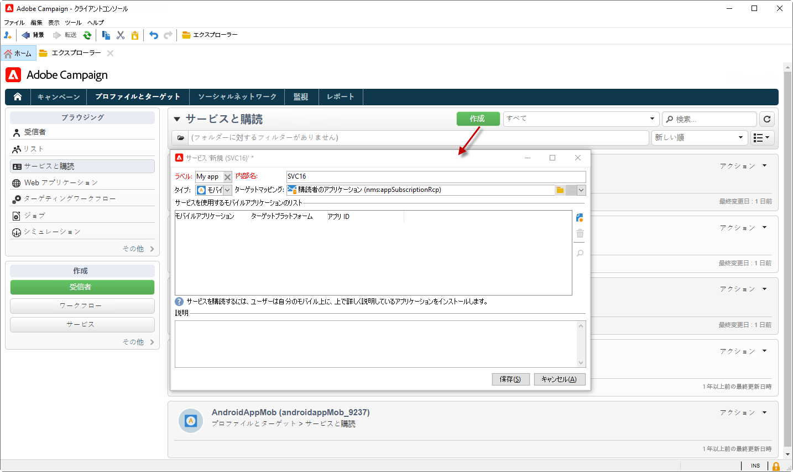{width="800" align="left"}

1. **[!UICONTROL ラベル]**&#x200B;と&#x200B;**[!UICONTROL 内部名]**&#x200B;を入力し、**[!UICONTROL モバイルアプリケーション]**&#x200B;タイプを選択します。

   >[!NOTE]
   >
   >デフォルトの「**[!UICONTROL 購読者のアプリケーション（nms:appSubscriptionRcp）]**」ターゲットマッピングが受信者のテーブルにリンクされています。異なるターゲットマッピングを使用する場合は、新しいターゲットマッピングを作成し、サービスの「**[!UICONTROL ターゲットマッピング]**」フィールドに入力する必要があります。ターゲットマッピングについて詳しくは、[このページ](../audiences/target-mappings.md)を参照してください。

1. 次に、右側にある「**[!UICONTROL 追加]**」アイコンを使用して、このサービスを使用するモバイルアプリケーションを定義します。

   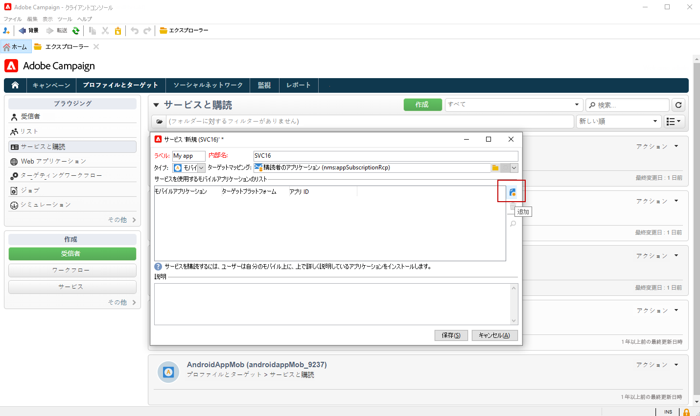

### モバイルアプリケーションの作成 {#create-sapp}

サービスを作成したら、このサービスを使用するモバイルアプリケーションを定義する必要があります。

>[!BEGINTABS]

>[!TAB iOS]

iOS デバイス用のアプリを作成するには、次の手順に従います。

1. サービスから、「**[!UICONTROL 追加]**」をクリックし、「**[!UICONTROL iOS アプリケーションを作成]**」を選択します。「**[!UICONTROL 次へ]**」をクリックします。

   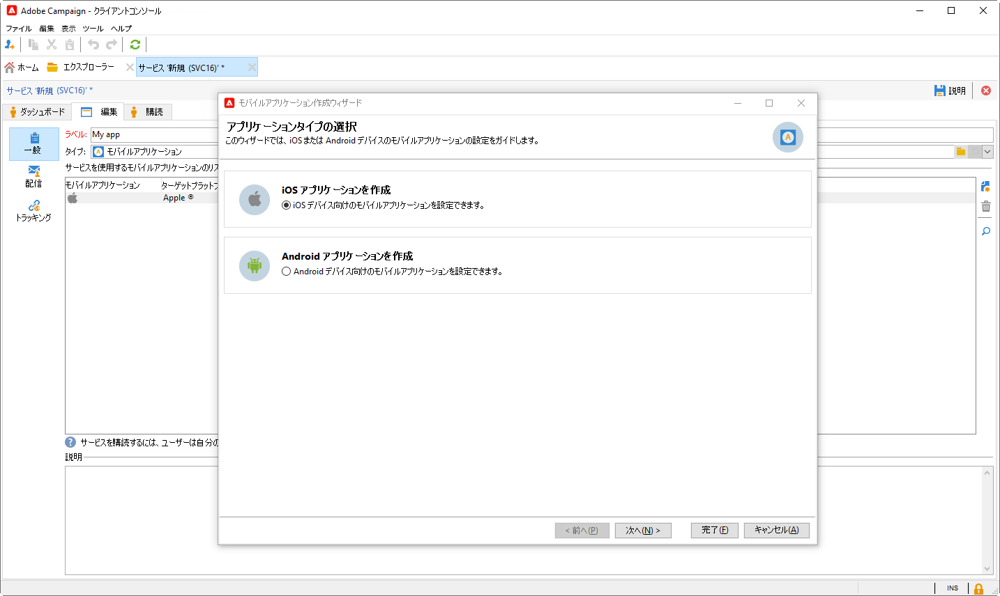

1. **[!UICONTROL Experience Platform Launch アプリ設定リスト]**&#x200B;ウィンドウから、この節で先ほど作成したアプリサーフェスを選択します。「**[!UICONTROL 次へ]**」をクリックします。

   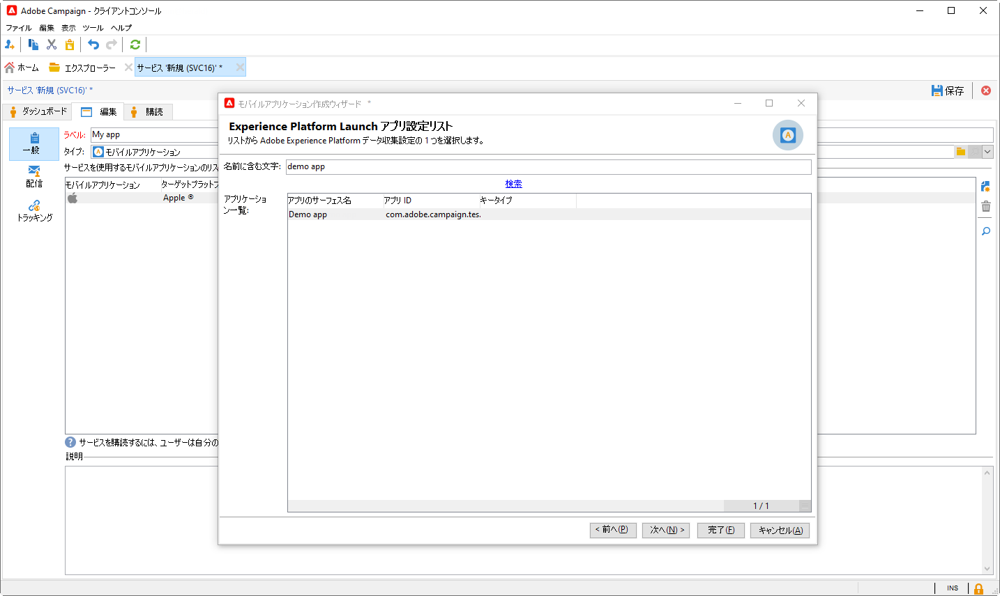

1. （オプション）**[!UICONTROL アプリケーション変数]**&#x200B;を使用してプッシュメッセージのコンテンツを強化できます。これらは完全にカスタマイズ可能で、モバイルデバイスに送信されるメッセージペイロードの一部です。

   次の例では、**mediaURl** 変数と **mediaExt** 変数を追加し、リッチなプッシュ通知を作成してさらに通知内に表示する画像をアプリケーションに提供します。

   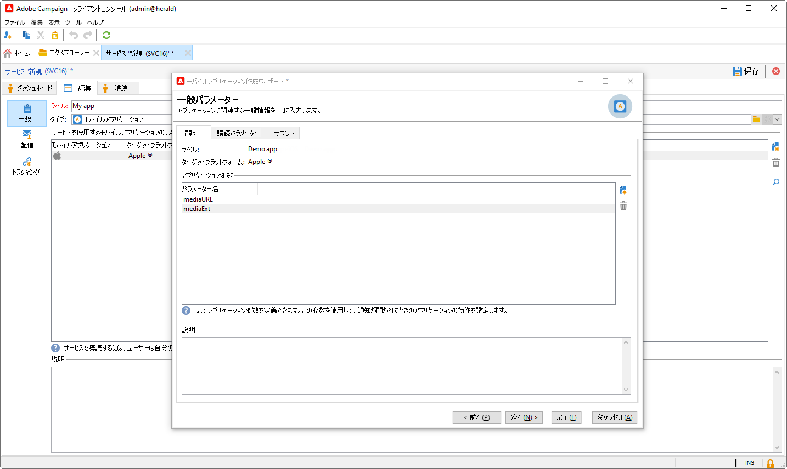

1. 「**[!UICONTROL サブスクリプションパラメーター]**」タブを参照すると、**[!UICONTROL サブスクライバーのアプリケーション（nms:appsubscriptionRcp）]**&#x200B;スキーマの拡張によりマッピングを定義できます。

1. 「**[!UICONTROL サウンド]**」タブを参照して、再生するサウンドを定義します。「**[!UICONTROL 追加]**」をクリックし、「**[!UICONTROL 内部名]**」フィールドに、アプリケーションに埋め込まれたファイル名またはシステムサウンドの名前を入力します。

1. 「**[!UICONTROL 次へ]**」をクリックし、開発アプリケーションの設定をおこないます。

1. **[!UICONTROL 統合キー]**&#x200B;は、各アプリケーションに固有です。これにより、モバイルアプリケーションが Adobe Campaign にリンクされ、Campaign 拡張機能の設定時に使用されます。

   Adobe Campaign と、アプリケーションコード（SDK 経由）で同じ&#x200B;**[!UICONTROL 統合キー]**&#x200B;が定義されていることを確認します。

   詳しくは、[Developer のドキュメント](https://developer.adobe.com/client-sdks/documentation/adobe-campaign-classic/#configuration-keys){target="_blank"}を参照してください

   >[!NOTE]
   >
   > **[!UICONTROL 統合キー]**&#x200B;は、文字列値を使用して完全にカスタマイズできますが、SDK で指定されたものと完全に同じにする必要があります。
   >
   > アプリケーションの開発バージョン（サンドボックス）と実稼動バージョンに同じ証明書を使用することはできません。

   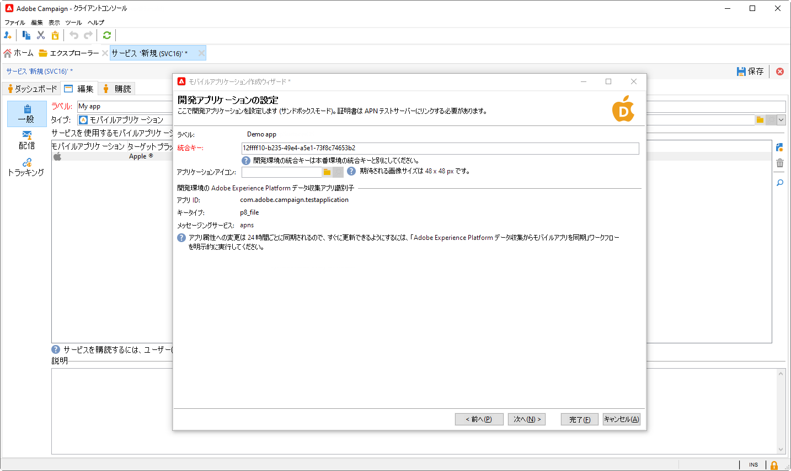

1. 「**[!UICONTROL アプリケーションアイコン]**」フィールドからアイコンを選択して、サービス内のモバイルアプリケーションをパーソナライズします。

1. 「**[!UICONTROL 次へ]**」をクリックして実稼動アプリケーションの設定を行い、上記と同じ手順に従います。アプリケーションの開発バージョン（サンドボックス）と実稼動バージョンに同じ&#x200B;**[!UICONTROL 統合キー]**&#x200B;を使用することはできません。

1. 「**[!UICONTROL 終了]**」をクリックします。

これで、Campaign で iOS アプリケーションを使用する準備が整いました。

>[!TAB Android]

Android デバイス用のアプリを作成するには、次の手順に従います。

1. サービスから、「**[!UICONTROL 追加]**」をクリックし、「**[!UICONTROL Android アプリケーションを作成]**」を選択します。「**[!UICONTROL 次へ]**」をクリックします。

   

1. **[!UICONTROL Experience Platform Launch アプリ設定リスト]**&#x200B;ウィンドウから、この節で前に作成したアプリサーフェスを選択し、「**[!UICONTROL 次へ]**」をクリックします。

   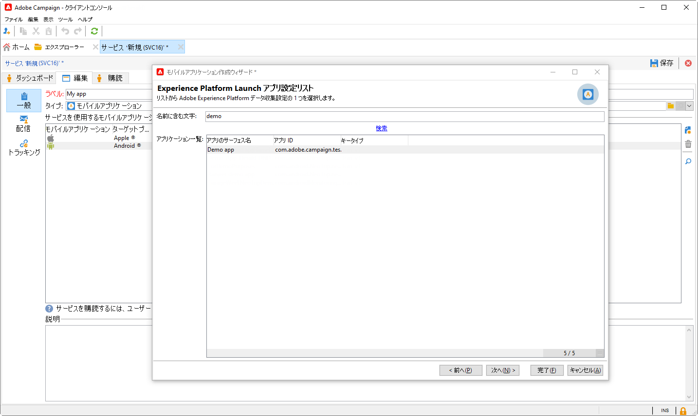

1. 統合キーは、各アプリケーションに固有です。これにより、モバイルアプリケーションが Adobe Campaign にリンクされ、Campaign 拡張機能の設定時に使用されます。

   Adobe Campaign と、アプリケーションコード（SDK 経由）で同じ&#x200B;**[!UICONTROL 統合キー]**&#x200B;が定義されていることを確認します。

   詳しくは、[Developer のドキュメント](https://developer.adobe.com/client-sdks/documentation/adobe-campaign-classic/#configuration-keys){target="_blank"}を参照してください

   >[!NOTE]
   >
   > **[!UICONTROL 統合キー]**&#x200B;は、文字列値を使用して完全にカスタマイズできますが、SDK で指定されたものと完全に同じにする必要があります。

   

1. 「**[!UICONTROL アプリケーションアイコン]**」フィールドからアイコンを選択して、サービス内のモバイルアプリケーションをパーソナライズします。

1. （オプション）必要に応じて、**[!UICONTROL アプリケーション変数]**&#x200B;を使用してプッシュメッセージのコンテンツを強化できます。これらは完全にカスタマイズ可能で、モバイルデバイスに送信されるメッセージペイロードの一部です。

1. 「**[!UICONTROL サブスクリプションパラメーター]**」タブを参照すると、**[!UICONTROL サブスクライバーのアプリケーション（nms:appsubscriptionRcp）]**&#x200B;スキーマの拡張によりマッピングを定義できます。

1. 「**[!UICONTROL 終了]**」、「**[!UICONTROL 保存]**」の順にクリックします。

これで、Campaign で Android アプリケーションを使用する準備が整いました。

>[!ENDTABS]

以下に、プッシュ通知をさらにパーソナライズするための FCM ペイロード名を示します。

| メッセージタイプ | 設定可能なメッセージ要素（FCM ペイロード名） | 設定可能なオプション（FCM ペイロード名） |
|:-:|:-:|:-:|
| データメッセージ | 該当なし | validate_only |
| 通知メッセージ | title、body、android_channel_id、icon、sound、tag、color、click_action、image、ticker、sticky、visibility、notification_priority、notification_count   | validate_only |

## Adobe Experience Platform データ収集でのモバイルプロパティの設定 {#create-mobile-property}

1. データ収集ホームページから、タグメニューにアクセスします。

1. 「**[!UICONTROL 新規プロパティ]**」をクリックします。

   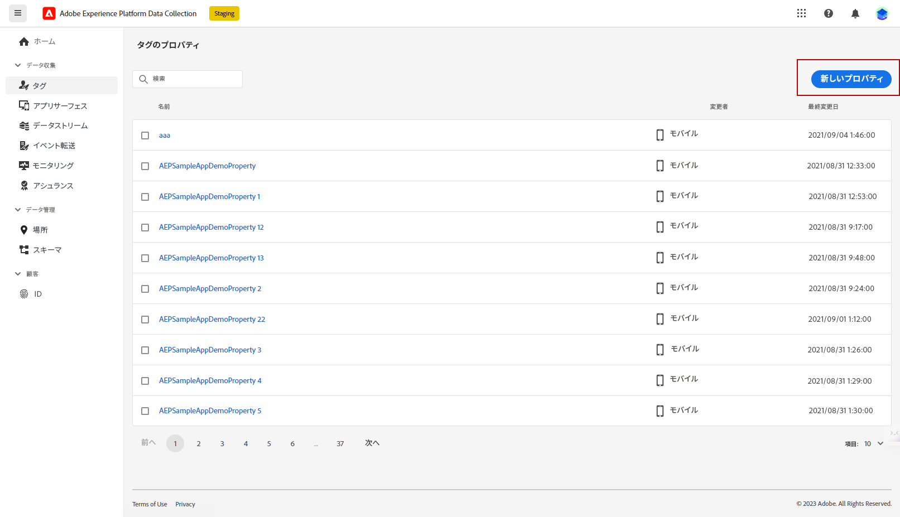

1. プロパティの名前を入力し、プラットフォームとして「**[!UICONTROL モバイル]**」を選択します。

   

1. 「**[!UICONTROL 保存]**」をクリックして、モバイルプロパティを作成します。

1. 新しく作成したモバイルプロパティにアクセスします。

1. モバイルプロパティダッシュボードから、**[!UICONTROL 拡張機能]**&#x200B;メニューにアクセスし、次に「**[!UICONTROL カタログ]**」タブにアクセスします。

   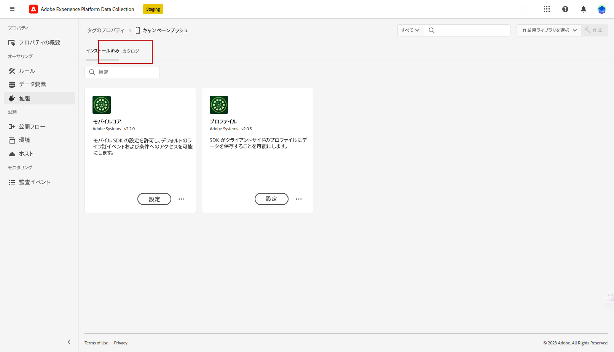

1. **[!DNL Adobe Campaign Classic]** 拡張機能をインストールします。[詳しくは、Campaign 拡張機能を参照してください](https://developer.adobe.com/client-sdks/documentation/adobe-campaign-classic/#configure-campaign-classic-extension)

   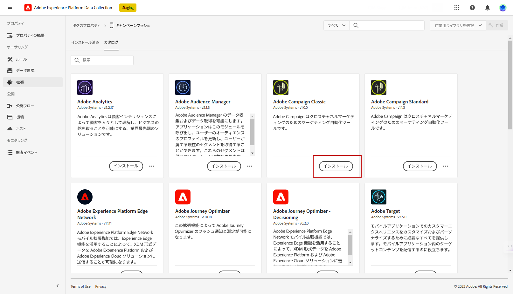

1. インスタンスの詳細を入力します。

   * **[!UICONTROL 登録エンドポイント]**&#x200B;または&#x200B;**[!UICONTROL トラッキングエンドポイント]** URL は、Campaign の&#x200B;**[!UICONTROL ツール]**／**[!UICONTROL 詳細]**／**[!UICONTROL デプロイメント]**&#x200B;ウィザードメニューにあります。
   * **[!UICONTROL 統合キー]**&#x200B;は、[この節](#create-app)で設定したモバイルアプリにあります。

   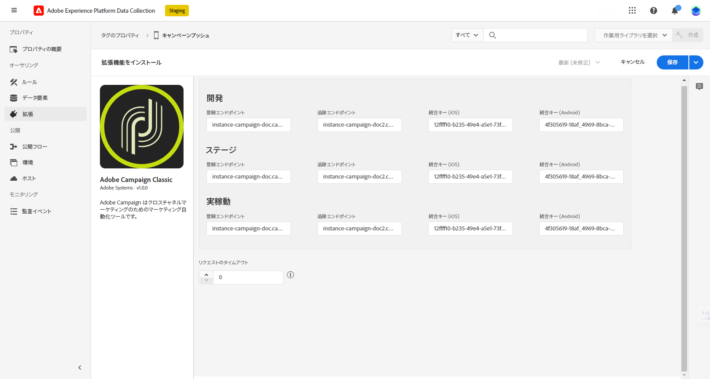

1. 「**[!UICONTROL 保存]**」をクリックします。

1. ここで、**[!UICONTROL 公開フロー]**&#x200B;メニューから設定を公開する必要があります。[詳細情報](https://developer.adobe.com/client-sdks/documentation/getting-started/create-a-mobile-property/#publish-the-configuration)

これで、モバイルプロパティが **[!UICONTROL Adobe Experience Platform データ収集]**&#x200B;テクニカルワークフローと自動的に同期されるようになります。[詳細情報](../../automation/workflow/technical-workflows.md#list-technical-workflows)

## Campaign Classic をモバイルアプリケーションに追加 {#campaign-mobile-app}

Adobe Experience Platform Mobile SDK は、モバイルアプリでアドビの Experience Cloud のソリューションとサービスを強化するのに役立ちます。SDK の設定はデータ収集 UI を通じて管理され、柔軟な設定と拡張可能なルールベースの統合を実現します。

詳しくは、[Adobe Developer のドキュメント](https://developer.adobe.com/client-sdks/documentation/adobe-campaign-classic/#add-campaign-classic-to-your-app){target="_blank"}を参照してください。

## プッシュ通知を作成{#push-create}

データ収集でモバイルアプリケーションを正常に設定したら、Adobe Campaign でプッシュ通知を作成して送信できるようになります。

iOS および Android の通知の配信に固有の詳細な要素については、[このページ](push.md#push-create)を参照してください。
