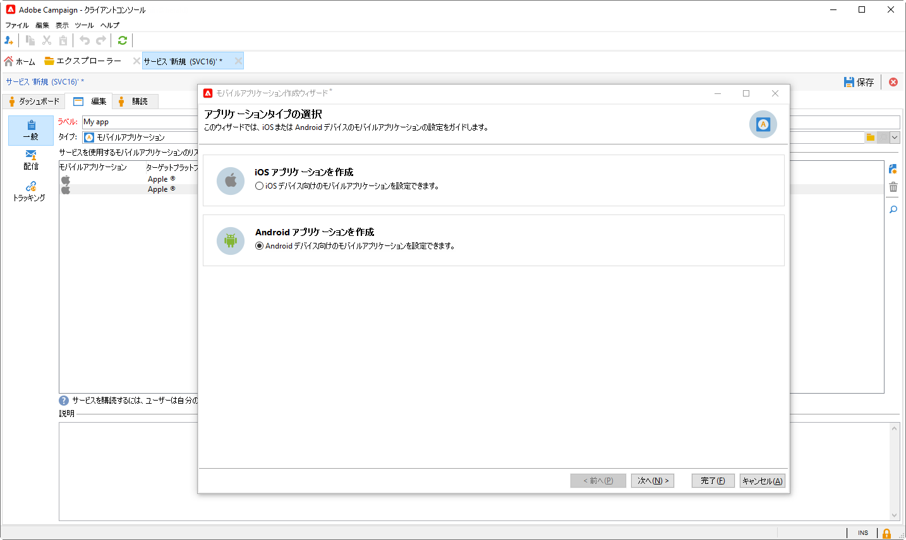
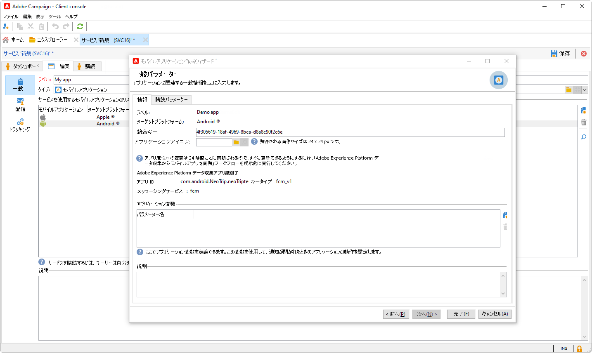
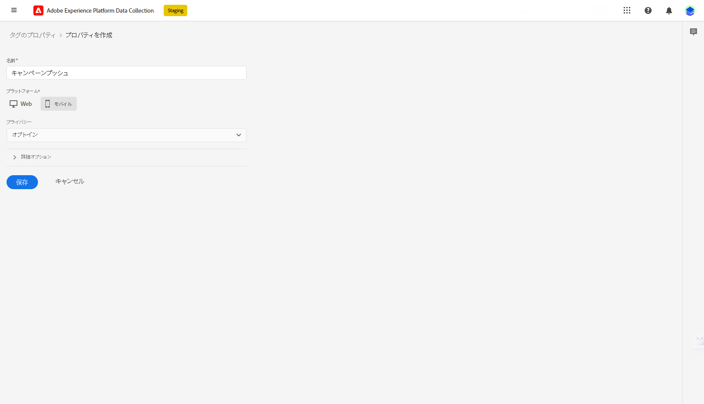

# プッシュ通知設定を修正しました {#push-notifications-config}

>[!AVAILABILITY]
>
> この機能は、リリース 8.5 以降の新規のお客様のみが利用でき、選択した一連のお客様に段階的にロールアウトされます。 環境が 2023 年 6 月より前にプロビジョニングされている場合は、次に説明する手順に従う必要があります [このページ](push-settings.md).

Adobe Campaign でプッシュ通知を送信するには、次の操作を実行します。

1. [Adobe Experience Platform Data Collection でのアプリサーフェスの作成](#create-app-surface)

1. [Adobe Campaignでのアプリケーション設定](#push-config-campaign)

1. [Adobe Experience Platform Data Collection でモバイルプロパティを作成および設定する](#create-mobile-property)

1. [AdobeAdobe Experience Platform Assurance 拡張機能を追加する](https://developer.adobe.com/client-sdks/documentation/platform-assurance-sdk/){target="_blank"}（推奨）

1. [モバイルCampaign Classicにアプリを追加](#campaign-mobile-ap)

1. [iOSと Android の両方の配信を作成](##push-create)

>[!NOTE]
>
> レガシー FCM および APNS p12 は、データ収集ではサポートされていません。

## Adobe Experience Platform Data Collection でのアプリサーフェスの作成 {#create-app-surface}

モバイルアプリケーションのプッシュ資格情報をに追加する必要があります。 [!DNL Adobe Experience Platform Data Collection].

モバイルアプリのプッシュ証明書の登録は、Adobeが自分に代わってプッシュ通知を送信することを許可するために必要です。 以下に説明する手順を参照してください。

1. 送信者 [!DNL Adobe Experience Platform Data Collection]を選択し、 **[!UICONTROL アプリのサーフェス]** 」タブをクリックします。

1. クリック **[!UICONTROL アプリサーフェスを作成]** 新しい設定を作成します。

   

1. を入力します。 **[!UICONTROL 名前]** を設定します。

1. 送信者 **[!UICONTROL モバイルアプリケーション設定]**、「オペレーショナルシステム」を選択します。

   * **iOS の場合**

     

      1. モバイルアプリを入力 **バンドル ID** 内 **[!UICONTROL アプリ ID (iOS Bundle ID)]** フィールドに入力します。

         アプリバンドル ID は、 **一般** のプライマリターゲットのタブ **XCode** Apple開発者アカウントの

      1. オンに切り替え **[!UICONTROL プッシュ認証情報]** 認証情報を追加します。

      1. .p8 Apple Push Notification Authentication Key ファイルをドラッグ&amp;ドロップします。

         このキーは、 **証明書**, **識別子** および **プロファイル** Apple開発者アカウントのページ。

      1. 次を提供： **キー ID**. これは、p8 認証キーの作成時に割り当てられた 10 文字の文字列です。

         これはの下にあります。 **キー** タブ **証明書**, **識別子** および **プロファイル** Apple開発者アカウントのページ。

      1. 次を提供： **チーム ID**. これは、 **メンバーシップ** タブをクリックします。

   * **Android の場合**

     

      1. 次を提供： **[!UICONTROL アプリ ID （Android パッケージ名）]**. 通常、パッケージ名は、 `build.gradle` ファイル。

      1. 切り替え **[!UICONTROL プッシュ認証情報]** 認証情報を追加します。

      1. FCM プッシュ資格情報をドラッグ&amp;ドロップします。 プッシュ資格情報の取得方法の詳細については、を参照してください。 [Google Documentation](https://firebase.google.com/docs/admin/setup#initialize-sdk){target="_blank"}.

1. クリック **[!UICONTROL 保存]** をクリックして、アプリ設定を作成します。

## Adobe Campaignでのアプリケーション設定{#push-config-campaign}

### サービスの作成 {#create-service}

プッシュ通知を送信する前に、Adobe Campaign で iOS アプリと Android アプリの設定を定義する必要があります。

プッシュ通知は、専用のサービスを通じてアプリのユーザーに送信されます。ユーザーはアプリをインストールすると、このサービスにサブスクライブします。Adobe Campaign は、このサービスを利用して、アプリのサブスクライバーのみをターゲットにします。このサービスでは、iOS デバイスと Android デバイスで送信するために、iOS アプリと Android アプリを追加する必要があります。

プッシュ通知を送信するサービスを作成するには、次の手順に従います。

1. **[!UICONTROL プロファイルとターゲット／サービスとサブスクリプション]**&#x200B;タブを参照し、「**[!UICONTROL 作成]**」をクリックします。

   {width="800" align="left"}

1. **[!UICONTROL ラベル]**&#x200B;と&#x200B;**[!UICONTROL 内部名]**&#x200B;を入力し、**[!UICONTROL モバイルアプリケーション]**&#x200B;タイプを選択します。

   >[!NOTE]
   >
   >デフォルトの「**[!UICONTROL 購読者のアプリケーション（nms:appSubscriptionRcp）]**」ターゲットマッピングが受信者のテーブルにリンクされています。異なるターゲットマッピングを使用する場合は、新しいターゲットマッピングを作成し、サービスの「**[!UICONTROL ターゲットマッピング]**」フィールドに入力する必要があります。ターゲットマッピングについて詳しくは、[このページ](../audiences/target-mappings.md)を参照してください。

1. 次に、右側にある「**[!UICONTROL 追加]**」アイコンを使用して、このサービスを使用するモバイルアプリケーションを定義します。

   

### モバイルアプリケーションを作成する {#create-sapp}

サービスを作成したら、このサービスを使用するモバイルアプリケーションを定義する必要があります。

>[!BEGINTABS]

>[!TAB iOS]

iOS デバイス用のアプリを作成するには、次の手順に従います。

1. サービスから、 **[!UICONTROL 追加]** 次に、 **[!UICONTROL iOSアプリケーションの作成]**. 「**[!UICONTROL 次へ]**」をクリックします。

   

1. 次の **[!UICONTROL Launch アプリ設定リスト]** ウィンドウで、このセクションで以前に作成した「アプリケーションサーフェス」(App surface) を選択します。 「**[!UICONTROL 次へ]**」をクリックします。

   

1. （オプション）**[!UICONTROL アプリケーション変数]**&#x200B;を使用してプッシュメッセージのコンテンツを強化できます。これらは完全にカスタマイズ可能で、モバイルデバイスに送信されるメッセージペイロードの一部です。

   次の例では、 **mediaURl** および **mediaExt** 変数を追加してリッチなプッシュ通知を作成し、通知内に表示する画像をアプリケーションに提供します。

   

1. 「**[!UICONTROL サブスクリプションパラメーター]**」タブを参照すると、**[!UICONTROL サブスクライバーのアプリケーション（nms:appsubscriptionRcp）]**&#x200B;スキーマの拡張によりマッピングを定義できます。

1. 「**[!UICONTROL サウンド]**」タブを参照して、再生するサウンドを定義します。「**[!UICONTROL 追加]**」をクリックし、「**[!UICONTROL 内部名]**」フィールドに、アプリケーションに埋め込まれたファイル名またはシステムサウンドの名前を入力します。

1. 「**[!UICONTROL 次へ]**」をクリックし、開発アプリケーションの設定をおこないます。

1. この **[!UICONTROL 統合キー]** は、各アプリケーションに固有です。 これにより、モバイルアプリケーションがAdobe Campaignにリンクされ、Campaign 拡張機能の設定時に使用されます。

   Adobe Campaign と、アプリケーションコード（SDK 経由）で同じ&#x200B;**[!UICONTROL 統合キー]**&#x200B;が定義されていることを確認します。

   詳しくは、[Developer のドキュメント](https://developer.adobe.com/client-sdks/documentation/adobe-campaign-classic/#configuration-keys){target="_blank"}を参照してください

   >[!NOTE]
   >
   > **[!UICONTROL 統合キー]**&#x200B;は、文字列値を使用して完全にカスタマイズできますが、SDK で指定されたものと完全に同じにする必要があります。
   >
   > アプリケーションの開発バージョン（サンドボックス）と実稼動バージョンに同じ証明書を使用することはできません。

   

1. 「**[!UICONTROL アプリケーションアイコン]**」フィールドからアイコンを選択して、サービス内のモバイルアプリケーションをパーソナライズします。

1. 「**[!UICONTROL 次へ]**」をクリックして本番アプリケーションの設定をおこない、上記と同じ手順に従います。同じ **[!UICONTROL 統合キー]** アプリケーションの開発バージョン（サンドボックス）と実稼動バージョンの場合。

1. 「**[!UICONTROL 終了]**」をクリックします。

これで、Campaign で iOS アプリケーションを使用する準備が整いました。

>[!TAB Android]

Android デバイス用のアプリを作成するには、次の手順に従います。

1. サービスから、 **[!UICONTROL 追加]** 次に、 **[!UICONTROL Android アプリケーションの作成]**. 「**[!UICONTROL 次へ]**」をクリックします。

   

1. 次の **[!UICONTROL Launch アプリ設定リスト]** ウィンドウで、このセクションで作成したアプリケーションサーフェスを選択し、 **[!UICONTROL 次へ]**.

   

1. 統合キーは、各アプリケーションに固有です。これにより、モバイルアプリケーションがAdobe Campaignにリンクされ、Campaign 拡張機能の設定時に使用されます。

   Adobe Campaign と、アプリケーションコード（SDK 経由）で同じ&#x200B;**[!UICONTROL 統合キー]**&#x200B;が定義されていることを確認します。

   詳しくは、[Developer のドキュメント](https://developer.adobe.com/client-sdks/documentation/adobe-campaign-classic/#configuration-keys){target="_blank"}を参照してください

   >[!NOTE]
   >
   > **[!UICONTROL 統合キー]**&#x200B;は、文字列値を使用して完全にカスタマイズできますが、SDK で指定されたものと完全に同じにする必要があります。

   

1. 「**[!UICONTROL アプリケーションアイコン]**」フィールドからアイコンを選択して、サービス内のモバイルアプリケーションをパーソナライズします。

1. （オプション）必要に応じて、**[!UICONTROL アプリケーション変数]**&#x200B;を使用してプッシュメッセージのコンテンツを強化できます。これらは完全にカスタマイズ可能で、モバイルデバイスに送信されるメッセージペイロードの一部です。

1. 「**[!UICONTROL サブスクリプションパラメーター]**」タブを参照すると、**[!UICONTROL サブスクライバーのアプリケーション（nms:appsubscriptionRcp）]**&#x200B;スキーマの拡張によりマッピングを定義できます。

1. 「**[!UICONTROL 終了]**」、「**[!UICONTROL 保存]**」の順にクリックします。

これで、Campaign で Android アプリケーションを使用する準備が整いました。

>[!ENDTABS]

以下に、プッシュ通知をさらにパーソナライズするための FCM ペイロード名を示します。

| メッセージタイプ | 設定可能なメッセージ要素（FCM ペイロード名） | 設定可能なオプション（FCM ペイロード名） |
|:-:|:-:|:-:|
| データメッセージ | 該当なし | validate_only |
| 通知メッセージ | title、body、android_channel_id、icon、sound、tag、color、click_action、image、ticker、sticky、visibility、notification_priority、notification_count   | validate_only |

## Adobe Experience Platform Data Collection でモバイルプロパティを設定する {#create-mobile-property}

1. データ収集ホームページから、タグメニューにアクセスします。

1. クリック **[!UICONTROL 新しいプロパティ]**.

   

1. プロパティの名前を入力し、「 」を選択します。 **[!UICONTROL モバイル]** をプラットフォームとして使用する。

   

1. クリック **[!UICONTROL 保存]** をクリックしてモバイルプロパティを作成します。

1. 新しく作成したモバイルプロパティにアクセスします。

1. モバイルプロパティダッシュボードから、 **[!UICONTROL 拡張機能]** メニューを選択し、 **[!UICONTROL カタログ]** タブをクリックします。

   

1. のインストール **[!DNL Adobe Campaign Classic]** 拡張子。 [Campaign 拡張機能の詳細を説明します](https://developer.adobe.com/client-sdks/documentation/adobe-campaign-classic/#configure-campaign-classic-extension)

   

1. インスタンスの詳細を入力します。

   * **[!UICONTROL 登録エンドポイント]** または **[!UICONTROL トラッキングエンドポイント]** URL は、 **[!UICONTROL ツール]** > **[!UICONTROL 詳細]** > **[!UICONTROL デプロイウィザード]** 」メニューを使用します。
   * **[!UICONTROL 統合キー]** は、 [この節](#create-app).

   

1. 「**[!UICONTROL 保存]**」をクリックします。

1. 次に、設定を **[!UICONTROL 公開フロー]** メニュー [詳細情報](https://developer.adobe.com/client-sdks/documentation/getting-started/create-a-mobile-property/#publish-the-configuration)

これで、モバイルプロパティが **[!UICONTROL Adobe Experience Platform Data Collection]** テクニカルワークフロー。 [詳細情報](../../automation/workflow/technical-workflows.md#list-technical-workflows)

## モバイルCampaign Classicにアプリを追加 {#campaign-mobile-app}

Adobe Experience Platform Mobile SDK は、モバイルアプリでアドビの Experience Cloud のソリューションとサービスを強化するのに役立ちます。SDK の設定はデータ収集 UI を通じて管理され、柔軟な設定と拡張可能なルールベースの統合を実現します。

詳しくは、[Adobe Developer のドキュメント](https://developer.adobe.com/client-sdks/documentation/adobe-campaign-classic/#add-campaign-classic-to-your-app){target="_blank"}を参照してください。

## プッシュ通知を作成する{#push-create}

データ収集でモバイルアプリケーションを正常に設定したら、Adobe Campaignでプッシュ通知を作成して送信できるようになりました。

参照： [このページ](push.md#push-create) :iOSおよび Android の通知の配信に関する詳細な要素。
