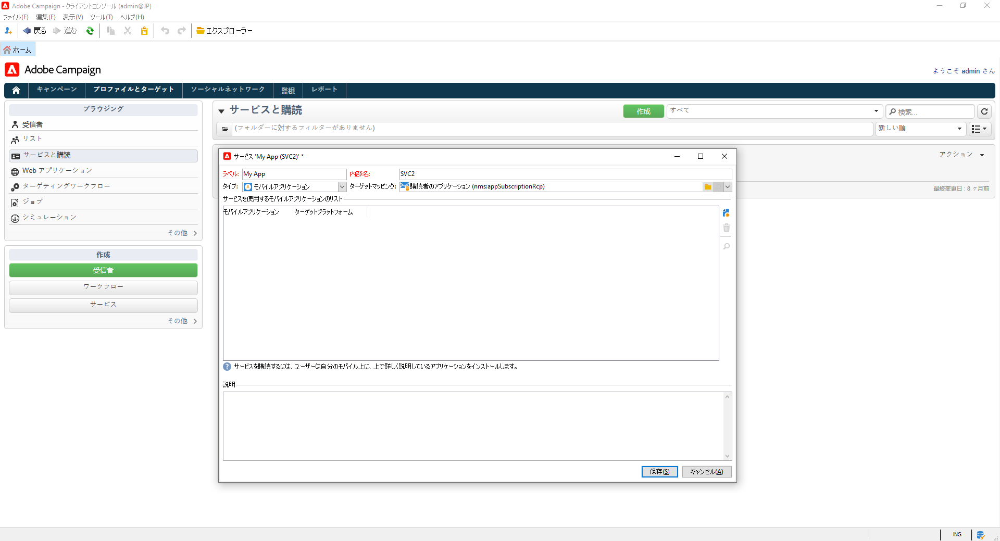
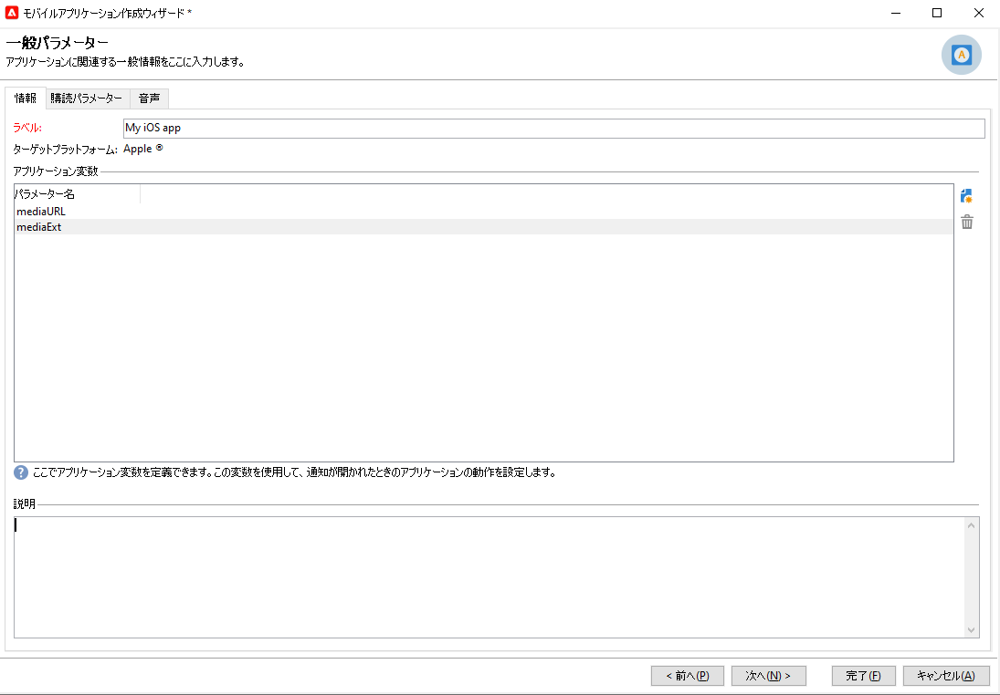
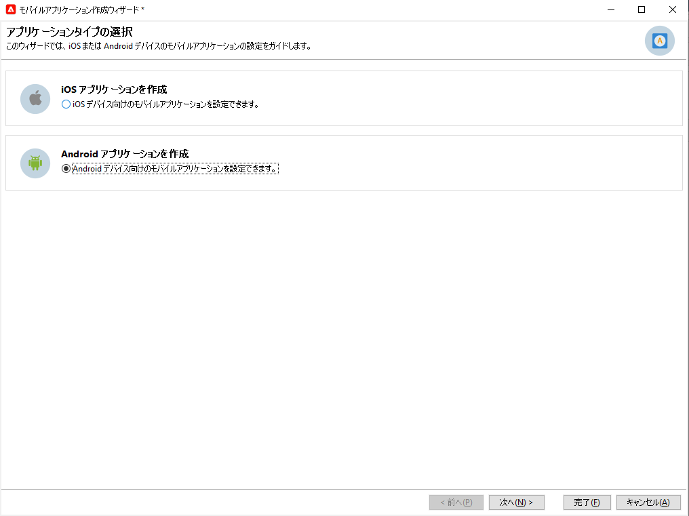

# プッシュ通知チャネルを設定 {#push-notification-configuration}

Adobe Campaign でプッシュ通知を送信するには、このページで詳しく説明するように、まず環境とアプリを設定する必要があります。Adobe Campaign では、プッシュ通知を送信するチャネルはモバイルアプリチャネルです。

>[!CAUTION]
>
>2024 年に Android Firebase Cloud Messaging（FCM）サービスに対するいくつかの重要な変更は、リリースする予定です。このリリースは、Adobe Campaign の実装に影響を与える場合があります。この変更をサポートするには、Android プッシュメッセージの購読サービス設定を更新する必要がある場合があります。今すぐ確認し、アクションを実行できます。[詳細情報](../../technotes/upgrades/push-technote.md)。

Adobe Campaign でプッシュ通知の送信を開始する前に、モバイルアプリと Adobe Experience Platform のタグで、設定と統合が行われていることを確認する必要があります。Adobe Experience Platform Mobile SDK は、Android および iOS 互換の SDK を介して、モバイル用のクライアントサイド統合 API を提供します。

アプリを Adobe Experience Platform Mobile SDK で設定するには、次の手順に従います。

1. [前提条件](#before-starting)を確認します。
1. Adobe Experience Platform データ収集で[モバイルタグプロパティ](#launch-property)を設定します。
1. [このページ](https://developer.adobe.com/client-sdks/documentation/getting-started/get-the-sdk/){target="_blank"}を参照して、Adobe Experience Platform Mobile SDK を取得します。
1. （オプション）[このページ](https://developer.adobe.com/client-sdks/documentation/getting-started/enable-debug-logging/){target="_blank"}を参照して、ログとライフサイクル指標を有効にします。
1. （オプション）[Adobe Experience Platform Assurance をアプリに](https://developer.adobe.com/client-sdks/documentation/getting-started/validate/){target="_blank"} to validate your implementation. Learn how to implement Adobe Experience Platform Assurance extension [in this page](https://developer.adobe.com/client-sdks/documentation/platform-assurance-sdk/){target="_blank"}追加します。
1. [このページ](#push-service)を参照して、Adobe Campaign で iOS および Android モバイルサービスを設定します。
1. モバイルプロパティに [Adobe Campaign 拡張機能](#configure-extension)をインストールして設定します。
1. [Adobe Experience Platform Mobile SDK ドキュメント](https://developer.adobe.com/client-sdks/documentation/getting-started/){target="_blank"}に従って、アプリで Adobe Experience Platform Mobile SDK を設定します。

## 前提条件 {#before-starting}

### 権限の設定 {#setup-permissions}

モバイルアプリケーションを作成する前に、まず、Adobe Experience Platform でタグに対する正しいユーザー権限があるか、割り当てられていることを確認する必要があります。Adobe Experience Platform のタグに対するユーザー権限は、Adobe Admin Console を通じてユーザーに割り当てられます。詳しくは、[タグのドキュメント](https://experienceleague.adobe.com/docs/experience-platform/tags/admin/user-permissions.html?lang=ja){target="_blank"}を参照してください。

>[!CAUTION]
>
>プッシュ設定は、エキスパートユーザーが実行する必要があります。 実装モデルとこの実装に関与するペルソナに応じて、権限の完全な設定を単一の製品プロファイルに割り当てるか、アプリ開発者と **Adobe Campaign** 管理者の間で権限を共有する必要がある場合があります。

**プロパティ**&#x200B;および&#x200B;**会社**&#x200B;の権限を割り当てるには、次の手順に従います。

1. **[!DNL Admin Console]** にアクセスします。
1. 「**[!UICONTROL 製品]**」タブから、**[!UICONTROL Adobe Experience Platform データ収集]**&#x200B;カードを選択します。
1. 既存の&#x200B;**[!UICONTROL 製品プロファイル]**&#x200B;を選択するか、「**[!UICONTROL 新規プロファイル]**」ボタンで新しい製品プロファイルを作成します。新しい&#x200B;**[!UICONTROL 新規プロファイル]**&#x200B;を作成する方法については、[Admin Console のドキュメント](https://experienceleague.adobe.com/docs/experience-platform/access-control/ui/create-profile.html?lang=ja#ui){target="_blank"}を参照してください。
1. 「**[!UICONTROL 権限]**」タブから、「**[!UICONTROL プロパティ権限]**」を選択します。
1. 「**[!UICONTROL すべて追加]**」をクリックします。これにより、次の権限が製品プロファイルに追加されます。
   * **[!UICONTROL 承認]**
   * **[!UICONTROL 開発]**
   * **[!UICONTROL プロパティの編集]**
   * **[!UICONTROL 環境の管理]**
   * **[!UICONTROL 拡張機能の管理]**
   * **[!UICONTROL 公開]**

   これらの権限は、Adobe Campaign 拡張機能をインストールして公開し、**Adobe Experience Platform Mobile SDK** でアプリのプロパティを公開するために必要です。

1. 次に、 左側のメニューで「**[!UICONTROL 会社の権限]**」を選択します。
1. 次の権限を追加します。

   * **[!UICONTROL アプリ設定の管理]**
   * **[!UICONTROL プロパティの管理]**

   これらの権限は、モバイルアプリ開発者が **Adobe Experience Platform データ収集**&#x200B;でプッシュ資格情報を設定するために必要です。

1. 「**[!UICONTROL 保存]**」をクリックします。

この&#x200B;**[!UICONTROL 製品プロファイル]**&#x200B;をユーザーに割り当てるには、次の手順に従います。

1. **[!DNL Admin Console]** にアクセスします。
1. 「**[!UICONTROL 製品]**」タブから、**[!UICONTROL Adobe Experience Platform データ収集]**&#x200B;カードを選択します。
1. 以前に設定した&#x200B;**[!UICONTROL 製品プロファイル]**&#x200B;を選択します。
1. 「**[!UICONTROL ユーザー]**」タブから、「**[!UICONTROL ユーザーを追加]**」をクリックします。
1. ユーザー名またはメールアドレスを入力して、ユーザーを選択します。次に、「**[!UICONTROL 保存]**」をクリックします。

   >[!NOTE]
   >
   >ユーザーが以前に Admin Console で作成されていない場合は、 [ユーザーの追加に関するドキュメント](https://helpx.adobe.com/jp/enterprise/using/manage-users-individually.html#add-users){target="_blank"}を参照してください。

### アプリの設定 {#configure-app}

技術的な設定では、アプリ開発者とビジネス管理者の緊密な共同作業が必要です。[!DNL Adobe Campaign] でプッシュ通知の送信を開始する前に、[!DNL Adobe Experience Platform Data Collection] で設定を定義し、モバイルアプリを Adobe Experience Platform Mobile SDK と統合する必要があります。

以下のリンクに記載されている実装手順に従います。

* **Apple iOS** の場合：アプリを APN に登録する方法については、[Apple のドキュメント](https://developer.apple.com/documentation/usernotifications/registering_your_app_with_apns){target="_blank"}を参照してください。
* **Google Android** の場合：Android で Firebase Cloud Messaging クライアントアプリを設定する方法については、[Google のドキュメント](https://firebase.google.com/docs/cloud-messaging/android/client){target="_blank"}を参照してください。

<!--
## Add your app push credentials in Adobe Experience Platform Data Collection {#push-credentials}

After granting the correct user permissions, you now need to add your mobile application push credentials in Adobe Experience Platform Data Collection. 

The mobile app push credential registration is required to authorize Adobe to send push notifications on your behalf. Refer to the steps detailed below:

1. From [!DNL Adobe Experience Platform Data Collection], browse to **[!UICONTROL App Surfaces]** in the left rail.

1. Click **[!UICONTROL Create App Surface]** to create a new configuration.

1. Enter a **[!UICONTROL Name]** for the configuration.

1. From **[!UICONTROL Mobile Application Configuration]**, select the system and enter settings.

    * **For iOS**

        1. Enter the mobile app **Bundle Id** in the **[!UICONTROL App ID (iOS Bundle ID)]** field. The app Bundle ID can be found in the **General** tab of the primary target in **XCode**.
        
        1. Switched on the **[!UICONTROL Push Credentials]** button to add your credentials.
        
        1. Drag and drop your .p8 Apple Push Notification Authentication Key file. This key can be acquired from the **Certificates**, **Identifiers** and **Profiles** page.

        1. Provide the **Key ID**. This is a 10 character string assigned during the creation of p8 auth key. It can be found under **Keys** tab in **Certificates**, **Identifiers** and **Profiles** page.
        
        1. Provide the **Team ID**. This is a string value which can be found under the Membership tab.

    * **For Android**

        1. Provide the **[!UICONTROL App ID (Android package name)]**: usually the package name is the app id in your `build.gradle` file.

        1. Switched on the **[!UICONTROL Push Credentials]** button to add your credentials.

        1. Drag and drop the FCM push credentials. For more details on how to get the push credentials refer to [Google Documentation](https://firebase.google.com/docs/admin/setup#initialize-sdk){target="_blank"}.
    

1. Click **[!UICONTROL Save]** to create your app configuration.
-->

## Adobe Experience Platform データ収集でのモバイルタグプロパティの設定 {#launch-property}

モバイルプロパティを設定すると、モバイルアプリ開発者またはマーケターがモバイル SDK を設定できます。通常、管理するモバイルアプリケーションごとにモバイルプロパティを作成します。モバイルプロパティを作成および設定する方法については、[Adobe Experience Platform Mobile SDK ドキュメント](https://developer.adobe.com/client-sdks/documentation/getting-started/create-a-mobile-property/){target="_blank"}を参照してください。
<!--
To get the SDKs needed for push notification to work you will need the following SDK extensions, for both Android and iOS:

* **[!UICONTROL Mobile Core]** (installed automatically)
* **[!UICONTROL Profile]** (installed automatically)
* **[!UICONTROL Adobe Experience Platform Edge]**
* **[!UICONTROL Adobe Experience Platform Assurance]**, optional but recommended to debug the mobile implementation.
-->

[!DNL Adobe Experience Platform Data Collection] タグについて詳しくは、[Adobe Experience Platform ドキュメント](https://experienceleague.adobe.com/docs/platform-learn/implement-mobile-sdk/initial-configuration/configure-tags.html?lang=ja){target="_blank"}を参照してください。

作成したら、新しいタグプロパティを開き、ライブラリを作成します。手順は次のとおりです。

1. 左側のナビゲーションで&#x200B;**公開フロー**&#x200B;を参照し、「**ライブラリを追加**」を選択します。
1. ライブラリの名前を入力し、環境を選択します。
1. 「**変更されたリソースをすべて追加**」、「**開発用に保存およびビルド**」を順に選択します。
1. 最後に、「**作業ライブラリを選択**」ボタンから、このライブラリを作業ライブラリとして設定します。

## Campaign でのモバイルサービスの設定 {#push-service}

モバイル アプリを [!DNL Adobe Experience Platform Data Collection] に設定したら、**[!DNL Adobe Campaign]** からプッシュ通知を送信できるように 2 つのサービス（iOS デバイス用に 1 つ、Android デバイス用に 1 つ）を作成する必要があります。

プッシュ通知は、専用のサービスを通じてアプリのユーザーに送信されます。ユーザーはアプリをインストールすると、このサービスにサブスクライブします。Adobe Campaign は、このサービスを利用して、アプリのサブスクライバーのみをターゲットにします。このサービスでは、iOS デバイスと Android デバイスで送信するために、iOS アプリと Android アプリを追加する必要があります。

プッシュ通知を送信するサービスを作成するには、次の手順に従います。

1. **[!UICONTROL プロファイルとターゲット／サービスとサブスクリプション]**&#x200B;タブを参照し、「**[!UICONTROL 作成]**」をクリックします。

   {width="800" align="left"}

1. **[!UICONTROL ラベル]**&#x200B;と&#x200B;**[!UICONTROL 内部名]**&#x200B;を入力し、**[!UICONTROL モバイルアプリケーション]**&#x200B;タイプを選択します。

   >[!NOTE]
   >
   >デフォルトの「**[!UICONTROL 購読者のアプリケーション（nms:appSubscriptionRcp）]**」ターゲットマッピングが受信者のテーブルにリンクされています。異なるターゲットマッピングを使用する場合は、新しいターゲットマッピングを作成し、サービスの「**[!UICONTROL ターゲットマッピング]**」フィールドに入力する必要があります。ターゲットマッピングについて詳しくは、[このページ](../audiences/target-mappings.md)を参照してください。

1. 次に、右側にある「**[!UICONTROL 追加]**」アイコンを使用して、このサービスを使用するモバイルアプリケーションを定義します。

>[!BEGINTABS]

>[!TAB iOS]

iOS デバイス用のアプリを作成するには、次の手順に従います。

1. 「**[!UICONTROL iOS アプリケーションを作成]**」を選択し、「**[!UICONTROL 次へ]**」をクリックします。

   {width="600" align="left"}

1. 「**[!UICONTROL ラベル]**」フィールドに、アプリの名前を入力します。
1. （オプション）**[!UICONTROL アプリケーション変数]**&#x200B;を使用してプッシュメッセージのコンテンツを強化できます。これらは完全にカスタマイズ可能で、モバイルデバイスに送信されるメッセージペイロードの一部です。

   次の例では、**mediaURl** 変数と **mediaExt** 変数を追加し、リッチなプッシュ通知を作成してさらに通知内に表示する画像をアプリケーションに提供します。

   {width="600" align="left"}

1. 「**[!UICONTROL サブスクリプションパラメーター]**」タブを参照すると、**[!UICONTROL サブスクライバーのアプリケーション（nms:appsubscriptionRcp）]**&#x200B;スキーマの拡張によりマッピングを定義できます。

1. 「**[!UICONTROL サウンド]**」タブを参照して、再生するサウンドを定義します。「**[!UICONTROL 追加]**」をクリックし、「**[!UICONTROL 内部名]**」フィールドに、アプリケーションに埋め込まれたファイル名またはシステムサウンドの名前を入力します。

1. 「**[!UICONTROL 次へ]**」をクリックし、開発アプリケーションの設定をおこないます。

1. 統合キーは、各アプリケーションに固有です。これにより、モバイルアプリケーションが Adobe Campaign にリンクされます。

   Adobe Campaign と、アプリケーションコード（SDK 経由）で同じ&#x200B;**[!UICONTROL 統合キー]**&#x200B;が定義されていることを確認します。

   詳しくは、[Developer のドキュメント](https://developer.adobe.com/client-sdks/documentation/adobe-campaign-classic/#configuration-keys){target="_blank"}を参照してください

   >[!NOTE]
   >
   > **[!UICONTROL 統合キー]**&#x200B;は、文字列値を使用して完全にカスタマイズできますが、SDK で指定されたものと完全に同じにする必要があります。
   >
   > アプリケーションの開発バージョン（サンドボックス）と実稼動バージョンに同じ証明書を使用することはできません。

1. 「**[!UICONTROL アプリケーションアイコン]**」フィールドからアイコンを選択して、サービス内のモバイルアプリケーションをパーソナライズします。

1. 「**[!UICONTROL 認証モード]**」を選択します。次の 2 つのモードを使用できます。

   * （推奨）**[!UICONTROL トークンベースの認証]**：APN 接続設定の&#x200B;**[!UICONTROL キー ID]**、**[!UICONTROL チーム ID]**、**[!UICONTROL バンドル ID]** を入力し、「**[!UICONTROL 秘密鍵を入力...]**」をクリックして p8 証明書を選択します。**[!UICONTROL トークンベースの認証]**&#x200B;について詳しくは、[Apple のドキュメント](https://developer.apple.com/documentation/usernotifications/setting_up_a_remote_notification_server/establishing_a_token-based_connection_to_apns){target="_blank"}を参照してください。

   * **[!UICONTROL 証明書ベースの認証]**：「**[!UICONTROL 証明書を入力...]**」をクリックし、p12 キーを選択して、モバイルアプリケーション開発者から提供されたパスワードを入力します。

   認証モードは、後でモバイルアプリケーションの「**[!UICONTROL 証明書]**」タブで変更することができます。

1. 「**[!UICONTROL 接続をテスト]**」ボタンを使用して、設定を検証します。

1. 「**[!UICONTROL 次へ]**」をクリックして本番アプリケーションの設定をおこない、上記と同じ手順に従います。

1. 「**[!UICONTROL 終了]**」をクリックします。

これで、Campaign で iOS アプリケーションを使用する準備が整いました。

>[!TAB Android]

Android デバイス用のアプリを作成するには、次の手順に従います。

1. 「**[!UICONTROL Android アプリケーションを作成]**」を選択し、「**[!UICONTROL 次へ]**」をクリックします。

   {width="600" align="left"}

1. 「**[!UICONTROL ラベル]**」フィールドに、アプリの名前を入力します。
1. 統合キーは、各アプリケーションに固有です。これにより、モバイルアプリケーションが Adobe Campaign にリンクされます。

   Adobe Campaign と、アプリケーションコード（SDK 経由）で同じ&#x200B;**[!UICONTROL 統合キー]**&#x200B;が定義されていることを確認します。

   詳しくは、[Developer のドキュメント](https://developer.adobe.com/client-sdks/documentation/adobe-campaign-classic/#configuration-keys){target="_blank"}を参照してください

   >[!NOTE]
   >
   > **[!UICONTROL 統合キー]**&#x200B;は、文字列値を使用して完全にカスタマイズできますが、SDK で指定されたものと完全に同じにする必要があります。
   >

1. 「**[!UICONTROL アプリケーションアイコン]**」フィールドからアイコンを選択して、サービス内のモバイルアプリケーションをパーソナライズします。
1. **[!UICONTROL API バージョン]**&#x200B;ドロップダウンリストで「**HTTP v1**」を選択します。
1. 「**[!UICONTROL プロジェクトの詳細を抽出するプロジェクトの json ファイルを読み込む...]**」リンクをクリックして、JSON キーファイルを読み込みます。JSON ファイルの抽出方法について詳しくは、[Google Firebase ドキュメント](https://firebase.google.com/docs/admin/setup#initialize-sdk){target="_blank"}を参照してください。

   次の詳細を手動で入力することもできます。
   * **[!UICONTROL プロジェクト ID]**
   * **[!UICONTROL 秘密鍵]**
   * **[!UICONTROL クライアントメール]**

1. 「**[!UICONTROL 接続をテスト]**」ボタンを使用して、設定を検証します。

   >[!CAUTION]
   >
   >「**[!UICONTROL 接続をテスト]**」ボタンは、MID サーバーが FCM サーバーにアクセスできるかどうかを確認しません。

1. （オプション）必要に応じて、**[!UICONTROL アプリケーション変数]**&#x200B;を使用してプッシュメッセージのコンテンツを強化できます。これらは完全にカスタマイズ可能で、モバイルデバイスに送信されるメッセージペイロードの一部です。

1. 「**[!UICONTROL 終了]**」、「**[!UICONTROL 保存]**」の順にクリックします。これで、Campaign で Android アプリケーションを使用する準備が整いました。

以下に、プッシュ通知をさらにパーソナライズするための FCM ペイロード名を示します。

| メッセージタイプ | 設定可能なメッセージ要素（FCM ペイロード名） | 設定可能なオプション（FCM ペイロード名） |
|:-:|:-:|:-:|
| データメッセージ | 該当なし | validate_only |
| 通知メッセージ | title、body、android_channel_id、icon、sound、tag、color、click_action、image、ticker、sticky、visibility、notification_priority、notification_count   | validate_only |

>[!ENDTABS]

## モバイルプロパティでの Adobe Campaign 拡張機能の設定 {#configure-extension}

Adobe Experience Platform Mobile SDK の **Adobe Campaign Classic 拡張機能**&#x200B;は、モバイルアプリのプッシュ通知を強化し、ユーザーのプッシュトークンの収集と、Adobe Experience Platform サービスとのインタラクション測定の管理を行うのに役立ちます。

この拡張機能は、Campaign Classic v7 と Campaign v8 の両方に適用され、お使いの環境に事前にインストールされており、設定する必要があります。モバイルタグプロパティの拡張機能を設定するには、次の手順に従います。

1. 以前に作成したタグプロパティを開きます。
1. 左側のナビゲーションから、**拡張機能**&#x200B;を参照し、「**カタログ**」タブを開きます。検索フィールドを使用して、**Adobe Campaign Classic** 拡張機能を検索します。
1. Campaign Classic カードから、「**インストール**」ボタンをクリックします。
1. [Adobe Experience Platform Mobile SDK ドキュメント](https://developer.adobe.com/client-sdks/documentation/adobe-campaign-classic/){target="_blank"}を参照して、設定を入力します。

これで、[Adobe Experience Platform Mobile SDK ドキュメント](https://developer.adobe.com/client-sdks/documentation/adobe-campaign-classic/#add-campaign-classic-to-your-app){target="_blank"}を参照して、アプリにキャンペーンを追加できるようになりました。
