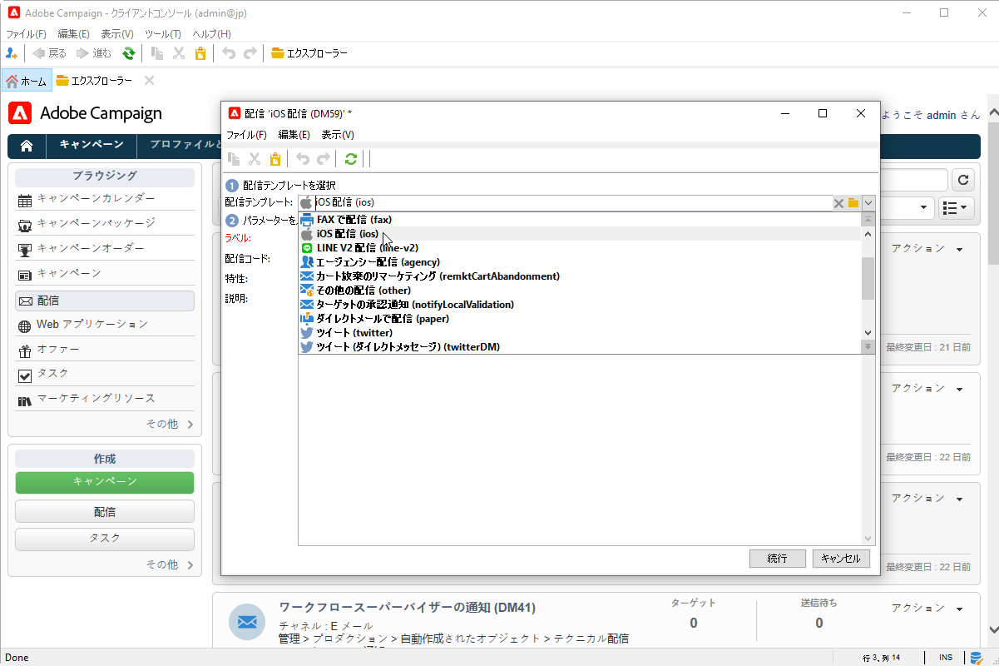
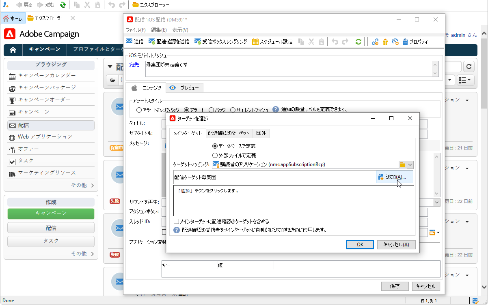
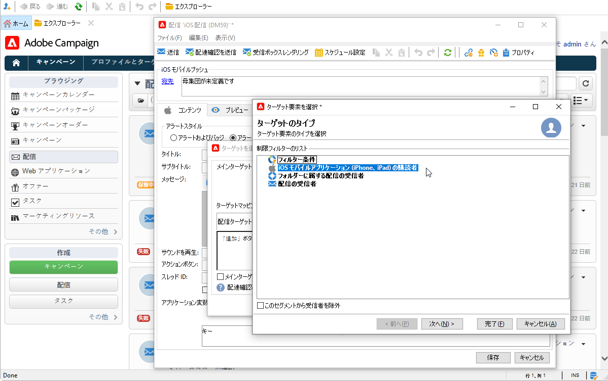
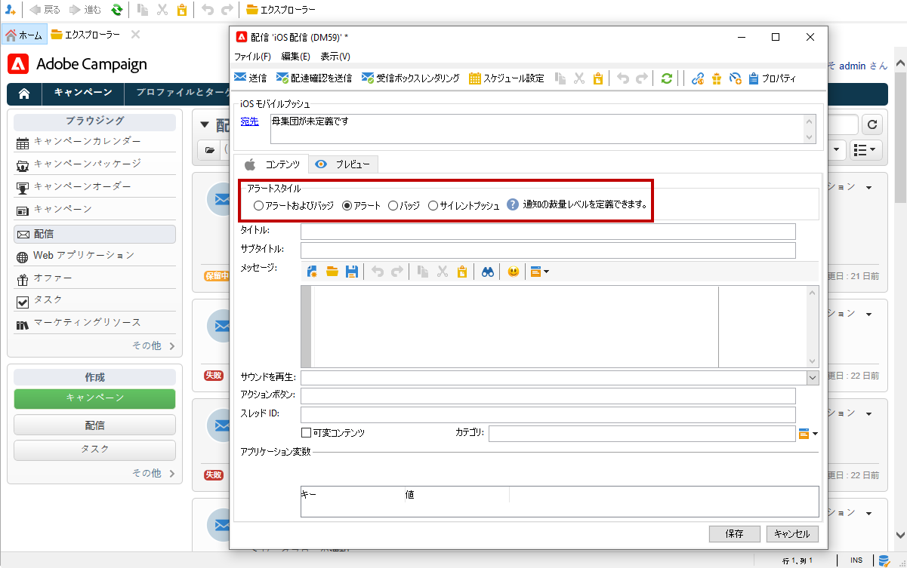

# プッシュ通知の作成と送信

モバイルアプリ配信を使用すると、iOS システムや Android システムに通知を送信できます。

Adobe Campaign でプッシュ通知を送信するには、次の操作を実行します。

1. Campaign の環境設定
1. 利用するモバイルアプリケーション用に、モバイルアプリタイプの情報サービスを作成します。
1. このサービスに、iOS バージョンと Android バージョンのアプリケーションを追加します。
1. iOS と Android の両方用に配信を作成します。

↗️ モバイルアプリチャネルの基礎知識については、[Campaign Classic v7 ドキュメント](https://experienceleague.adobe.com/docs/campaign-classic/using/sending-messages/sending-push-notifications/about-mobile-app-channel.html?lang=ja){target=&quot;_blank&quot;}を参照してください

## Adobe SDK との統合

### Campaign SDK の統合

Campaign SDK を使用すると、ご利用のモバイルアプリケーションを Adobe Campaign プラットフォームへと容易に統合できます。

互換性のある SDK バージョンは [Campaign 互換性マトリクス](../start/compatibility-matrix.md#MobileSDK)に記載されています。

Campaign Android および iOS SDK をアプリと統合する方法については、[この節](../config/push-config.md)を参照してください

### Launch での Campaign 拡張機能の設定

Campaign Classic の拡張機能を利用すると、Adobe Experience Platform Launch SDK と Campaign を統合できます。

↗️ 詳細については、[Adobe Mobile SDK ドキュメント](https://aep-sdks.gitbook.io/docs/using-mobile-extensions/adobe-campaignclassic){target=&quot;_blank&quot;}を参照してください。

## Campaign でのアプリ設定

iOS アプリと Android アプリの設定は、Adobe Campaign で定義する必要があります。

↗️ iOS版 の設定ガイドラインについて詳しくは、[Campaign Classic v7 ドキュメント](https://experienceleague.adobe.com/docs/campaign-classic/using/sending-messages/sending-push-notifications/configure-the-mobile-app/configuring-the-mobile-application.html?lang=ja#sending-messages){target=&quot;_blank&quot;}を参照してください

↗️ Android 版の設定ガイドラインについて詳しくは、[Campaign Classic v7 ドキュメント](https://experienceleague.adobe.com/docs/campaign-classic/using/sending-messages/sending-push-notifications/configure-the-mobile-app/configuring-the-mobile-application-android.html?lang=ja#sending-messages){target=&quot;_blank&quot;}を参照してください

## 最初のプッシュ通知の作成

ここでは、iOS および Android の通知の配信に固有な設定について説明します。

>[!CAUTION]
>
>Campaign v8 でのモバイル登録が&#x200B;**非同期**&#x200B;になりました。[詳細](../dev/staging.md)

新しい配信を作成するには、「**[!UICONTROL Campaign]**」タブで「**[!UICONTROL 配信]**」、既存の配信リストの上にある「**[!UICONTROL 作成]**」ボタンの順にクリックします。

↗️ 配信の作成方法に関する全般的な情報については、[Campaign Classic v7 ドキュメント](https://experienceleague.adobe.com/docs/campaign-classic/using/sending-messages/key-steps-when-creating-a-delivery/steps-about-delivery-creation-steps.html?lang=ja#sending-messages){target=&quot;_blank&quot;}を参照してください。

### iOS で通知を送信する {#send-notifications-on-ios}

1. 「**[!UICONTROL iOS 配信]**」配信テンプレートを選択し、「**[!UICONTROL 続行]**」をクリックします。

   

1. 通知のターゲットを定義するには、**[!UICONTROL 宛先]**&#x200B;リンク／**[!UICONTROL 追加]**&#x200B;をクリックします。

   

1. 「**[!UICONTROL iOS モバイルアプリケーション (iPhone、iPad) の購読者]**」を選択してモバイルアプリケーションに関連するサービス、アプリケーションの iOS バージョンの順に選択します。

   

1.  **[!UICONTROL アラート]**、**[!UICONTROL バッジ]**、**[!UICONTROL アラートおよびバッジ]**&#x200B;または&#x200B;**[!UICONTROL サイレントプッシュ]**&#x200B;から通知の種類を選択します。

   

1. 「**[!UICONTROL タイトル]**」フィールドで、通知に表示するタイトルのラベルを入力します。

1. 選択した通知のタイプに基づいて「**[!UICONTROL メッセージ]**」と「**[!UICONTROL バッジの値]**」を入力します。

1. 次の要素も定義できます。

   * 「**[!UICONTROL アクションボタン]**」を使用すると、アラート通知に表示されるアクションボタンのラベル（ペイロードの **action_loc_key** フィールド）を定義できます。

   * 「**[!UICONTROL サウンドを再生]**」フィールドで、通知を受信したときにモバイル端末で再生されるサウンドを選択します。

   * 「**[!UICONTROL アプリケーション変数]**」フィールドで、それぞれの変数の値を入力します。例えば、ユーザーが通知を有効化したときに表示される特定のアプリケーション画面を設定できます。

1. 通知を設定したら、「**[!UICONTROL プレビュー]**」タブをクリックして通知をプレビューします。

   

### Android で通知を送信する {#send-notifications-on-android}

1. 「**[!UICONTROL Android 配信（android）]**」配信テンプレートを選択します。

   

1. 通知のターゲットを定義するには、**[!UICONTROL 宛先]**&#x200B;リンク／**[!UICONTROL 追加]**&#x200B;をクリックします。

   

1. 「**[!UICONTROL Android モバイルアプリケーションの購読者]**」を選択してモバイルアプリケーション（この場合は Neotrips）に関連するサービスを選択し、アプリケーションの Android バージョンを選択します。

   

1. 次に通知の内容を入力します。

   

1. 「**[!UICONTROL 顔文字を挿入]**」アイコンをクリックして、プッシュ通知に顔文字を挿入します。

1. 「**[!UICONTROL アプリケーション変数]**」フィールドで、それぞれの変数の値を入力します。例えば、ユーザーが通知を有効化したときに表示される特定のアプリケーション画面を設定できます。

1. 通知を設定したら、「**[!UICONTROL プレビュー]**」タブをクリックして通知をプレビューします。

   <!---->

## プッシュ通知のテスト、送信、監視

配達確認や最終配信を送信するには、メール配信と同じプロセスを使用します。詳しくは、次の Campaign Classic v7 ドキュメントを参照してください：

* 配信の検証と配達確認の送信
↗️ [配信を検証する主な手順については、こちらを参照](https://experienceleague.adobe.com/docs/campaign-classic/using/sending-messages/key-steps-when-creating-a-delivery/steps-validating-the-delivery.html?lang=ja){target=&quot;_blank&quot;}してください

* 配信の確認と送信
↗️ [配信を送信する主な手順については、こちらを参照](https://experienceleague.adobe.com/docs/campaign-classic/using/sending-messages/key-steps-when-creating-a-delivery/steps-sending-the-delivery.html?lang=ja){target=&quot;_blank&quot;}してください

メッセージを送信した後は、配信を監視およびトラッキングできます。詳しくは、次の Campaign Classic v7 ドキュメントを参照してください：

* プッシュ通知の強制隔離
↗️ [プッシュ通知の強制隔離の詳細については、こちらを参照](https://experienceleague.adobe.com/docs/campaign-classic/using/sending-messages/monitoring-deliveries/understanding-quarantine-management.html?lang=ja#push-notification-quarantines){target=&quot;_blank&quot;}してください

* トラブルシューティング
↗️ [プッシュ通知のトラブルシューティング方法については、こちらを参照](https://experienceleague.adobe.com/docs/campaign-classic/using/sending-messages/sending-push-notifications/troubleshooting.html?lang=ja){target=&quot;_blank&quot;}してください