# プッシュ通知の作成と送信

モバイルアプリ配信を使用すると、iOS システムや Android システムに通知を送信できます。

Adobe Campaign でプッシュ通知を送信するには、次の操作を実行します。

1. Campaign の環境設定
1. 利用するモバイルアプリケーション用に、モバイルアプリタイプの情報サービスを作成します。
1. このサービスに、iOS バージョンと Android バージョンのアプリケーションを追加します。
1. iOS と Android の両方用に配信を作成します。

 モバイルアプリの概要については、[Campaign Classic v7 ドキュメント](https://experienceleague.adobe.com/docs/campaign-classic/using/sending-messages/sending-push-notifications/about-mobile-app-channel.html?lang=ja)を参照してください。{target="_blank"}

## Campaign SDK の統合

Campaign SDK を使用すると、ご利用のモバイルアプリケーションを Adobe Campaign プラットフォームへと容易に統合できます。

互換性のある SDK バージョンは [Campaign 互換性マトリクス](../start/compatibility-matrix.md#MobileSDK)に記載されています。

Campaign Android および iOS SDK をアプリと統合する方法については、[この節](../config/push-config.md)を参照してください

<!--
### Configure Campaign Extension in Launch

You can integrate Adobe Experience Platorm Launch SDK with Campaign, by leveraging Campaign Classic extension.

 Learn more in [Adobe Mobile SDK documentation](https://aep-sdks.gitbook.io/docs/using-mobile-extensions/adobe-campaignclassic){target="_blank"}

-->

## Campaign でのアプリ設定

iOS アプリと Android アプリの設定は、Adobe Campaign で定義する必要があります。

 詳しい iOS 版構成ガイドについては、[Campaign Classic v7 ドキュメント](https://experienceleague.adobe.com/docs/campaign-classic/using/sending-messages/sending-push-notifications/configure-the-mobile-app/configuring-the-mobile-application.html?lang=ja#sending-messages)を参照してください{target="_blank"} を参照してください。

 詳しい Android 版構成ガイドについては、[Campaign Classic v7 ドキュメント](https://experienceleague.adobe.com/docs/campaign-classic/using/sending-messages/sending-push-notifications/configure-the-mobile-app/configuring-the-mobile-application-android.html?lang=ja#sending-messages)を参照してください{target="_blank"}

## 最初のプッシュ通知の作成

ここでは、iOS および Android の通知の配信に固有な設定について説明します。

>[!CAUTION]
>
>[エンタープライズ（FFDA）デプロイメント](../architecture/enterprise-deployment.md)のコンテキストでは、モバイル登録が&#x200B;**非同期**&#x200B;で行われるようになりました。[詳細](../architecture/staging.md)

新しい配信を作成するには、「**[!UICONTROL Campaign]**」タブで「**[!UICONTROL 配信]**」、既存の配信リストの上にある「**[!UICONTROL 作成]**」ボタンの順にクリックします。

 配信の作成方法に関する全般的な情報については、 [Campaign Classicv7 ドキュメント](https://experienceleague.adobe.com/docs/campaign-classic/using/sending-messages/key-steps-when-creating-a-delivery/steps-about-delivery-creation-steps.html?lang=ja#sending-messages){target="_blank"}

### iOS で通知を送信する {#send-notifications-on-ios}

>[!NOTE]
>
>この機能は、Campaign v8.3 以降で使用できます。お使いのバージョンを確認するには、[この節](../start/compatibility-matrix.md#how-to-check-your-campaign-version-and-buildversion)を参照してください。

1. 「**[!UICONTROL iOS 配信]**」配信テンプレートを選択します。

   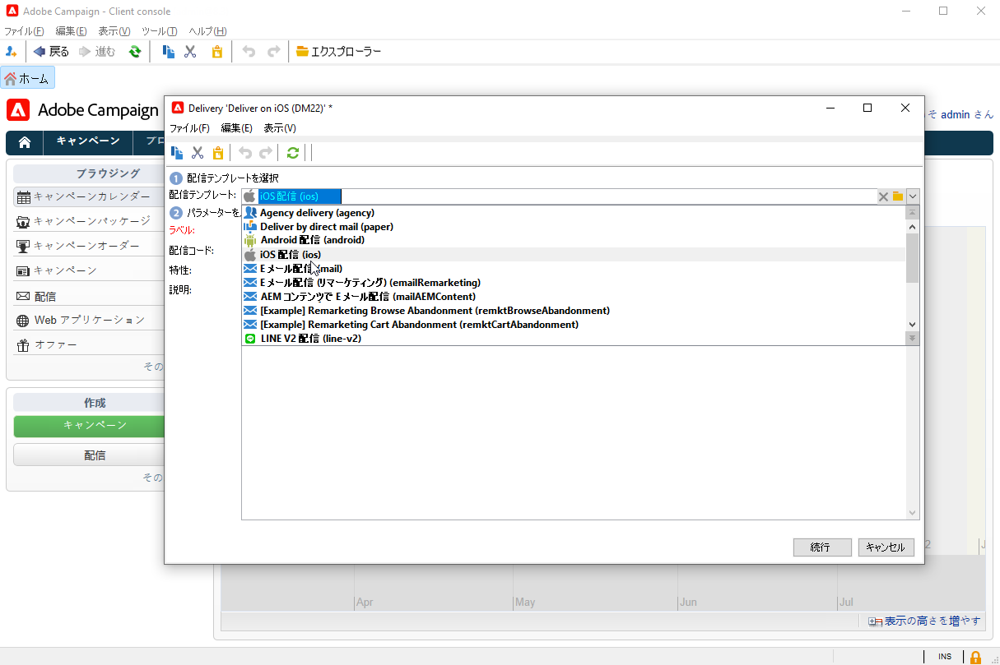

1. 通知のターゲットを定義するには、**[!UICONTROL 宛先]**&#x200B;リンク／**[!UICONTROL 追加]**&#x200B;をクリックします。

   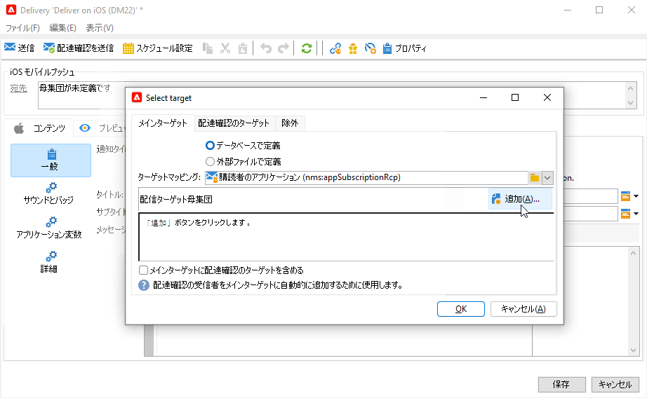

1. 「**[!UICONTROL iOS モバイルアプリケーション (iPhone、iPad) の購読者]**」を選択してモバイルアプリケーションに関連するサービス、アプリケーションの iOS バージョンの順に選択します。

   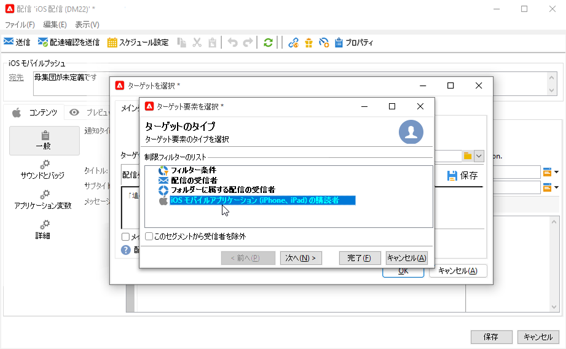

1. **[!UICONTROL 一般的な通知（アラート、サウンド、バッジ）]**&#x200B;または&#x200B;**[!UICONTROL サイレント通知]**&#x200B;から&#x200B;**[!UICONTROL 通知タイプ]**&#x200B;を選択します。

   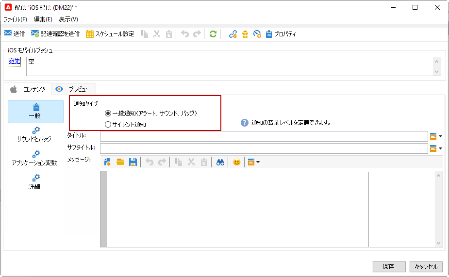

   >[!NOTE]
   >
   >**サイレントプッシュ**&#x200B;モードを使用すると、モバイルアプリケーションに「サイレント」通知を送信できます。ユーザーは、通知が到着したことを知らされません。通知は、アプリケーションに直接転送されます。

1. 「**[!UICONTROL タイトル]**」フィールドで、通知センターから使用可能な通知のリストに表示するタイトルのラベルを入力します。

   このフィールドを使用して、iOS 通知ペイロードの **title** パラメーターの値を定義できます。

1. **[!UICONTROL 字幕]**、**字幕**&#x200B;の値、iOS 通知ペイロードのパラメーターを追加することができます。

1. ウィザードの「**[!UICONTROL メッセージコンテンツ]**」セクションにメッセージのコンテンツを入力します。

1. 「**[!UICONTROL サウンドとバッジ]**」タブでは、次のオプションを編集できます。

   * **[!UICONTROL クリーンバッジ]**：このオプションを有効にして、バッジ値を更新します。

   * **[!UICONTROL 値]**：新しい未読情報の数をアプリケーションアイコンに直接表示する際に使用する数値を設定します。

   * **[!UICONTROL 重大なアラートモード]**：ユーザーの電話がフォーカスモードに設定されている場合や、iPhone がミュートになっている場合でも、通知にサウンドを追加するには、このオプションを有効にします。

   * **[!UICONTROL 名前]**：通知を受信したときにモバイル端末で再生されるサウンドを選択します。

   * **[!UICONTROL 音量]**：サウンドのボリューム（0～100）。

      >[!NOTE]
      > 
      >サウンドは、アプリケーションに含まれている必要があり、サービスが作成されたときに定義される必要があります。
      >
      >iOSの設定ガイドラインについて詳しくは、 [Campaign Classicv7 ドキュメント](https://experienceleague.adobe.com/docs/campaign-classic/using/sending-messages/sending-push-notifications/configure-the-mobile-app/configuring-the-mobile-application.html?lang=ja){target="_blank"}.
   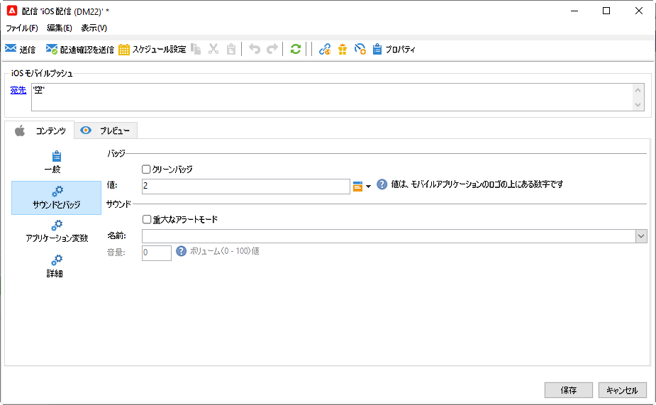

1. 「**[!UICONTROL アプリケーション変数]**」タブから、**[!UICONTROL アプリケーション変数]**&#x200B;が自動的に追加されます。これによって、通知の動作を定義できます。例えば、ユーザーが通知を有効化したときに特定のアプリケーション画面が表示されるように設定できます。

   詳しくは、 [Campaign Classicv7 ドキュメント](https://experienceleague.adobe.com/docs/campaign-classic/using/sending-messages/sending-push-notifications/configure-the-mobile-app/configuring-the-mobile-application.html?lang=ja){target="_blank"}.

1. 「**[!UICONTROL 詳細]**」タブでは、次の一般的なオプションを編集できます。

   * **[!UICONTROL 可変コンテンツ]**：モバイルアプリケーションがメディアコンテンツをダウンロードできるようにするには、このオプションを有効にします。

   * **[!UICONTROL スレッド ID]**：関連する通知をグループ化するために使用される識別子。

   * **[!UICONTROL カテゴリ]**：アクションボタンを表示するカテゴリ ID の名前。これらの通知により、ユーザーは、アプリケーションを開いたりアプリケーション内を移動したりせずに、通知に応じて様々なタスクをより迅速に実行できます。

   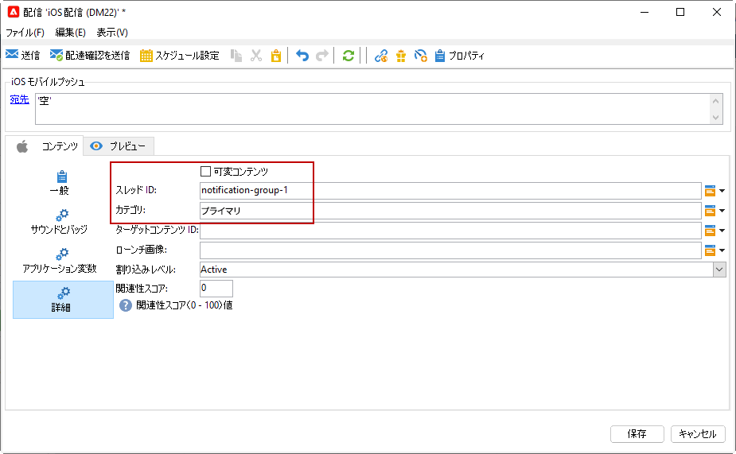

1. 時間依存通知の場合、次のオプションを指定できます。

   * **[!UICONTROL ターゲットコンテンツ ID]**：通知が開かれたときに転送するアプリケーションウィンドウをターゲティングするために使用される識別子。

   * **[!UICONTROL ローンチ画像]**：表示する起動画像ファイルの名前。ユーザーがアプリケーションのローンチを選択した場合は、アプリケーションのローンチ画面ではなく、選択した画像が表示されます。

   * **[!UICONTROL 割り込みレベル]**：

      * **[!UICONTROL アクティブ]**：デフォルトでは、通知が直ちに表示され、画面が点灯し、サウンドを再生できます。通知はフォーカスモードを妨げません。

      * **[!UICONTROL パッシブ]**：画面を点灯させたり、サウンドを再生したりせずに、システムは通知リストに通知を追加します。通知はフォーカスモードを妨げません。

      * **[!UICONTROL 時間依存]** システムにより通知がすぐに表示され、画面が点灯し、サウンドを再生でき、フォーカスモードで通知することができます。このレベルでは、Apple からの特別な権限は必要ありません。

      * **[!UICONTROL 重大]** システムにより通知が直ちに表示され、画面が点灯し、ミュートスイッチまたはフォーカスモードがバイパスされます。このレベルには、Apple からの特別な権限が必要です。
   * **[!UICONTROL 関連性スコア]**：関連性スコアを 0 から 100 に設定します。通知の概要で通知を並べ替える場合にシステムが使用します。

   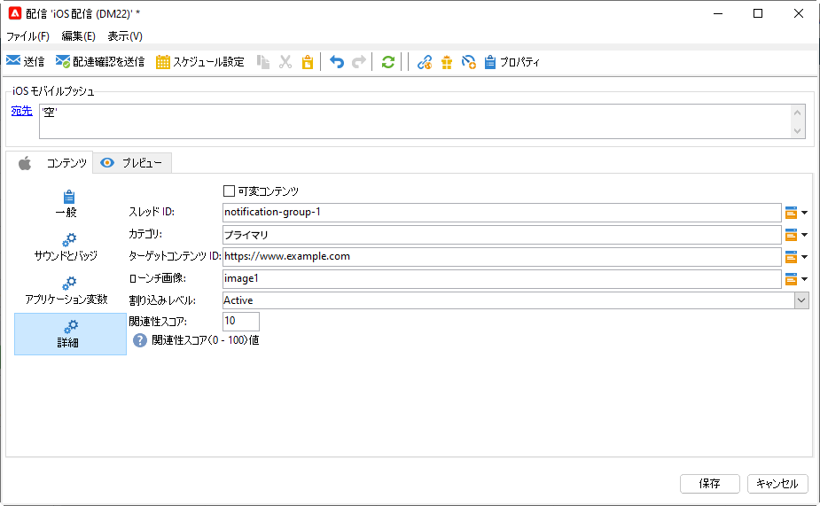

1. 通知を設定したら、「**[!UICONTROL プレビュー]**」タブをクリックして通知をプレビューします。

   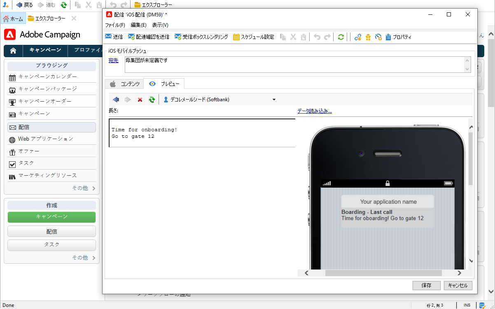

### Android で通知を送信する {#send-notifications-on-android}

1. 「**[!UICONTROL Android 配信（android）]**」配信テンプレートを選択します。

   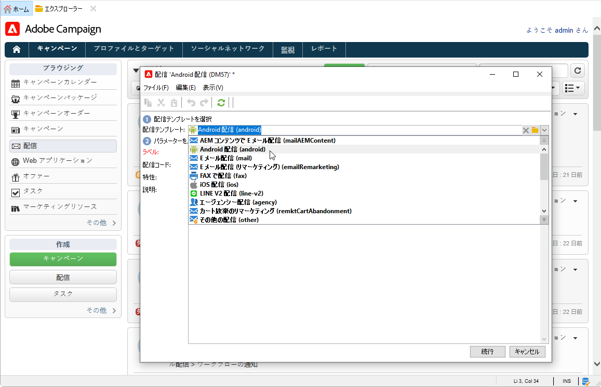

1. 通知のターゲットを定義するには、**[!UICONTROL 宛先]**&#x200B;リンク／**[!UICONTROL 追加]**&#x200B;をクリックします。

   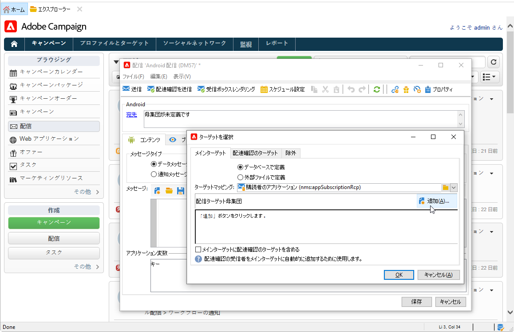

1. 「**[!UICONTROL Android モバイルアプリケーションの購読者]**」を選択してモバイルアプリケーション（この場合は Neotrips）に関連するサービスを選択し、アプリケーションの Android バージョンを選択します。

   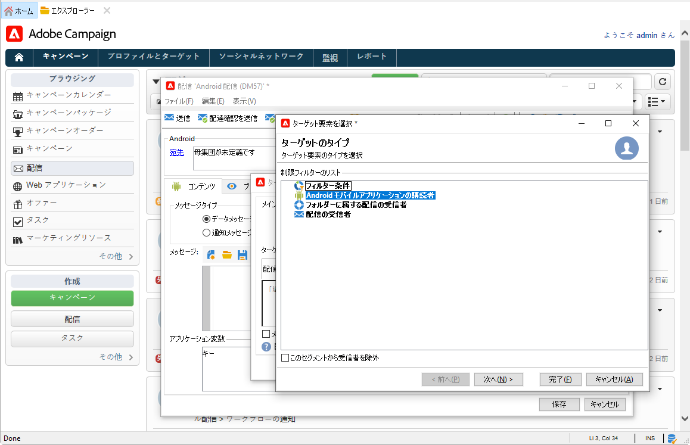

1. 次に通知の内容を入力します。

   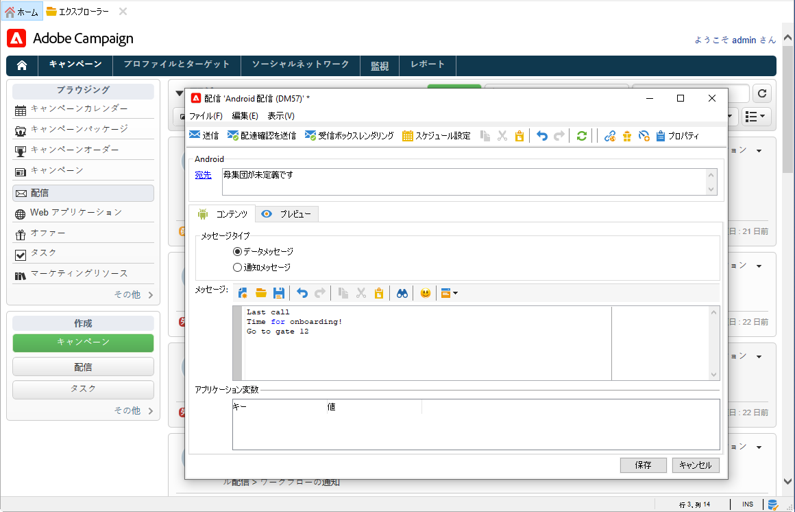

1. 「**[!UICONTROL 顔文字を挿入]**」アイコンをクリックして、プッシュ通知に顔文字を挿入します。

1. 「**[!UICONTROL アプリケーション変数]**」フィールドで、それぞれの変数の値を入力します。例えば、ユーザーが通知を有効化したときに表示される特定のアプリケーション画面を設定できます。

1. 通知を設定したら、「**[!UICONTROL プレビュー]**」タブをクリックして通知をプレビューします。

   <!---->

## プッシュ通知のテスト、送信、監視

配達確認や最終配信を送信するには、メール配信と同じプロセスを使用します。詳しくは、次の Campaign Classic v7 ドキュメントを参照してください：

* 配信の検証と配達確認の送信
    [配信を検証するための主な手順を学ぶ](https://experienceleague.adobe.com/docs/campaign-classic/using/sending-messages/key-steps-when-creating-a-delivery/steps-validating-the-delivery.html?lang=ja){target="_blank"} を参照してください。

* 配信の確認と送信
    [配信を送信するための主な手順を説明します](https://experienceleague.adobe.com/docs/campaign-classic/using/sending-messages/key-steps-when-creating-a-delivery/steps-sending-the-delivery.html?lang=ja){target="_blank"}

メッセージを送信した後は、配信を監視およびトラッキングできます。詳しくは、次の Campaign Classic v7 ドキュメントを参照してください：

* プッシュ通知の強制隔離
    [プッシュ通知の強制隔離の詳細を説明します](https://experienceleague.adobe.com/docs/campaign-classic/using/sending-messages/monitoring-deliveries/understanding-quarantine-management.html?lang=ja#push-notification-quarantines){target="_blank"}

* トラブルシューティング
    [プッシュ通知のトラブルシューティング方法を説明します](https://experienceleague.adobe.com/docs/campaign-classic/using/sending-messages/sending-push-notifications/troubleshooting.html?lang=ja){target="_blank"}
