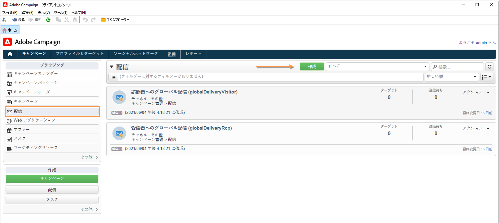

# プッシュ通知の作成と送信{#push-notifications-create}

モバイルアプリ配信を使用すると、iOS デバイスや Android デバイスに通知を送信できます。

Adobe Campaign でプッシュ通知を送信するには、次の操作を実行します。

1. SDK をアプリに統合します。[詳細情報](#push-sdk)
1. モバイルアプリケーションタイプの情報サービスをモバイルアプリケーション用に作成し、そのサービスにアプリケーションの iOS バージョンと Android バージョンを追加します。[詳細情報](#push-config)
1. iOS と Android の両方用に配信を作成します。[詳細情報](#push-create)

## SDK の統合 {#push-sdk}

Adobe Campaignでプッシュ通知を送信するには、Adobe Experience Platform Mobile SDK のデータ収集 UI でAdobe Campaign拡張機能を設定する必要があります。

Adobe Experience Platform Mobile SDK は、モバイルアプリでアドビの Experience Cloud のソリューションとサービスを強化するのに役立ちます。SDK の設定はデータ収集 UI を通じて管理され、柔軟な設定と拡張可能なルールベースの統合を実現します。

詳しくは、[Adobe Developer のドキュメント](https://developer.adobe.com/client-sdks/documentation/adobe-campaign-classic){target="_blank"}を参照してください。

## Campaign でのアプリ設定{#push-config}

プッシュ通知を送信する前に、Adobe Campaign で iOS アプリと Android アプリの設定を定義する必要があります。

プッシュ通知は、専用のサービスを通じてアプリのユーザーに送信されます。ユーザーはアプリをインストールすると、このサービスにサブスクライブします。Adobe Campaign は、このサービスを利用して、アプリのサブスクライバーのみをターゲットにします。このサービスでは、iOS デバイスと Android デバイスで送信するために、iOS アプリと Android アプリを追加する必要があります。

プッシュ通知を送信するサービスを作成するには、次の手順に従います。

1. **[!UICONTROL プロファイルとターゲット／サービスとサブスクリプション]**&#x200B;タブを参照し、「**[!UICONTROL 作成]**」をクリックします。

   {width="800" align="left"}

1. **[!UICONTROL ラベル]**&#x200B;と&#x200B;**[!UICONTROL 内部名]**&#x200B;を入力し、**[!UICONTROL モバイルアプリケーション]**&#x200B;タイプを選択します。

   >[!NOTE]
   >
   >デフォルトの「**[!UICONTROL 購読者のアプリケーション（nms:appSubscriptionRcp）]**」ターゲットマッピングが受信者のテーブルにリンクされています。異なるターゲットマッピングを使用する場合は、新しいターゲットマッピングを作成し、サービスの「**[!UICONTROL ターゲットマッピング]**」フィールドに入力する必要があります。ターゲットマッピングについて詳しくは、[このページ](../audiences/target-mappings.md)を参照してください。

1. 次に、右側にある「**[!UICONTROL 追加]**」アイコンを使用して、このサービスを使用するモバイルアプリケーションを定義します。

>[!BEGINTABS]

>[!TAB iOS]

iOS デバイス用のアプリを作成するには、次の手順に従います。

1. 「**[!UICONTROL iOS アプリケーションを作成]**」を選択し、「**[!UICONTROL 次へ]**」をクリックします。

   {width="600" align="left"}

1. 「**[!UICONTROL ラベル]**」フィールドに、アプリの名前を入力します。
1. （オプション）**[!UICONTROL アプリケーション変数]**&#x200B;を使用してプッシュメッセージのコンテンツを強化できます。これらは完全にカスタマイズ可能で、モバイルデバイスに送信されるメッセージペイロードの一部です。

   次の例では、**mediaURl** 変数と **mediaExt** 変数を追加し、リッチなプッシュ通知を作成してさらに通知内に表示する画像をアプリケーションに提供します。

   {width="600" align="left"}

1. 「**[!UICONTROL サブスクリプションパラメーター]**」タブを参照すると、**[!UICONTROL サブスクライバーのアプリケーション（nms:appsubscriptionRcp）]**&#x200B;スキーマの拡張によりマッピングを定義できます。

1. 「**[!UICONTROL サウンド]**」タブを参照して、再生するサウンドを定義します。「**[!UICONTROL 追加]**」をクリックし、「**[!UICONTROL 内部名]**」フィールドに、アプリケーションに埋め込まれたファイル名またはシステムサウンドの名前を入力します。

1. 「**[!UICONTROL 次へ]**」をクリックし、開発アプリケーションの設定をおこないます。

1. 統合キーは、各アプリケーションに固有です。これにより、モバイルアプリケーションが Adobe Campaign にリンクされます。

   Adobe Campaign と、アプリケーションコード（SDK 経由）で同じ&#x200B;**[!UICONTROL 統合キー]**&#x200B;が定義されていることを確認します。

   詳しくは、 [開発者向けドキュメント](https://developer.adobe.com/client-sdks/documentation/adobe-campaign-classic/#configuration-keys){target="_blank"}

   >[!NOTE]
   >
   > **[!UICONTROL 統合キー]**&#x200B;は、文字列値を使用して完全にカスタマイズできますが、SDK で指定されたものと完全に同じにする必要があります。
   >
   > アプリケーションの開発バージョン（サンドボックス）と実稼動バージョンに同じ証明書を使用することはできません。

1. 「**[!UICONTROL アプリケーションアイコン]**」フィールドからアイコンを選択して、サービス内のモバイルアプリケーションをパーソナライズします。

1. 「**[!UICONTROL 認証モード]**」を選択します。次の 2 つのモードを使用できます。

   * （推奨）**[!UICONTROL トークンベースの認証]**：APN 接続設定の&#x200B;**[!UICONTROL キー ID]**、**[!UICONTROL チーム ID]**、**[!UICONTROL バンドル ID]** を入力し、「**[!UICONTROL 秘密鍵を入力...]**」をクリックして p8 証明書を選択します。**[!UICONTROL トークンベースの認証]**&#x200B;について詳しくは、[Apple のドキュメント](https://developer.apple.com/documentation/usernotifications/setting_up_a_remote_notification_server/establishing_a_token-based_connection_to_apns){target="_blank"}を参照してください。

   * **[!UICONTROL 証明書ベースの認証]**：「**[!UICONTROL 証明書を入力...]**」をクリックし、p12 キーを選択して、モバイルアプリケーション開発者から提供されたパスワードを入力します。
   認証モードは、後でモバイルアプリケーションの「**[!UICONTROL 証明書]**」タブで変更することができます。

1. 「**[!UICONTROL 接続をテスト]**」ボタンを使用して、設定を検証します。

1. 「**[!UICONTROL 次へ]**」をクリックして本番アプリケーションの設定をおこない、上記と同じ手順に従います。

1. 「**[!UICONTROL 終了]**」をクリックします。

これで、Campaign で iOS アプリケーションを使用する準備が整いました。

>[!TAB Android]

Android デバイス用のアプリを作成するには、次の手順に従います。

1. 「**[!UICONTROL Android アプリケーションを作成]**」を選択し、「**[!UICONTROL 次へ]**」をクリックします。

   {width="600" align="left"}

1. 「**[!UICONTROL ラベル]**」フィールドに、アプリの名前を入力します。
1. 統合キーは、各アプリケーションに固有です。これにより、モバイルアプリケーションが Adobe Campaign にリンクされます。

   Adobe Campaign と、アプリケーションコード（SDK 経由）で同じ&#x200B;**[!UICONTROL 統合キー]**&#x200B;が定義されていることを確認します。

   詳しくは、 [開発者向けドキュメント](https://developer.adobe.com/client-sdks/documentation/adobe-campaign-classic/#configuration-keys){target="_blank"}

   >[!NOTE]
   >
   > **[!UICONTROL 統合キー]**&#x200B;は、文字列値を使用して完全にカスタマイズできますが、SDK で指定されたものと完全に同じにする必要があります。

1. 「**[!UICONTROL アプリケーションアイコン]**」フィールドからアイコンを選択して、サービス内のモバイルアプリケーションをパーソナライズします。
1. **[!UICONTROL API バージョン]**&#x200B;ドロップダウンリストで「**HTTP v1**」を選択します。
1. 「**[!UICONTROL プロジェクトの詳細を抽出するプロジェクトの json ファイルを読み込む...]**」リンクをクリックして、JSON キーファイルを読み込みます。JSON ファイルの抽出方法について詳しくは、[Google Firebase ドキュメント](https://firebase.google.com/docs/admin/setup#initialize-sdk){target="_blank"}を参照してください。

   次の詳細を手動で入力することもできます。
   * **[!UICONTROL プロジェクト ID]**
   * **[!UICONTROL 秘密鍵]**
   * **[!UICONTROL クライアント E メール]**

1. 「**[!UICONTROL 接続をテスト]**」ボタンを使用して、設定を検証します。

   >[!CAUTION]
   >
   >「**[!UICONTROL 接続をテスト]**」ボタンは、MID サーバーが FCM サーバーにアクセスできるかどうかを確認しません。

1. （オプション）必要に応じて、**[!UICONTROL アプリケーション変数]**&#x200B;を使用してプッシュメッセージのコンテンツを強化できます。これらは完全にカスタマイズ可能で、モバイルデバイスに送信されるメッセージペイロードの一部です。

1. 「**[!UICONTROL 終了]**」、「**[!UICONTROL 保存]**」の順にクリックします。これで、Campaign で Android アプリケーションを使用する準備が整いました。

以下に、プッシュ通知をさらにパーソナライズするための FCM ペイロード名を示します。

| メッセージタイプ | 設定可能なメッセージ要素（FCM ペイロード名） | 設定可能なオプション（FCM ペイロード名） |
|:-:|:-:|:-:|
| データメッセージ | 該当なし | validate_only |
| 通知メッセージ | title、body、android_channel_id、icon、sound、tag、color、click_action、image、ticker、sticky、visibility、notification_priority、notification_count   | validate_only |

>[!ENDTABS]

## 最初のプッシュ通知の作成{#push-create}

ここでは、iOS および Android の通知の配信に固有な設定について説明します。

>[!CAUTION]
>
>[エンタープライズ（FFDA）デプロイメント](../architecture/enterprise-deployment.md)のコンテキストでは、モバイル登録が&#x200B;**非同期**&#x200B;で行われるようになりました。[詳細](../architecture/staging.md)

新しい配信を作成するには、「**[!UICONTROL Campaign]**」タブで「**[!UICONTROL 配信]**」、既存の配信リストの上にある「**[!UICONTROL 作成]**」ボタンの順にクリックします。

>[!BEGINTABS]

>[!TAB iOS]

iOS デバイスで通知を送信するには、次の手順に従います。

1. 「**[!UICONTROL iOS 配信]**」配信テンプレートを選択します。

   

1. 通知のターゲットを定義するには、**[!UICONTROL 宛先]**&#x200B;リンク／**[!UICONTROL 追加]**&#x200B;をクリックします。

   

1. 「**[!UICONTROL iOS モバイルアプリケーション (iPhone、iPad) の購読者]**」を選択してモバイルアプリケーションに関連するサービス、アプリケーションの iOS バージョンの順に選択します。

   

1. **[!UICONTROL 一般的な通知（アラート、サウンド、バッジ）]**&#x200B;または&#x200B;**[!UICONTROL サイレント通知]**&#x200B;から&#x200B;**[!UICONTROL 通知タイプ]**&#x200B;を選択します。

   

   >[!NOTE]
   >
   >**サイレントプッシュ**&#x200B;モードを使用すると、モバイルアプリケーションに「サイレント」通知を送信できます。ユーザーは、通知が到着したことを知らされません。通知は、アプリケーションに直接転送されます。

1. 「**[!UICONTROL タイトル]**」フィールドで、通知センターから使用可能な通知のリストに表示するタイトルのラベルを入力します。

   このフィールドを使用して、iOS 通知ペイロードの **title** パラメーターの値を定義できます。

1. **[!UICONTROL 字幕]**、**字幕**&#x200B;の値、iOS 通知ペイロードのパラメーターを追加することができます。

1. ウィザードの「**[!UICONTROL メッセージコンテンツ]**」セクションにメッセージのコンテンツを入力します。

1. 「**[!UICONTROL サウンドとバッジ]**」タブでは、次のオプションを編集できます。

   * **[!UICONTROL クリーンバッジ]**：このオプションを有効にして、バッジ値を更新します。

   * **[!UICONTROL 値]**：新しい未読情報の数をアプリケーションアイコンに直接表示する際に使用する数値を設定します。

   * **[!UICONTROL 重大なアラートモード]**：ユーザーの電話がフォーカスモードに設定されている場合や、iPhone がミュートになっている場合でも、通知にサウンドを追加するには、このオプションを有効にします。

   * **[!UICONTROL 名前]**：通知を受信したときにモバイル端末で再生されるサウンドを選択します。

   * **[!UICONTROL 音量]**：サウンドのボリューム（0～100）。

      >[!NOTE]
      > 
      >サウンドは、アプリケーションに含まれている必要があり、サービスが作成されたときに定義される必要があります。
   

1. 「**[!UICONTROL アプリケーション変数]**」タブから、**[!UICONTROL アプリケーション変数]**&#x200B;が自動的に追加されます。これによって、通知の動作を定義できます。例えば、ユーザーが通知を有効化したときに特定のアプリケーション画面が表示されるように設定できます。

1. 「**[!UICONTROL 詳細]**」タブでは、次の一般的なオプションを編集できます。

   * **[!UICONTROL 可変コンテンツ]**：モバイルアプリケーションがメディアコンテンツをダウンロードできるようにするには、このオプションを有効にします。

   * **[!UICONTROL スレッド ID]**：関連する通知をグループ化するために使用される識別子。

   * **[!UICONTROL カテゴリ]**：アクションボタンを表示するカテゴリ ID の名前。これらの通知により、ユーザーは、アプリケーションを開いたりアプリケーション内を移動したりせずに、通知に応じて様々なタスクをより迅速に実行できます。

   

1. 時間依存通知の場合、次のオプションを指定できます。

   * **[!UICONTROL ターゲットコンテンツ ID]**：通知が開かれたときに転送するアプリケーションウィンドウをターゲティングするために使用される識別子。

   * **[!UICONTROL ローンチ画像]**：表示する起動画像ファイルの名前。ユーザーがアプリケーションのローンチを選択した場合は、アプリケーションのローンチ画面ではなく、選択した画像が表示されます。

   * **[!UICONTROL 割り込みレベル]**：

      * **[!UICONTROL アクティブ]**：デフォルトでは、通知が直ちに表示され、画面が点灯し、サウンドを再生できます。通知はフォーカスモードを妨げません。

      * **[!UICONTROL パッシブ]**：画面を点灯させたり、サウンドを再生したりせずに、システムは通知リストに通知を追加します。通知はフォーカスモードを妨げません。

      * **[!UICONTROL 時間依存]** システムにより通知がすぐに表示され、画面が点灯し、サウンドを再生でき、フォーカスモードで通知することができます。このレベルでは、Apple からの特別な権限は必要ありません。

      * **[!UICONTROL 重大]** システムにより通知が直ちに表示され、画面が点灯し、ミュートスイッチまたはフォーカスモードがバイパスされます。このレベルには、Apple からの特別な権限が必要です。
   * **[!UICONTROL 関連性スコア]**：関連性スコアを 0 から 100 に設定します。通知の概要で通知を並べ替える場合にシステムが使用します。

   

1. 通知を設定したら、「**[!UICONTROL プレビュー]**」タブをクリックして通知をプレビューします。

   

>[!TAB Android]

Android デバイスで通知を送信するには、次の手順に従います。

1. 「**[!UICONTROL Android 配信（android）]**」配信テンプレートを選択します。

   

1. 通知のターゲットを定義するには、**[!UICONTROL 宛先]**&#x200B;リンク／**[!UICONTROL 追加]**&#x200B;をクリックします。

   

1. 「**[!UICONTROL Android モバイルアプリケーションの購読者]**」を選択してモバイルアプリケーション（この場合は Neotrips）に関連するサービスを選択し、アプリケーションの Android バージョンを選択します。

   

1. 次に通知の内容を入力します。

   

1. 「**[!UICONTROL 顔文字を挿入]**」アイコンをクリックして、プッシュ通知に顔文字を挿入します。

1. 「**[!UICONTROL アプリケーション変数]**」フィールドで、それぞれの変数の値を入力します。例えば、ユーザーが通知を有効化したときに表示される特定のアプリケーション画面を設定できます。

1. 通知を設定したら、「**[!UICONTROL プレビュー]**」タブをクリックして通知をプレビューします。

   <!---->

>[!ENDTABS]

## プッシュ通知のテスト、送信、監視

配達確認や最終配信を送信するには、他の配信と同じプロセスを使用します。

配信を検証する方法について詳しくは、[このページ](preview-and-proof.md)を参照してください。

配信を確認して送信する方法について詳しくは、[このページ](send.md)を参照してください

メッセージを送信した後は、配信を監視およびトラッキングできます。プッシュ通知配信の失敗理由について詳しくは、[このページ](delivery-failures.md#push-error-types)を参照してください。

