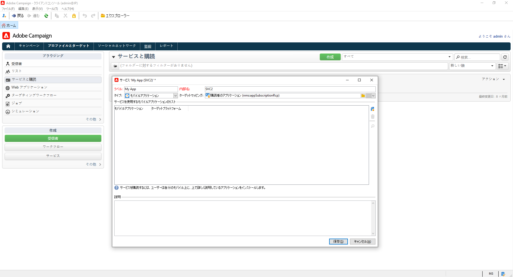

# プッシュ通知の作成と送信{#push-notifications-create}

モバイルアプリ配信では、iOSおよび Android デバイスに通知を送信できます。

Adobe Campaign でプッシュ通知を送信するには、次の操作を実行します。

1. SDK をアプリに統合します。 [詳細情報](#push-sdk)
1. モバイルアプリケーション用にモバイルアプリケーションタイプの情報サービスを作成し、そのサービスにアプリケーションのiOSバージョンと Android バージョンを追加します。 [詳細情報](#push-config)
1. iOS と Android の両方用に配信を作成します。[詳細情報](#push-create)

## SDK の統合 {#push-sdk}

Adobe Experience Platform Mobile SDK を使用するには、データ収集 UI で Adobe Campaign 拡張機能を設定します。Adobe Experience Platform Mobile SDK は、モバイルアプリでアドビの Experience Cloud のソリューションとサービスを強化するのに役立ちます。SDK の設定はデータ収集 UI を通じて管理され、柔軟な設定と拡張可能なルールベースの統合を実現します。詳しくは、[Adobe Developer のドキュメント](https://developer.adobe.com/client-sdks/documentation/adobe-campaign-classic){target="_blank"}を参照してください。

また、Campaign SDK を統合することで、ご利用のモバイルアプリケーションの Adobe Campaign プラットフォームへの統合を容易にすることができます。互換性のある SDK バージョンは [Campaign 互換性マトリクス](../start/compatibility-matrix.md#MobileSDK)に記載されています。

Campaign Android および iOS SDK をアプリと統合する方法については、[このページ](../config/push-config.md)を参照してください

## Campaign でのアプリ設定{#push-config}

プッシュ通知を送信する前に、Adobe CampaignでiOSおよび Android アプリの設定を定義する必要があります。

プッシュ通知は、専用のサービスを通じてアプリのユーザーに送信されます。 ユーザーがアプリをインストールすると、次のようにこのサービスを購読します。Adobe Campaignは、このサービスを利用して、アプリの購読者のみをターゲットに設定します。 このサービスでは、iOSおよび Android アプリを追加して、iOSおよび Android デバイスで送信する必要があります。

プッシュ通知を送信するサービスを作成するには、次の手順に従います。

1. 参照先 **[!UICONTROL プロファイルとターゲット/サービスと購読]** タブで、 **[!UICONTROL 作成]**.

   {width="800" align="left"}

1. を入力します。 **[!UICONTROL ラベル]** および **[!UICONTROL 内部名]**&#x200B;を選択し、 **[!UICONTROL モバイルアプリ]** タイプ。

   >[!NOTE]
   >
   >デフォルトの「**[!UICONTROL 購読者のアプリケーション（nms:appSubscriptionRcp）]**」ターゲットマッピングが受信者のテーブルにリンクされています。異なるターゲットマッピングを使用する場合は、新しいターゲットマッピングを作成し、サービスの「**[!UICONTROL ターゲットマッピング]**」フィールドに入力する必要があります。ターゲットマッピングの詳細については、 [このページ](../audiences/target-mappings.md).

1. その後、 **[!UICONTROL 追加]** このサービスを使用するモバイルアプリケーションを定義する右側のアイコン。

>[!BEGINTABS]

>[!TAB iOS]

iOSデバイス用のアプリを作成するには、次の手順に従います。

1. 選択 **[!UICONTROL iOSアプリケーションの作成]** をクリックし、 **[!UICONTROL 次へ]**.

   {width="600" align="left"}

1. アプリの名前を **[!UICONTROL ラベル]** フィールドに入力します。
1. （オプション）プッシュメッセージのコンテンツを **[!UICONTROL アプリケーション変数]**. これらは完全にカスタマイズ可能で、モバイルデバイスに送信されるメッセージペイロードの一部です。

   以下の例では、 **mediaURl** および **mediaExt** 変数を追加してリッチなプッシュ通知を作成し、通知内に表示する画像をアプリケーションに提供します。

   {width="600" align="left"}

1. 次を参照： **[!UICONTROL 購読パラメーター]** タブを使用して、 **[!UICONTROL 購読者のアプリケーション (nms:appsubscriptionRcp)]** スキーマ。

1. 次を参照： **[!UICONTROL サウンド]** タブをクリックして、再生するサウンドを定義します。 「**[!UICONTROL 追加]**」をクリックし、「**[!UICONTROL 内部名]**」フィールドに、アプリケーションに埋め込まれたファイル名またはシステムサウンドの名前を入力します。

1. 「**[!UICONTROL 次へ]**」をクリックし、開発アプリケーションの設定をおこないます。

1. 統合キーは、各アプリケーションに固有です。 これにより、モバイルアプリケーションがAdobe Campaignにリンクされます。

   同じ **[!UICONTROL 統合キー]** は、 Adobe Campaignと、SDK を介するアプリケーションコードで定義されます。

   Campaign SDK を使用している場合は、詳しくは[このページ](../config/push-config.md).

   Adobe Experience Platform SDK（データ収集）を使用している場合は、詳しくは [このページ](https://developer.adobe.com/client-sdks/documentation/adobe-campaign-classic/#configuration-keys){target="_blank"}

   >[!NOTE]
   >
   > **[!UICONTROL 統合キー]**&#x200B;は、文字列値を使用して完全にカスタマイズできますが、SDK で指定されたものと完全に同じにする必要があります。
   >
   > 開発バージョン（サンドボックス）と実稼動バージョンのアプリケーションに同じ証明書を使用することはできません。

1. アイコンを **[!UICONTROL アプリケーションアイコン]** フィールドを使用して、サービス内のモバイルアプリケーションをパーソナライズします。

1. 「**[!UICONTROL 認証モード]**」を選択します。次の 2 つのモードを使用できます。

   * （推奨） **[!UICONTROL トークンベースの認証]**:APNs 接続設定を入力します **[!UICONTROL キー ID]**, **[!UICONTROL チーム ID]** および **[!UICONTROL バンドル ID]** 次に、「 **[!UICONTROL 秘密鍵を入力…]**. 詳しくは、 **[!UICONTROL トークンベースの認証]**（を参照） [Appleドキュメント](https://developer.apple.com/documentation/usernotifications/setting_up_a_remote_notification_server/establishing_a_token-based_connection_to_apns){target="_blank"}.

   * **[!UICONTROL 証明書ベースの認証]**：「**[!UICONTROL 証明書を入力...]**」をクリックし、p12 キーを選択して、モバイルアプリケーション開発者から提供されたパスワードを入力します。
   認証モードは、後で **[!UICONTROL 証明書]** 」タブを使用します。

1. 以下を使用： **[!UICONTROL 接続をテストする]** ボタンをクリックして設定を検証します。

1. 「**[!UICONTROL 次へ]**」をクリックして本番アプリケーションの設定をおこない、上記と同じ手順に従います。

1. 「**[!UICONTROL 完了]**」をクリックします。

これで、iOSアプリケーションを Campaign で使用する準備が整いました。

>[!TAB Android]

Android デバイス用のアプリを作成するには、次の手順に従います。

1. 選択 **[!UICONTROL Android アプリケーションの作成]** をクリックし、 **[!UICONTROL 次へ]**.

   {width="600" align="left"}

1. アプリの名前を **[!UICONTROL ラベル]** フィールドに入力します。
1. 統合キーは、各アプリケーションに固有です。 これにより、モバイルアプリケーションがAdobe Campaignにリンクされます。

   同じ **[!UICONTROL 統合キー]** は、 Adobe Campaignと、SDK を介するアプリケーションコードで定義されます。

   Campaign SDK を使用している場合は、詳しくは [このページ](../config/push-config.md).

   Adobe Experience Platform SDK（データ収集）を使用している場合は、詳しくは [このページ](https://developer.adobe.com/client-sdks/documentation/adobe-campaign-classic/#configuration-keys){target="_blank"}

   >[!NOTE]
   >
   > **[!UICONTROL 統合キー]**&#x200B;は、文字列値を使用して完全にカスタマイズできますが、SDK で指定されたものと完全に同じにする必要があります。

1. アイコンを **[!UICONTROL アプリケーションアイコン]** フィールドを使用して、サービス内のモバイルアプリケーションをパーソナライズします。
1. 選択 **HTTP v1** in  **[!UICONTROL API バージョン]** 」ドロップダウンリストから選択できます。
1. クリック **[!UICONTROL プロジェクトの詳細を抽出するプロジェクトの json ファイルを読み込む…]** リンクを使用して、JSON キーファイルを読み込みます。 JSON ファイルの抽出方法について詳しくは、 [Google Firebase ドキュメント](https://firebase.google.com/docs/admin/setup#initialize-sdk){target="_blank"}.

   次の詳細を手動で入力することもできます。
   * **[!UICONTROL プロジェクト ID]**
   * **[!UICONTROL 秘密鍵]**
   * **[!UICONTROL クライアント E メール]**

1. 以下を使用： **[!UICONTROL 接続をテストする]** ボタンをクリックして設定を検証します。

   >[!CAUTION]
   >
   >この **[!UICONTROL 接続をテスト]** ボタンは、MID サーバーが FCM サーバーにアクセスできるかどうかを確認しません。

1. （オプション）プッシュメッセージのコンテンツを **[!UICONTROL アプリケーション変数]** 必要に応じて。 これらは完全にカスタマイズ可能で、モバイルデバイスに送信されるメッセージペイロードの一部です。

1. 「**[!UICONTROL 完了]**」、「**[!UICONTROL 保存]**」の順にクリックします。これで、Campaign で Android アプリケーションを使用する準備が整いました。

以下に、プッシュ通知をさらにパーソナライズするための FCM ペイロード名を示します。

| メッセージタイプ | 設定可能なメッセージ要素（FCM ペイロード名） | 設定可能なオプション（FCM ペイロード名） |
|:-:|:-:|:-:|
| データメッセージ | 該当なし | validate_only |
| 通知メッセージ | title、body、android_channel_id、icon、sound、tag、color、click_action、image、ticker、sticky、visibility、notification_priority、notification_count   | validate_only |

>[!ENDTABS]

## 最初のプッシュ通知の作成{#push-create}

ここでは、iOS および Android の通知の配信に固有な設定について説明します。

>[!CAUTION]
>
>[エンタープライズ（FFDA）デプロイメント](../architecture/enterprise-deployment.md)のコンテキストでは、モバイル登録が&#x200B;**非同期**&#x200B;で行われるようになりました。[詳細](../architecture/staging.md)

新しい配信を作成するには、「**[!UICONTROL Campaign]**」タブで「**[!UICONTROL 配信]**」、既存の配信リストの上にある「**[!UICONTROL 作成]**」ボタンの順にクリックします。

>[!BEGINTABS]

>[!TAB iOS]

iOSデバイスで通知を送信するには、次の手順に従います。

1. 「**[!UICONTROL iOS 配信]**」配信テンプレートを選択します。

   

1. 通知のターゲットを定義するには、**[!UICONTROL 宛先]**&#x200B;リンク／**[!UICONTROL 追加]**&#x200B;をクリックします。

   

1. 「**[!UICONTROL iOS モバイルアプリケーション (iPhone、iPad) の購読者]**」を選択してモバイルアプリケーションに関連するサービス、アプリケーションの iOS バージョンの順に選択します。

   

1. **[!UICONTROL 一般的な通知（アラート、サウンド、バッジ）]**&#x200B;または&#x200B;**[!UICONTROL サイレント通知]**&#x200B;から&#x200B;**[!UICONTROL 通知タイプ]**&#x200B;を選択します。

   

   >[!NOTE]
   >
   >**サイレントプッシュ**&#x200B;モードを使用すると、モバイルアプリケーションに「サイレント」通知を送信できます。ユーザーは、通知が到着したことを知らされません。通知は、アプリケーションに直接転送されます。

1. 「**[!UICONTROL タイトル]**」フィールドで、通知センターから使用可能な通知のリストに表示するタイトルのラベルを入力します。

   このフィールドを使用して、iOS 通知ペイロードの **title** パラメーターの値を定義できます。

1. **[!UICONTROL 字幕]**、**字幕**&#x200B;の値、iOS 通知ペイロードのパラメーターを追加することができます。

1. ウィザードの「**[!UICONTROL メッセージコンテンツ]**」セクションにメッセージのコンテンツを入力します。

1. 「**[!UICONTROL サウンドとバッジ]**」タブでは、次のオプションを編集できます。

   * **[!UICONTROL クリーンバッジ]**：このオプションを有効にして、バッジ値を更新します。

   * **[!UICONTROL 値]**：新しい未読情報の数をアプリケーションアイコンに直接表示する際に使用する数値を設定します。

   * **[!UICONTROL 重大なアラートモード]**：ユーザーの電話がフォーカスモードに設定されている場合や、iPhone がミュートになっている場合でも、通知にサウンドを追加するには、このオプションを有効にします。

   * **[!UICONTROL 名前]**：通知を受信したときにモバイル端末で再生されるサウンドを選択します。

   * **[!UICONTROL 音量]**：サウンドのボリューム（0～100）。

      >[!NOTE]
      > 
      >サウンドは、アプリケーションに含まれている必要があり、サービスが作成されたときに定義される必要があります。
   

1. 「**[!UICONTROL アプリケーション変数]**」タブから、**[!UICONTROL アプリケーション変数]**&#x200B;が自動的に追加されます。これによって、通知の動作を定義できます。例えば、ユーザーが通知を有効化したときに特定のアプリケーション画面が表示されるように設定できます。

1. 「**[!UICONTROL 詳細]**」タブでは、次の一般的なオプションを編集できます。

   * **[!UICONTROL 可変コンテンツ]**：モバイルアプリケーションがメディアコンテンツをダウンロードできるようにするには、このオプションを有効にします。

   * **[!UICONTROL スレッド ID]**：関連する通知をグループ化するために使用される識別子。

   * **[!UICONTROL カテゴリ]**：アクションボタンを表示するカテゴリ ID の名前。これらの通知により、ユーザーは、アプリケーションを開いたりアプリケーション内を移動したりせずに、通知に応じて様々なタスクをより迅速に実行できます。

   

1. 時間依存通知の場合、次のオプションを指定できます。

   * **[!UICONTROL ターゲットコンテンツ ID]**：通知が開かれたときに転送するアプリケーションウィンドウをターゲティングするために使用される識別子。

   * **[!UICONTROL ローンチ画像]**：表示する起動画像ファイルの名前。ユーザーがアプリケーションのローンチを選択した場合は、アプリケーションのローンチ画面ではなく、選択した画像が表示されます。

   * **[!UICONTROL 割り込みレベル]**：

      * **[!UICONTROL アクティブ]**：デフォルトでは、通知が直ちに表示され、画面が点灯し、サウンドを再生できます。通知はフォーカスモードを妨げません。

      * **[!UICONTROL パッシブ]**：画面を点灯させたり、サウンドを再生したりせずに、システムは通知リストに通知を追加します。通知はフォーカスモードを妨げません。

      * **[!UICONTROL 時間依存]** システムにより通知がすぐに表示され、画面が点灯し、サウンドを再生でき、フォーカスモードで通知することができます。このレベルでは、Apple からの特別な権限は必要ありません。

      * **[!UICONTROL 重大]** システムにより通知が直ちに表示され、画面が点灯し、ミュートスイッチまたはフォーカスモードがバイパスされます。このレベルには、Apple からの特別な権限が必要です。
   * **[!UICONTROL 関連性スコア]**：関連性スコアを 0 から 100 に設定します。通知の概要で通知を並べ替える場合にシステムが使用します。

   

1. 通知を設定したら、「**[!UICONTROL プレビュー]**」タブをクリックして通知をプレビューします。

   

>[!TAB Android]

Android デバイスで通知を送信するには、次の手順に従います。

1. 「**[!UICONTROL Android 配信（android）]**」配信テンプレートを選択します。

   

1. 通知のターゲットを定義するには、**[!UICONTROL 宛先]**&#x200B;リンク／**[!UICONTROL 追加]**&#x200B;をクリックします。

   

1. 「**[!UICONTROL Android モバイルアプリケーションの購読者]**」を選択してモバイルアプリケーション（この場合は Neotrips）に関連するサービスを選択し、アプリケーションの Android バージョンを選択します。

   

1. 次に通知の内容を入力します。

   

1. 「**[!UICONTROL 顔文字を挿入]**」アイコンをクリックして、プッシュ通知に顔文字を挿入します。

1. 「**[!UICONTROL アプリケーション変数]**」フィールドで、それぞれの変数の値を入力します。例えば、ユーザーが通知を有効化したときに表示される特定のアプリケーション画面を設定できます。

1. 通知を設定したら、「**[!UICONTROL プレビュー]**」タブをクリックして通知をプレビューします。

   <!---->

>[!ENDTABS]

## プッシュ通知のテスト、送信、監視

配達確認を送信し、最終的な配信を送信するには、他の配信と同じ手順を使用します。

で配信を検証する方法を説明します。 [このページ](preview-and-proof.md).

で配信を確認して送信する方法を説明します。 [このページ](send.md)

メッセージを送信した後は、配信を監視およびトラッキングできます。プッシュ通知配信の失敗理由について詳しくは、 [このページ](delivery-failures.md#push-error-types).

