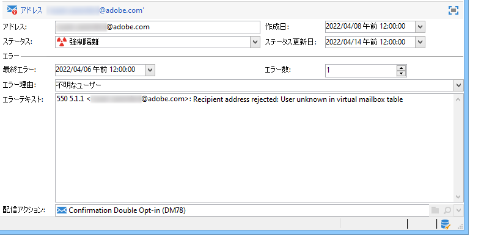
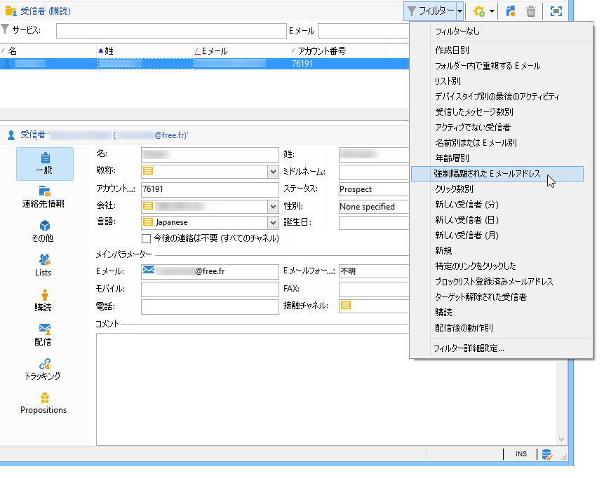
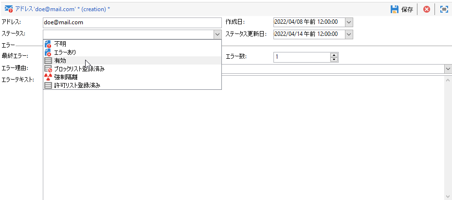

# 強制隔離 {#quarantine-management}

Adobe Campaign は、オンラインチャネル（メール、SMS、プッシュ通知）の強制隔離されたアドレスのリストを管理します。一部のインターネットアクセスプロバイダーは、無効なアドレスの割合が高すぎる場合、メールを自動的にスパムと見なします。したがって、強制隔離を使用すると、これらのプロバイダーによってブロックリストに追加されるのを回避できます。また、強制隔離は、誤りのある電話番号を配信から除外することで、SMS の送信コスト削減にも貢献します。

アドレスまたは電話番号が強制隔離されると、受信者は配信分析時にターゲットから除外されます。マーケティングメッセージ（自動ワークフローメールを含む）を、これらの連絡先に送信することはできません。強制隔離されたアドレスがリストにも存在する場合、それらのリストに送信する際に除外されます。例えば、メールボックスの容量が超過した場合、アドレスが存在しない場合、またはメールサーバーが使用できない場合などに、メールアドレスを強制隔離できます。

<!--For more on best practices to secure and optimize your deliveries, refer to [this page](delivery-best-practices.md).-->

**強制隔離**&#x200B;は、**住所**、**電話番号**、または&#x200B;**デバイストークン**&#x200B;にのみ適用され、プロファイル自体には適用されません。例えば、メールアドレスが強制隔離されているプロファイルは、プロファイルを更新して新しいアドレスを入力できるので、再び配信アクションのターゲットになる可能性があります。同様に、2 つのプロファイルの電話番号が同じ場合、その番号が強制隔離されると、両方のプロファイルが影響を受けます。強制隔離されたアドレスまたは電話番号は、[除外ログ](#delivery-quarantines)（配信の場合）または[強制隔離リスト](#non-deliverable-bounces)（プラットフォーム全体の場合）に表示されます。

一方、プロファイルは、特定のチャネルの購読解除（オプトアウト）後のように&#x200B;**ブロックリスト**&#x200B;に登録される可能性があります。これは、プロファイルがターゲットから外されていることを意味します。結果として、メールチャネルのブロックリストのプロファイルに 2 つのメールアドレスがある場合、両方のアドレスが配信から除外されます。プロファイルが 1 つ以上のチャネルのブロックリストに含まれているかどうかは、プロファイルの「**[!UICONTROL 一般]**」タブの「**[!UICONTROL 今後の連絡は不要]**」セクションで確認できます。[詳細情報](../audiences/view-profiles.md)

>[!NOTE]
>
>受信者がメッセージをスパムとして報告したり、「STOP」などのキーワードを使用して SMS メッセージに返信したりすると、受信者のアドレスまたは電話番号は&#x200B;**[!UICONTROL ブロックリスト登録済み]**&#x200B;として強制隔離されます。それに応じてプロファイルも更新されます。

<!--For the email channel, email addresses are quarantined. For the mobile app channel, device tokens are quarantined. For the SMS channel, phone numbers are quarantined.?-->

## メール、電話、デバイスが強制隔離に送信される理由 {#quarantine-reason}

Adobe Campaign では、配信エラーのタイプと理由に応じて強制隔離を管理します。これらは、エラーメッセージの選定時に割り当てられます。配信エラーの管理について詳しくは、[このページ](delivery-failures.md)を参照してください。

次の 2 つのタイプまたはエラーを取り込むことができます。

* **ハードエラー**：メールアドレス、電話番号、またはデバイスがただちに強制隔離されます。
* **ソフトエラー**：ソフトエラーは、エラーカウンターを増分し、メール、電話番号、デバイストークンを強制隔離する可能性があります。Campaign が[再試行](delivery-failures.md#retries)を実行します。エラーカウンターが制限しきい値に達すると、アドレス、電話番号、またはデバイストークンが強制隔離されます。[詳細情報](delivery-failures.md#retries)。

強制隔離されたアドレスのリストの「**[!UICONTROL エラー理由]**」フィールドには、選択されたアドレスが強制隔離された理由が示されます。[詳細情報](#identifying-quarantined-addresses-for-the-entire-platform)。

ユーザーがメールをスパムと評価した場合、メッセージはアドビが管理するテクニカルメールボックスへと自動的にリダイレクトされます。さらに、そのメールアドレスは自動的に強制隔離され、ステータスが「**[!UICONTROL ブロックリスト登録済み]**」となります。このステータスはアドレスのみに適用されます。プロファイルはブロックリストに登録されていないので、ユーザーは引き続き SMS メッセージやプッシュ通知を受信します。フィードバックループについて詳しくは、[配信のベストプラクティスガイド](https://experienceleague.adobe.com/docs/deliverability-learn/deliverability-best-practice-guide/transition-process/infrastructure.html?lang=ja#feedback-loops){target="_blank"}を参照してください。

>[!NOTE]
>
>Adobe Campaign の強制隔離では、大文字と小文字が区別されます。後から再度ターゲットされることのないよう、E メールアドレスは必ず小文字でインポートしてください。

## 強制隔離されたアドレスへのアクセス {#access-quarantined-addresses}

強制隔離されたアドレスは、特定の配信先またはプラットフォーム全体について表示できます。

### 配信の強制隔離{#delivery-quarantines}

強制隔離アドレスは、配信準備フェーズの間、配信ダッシュボードの配信ログに一覧表示されます。

配信ごとに、**[!UICONTROL 配信の概要]**&#x200B;レポートを確認することもできます。このレポートには、配信ターゲット内の強制隔離中のアドレス数が表示され、次のように表示されます。

* 配信分析時に強制隔離されたアドレス数
* 配信アクション後に強制隔離されたアドレス数

### 配信不能アドレスとバウンスアドレス{#non-deliverable-bounces}

Campaign 管理者は&#x200B;**プラットフォーム全体に対して**&#x200B;強制隔離されたアドレスのリストを表示するために、**[!UICONTROL 管理／キャンペーン管理／配信不能件数の管理／配信不能件数およびアドレス]**&#x200B;を参照できます。このセクションには、**メール**、**SMS** および&#x200B;**プッシュ通知**&#x200B;チャネルの強制隔離された要素のリストが表示されます。

>[!NOTE]
>
>強制隔離の件数は時間と共に増加します。例えば、メールアドレスの寿命が 3 年と考えられ、受信者テーブルが毎年 50％増加する場合、強制隔離の増加は次のように計算できます。
>
>1 年目の終了時：(1&#42;0.33)/(1+0.5)=22%。
>
>2 年目の終了時：((1.22&#42;0.33)+0.33)/(1.5+0.75)=32.5%。

さらに、ホームページの「**レポート**」セクションから入手できる&#x200B;**[!UICONTROL 配信不能件数とバウンス数]**&#x200B;の組み込みレポートには、強制隔離中のアドレス、発生したエラーのタイプおよびエラーのドメイン別分類に関する情報が表示されます。特定の配信のデータをフィルターしたり、必要に応じてこのレポートをカスタマイズしたりできます。

バウンスアドレスについて詳しくは、[配信品質のベストプラクティスガイド](https://experienceleague.adobe.com/docs/deliverability-learn/deliverability-best-practice-guide/metrics-for-deliverability/bounces.html?lang=ja)を参照してください{target="_blank"} を参照してください。

### 強制隔離されたメールアドレス {#quarantined-recipient}

あらゆる受信者のメールアドレスのステータスを調べることができます。

そのためには、受信者のプロファイルを選択し、「**[!UICONTROL 配信]**」タブをクリックします。その受信者に対するすべての配信について、アドレスが失敗したか、分析中に強制隔離されたかなどを確認できます。

各フォルダーについて、以下のように、**[!UICONTROL 強制隔離された E メールアドレス]**&#x200B;組み込みフィルターを使用して、メールアドレスが強制隔離されている受信者のみを表示できます。

## 強制隔離アドレスを削除 {#remove-a-quarantined-address}

特定の条件に一致するアドレスは、**データベースクリーンアップ**&#x200B;組み込みワークフローによって強制隔離リストから自動的に削除されます。

次の場合、アドレスは強制隔離リストから自動的に削除されます。

* 「**[!UICONTROL エラーあり]**」ステータスのアドレスは、配信が正常に完了すると、強制隔離リストから削除されます。
* 「**[!UICONTROL エラーあり]**」ステータスのアドレスは、最後のソフトバウンスが 10 日以上前に発生した場合に、強制隔離リストから削除されます。ソフトエラー管理について詳しくは、[この節](#soft-error-management)を参照してください。
* 「**[!UICONTROL エラーあり]**」ステータスのアドレスで、**[!UICONTROL メールボックス容量超過]**&#x200B;エラーでバウンスしたアドレスは、30 日後に強制隔離リストから削除されます。

その後、ステータスは「**[!UICONTROL 有効]**」に変わります。

>[!CAUTION]
>
>アドレスが&#x200B;**[!UICONTROL 強制隔離中]**&#x200B;または「**[!UICONTROL ブロックリスト登録済み]**」のステータスの受信者は、メールを受信した場合でも削除されません。

また、強制隔離リストからアドレスを手動で削除することもできます。強制隔離からアドレスを削除するには、次の操作を実行します。

* **[!UICONTROL 管理／キャンペーン管理／配信不能件数の管理／配信不能件数およびアドレス]**&#x200B;ノードから、ステータスを「**[!UICONTROL 有効]**」に変更します。

   

例えば、受信者に正常に配信できないためにメールが誤ってバウンスとしてマークされる ISP の停止の場合に、強制隔離リストで一括更新を実行する必要がある場合があります。

これを実行するには、影響を受けるすべての受信者を強制隔離リストから削除して、Campaign による今後のメール配信に含められるよう、ワークフローを作成し、強制隔離テーブルにクエリを追加して、影響を受けるすべての受信者を除外します。

このクエリで推奨されるガイドラインを次に示します。

* **エラーテキスト（強制隔離テキスト）**&#x200B;に「Momen_Code10_InvalidRecipient」が含まれる
* **メールドメイン（@domain）**&#x200B;が domain1.com と等しい、または&#x200B;**メールドメイン（@domain）**&#x200B;が domain2.com と等しい、または&#x200B;**メールドメイン（@domain）**&#x200B;が domain3.com と等しい
* **更新ステータス（@lastModified）**&#x200B;が YYYY/MM/DD 午前 HH:MM:SS 以降
* **ステータスを更新（@lastModified）**（MM/DD/YYYY HH:MM:SS PM 以前）

影響を受ける受信者のリストを受信したら、**[!UICONTROL データを更新]**&#x200B;アクティビティを追加して、ステータスを「**[!UICONTROL 有効]**」に設定し、**[!UICONTROL データベースクリーンアップ]**&#x200B;ワークフローで強制隔離リストから削除されるようにします。また、強制隔離テーブルから削除するだけでもかまいません。

