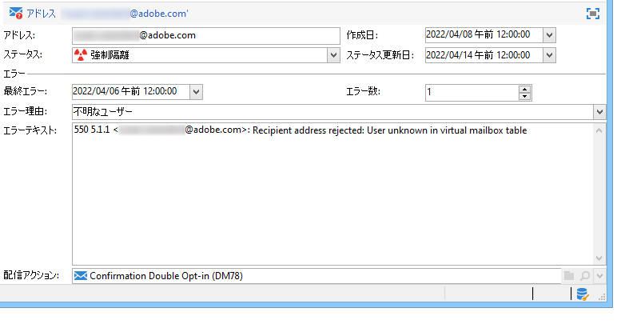
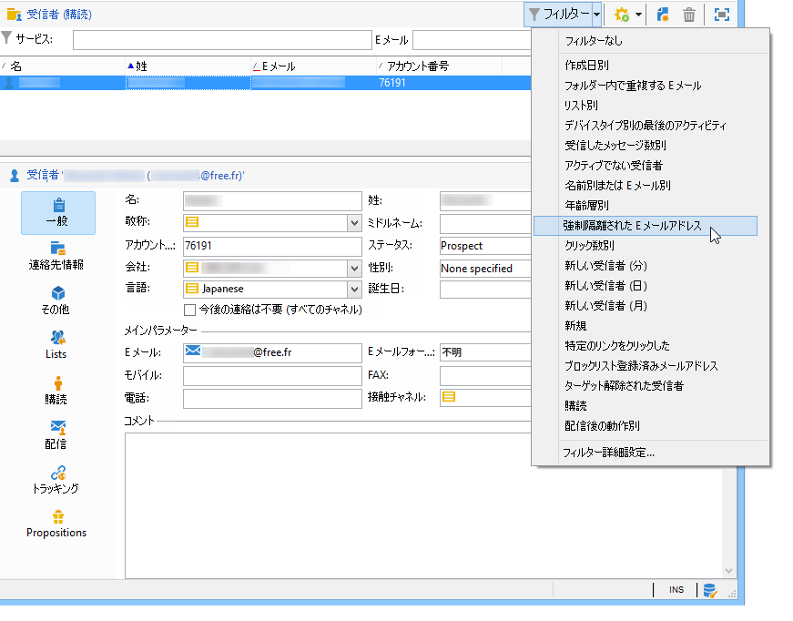
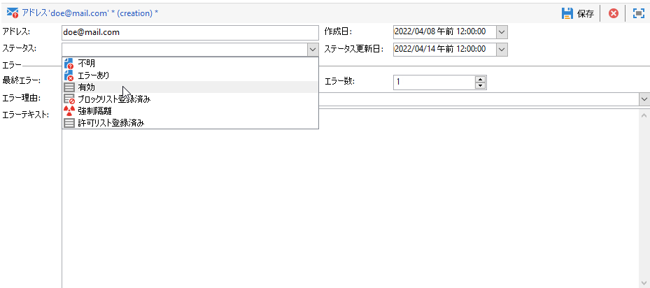

# 強制隔離 {#quarantine-management}

Adobe Campaign は、オンラインチャネル（メール、SMS、プッシュ通知）の強制隔離されたアドレスのリストを管理します。 一部のインターネットアクセスプロバイダーは、無効なアドレスの割合が高すぎる場合、メールを自動的にスパムと見なします。 したがって、強制隔離を使用すると、これらのプロバイダーによってブロックリストに追加されるのを回避できます。 また、強制隔離は、誤りのある電話番号を配信から除外することで、SMS の送信コスト削減にも貢献します。

アドレスまたは電話番号が強制隔離されると、受信者は配信分析時にターゲットから除外されます。マーケティングメッセージ（自動ワークフローメールを含む）を、これらの連絡先に送信することはできません。 強制隔離されたアドレスがリストにも存在する場合、それらのリストに送信する際に除外されます。 例えば、メールボックスの容量が超過した場合、アドレスが存在しない場合、またはメールサーバーが使用できない場合などに、メールアドレスを強制隔離できます。

<!--For more on best practices to secure and optimize your deliveries, refer to [this page](delivery-best-practices.md).-->

## 強制隔離とブロックリスト

**強制隔離**&#x200B;は、**住所**、**電話番号**、または&#x200B;**デバイストークン**&#x200B;にのみ適用され、プロファイル自体には適用されません。 例えば、メールアドレスが強制隔離されているプロファイルは、プロファイルを更新して新しいアドレスを入力できるので、再び配信アクションのターゲットになる可能性があります。 同様に、2 つのプロファイルの電話番号が同じ場合、その番号が強制隔離されると、両方のプロファイルが影響を受けます。 強制隔離されたアドレスまたは電話番号は、[除外ログ](#delivery-quarantines)（配信の場合）または[強制隔離リスト](#non-deliverable-bounces)（プラットフォーム全体の場合）に表示されます。

>[!NOTE]
>
>受信者がメッセージをスパムとして報告したり、「STOP」などのキーワードを使用して SMS メッセージに返信したりすると、受信者のアドレスまたは電話番号は&#x200B;**[!UICONTROL ブロックリスト登録済み]**&#x200B;として強制隔離されます。 それに応じてプロファイルも更新されます。

一方、**プロファイル**&#x200B;は、特定のチャネルの購読解除（オプトアウト）後に&#x200B;**プロファイル**&#x200B;に存在する可能性があります。これは、これらのプロファイルが任意の配信によってターゲットにされなくなったことを意味します。 結果として、メールチャネルのブロックリストのプロファイルに 2 つのメールアドレスがある場合、両方のアドレスが配信から除外されます。 プロファイルが 1 つ以上のチャネルのブロックリストに含まれているかどうかは、プロファイルの「**[!UICONTROL 一般]**」タブの「**[!UICONTROL 今後の連絡は不要]**」セクションで確認できます。 [詳細情報](../audiences/view-profiles.md)

>[!NOTE]
>
>[&quot;mailto&quot; List-Unsubscribe メソッド &#x200B;](https://experienceleague.adobe.com/ja/docs/deliverability-learn/deliverability-best-practice-guide/additional-resources/campaign/acc-technical-recommendations#mailto-list-unsubscribe){target="_blank"}を介した購読解除された受信者は、強制隔離に送信されません。 配信にサービスが定義されていない場合、配信に関連付けられている[&#x200B; サービス &#x200B;](../start/subscriptions.md)から購読を解除されるか、または配信にサービスが定義されていない場合はメールブロックリスト（プロファイルの&#x200B;**[!UICONTROL もう連絡先]** セクションに表示）に送信されます。

<!--For the mobile app channel, device tokens are quarantined.-->

## メール、電話、デバイスが強制隔離に送信される理由 {#quarantine-reason}

Adobe Campaign では、配信エラーのタイプと理由に応じて強制隔離を管理します。 これらは、エラーメッセージの選定時に割り当てられます。 配信エラーの管理について詳しくは、[このページ](delivery-failures.md)を参照してください。

次の 2 つのタイプまたはエラーを取り込むことができます。

* **ハードエラー**：メールアドレス、電話番号、またはデバイスがただちに強制隔離されます。
* **ソフトエラー**：ソフトエラーは、エラーカウンターを増分し、メール、電話番号、デバイストークンを強制隔離する可能性があります。 Campaign が[再試行](delivery-failures.md#retries)を実行します。エラーカウンターが制限しきい値に達すると、アドレス、電話番号、またはデバイストークンが強制隔離されます。 [詳細情報](delivery-failures.md#retries)。

強制隔離されたアドレスのリストの「**[!UICONTROL エラー理由]**」フィールドには、選択されたアドレスが強制隔離された理由が示されます。 [詳細情報](#non-deliverable-bounces)。

ユーザーがメールをスパムと評価した場合、メッセージはアドビが管理するテクニカルメールボックスへと自動的にリダイレクトされます。 さらに、そのメールアドレスは自動的に強制隔離され、ステータスが「**[!UICONTROL ブロックリスト登録済み]**」となります。 このステータスはアドレスのみに適用されます。プロファイルはブロックリストに登録されていないので、ユーザーは引き続き SMS メッセージやプッシュ通知を受信します。 フィードバックループについて詳しくは、[配信のベストプラクティスガイド](https://experienceleague.adobe.com/docs/deliverability-learn/deliverability-best-practice-guide/transition-process/infrastructure.html?lang=ja#feedback-loops){target="_blank"}を参照してください。

>[!NOTE]
>
>Adobe Campaign の強制隔離では、大文字と小文字が区別されます。 後から再度ターゲットされることのないよう、メールアドレスは必ず小文字でインポートしてください。

## ソフトエラー管理 {#soft-error-management}

ハードエラーとは対照的に、ソフトエラーはメールアドレスをすぐに強制隔離に送信するのではなく、エラーカウンターを増分します。 エラーカウンターが上限しきい値に達すると、アドレスは強制隔離されます。 再試行とエラータイプについて詳しくは、[配信エラーについて](delivery-failures.md)を参照してください。

最後に重大なエラーが発生したのが 10 日以上前の場合、エラーカウンターが再初期化されます。 次に、アドレスのステータスが&#x200B;**[!UICONTROL 有効]**&#x200B;に変更され、**[!UICONTROL データベース クリーンアップ]** ワークフローによって強制隔離のリストから削除されます。 [技術的なワークフローについて詳しく見る](../config/workflows.md#technical-workflows)。

## 強制隔離されたアドレスへのアクセス {#access-quarantined-addresses}

強制隔離されたアドレスは、特定の配信先またはプラットフォーム全体について表示できます。

### 配信の強制隔離{#delivery-quarantines}

強制隔離アドレスは、配信準備フェーズの間、配信ダッシュボードの配信ログに一覧表示されます。

配信ごとに、**[!UICONTROL 配信の概要]**&#x200B;レポートを確認することもできます。このレポートには、配信ターゲット内の強制隔離中のアドレス数が表示され、次のように表示されます。

* 配信分析時に強制隔離されたアドレス数
* 配信アクション後に強制隔離されたアドレス数

配信レポートについて詳しくは、[この節](../reporting/gs-reporting.md)を参照してください。

### 配信不能アドレスとバウンスアドレス{#non-deliverable-bounces}

Campaign 管理者は&#x200B;**プラットフォーム全体に対して**&#x200B;強制隔離されたアドレスのリストを表示するために、**[!UICONTROL 管理／キャンペーン管理／配信不能件数の管理／配信不能件数およびアドレス]**&#x200B;を参照できます。 このセクションには、**メール**、**SMS** および&#x200B;**プッシュ通知**&#x200B;チャネルの強制隔離された要素のリストが表示されます。

>[!NOTE]
>
>強制隔離の件数は時間と共に増加します。 例えば、メールアドレスの寿命が 3 年と考えられ、受信者テーブルが毎年 50％増加する場合、強制隔離の増加は次のように計算できます。
>
>1 年目の終了時：(1&#42;0.33)/(1+0.5)=22%。
>
>2 年目の終了時：((1.22&#42;0.33)+0.33)/(1.5+0.75)=32.5%。

さらに、このホームページの&#x200B;**レポート** セクションから入手できる&#x200B;**[!UICONTROL 配信不能件数とバウンス]**&#x200B;の組み込みレポートには、強制隔離のアドレス、発生したエラーの種類、ドメイン別のエラー分類に関する情報が表示されます。 特定の配信のデータをフィルターしたり、必要に応じてこのレポートをカスタマイズしたりできます。

バウンスアドレスについて詳しくは、[配信品質のベストプラクティスガイド &#x200B;](https://experienceleague.adobe.com/docs/deliverability-learn/deliverability-best-practice-guide/metrics-for-deliverability/bounces.html?lang=ja){target="_blank"}を参照してください。

### 強制隔離されたメールアドレス {#quarantined-recipient}

あらゆる受信者のメールアドレスのステータスを調べることができます。

そのためには、受信者のプロファイルを選択し、「**[!UICONTROL 配信]**」タブをクリックします。 その受信者に対するすべての配信について、アドレスが失敗したか、分析中に強制隔離されたかなどを確認できます。

各フォルダーについて、以下のように、**[!UICONTROL 強制隔離されたメールアドレス]**&#x200B;ビルトインのフィルターを使用して、メールアドレスが強制隔離されている受信者のみを表示できます。

## 強制隔離アドレスを削除 {#remove-a-quarantined-address}

### 自動更新 {#unquarantine-auto}

特定の条件に一致するアドレスは、**[!UICONTROL データベースクリーンアップ]**&#x200B;ビルトインのワークフローによって強制隔離リストから自動的に削除されます。

次の場合、アドレスは強制隔離リストから自動的に削除されます。

* 「**[!UICONTROL エラーあり]**」ステータスのアドレスは、配信が正常に完了すると、強制隔離リストから削除されます。
* 「**[!UICONTROL エラーあり]**」ステータスのアドレスは、最後のソフトバウンスが 10 日以上前に発生した場合に、強制隔離リストから削除されます。 ソフトエラー管理について詳しくは、[この節](#soft-error-management)を参照してください。
* 「**[!UICONTROL エラーあり]**」ステータスのアドレスで、**[!UICONTROL メールボックス容量超過]**&#x200B;エラーでバウンスしたアドレスは、30 日後に強制隔離リストから削除されます。

その後、ステータスは「**[!UICONTROL 有効]**」に変わります。

>[!CAUTION]
>
>アドレスが&#x200B;**[!UICONTROL 強制隔離中]**&#x200B;または「**[!UICONTROL ブロックリスト登録済み]**」のステータスの受信者は、メールを受信した場合でも削除されません。

### 手動更新 {#unquarantine-manual}

また、強制隔離リストからアドレスを手動で削除することもできます。 強制隔離からアドレスを手動で削除するには、ステータスを&#x200B;**[!UICONTROL 管理/キャンペーン管理/配信不能管理/配信不能件数とアドレス]** ノードの&#x200B;**[!UICONTROL 有効]**&#x200B;に変更します。

### 一括更新 {#unquarantine-bulk}

受信者に電子メールを正常に配信できないため、電子メールがバウンスとして誤ってマークされるISPの停止など、特定の状況では、強制隔離リストの一括更新を実行する必要がある場合があります。

一括更新を実行するには：

1. ワークフローを作成し、強制隔離テーブル （**[!UICONTROL nms:address]**）にクエリを追加して、影響を受ける受信者をフィルタリングします
2. クエリ条件を使用して、隔離しないアドレスを特定します。次に例を示します。
   * **電子メールドメイン （@domain）**&#x200B;が影響を受けるISP ドメインと等しい
   * **停止の期間内にステータス （@lastModified）**&#x200B;を更新
   * **ステータス （@status）**&#x200B;が強制隔離ステータスに等しい
3. **[!UICONTROL データの更新]** アクティビティを追加して、アドレスのステータスを&#x200B;**[!UICONTROL 有効]**&#x200B;に設定します

その後、アドレスは&#x200B;**[!UICONTROL データベースクリーンアップ]** ワークフローによって自動的に強制隔離リストから削除され、今後の配信に含めることができます。

## 関連トピック

* [配信エラーについて](delivery-failures.md) – 様々な種類の配信エラーと、Campaignによるバウンスの処理方法について説明します
* [配信を監視](delivery-dashboard.md) – 配信ログにアクセスし、配信パフォーマンスを監視します
* [配信のベストプラクティス &#x200B;](../start/delivery-best-practices.md) – 配信品質を維持し、強制隔離を回避するためのベストプラクティス

