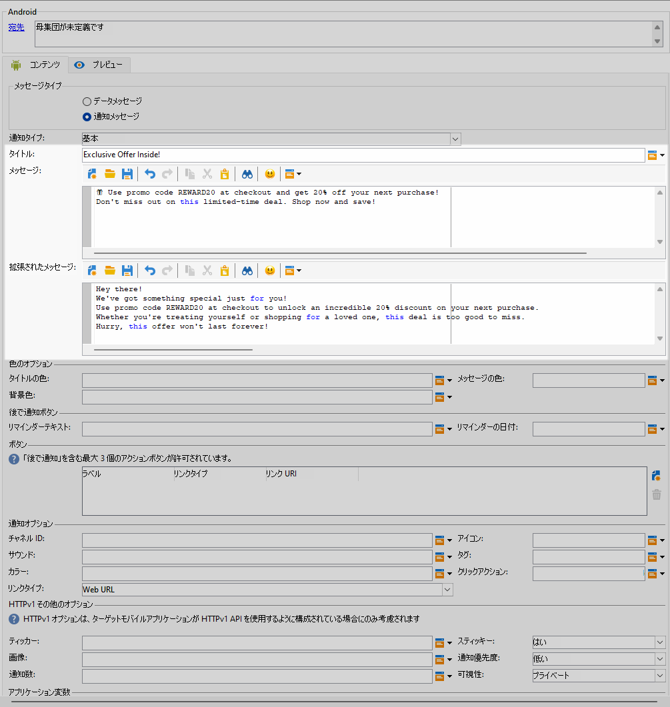
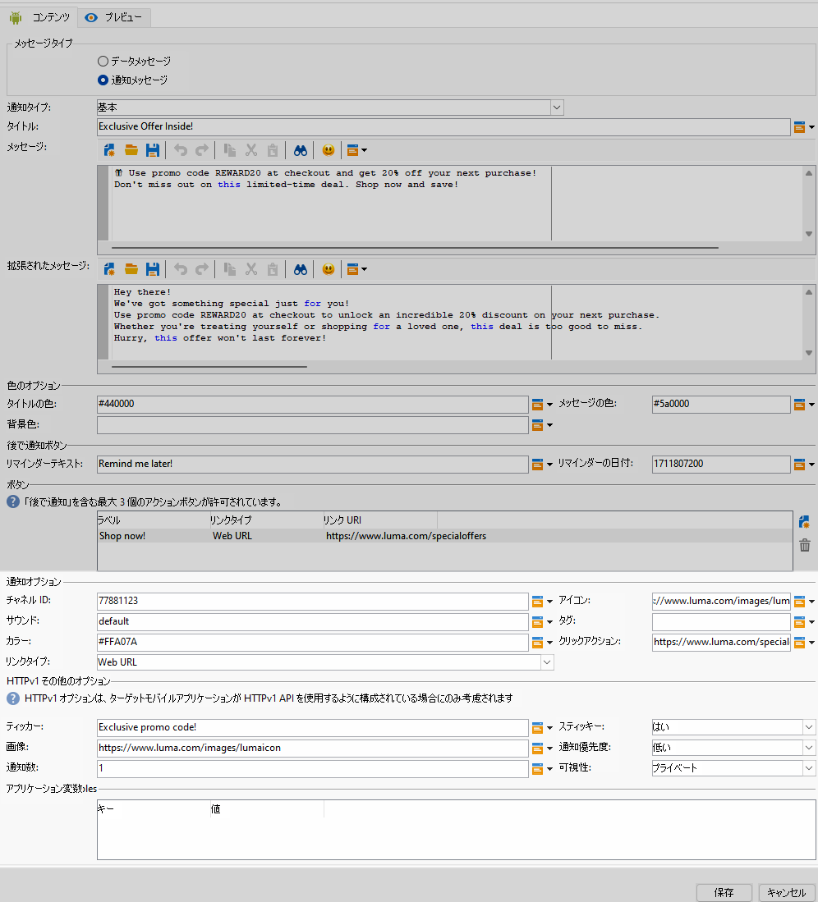
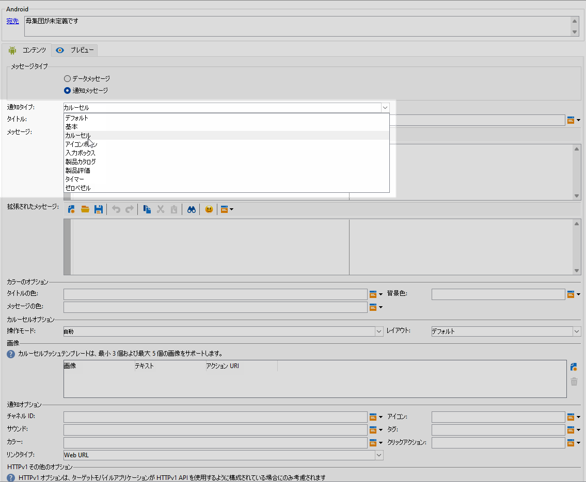
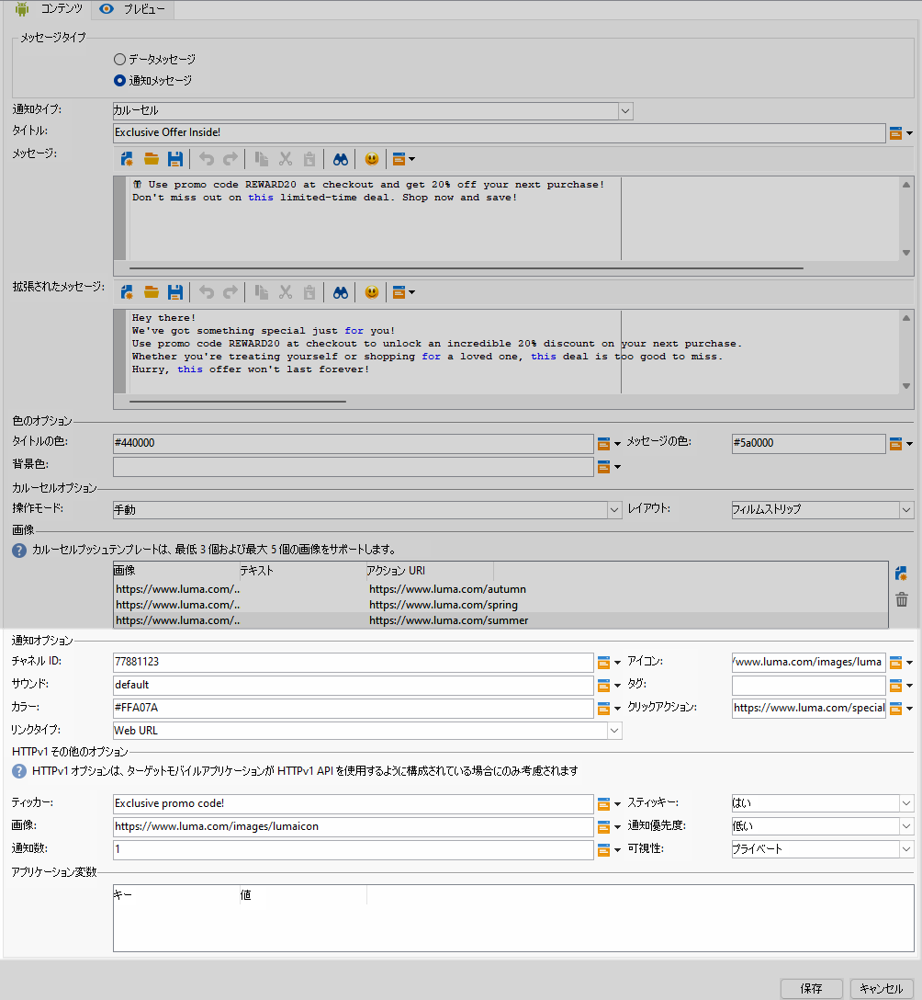
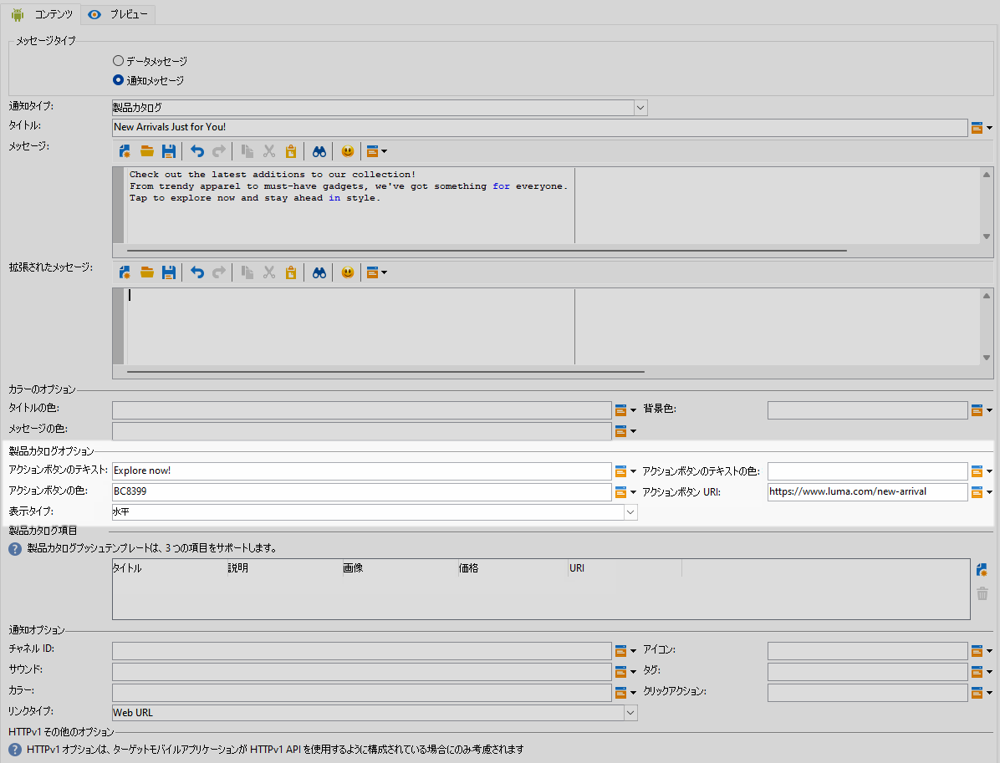

# Android のリッチプッシュ配信の設計 {#rich-push}

>[!IMPORTANT]
>
>リッチ プッシュ通知をデザインする前に、まず V2 コネクタを設定する必要があります。 手順について詳しくは、[このページ](https://experienceleague.adobe.com/ja/docs/campaign-classic/using/sending-messages/sending-push-notifications/configure-the-mobile-app/configuring-the-mobile-application-android#configuring-external-account-android)を参照してください。

Firebase Cloud Messaging では、次の 2 種類のメッセージの中から選択できます。

* **[!UICONTROL データメッセージ]**&#x200B;は、クライアントアプリで処理されます。これらのメッセージは、モバイルアプリケーションに直接送信され、デバイス上で Android 通知を生成して表示されます。データメッセージには、カスタムアプリケーション変数のみが含まれます。

* **[!UICONTROL 通知メッセージ]**&#x200B;は、FCM SDK によって自動的に処理されます。 FCM は、クライアントアプリに代わって、ユーザーのデバイスにメッセージを自動的に表示します。通知メッセージには、事前に定義された一連のパラメーターとオプションが含まれていますが、カスタムアプリケーション変数を使用してさらにパーソナライズすることもできます。

インターフェイスでスクロールバーが無効になっている場合は、**[!UICONTROL 管理]**`>`**[!UICONTROL Platform]**`>`**[!UICONTROL オプション]** にアクセスし、**[!UICONTROL XtkUseScrollBar]** オプションを 1 に設定します。

## Android通知のコンテンツを定義 {#push-message}

プッシュ配信を作成したら、次のいずれかのテンプレートを使用して、そのコンテンツを定義できます。

* **デフォルト** では、シンプルなアイコンと付随する画像で通知を送信できます。

* **基本** では、テキスト、画像、ボタンを通知に含めることができます。

* **カルーセル** を使用すると、ユーザーがスワイプできるテキストと複数の画像を含む通知を送信できます。

* **アイコンボタン** アイコンと対応する画像を含む通知を送信できます。

* **入力ボックス** は、通知を通じて直接ユーザーの入力とフィードバックを収集します。

* **商品カタログ** さまざまな商品画像を表示します。

* **製品評価** を使用すると、ユーザーはフィードバックを提供し、製品を評価できます。

* **タイマー** 通知にライブカウントダウンタイマーが含まれます。

* **ゼロベゼル** は、テキストをシームレスにオーバーレイして、画像の背景面全体を使用します。

これらのテンプレートをパーソナライズする方法について詳しくは、以下のタブを参照してください。

>[!BEGINTABS]

>[!TAB  デフォルト ]

1. **[!UICONTROL 通知タイプ]**&#x200B;ドロップダウンから、「**[!UICONTROL デフォルト]**」を選択します。

   

1. メッセージを作成するには、「**[!UICONTROL タイトル]**」フィールドと「**[!UICONTROL メッセージ]**」フィールドにテキストを入力します。

   

1. 動的パーソナライゼーションフィールドを使用して、コンテンツの定義、データのパーソナライズ、動的コンテンツの追加を行います。[詳細情報](../send/personalize.md)

1. プッシュ通知をさらにカスタマイズするには、プッシュ通知の&#x200B;**[!UICONTROL 通知オプション]**&#x200B;と **[!UICONTROL HTTPv1 追加オプション]**&#x200B;を設定します。[詳細情報](#push-advanced)

   

メッセージのコンテンツを定義したら、テストサブスクライバーを利用して、メッセージをプレビューしテストできます。

>[!TAB  基本 ]

1. **[!UICONTROL 通知タイプ]**&#x200B;ドロップダウンから、「**[!UICONTROL 基本]**」を選択します。

   

1. メッセージを作成するには、「**[!UICONTROL タイトル]**」、「**[!UICONTROL メッセージ]**」、「**[!UICONTROL 拡張されたメッセージ]**」の各フィールドにテキストを入力します。

   **[!UICONTROL メッセージ]**&#x200B;テキストは折りたたまれたビューに表示され、通知を拡張すると&#x200B;**[!UICONTROL 拡張されたメッセージ]**&#x200B;が表示されます。

   

1. 動的パーソナライゼーションフィールドを使用して、コンテンツの定義、データのパーソナライズ、動的コンテンツの追加を行います。[詳細情報](../send/personalize.md)

1. **[!UICONTROL カラーオプション]**&#x200B;メニューで、**[!UICONTROL タイトル]**、**[!UICONTROL メッセージ]**、**[!UICONTROL 背景]**&#x200B;の 16 進数のカラーコードを入力します。

1. 必要に応じて、 **[!UICONTROL 「後で通知」ボタン]**&#x200B;を追加します。対応するフィールドに&#x200B;**[!UICONTROL リマインダーテキスト]**&#x200B;と&#x200B;**日付**&#x200B;を入力します。

   「**[!UICONTROL リマインダーの日付]**」フィールドには、エポックを表す値（秒単位）が必要です。

1. 「**[!UICONTROL 追加ボタン]**」をクリックし、次のフィールドに入力します。

   * **[!UICONTROL ラベル]**：ボタンに表示されるテキスト。
   * **[!UICONTROL リンク URI]**：ボタンクリック時に実行する URI を指定します。

   プッシュ通知には、最大 3 つのボタンを含めるオプションがあります。「**[!UICONTROL 後で通知ボタン]**」を選択した場合、含めることができるボタンは最大 2 つだけです。

1. ボタンのリンク先 URL の&#x200B;**[!UICONTROL リンクタイプ]**&#x200B;を選択します。

   * **[!UICONTROL Web URL]**：Web URL は、ユーザーをオンラインコンテンツに誘導します。クリックすると、デバイスのデフォルトの web ブラウザーが開き、指定した URL に移動するように求められます。

   * **[!UICONTROL ディープリンク]**：ディープリンクは、アプリが閉じている場合でも、ユーザーをアプリ内の特定のセクションに誘導する URL です。クリックすると、ダイアログが表示され、ユーザーはリンクを処理できる様々なアプリから選択できます。

   * **[!UICONTROL オープンアプリ]**：オープンアプリの URL を使用すると、アプリケーション内のコンテンツに直接接続できます。これにより、アプリケーションでは、曖昧さ回避ダイアログをバイパスして、特定のタイプのリンクのデフォルトハンドラーとして確立できます。

   Android アプリリンクの処理方法について詳しくは、[Android 開発者向けドキュメント](https://developer.android.com/training/app-links)を参照してください。

   

1. プッシュ通知をさらにカスタマイズするには、プッシュ通知の&#x200B;**[!UICONTROL 通知オプション]**&#x200B;と **[!UICONTROL HTTPv1 追加オプション]**&#x200B;を設定します。[詳細情報](#push-advanced)

   

メッセージのコンテンツを定義したら、テストサブスクライバーを利用して、メッセージをプレビューしテストできます。

>[!TAB  カルーセル ]

1. **[!UICONTROL 通知タイプ]**&#x200B;ドロップダウンから、「**[!UICONTROL カルーセル]**」を選択します。

   

1. メッセージを作成するには、「**[!UICONTROL タイトル]**」、「**[!UICONTROL メッセージ]**」、「**[!UICONTROL 拡張されたメッセージ]**」の各フィールドにテキストを入力します。

   **[!UICONTROL メッセージ]**&#x200B;テキストは折りたたまれたビューに表示され、通知を拡張すると&#x200B;**[!UICONTROL 拡張されたメッセージ]**&#x200B;が表示されます。

   

1. 式エディターを使用して、コンテンツの定義、データのパーソナライズ、動的コンテンツの追加を行います。[詳細情報](../send/personalize.md)

1. **[!UICONTROL カラーオプション]**&#x200B;メニューで、**[!UICONTROL タイトル]**、**[!UICONTROL メッセージ]**、**[!UICONTROL 背景]**&#x200B;の 16 進数のカラーコードを入力します。

1. **[!UICONTROL カルーセル]**&#x200B;の操作方法を選択します。

   * **[!UICONTROL 自動]**：画像をスライドとして自動的に切り替えさせ、定義済みの間隔で移行します。
   * **[!UICONTROL 手動]**：ユーザーはスライド間を手動でスワイプして画像間を移動できます。

1. **[!UICONTROL レイアウト]**&#x200B;ドロップダウンから「**[!UICONTROL フィルムストリップ]**」オプションを選択して、メインスライドの横に前と次の画像のプレビューを含めます。

1. 「**[!UICONTROL 画像を追加]**」をクリックし、画像の URL、テキスト、アクションの URL を入力します。

   少なくとも 3 つの画像、最大 5 つの画像を含めます。

   

1. プッシュ通知をさらにカスタマイズするには、プッシュ通知の&#x200B;**[!UICONTROL 通知オプション]**&#x200B;と **[!UICONTROL HTTPv1 追加オプション]**&#x200B;を設定します。[詳細情報](#push-advanced)

   

メッセージのコンテンツを定義したら、テストサブスクライバーを利用して、メッセージをプレビューしテストできます。

>[!TAB  アイコン ボタン ]

1. **[!UICONTROL 通知タイプ]** ドロップダウンから、**[!UICONTROL アイコンボタン]** を選択します。

   

1. **[!UICONTROL カラーオプション]** メニューで、**[!UICONTROL 背景]** の 16 進数カラーコードを入力します。

   

1. **[!UICONTROL キャンセルボタン画像]** の URL を指定します。

1. **[!UICONTROL アイコン画像ボタン]** の下の **[!UICONTROL 画像を追加]** をクリックします。 次に、「**画像 URL**」、「**リンクタイプ**」、「**リンク URI**」を入力します。

   少なくとも 3 つの画像と最大 5 つのボタンを含めてください。

   

1. プッシュ通知をさらにカスタマイズするには、プッシュ通知の&#x200B;**[!UICONTROL 通知オプション]**&#x200B;と **[!UICONTROL HTTPv1 追加オプション]**&#x200B;を設定します。[詳細情報](#push-advanced)

   

メッセージのコンテンツを定義したら、テストサブスクライバーを利用して、メッセージをプレビューしテストできます。

>[!TAB  入力ボックス ]

1. **[!UICONTROL 通知タイプ]** ドロップダウンから「**[!UICONTROL 入力ボックス]**」を選択します。

   

1. メッセージを作成するには、「**[!UICONTROL タイトル]**」、「**[!UICONTROL メッセージ]**」、「**[!UICONTROL 拡張されたメッセージ]**」の各フィールドにテキストを入力します。

   **[!UICONTROL メッセージ]**&#x200B;テキストは折りたたまれたビューに表示され、通知を拡張すると&#x200B;**[!UICONTROL 拡張されたメッセージ]**&#x200B;が表示されます。

   

1. **[!UICONTROL カラーオプション]** メニューで、**[!UICONTROL タイトル]**、**[!UICONTROL メッセージ]**、**[!UICONTROL 背景]** の 16 進数カラーコードを入力します。

1. **[!UICONTROL 入力ボックスオプション]** メニューで、次のオプションを入力します。

   * **[!UICONTROL レシーバー名を入力]**：入力のレシーバーの名前または識別子を入力します。
   * **[!UICONTROL 入力テキスト]**: **入力ボックス** のテキストを入力します。
   * **[!UICONTROL フィードバックテキスト]**：返信の後に表示するテキストを入力します。
   * **[!UICONTROL フィードバック画像]**：返信後に表示される画像の URL を追加します。

   

1. プッシュ通知をさらにカスタマイズするには、プッシュ通知の&#x200B;**[!UICONTROL 通知オプション]**&#x200B;と **[!UICONTROL HTTPv1 追加オプション]**&#x200B;を設定します。[詳細情報](#push-advanced)

   

メッセージのコンテンツを定義したら、テストサブスクライバーを利用して、メッセージをプレビューしテストできます。

>[!TAB  製品カタログ ]

1. **[!UICONTROL 通知タイプ]** ドロップダウンから、「**[!UICONTROL 製品カタログ]**」を選択します。

   

1. メッセージを作成するには、「**[!UICONTROL タイトル]**」、「**[!UICONTROL メッセージ]**」、「**[!UICONTROL 拡張されたメッセージ]**」の各フィールドにテキストを入力します。

   **[!UICONTROL メッセージ]**&#x200B;テキストは折りたたまれたビューに表示され、通知を拡張すると&#x200B;**[!UICONTROL 拡張されたメッセージ]**&#x200B;が表示されます。

   

1. **[!UICONTROL カラーオプション]**&#x200B;メニューで、**[!UICONTROL タイトル]**、**[!UICONTROL メッセージ]**、**[!UICONTROL 背景]**&#x200B;の 16 進数のカラーコードを入力します。

1. **[!UICONTROL 製品カタログオプション]** メニューで、次のオプションを入力します。

   * **[!UICONTROL アクションボタンのテキスト]**：ボタンに表示するテキスト。
   * **[!UICONTROL アクションボタンのテキストの色]**: アクションボタンのテキストの色。
   * **[!UICONTROL アクションボタンの色]**：アクションボタンの色。
   * **[!UICONTROL アクションボタン URI]**：ボタンをクリックしたときに実行される URI を指定します。
   * **[!UICONTROL 表示タイプ]**：垂直表示または水平表示を選択します。

   

1. **[!UICONTROL 製品カタログ項目]** メニューで **[!UICONTROL 追加]** をクリックし、各項目に次の詳細を入力します。

   * **[!UICONTROL タイトル]**
   * **[!UICONTROL 説明]**
   * **[!UICONTROL 画像 URL]**
   * **[!UICONTROL 価格]**
   * **[!UICONTROL URI]**

   必ず最大 3 つの項目を含めます。

   

1. プッシュ通知をさらにカスタマイズするには、プッシュ通知の&#x200B;**[!UICONTROL 通知オプション]**&#x200B;と **[!UICONTROL HTTPv1 追加オプション]**&#x200B;を設定します。[詳細情報](#push-advanced)

メッセージのコンテンツを定義したら、テストサブスクライバーを利用して、メッセージをプレビューしテストできます。

>[!TAB  製品評価 ]

1. **[!UICONTROL 通知タイプ]** ドロップダウンから、「**[!UICONTROL 製品評価]**」を選択します。

   

1. メッセージを作成するには、「**[!UICONTROL タイトル]**」、「**[!UICONTROL メッセージ]**」、「**[!UICONTROL 拡張されたメッセージ]**」の各フィールドにテキストを入力します。

   **[!UICONTROL メッセージ]**&#x200B;テキストは折りたたまれたビューに表示され、通知を拡張すると&#x200B;**[!UICONTROL 拡張されたメッセージ]**&#x200B;が表示されます。

   

1. **[!UICONTROL カラーオプション]**&#x200B;メニューで、**[!UICONTROL タイトル]**、**[!UICONTROL メッセージ]**、**[!UICONTROL 背景]**&#x200B;の 16 進数のカラーコードを入力します。

1. **[!UICONTROL 製品評価オプション]** メニューで、**[!UICONTROL 評価アイコンが選択されていない状態]** および **[!UICONTROL 評価アイコンが選択された状態]** の URL を入力します。

   

1. **[!UICONTROL 製品評価の項目]** メニューで、「**[!UICONTROL 追加]**」をクリックし、**[!UICONTROL リンク URI]** を入力して、**[!UICONTROL リンクタイプ]** を選択します。

   * **[!UICONTROL Web URL]**：Web URL は、ユーザーをオンラインコンテンツに誘導します。クリックすると、デバイスのデフォルトの web ブラウザーが開き、指定した URL に移動するように求められます。

   * **[!UICONTROL ディープリンク]**：ディープリンクは、アプリが閉じている場合でも、ユーザーをアプリ内の特定のセクションに誘導する URL です。クリックすると、ダイアログが表示され、ユーザーはリンクを処理できる様々なアプリから選択できます。

   * **[!UICONTROL オープンアプリ]**：オープンアプリの URL を使用すると、アプリケーション内のコンテンツに直接接続できます。これにより、アプリケーションでは、曖昧さ回避ダイアログをバイパスして、特定のタイプのリンクのデフォルトハンドラーとして確立できます。

   * **[!UICONTROL 解除]**：ボタンに URL が関連付けられていません。クリックすると、ダイアログやインターフェイスが閉じるだけです。

   値は必ず 3 つ以上、5 つ以下にしてください。

   

1. プッシュ通知をさらにカスタマイズするには、プッシュ通知の&#x200B;**[!UICONTROL 通知オプション]**&#x200B;と **[!UICONTROL HTTPv1 追加オプション]**&#x200B;を設定します。[詳細情報](#push-advanced)

   

メッセージのコンテンツを定義したら、テストサブスクライバーを利用して、メッセージをプレビューしテストできます。

>[!TAB  タイマー ]

1. **[!UICONTROL 通知タイプ]** ドロップダウンから「**[!UICONTROL タイマー]**」を選択します。

   

1. メッセージを作成するには、「**[!UICONTROL タイトル]**」、「**[!UICONTROL メッセージ]**」、「**[!UICONTROL 拡張されたメッセージ]**」の各フィールドにテキストを入力します。

   **[!UICONTROL メッセージ]**&#x200B;テキストは折りたたまれたビューに表示され、通知を拡張すると&#x200B;**[!UICONTROL 拡張されたメッセージ]**&#x200B;が表示されます。

   

1. タイマーの期限が切れた後に表示されるテキストを「**[!UICONTROL 代替タイトル]**」、「**[!UICONTROL 代替メッセージ]**」および「**[!UICONTROL 代替拡張メッセージ]**」フィールドに入力します。

1. **[!UICONTROL カラーオプション]** メニューで、**[!UICONTROL タイトル]**、**[!UICONTROL メッセージ]**、**[!UICONTROL 背景]**、**[!UICONTROL タイマー]** の 16 進数カラーコードを入力します。

   

1. **[!UICONTROL タイマー時間]** を秒単位または **[!UICONTROL タイマー終了タイムスタンプ]** で特定のエポックタイムスタンプに設定し、タイマーの有効期限が切れた後に表示される **[!UICONTROL 代替画像]** URL を追加します。

   

1. プッシュ通知をさらにカスタマイズするには、プッシュ通知の&#x200B;**[!UICONTROL 通知オプション]**&#x200B;と **[!UICONTROL HTTPv1 追加オプション]**&#x200B;を設定します。[詳細情報](#push-advanced)

メッセージのコンテンツを定義したら、テストサブスクライバーを利用して、メッセージをプレビューしテストできます。

>[!TAB  ゼロ・ベゼル ]

1. **[!UICONTROL Notification Type]** ドロップダウンから **[!UICONTROL Zero beel]** を選択します。

   

1. メッセージを作成するには、「**[!UICONTROL タイトル]**」、「**[!UICONTROL メッセージ]**」、「**[!UICONTROL 拡張されたメッセージ]**」の各フィールドにテキストを入力します。

   **[!UICONTROL メッセージ]**&#x200B;テキストは折りたたまれたビューに表示され、通知を拡張すると&#x200B;**[!UICONTROL 拡張されたメッセージ]**&#x200B;が表示されます。

   

1. **[!UICONTROL カラーオプション]**&#x200B;メニューで、**[!UICONTROL タイトル]**、**[!UICONTROL メッセージ]**、**[!UICONTROL 背景]**&#x200B;の 16 進数のカラーコードを入力します。

1. **[!UICONTROL ゼロベゼルオプション]** メニューで、「**[!UICONTROL 折りたたまれた通知スタイル]**」フィールドに画像 URL を追加します。

   

1. プッシュ通知をさらにカスタマイズするには、プッシュ通知の&#x200B;**[!UICONTROL 通知オプション]**&#x200B;と **[!UICONTROL HTTPv1 追加オプション]**&#x200B;を設定します。[詳細情報](#push-advanced)

メッセージのコンテンツを定義したら、テストサブスクライバーを利用して、メッセージをプレビューしテストできます。

>[!ENDTABS]

## プッシュ通知の詳細設定 {#push-advanced}

### 通知オプション {#notification-options}

| パラメーター | 説明 |
|---------|---------|
| **[!UICONTROL チャネル ID]** | 通知のチャネル ID を設定します。このチャネル ID を持つ通知を受信するには、このチャネル ID を持つチャネルをアプリで事前に作成しておく必要があります。 |
| **[!UICONTROL アイコン]** | プロファイルのデバイスに表示される通知のアイコンを設定します。 |
| **[!UICONTROL サウンド]** | デバイスが通知を受け取るときに再生するサウンドを設定します。 |
| **[!UICONTROL タグ]** | 通知ドロワー内の既存の通知を置き換えるために使用する識別子を設定します。これにより、複数の通知が蓄積されるのを防ぎ、関連する最新通知のみが表示されるようにします。 |
| **[!UICONTROL カラー]** | 通知のアイコンのカラーを 16 進数のカラーコードで設定します。 |
| **[!UICONTROL クリックアクション]** | 通知のユーザークリックに関連付けられたアクションを設定します。 |
| **[!UICONTROL 通知の背景色]** | 通知の背景色を 16 進数のカラーコードで設定します。 |
| **[!UICONTROL リンクタイプ]** | <ul><li>Web URL：Web URL は、ユーザーをオンラインコンテンツに誘導します。クリックすると、デバイスのデフォルトの web ブラウザーが開き、指定した URL に移動するように求められます。</li><li>ディープリンク：ディープリンクは、アプリが閉じている場合でも、ユーザーをアプリ内の特定のセクションに誘導する URL です。クリックすると、ダイアログが表示され、ユーザーはリンクを処理できる様々なアプリから選択できます。</li><li> オープンアプリ：オープンアプリ URL を使用すると、アプリケーション内のコンテンツに直接接続できます。これにより、アプリケーションでは、曖昧さ回避ダイアログをバイパスして、特定のタイプのリンクのデフォルトハンドラーとして確立できます。</li></ul> |

### HTTPv1 その他のオプション {#additional-options}

| パラメーター | 説明 |
|---------|---------|
| **[!UICONTROL ティッカー]** | 通知のティッカーテキストを設定します。Android 5.0 Lollipop に設定されたデバイスでのみ使用できます。 |
| **[!UICONTROL スティッキー]** | 有効にした場合、ユーザーがクリックした後も通知は表示されたままになります。 無効にした場合、ユーザーが操作すると通知は自動的に閉じられます。スティッキー動作を使用すると、重要な通知を長期間画面に保持できます。 |
| **[!UICONTROL 画像]** | 通知に表示する画像の URL を設定します。 |
| **[!UICONTROL 通知優先度]** | 通知の優先度レベル（デフォルト、最小、低、高）を設定します。 優先度レベルは通知の重要度と緊急性を決定し、通知の表示方法と、特定のシステム設定をバイパスできるかどうかに影響します。詳しくは、[FCM のドキュメント](https://firebase.google.com/docs/reference/fcm/rest/v1/projects.messages?hl=ja#notificationpriority)を参照してください。 |
| **[!UICONTROL 通知数]** | アプリケーションアイコンに直接表示する新しい未読情報の数を設定します。これにより、ユーザーは保留中の通知数をすばやく確認できます。 |
| **[!UICONTROL 可視性]** | 通知の表示レベルを（パブリック、プライベート、秘密）のいずれかに設定します。表示レベルは、通知の内容をロック画面やその他の機密領域にどの程度表示するかを決定します。詳しくは、[FCM ドキュメント](https://firebase.google.com/docs/reference/fcm/rest/v1/projects.messages#visibility)を参照してください。 |
| **[!UICONTROL アプリケーション変数]** | 通知動作を定義できます。 これらの変数は完全にカスタマイズ可能で、モバイルデバイスに送信されるメッセージペイロードの一部に含まれます。 |

