# iOSのリッチなプッシュ配信をデザイン {#rich-push}

>[!IMPORTANT]
>
>リッチ プッシュ通知をデザインする前に、まず V2 コネクタを設定する必要があります。 手順について詳しくは、[このページ](https://experienceleague.adobe.com/ja/docs/campaign-classic/using/sending-messages/sending-push-notifications/configure-the-mobile-app/configuring-the-mobile-application)を参照してください。

## iOS通知のコンテンツを定義 {#push-message}

プッシュ配信を作成したら、次のいずれかのテンプレートを使用して、そのコンテンツを定義できます。

* **デフォルト** では、シンプルなアイコンと付随する画像で通知を送信できます。

* **基本** では、テキスト、画像、ボタンを通知に含めることができます。

* **カルーセル** を使用すると、ユーザーがスワイプできるテキストと複数の画像を含む通知を送信できます。

これらのテンプレートをパーソナライズする方法について詳しくは、以下のタブを参照してください。

>[!BEGINTABS]

>[!TAB  デフォルト ]

1. **[!UICONTROL 通知タイプ]** として ]**一般通知（アラート、サウンド、バッジ**[!UICONTROL  を選択します。

1. **[!UICONTROL 通知タイプ]** ドロップダウンから「**[!UICONTROL デフォルト]**」を選択します。

   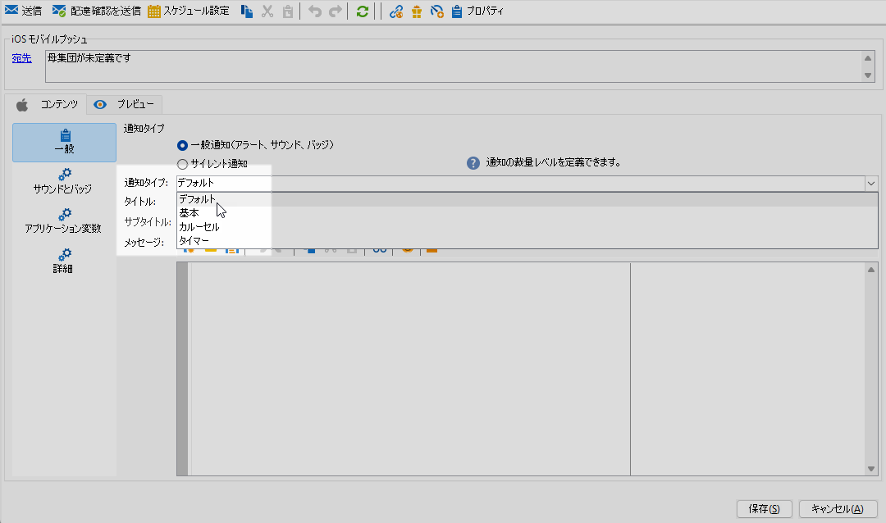

1. 「**[!UICONTROL タイトル]**」フィールドで、通知センターから使用可能な通知のリストに表示するタイトルのラベルを入力します。

   このフィールドを使用して、iOS 通知ペイロードの **title** パラメーターの値を定義できます。

1. オプションで、iOS通知ペイロードの **[!UICONTROL サブタイトル]** パラメーターに対応する **サブタイトル** を追加します。

1. ウィザードの「**[!UICONTROL メッセージコンテンツ]**」セクションにメッセージのコンテンツを入力します。

   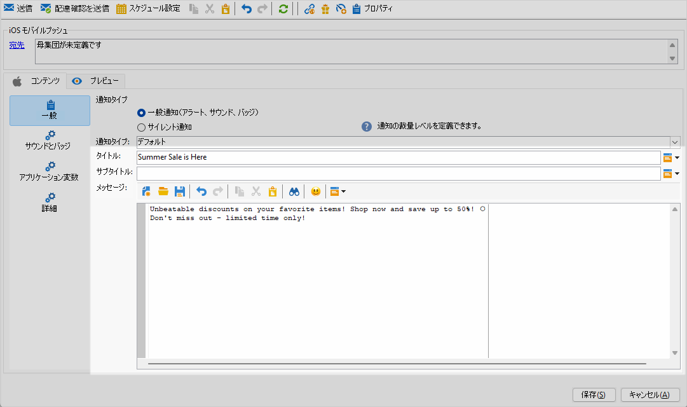

1. 「**[!UICONTROL サウンドとバッジ]**」タブに移動して、通知のサウンドやバッジのオプションなど、その他の設定をカスタマイズします。 [詳細情報](#sound-badge)

   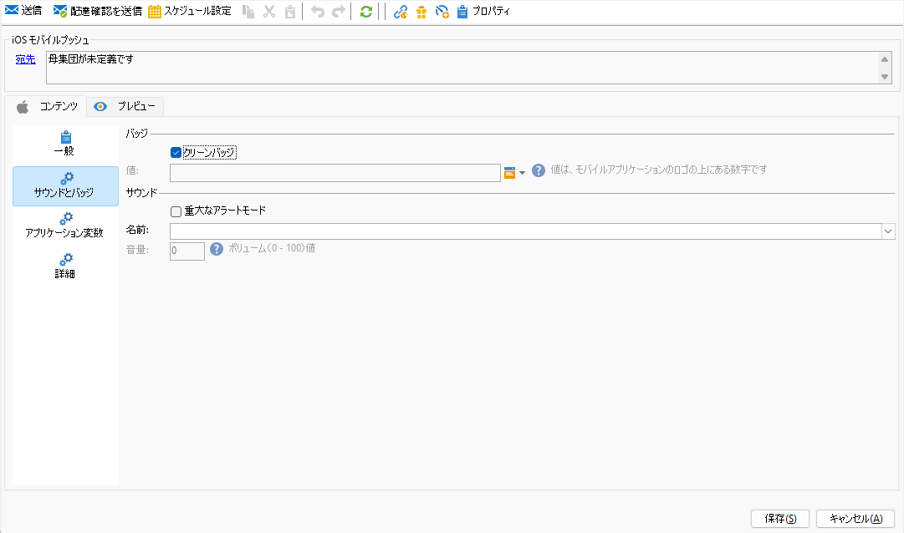

1. 「**[!UICONTROL アプリケーション変数]**」タブから、**[!UICONTROL アプリケーション変数]**&#x200B;が自動的に追加されます。これによって、通知の動作を定義できます。例えば、ユーザーが通知を有効化したときに特定のアプリケーション画面が表示されるように設定できます。

1. さらにカスタマイズするには、プッシュ通知で使用できる **[!UICONTROL 詳細オプション]** を確認します。 [詳細情報](#push-advanced)

   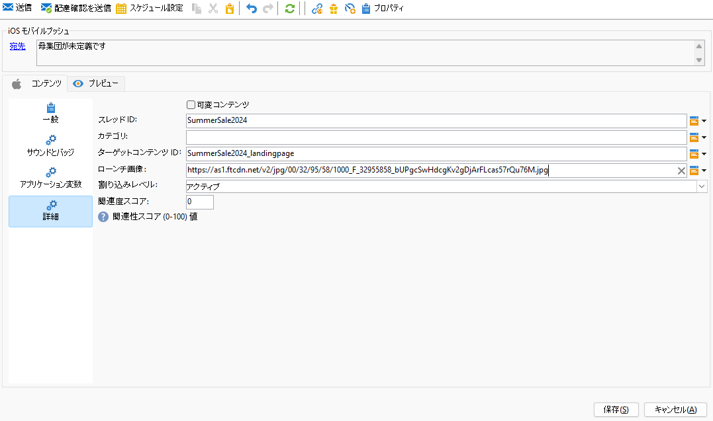

1. 通知を設定したら、「**[!UICONTROL プレビュー]**」タブをクリックして通知をプレビューします。

>[!TAB  基本 ]

1. **[!UICONTROL 通知タイプ]** として ]**一般通知（アラート、サウンド、バッジ**[!UICONTROL  を選択します。

1. **[!UICONTROL 通知タイプ]**&#x200B;ドロップダウンから、「**[!UICONTROL 基本]**」を選択します。

   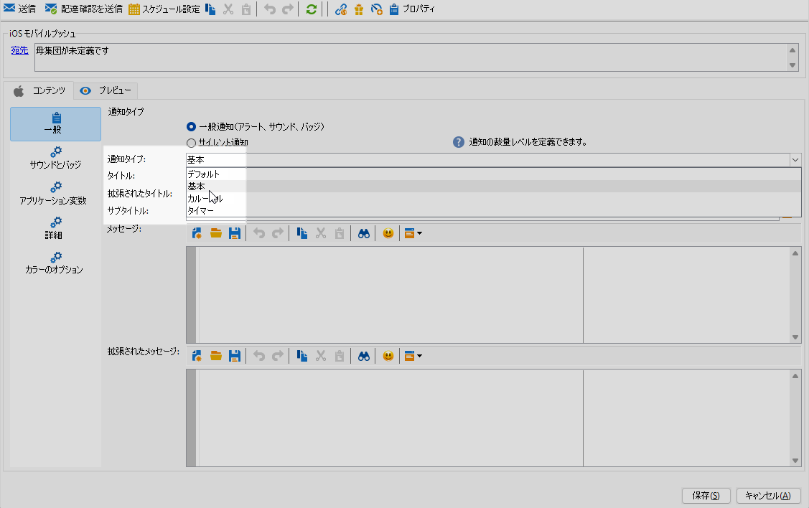

1. メッセージを作成するには、「**[!UICONTROL タイトル]**」、「**[!UICONTROL 展開されたメッセージ]**」、「**[!UICONTROL メッセージ]**」、「**[!UICONTROL 展開されたメッセージ]** フィールドにテキストを入力します。

   **[!UICONTROL メッセージ]**&#x200B;テキストは折りたたまれたビューに表示され、通知を拡張すると&#x200B;**[!UICONTROL 拡張されたメッセージ]**&#x200B;が表示されます。

   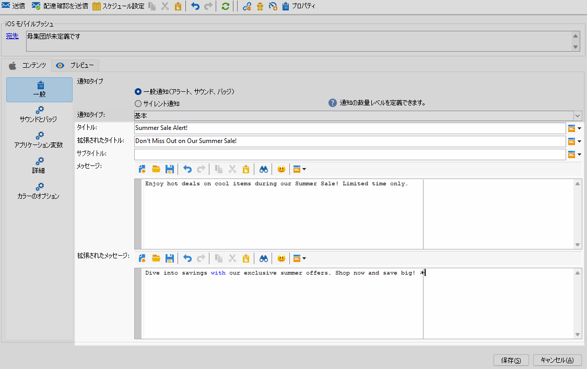

1. オプションで、iOS通知ペイロードの **[!UICONTROL サブタイトル]** パラメーターに対応する **サブタイトル** を追加します。

1. 「**[!UICONTROL サウンドとバッジ]**」タブに移動して、通知のサウンドやバッジのオプションなど、その他の設定をカスタマイズします。 [詳細情報](#sound-badge)

1. 「**[!UICONTROL アプリケーション変数]**」タブから、**[!UICONTROL アプリケーション変数]**&#x200B;が自動的に追加されます。これによって、通知の動作を定義できます。例えば、ユーザーが通知を有効化したときに特定のアプリケーション画面が表示されるように設定できます。

1. さらにカスタマイズするには、プッシュ通知で使用できる **[!UICONTROL 詳細オプション]** を確認します。 [詳細情報](#push-advanced)

   

1. **[!UICONTROL カラーオプション]** メニューで、**[!UICONTROL タイトル]**、**[!UICONTROL メッセージ]** および **[!UICONTROL 背景]** の 16 進数カラーコードを入力します。

   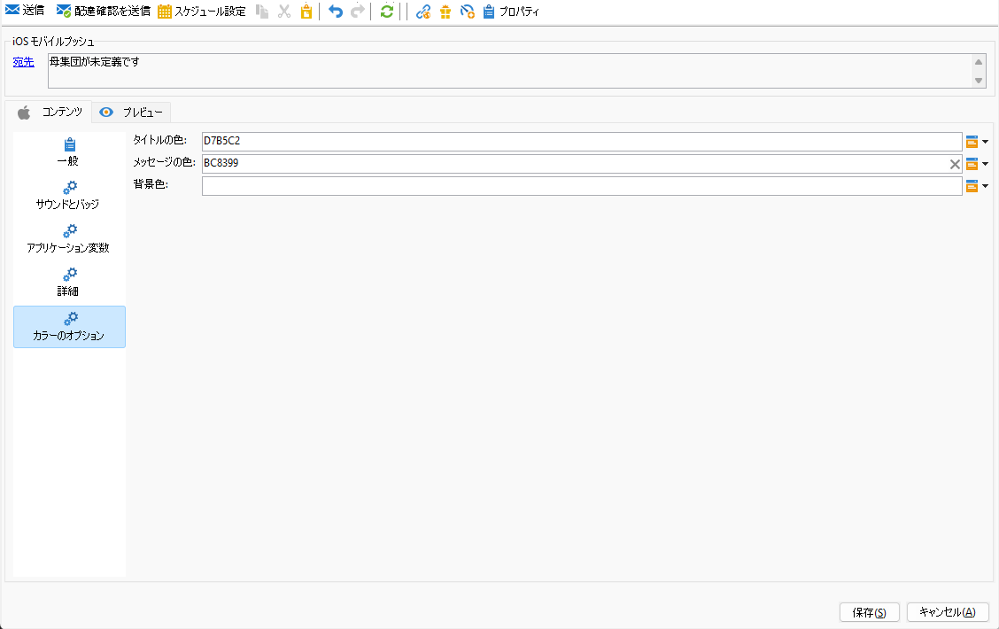

メッセージのコンテンツを定義したら、テストサブスクライバーを利用して、メッセージをプレビューしテストできます。

>[!TAB  カルーセル ]

1. **[!UICONTROL 通知タイプ]** として ]**一般通知（アラート、サウンド、バッジ**[!UICONTROL  を選択します。

1. **[!UICONTROL 通知タイプ]**&#x200B;ドロップダウンから、「**[!UICONTROL カルーセル]**」を選択します。

   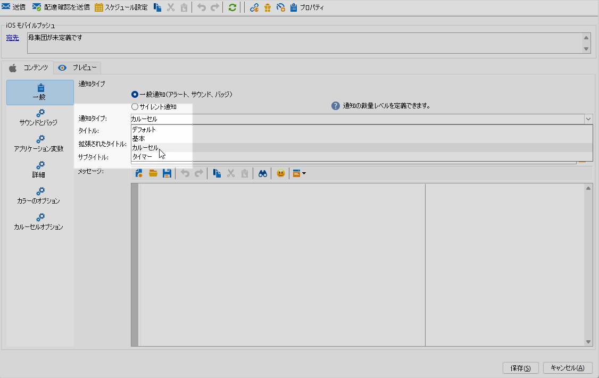

1. メッセージを作成するには、「**[!UICONTROL タイトル]**」、「**[!UICONTROL 展開されたタイトル]**、「**[!UICONTROL メッセージ]**」フィールドにテキストを入力します。

   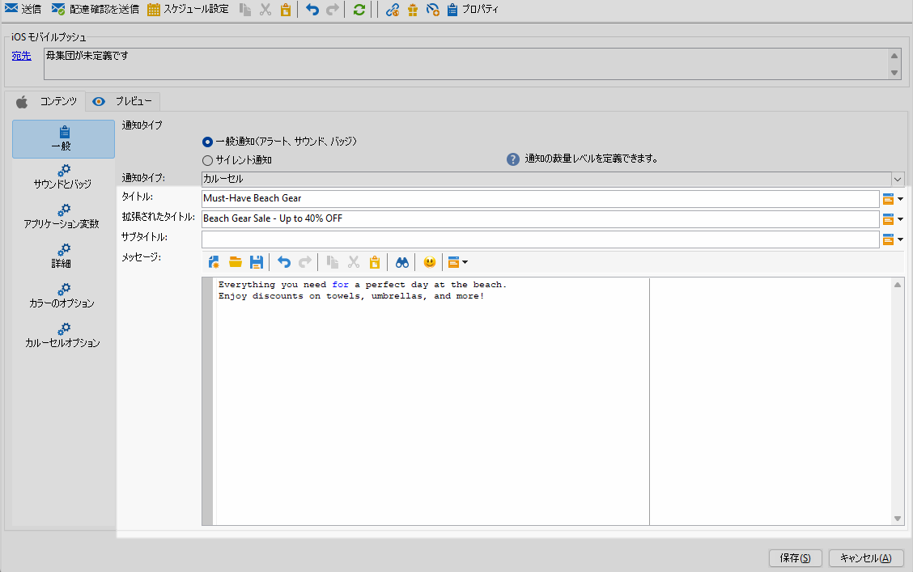

1. 「**[!UICONTROL サウンドとバッジ]**」タブに移動して、通知のサウンドやバッジのオプションなど、その他の設定をカスタマイズします。 [詳細情報](#sound-badge)

1. 「**[!UICONTROL アプリケーション変数]**」タブから、**[!UICONTROL アプリケーション変数]**&#x200B;が自動的に追加されます。これによって、通知の動作を定義できます。例えば、ユーザーが通知を有効化したときに特定のアプリケーション画面が表示されるように設定できます。

   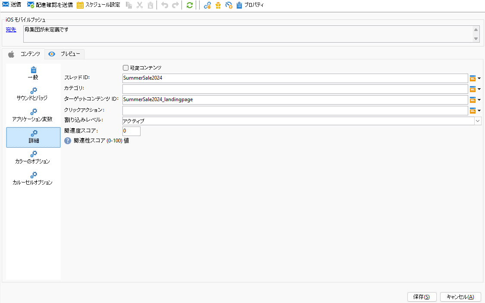

1. さらにカスタマイズするには、プッシュ通知で使用できる **[!UICONTROL 詳細オプション]** を確認します。 [詳細情報](#push-advanced)

1. **[!UICONTROL カラーオプション]** メニューで、**[!UICONTROL タイトル]**、**[!UICONTROL メッセージ]** および **[!UICONTROL 背景]** の 16 進数カラーコードを入力します。

1. **[!UICONTROL カルーセル]** の操作方法を「**[!UICONTROL カルーセルオプション]**」タブで選択します。

   * **[!UICONTROL 自動]**：画像をスライドとして自動的に切り替えさせ、定義済みの間隔で移行します。
   * **[!UICONTROL 手動]**：ユーザーはスライド間を手動でスワイプして画像間を移動できます。

1. **[!UICONTROL 画像を追加]** をクリックし、**[!UICONTROL 画像 URL]**、**[!UICONTROL テキスト]** および **[!UICONTROL アクション URL]** を入力します。

   少なくとも 3 つの画像、最大 5 つの画像を含めます。

   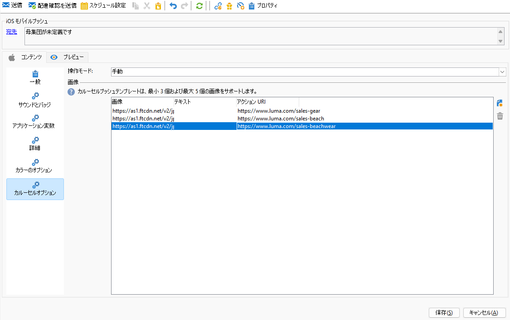

メッセージのコンテンツを定義したら、テストサブスクライバーを利用して、メッセージをプレビューしテストできます。

>[!TAB  タイマー ]

1. **[!UICONTROL 通知タイプ]** として ]**一般通知（アラート、サウンド、バッジ**[!UICONTROL  を選択します。

1. **[!UICONTROL 通知タイプ]** ドロップダウンから「**[!UICONTROL タイマー]**」を選択します。

   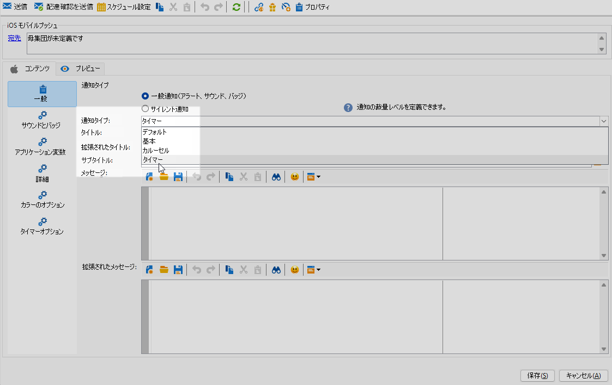

1. メッセージを作成するには、「**[!UICONTROL タイトル]**」、「**[!UICONTROL 展開されたタイトル]**、「**[!UICONTROL メッセージ]**」、「**[!UICONTROL 展開されたメッセージ]**」フィールドにテキストを入力します。

   **[!UICONTROL メッセージ]**&#x200B;テキストは折りたたまれたビューに表示され、通知を拡張すると&#x200B;**[!UICONTROL 拡張されたメッセージ]**&#x200B;が表示されます。

   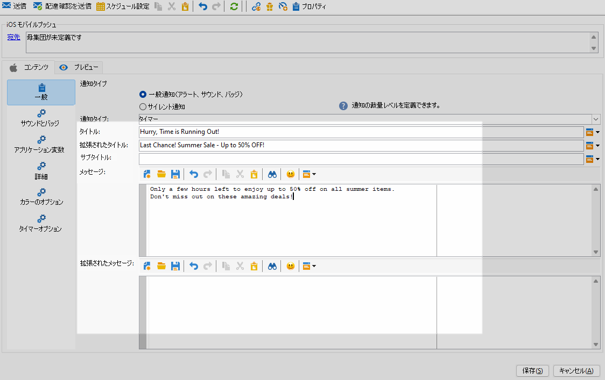

1. オプションで、iOS通知ペイロードの **[!UICONTROL サブタイトル]** パラメーターに対応する **サブタイトル** を追加します。

1. 「**[!UICONTROL サウンドとバッジ]**」タブに移動して、通知のサウンドやバッジのオプションなど、その他の設定をカスタマイズします。 [詳細情報](#sound-badge)

1. 「**[!UICONTROL アプリケーション変数]**」タブから、**[!UICONTROL アプリケーション変数]**&#x200B;が自動的に追加されます。これによって、通知の動作を定義できます。例えば、ユーザーが通知を有効化したときに特定のアプリケーション画面が表示されるように設定できます。

1. さらにカスタマイズするには、プッシュ通知で使用できる **[!UICONTROL 詳細オプション]** を確認します。 [詳細情報](#push-advanced)

1. **[!UICONTROL カラーオプション]** メニューで、**[!UICONTROL タイトル]**、**[!UICONTROL メッセージ]** および **[!UICONTROL 背景]** の 16 進数カラーコードを入力します。

   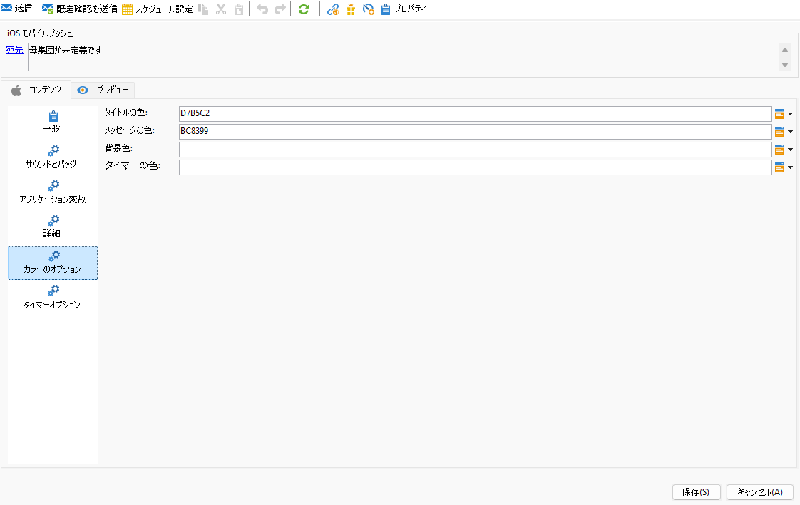

1. 「**[!UICONTROL タイマー]**」タブで、**[!UICONTROL タイマー時間]** （秒単位）または **[!UICONTROL タイマー終了タイムスタンプ]** を特定のエポックタイムスタンプに設定します。

1. タイマーの期限が切れた後に表示されるテキストと画像を「**[!UICONTROL 代替タイトル]**」、「**[!UICONTROL 代替メッセージ]**」および「**[!UICONTROL 代替画像]**」フィールドに入力します。

   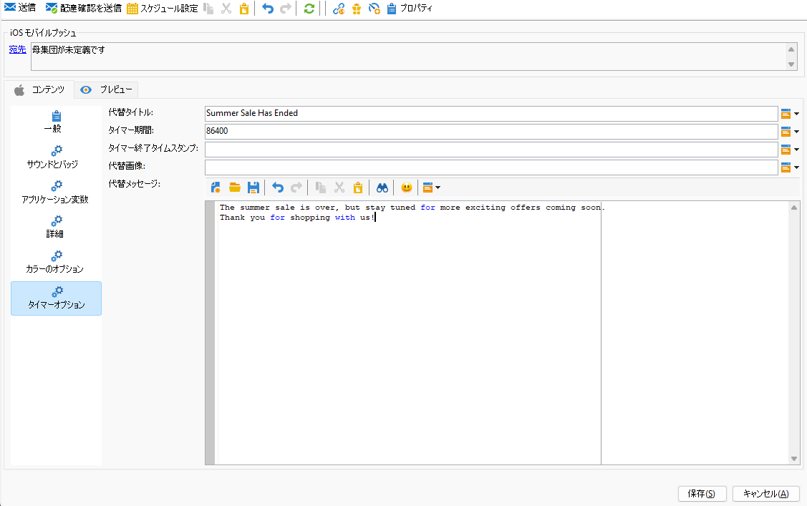

メッセージのコンテンツを定義したら、テストサブスクライバーを利用して、メッセージをプレビューしテストできます。

>[!ENDTABS]

## プッシュ通知の詳細設定 {#push-advanced}

### サウンドとバッジのオプション {#sound-badge}

| パラメーター | 説明 |
|---------|---------|
| **[!UICONTROL クリーンバッジ]** | このオプションを有効にして、バッジ値を更新します。 |
| **[!UICONTROL 値]** | 新しい未読情報の数をアプリケーションアイコンに直接表示する際に使用する数値を設定します。 |
| **[!UICONTROL 重大なアラートモード]** | ユーザーの電話がフォーカスモードに設定されている場合や、iPhoneがミュートになっている場合でも、通知にサウンドを追加するには、このオプションを有効にします。 |
| **[!UICONTROL 名前]** | 通知を受信したときにモバイル端末で再生されるサウンドを選択します。 |
| **[!UICONTROL ボリューム]** | サウンドのボリュームを 0 から 100 に設定します。 サウンドは、アプリケーションに含まれている必要があり、サービスが作成されたときに定義される必要があります。 |

### 詳細オプション {#notification-options}

| パラメーター | 説明 |
|---------|---------|
| **[!UICONTROL 可変コンテンツ]** | このオプションを有効にすると、モバイルアプリケーションがメディアコンテンツをダウンロードできるようになります。 |
| **[!UICONTROL スレッド ID]** | 関連する通知をグループ化するために使用する識別子を設定します。 |
| **[!UICONTROL カテゴリ]** | アクションボタンを表示するカテゴリ ID の名前を設定します。 これらの通知により、ユーザーは、アプリケーションを開いたりアプリケーション内を移動したりせずに、通知に応じて様々なタスクをより迅速に実行できます。 |
| **[!UICONTROL ターゲットコンテンツ ID]** | 通知が開かれたときに転送するアプリケーションウィンドウをターゲティングするために使用される識別子を設定します。 |
| **[!UICONTROL ローンチ画像]** | 表示するローンチ画像ファイルの名前を設定します。 ユーザーがアプリケーションのローンチを選択した場合は、アプリケーションのローンチ画面ではなく、選択した画像が表示されます。 |
| **[!UICONTROL クリックアクション]** | 通知のユーザークリックに関連付けられたアクションを設定します。 |
| **[!UICONTROL 割り込みレベル]** | <ul><li>アクティブ：デフォルトでは、通知が直ちに表示され、画面が点灯し、サウンドを再生できます。 通知はフォーカスモードを妨げません。</li><li>パッシブ：画面を点灯させたり、サウンドを再生したりせずに、システムは通知リストに通知を追加します。 通知はフォーカスモードを妨げません。</li><li> 時間依存：システムにより通知がすぐに表示され、画面が点灯し、サウンドを再生でき、フォーカスモードで通知することができます。 このレベルでは、Apple からの特別な権限は必要ありません。</li><li>重大：システムにより通知が直ちに表示され、画面が点灯し、ミュートスイッチまたはフォーカスモードがバイパスされます。 このレベルには、Apple からの特別な権限が必要です。</li></ul> |
| **[!UICONTROL 関連度スコア]** | 関連度スコアを 0 から 100 に設定します。 通知の概要で通知を並べ替える場合にシステムが使用します。 |

