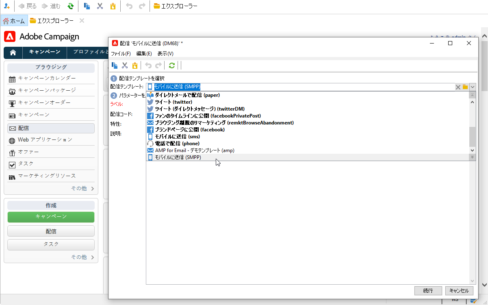
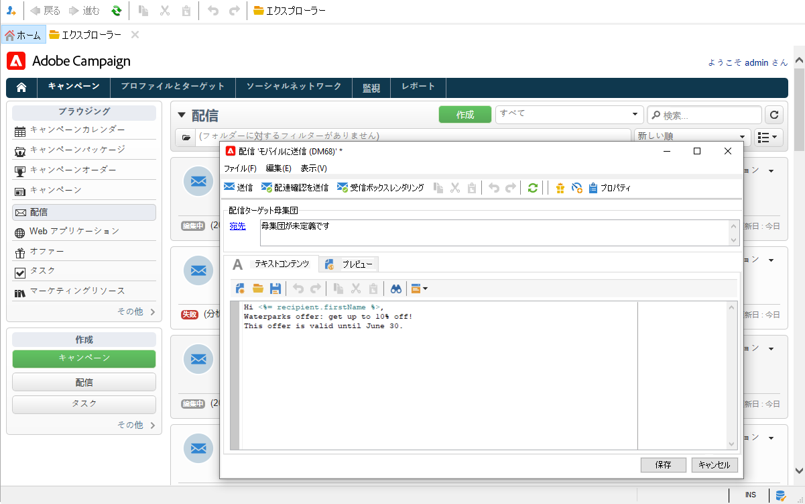
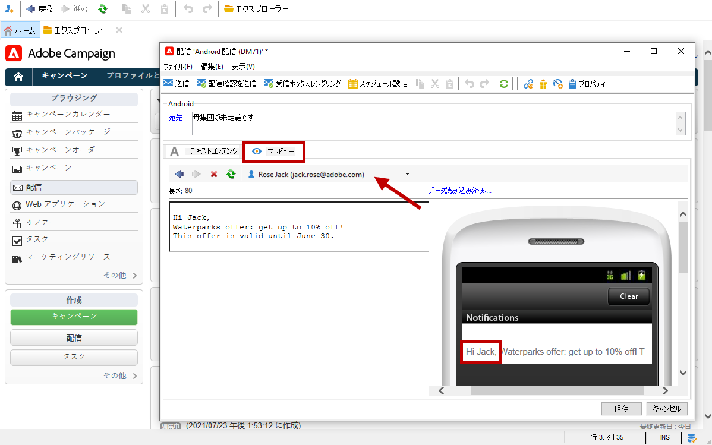

# SMS の作成と送信

Adobe Campaign を使用すると、パーソナライズされた SMS メッセージを送信できます。

[!DNL :arrow_upper_right:]  [Campaign Classicv7のドキュメントでSMSチャネルの使用を開始する方法を説明します](https://experienceleague.adobe.com/docs/campaign-classic/using/sending-messages/sending-messages-on-mobiles/sms-channel.html?lang=ja)

>[!NOTE]
>
>Adobe Campaignでは、 **Adobe Campaignモバイルアプリチャネル(NMAC)**&#x200B;オプションを使用して、モバイルにプッシュ通知を送信することもできます。 詳細については、[この節](push.md)を参照してください。

## SMS チャネルの設定

携帯電話に送信するには、次が必要です。

* コネクタとメッセージのタイプを指定する外部アカウント。

* この外部アカウントの参照元となる配信テンプレート。

[!DNL :arrow_upper_right:]   [Campaign Classicv7のドキュメントでSMSチャネルを設定する方法を説明します](https://experienceleague.adobe.com/docs/campaign-classic/using/sending-messages/sending-messages-on-mobiles/sms-set-up.html?lang=ja#sending-messages)

SMS の送信を開始する前：

* 受信者プロファイルに少なくとも携帯電話番号が含まれていることを確認します。
* Adobe Campaign Classic の[配信のベストプラクティス](https://experienceleague.adobe.com/docs/campaign-classic/using/sending-messages/key-steps-when-creating-a-delivery/delivery-bestpractices/delivery-best-practices.html?lang=ja#sending-messages)を参照してください。これはキャンペーン v8 にも当てはまります。

また、SMS のプロトコルと設定についても熟知している必要があります。[このドキュメント](https://experienceleague.adobe.com/docs/campaign-classic/using/sending-messages/sending-messages-on-mobiles/sms-protocol.html?lang=ja#sending-messages)でAdobe CampaignとSMPPプロバイダーの間に設定された接続について説明します。

## 最初のSMS配信を作成する

1. 新しい配信を作成するには、「**[!UICONTROL キャンペーン]**」タブで「**[!UICONTROL 配信]**」をクリックし、既存の配信一覧の上部の「**[!UICONTROL 作成]**」ボタンをクリックします。

   

   [!DNL :arrow_upper_right:]配信の作成方法に関する全般的な情報については、[Campaign Classic v7 ドキュメント](https://experienceleague.adobe.com/docs/campaign-classic/using/sending-messages/key-steps-when-creating-a-delivery/steps-about-delivery-creation-steps.html?lang=ja#sending-messages)を参照してください。

1. SMS配信を送信するための、関連する外部アカウントを参照する配信テンプレートを選択します。

   

   [!DNL :arrow_upper_right:]  [Campaign Classicv7ドキュメントでSMPP外部アカウントを作成する方法を説明します](https://experienceleague.adobe.com/docs/campaign-classic/using/sending-messages/sending-messages-on-mobiles/sms-set-up.html?lang=en#creating-an-smpp-external-account)

   [!DNL :arrow_upper_right:] モバイルに配信する配信テンプレートを作成する方法については、 [Campaign Classicv7のドキュメントを参照してください。](https://experienceleague.adobe.com/docs/campaign-classic/using/sending-messages/sending-messages-on-mobiles/sms-set-up.html?lang=en#changing-the-delivery-template)

1. ラベル、コードおよび説明を設定して配信を識別します。

1. 「**[!UICONTROL 続行]**」をクリックして、メッセージ設定ウィンドウを確定して表示します。

1. 必要に応じて、パーソナライゼーションフィールドを含め、ウィザードの「**[!UICONTROL テキストコンテンツ]**」セクションにメッセージの内容を入力します。

   

1. ターゲット母集団の選択.

SMSを作成およびデザインするための主な手順については、Campaign Classicv7のドキュメントで詳しく説明しています。

* SMS の作成

   [!DNL :arrow_upper_right:] [SMS配信の作成方法を説明します](https://experienceleague.adobe.com/docs/campaign-classic/using/sending-messages/sending-messages-on-mobiles/sms-create.html?lang=en#sending-messages)

* SMSコンテンツのデザイン

   [!DNL :arrow_upper_right:] [SMSコンテンツの定義方法を説明します](https://experienceleague.adobe.com/docs/campaign-classic/using/sending-messages/sending-messages-on-mobiles/sms-create.html?lang=en#defining-the-sms-content)

* メールのオーディエンスを選択

   [!DNL :arrow_upper_right:] [ターゲット母集団の定義方法を学ぶ](https://experienceleague.adobe.com/docs/campaign-classic/using/sending-messages/key-steps-when-creating-a-delivery/steps-defining-the-target-population.html?lang=ja)

[!DNL :bulb:] オーディエンスを定義する手順について詳しくは、このペ [ージを参照してください](../start/audiences.md)。

## SMS をテストする

パーソナライゼーションを使用したメッセージのレンダリングを表示するには、「**[!UICONTROL プレビュー]**」をクリックし、受信者を選択します。

配達確認を送信するには、次のCampaign Classicv7ドキュメントの節を参照してください。

* 配信の検証と配達確認の送信
   [!DNL :arrow_upper_right:] [配信を検証するための主な手順を学ぶ](https://experienceleague.adobe.com/docs/campaign-classic/using/sending-messages/key-steps-when-creating-a-delivery/steps-validating-the-delivery.html?lang=ja)
* シードアドレスの追加
   [!DNL :arrow_upper_right:] [シードアドレスの詳細](https://experienceleague.adobe.com/docs/campaign-classic/using/sending-messages/using-seed-addresses/about-seed-addresses.html?lang=ja)

## SMS配信の送信および監視

SMSを送信および監視する主な手順については、Campaign Classicv7のドキュメントで詳しく説明しています。

* SMS 配信の送信、監視、追跡

   [!DNL :arrow_upper_right:] [SMSを送信、監視、および追跡するためのツールについて説明します](https://experienceleague.adobe.com/docs/campaign-classic/using/sending-messages/sending-messages-on-mobiles/sms-send.html?lang=en#sending-messages)
* SMS配信のトラブルシューティング

   [!DNL :arrow_upper_right:] [SMSのトラブルシューティングの詳細](https://experienceleague.adobe.com/docs/campaign-classic/using/sending-messages/sending-messages-on-mobiles/troubleshooting-sms.html?lang=en#sending-messages)
