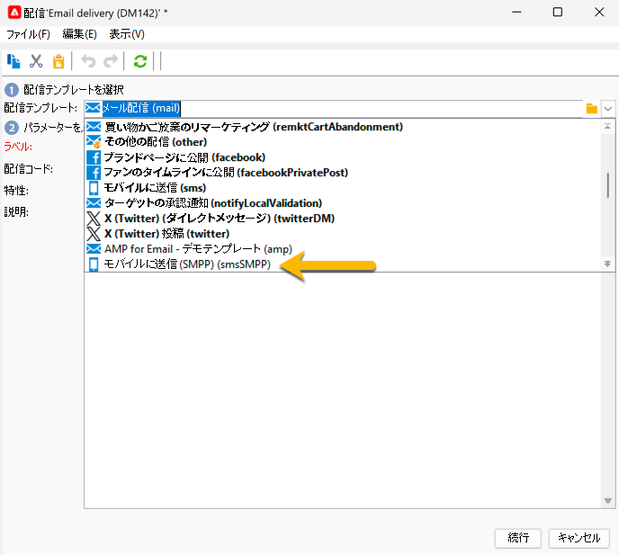
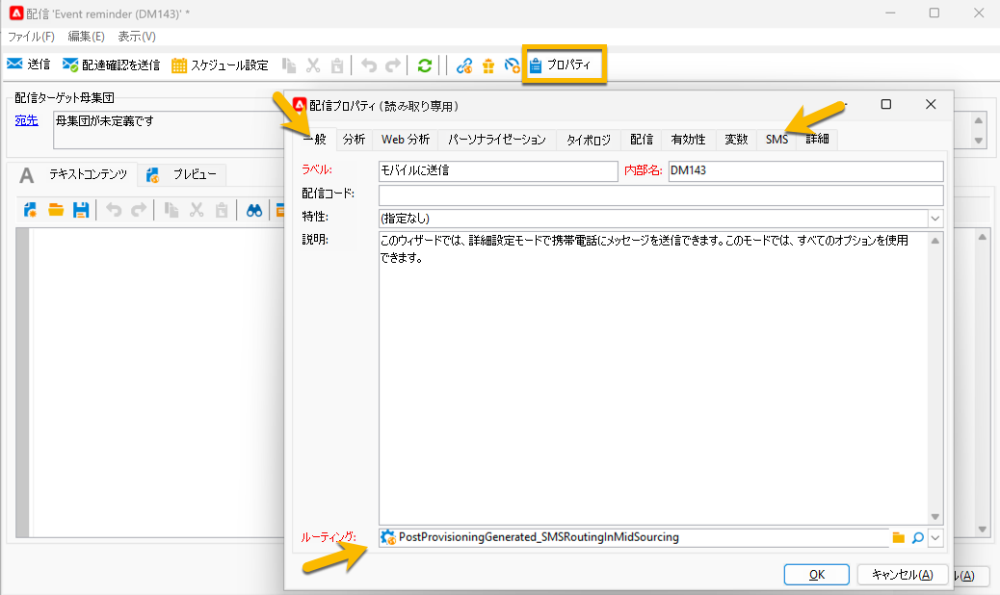

# 最初の SMS 配信の作成 {#sms-delivery}

新しい SMS 配信を作成するには、次の手順に従います。

1. 新しい配信を作成し、SMS 送信用に作成した [SMS 配信テンプレート](sms-mid-sourcing.md#sms-delivery-template)を選択します。

   {zoomable="yes"}

   配信の作成手順について詳しくは、[このページ](../../start/create-message.md)を参照してください。

<!-- * For standalone instance,  [learn more here](sms-standalone-instance.md#sms-delivery-template).
* For mid-sourcing infrastructure, -->

1. トラッキングに必要な場合は、「**[!UICONTROL ラベル]**」フィールドで配信の名前を変更し、「**[!UICONTROL 配信コード]**」フィールドと&#x200B;**[!UICONTROL 特性]**&#x200B;リストに情報を追加します。また、配信に&#x200B;**[!UICONTROL 説明]**&#x200B;を追加することもできます。

1. 「**[!UICONTROL 続行]**」ボタンをクリックします。これで、配信でのテンプレートのすべての設定が完了しました。

1. 「**[!UICONTROL プロパティ]**」ボタンで、すべてが必要に応じて設定されていることを確認できます。[詳しくは、「SMS」タブを参照してください](sms-delivery-settings.md#sms-tab)

   {zoomable="yes"}

1. 配信の[コンテンツを定義します](sms-content.md)。

1. [オーディエンスを選択します](sms-audience.md)。

オーディエンスを定義する手順について詳しくは、[こちらのページ](../../audiences/create-audiences.md)を参照してください。

## SMS の検証と送信 {#sms-validate}

配信を作成したら、次の手順に従います。

1. レンダリングとコンテンツを検証するための[配達確認を送信します](sms-proofs.md)。

1. 次に、[最終的なオーディエンスに送信します](sms-send.md)。

## SMS の監視と追跡 {#sms-monitor}

送信後、[SMS の監視および追跡方法について詳しくは、こちらを参照してください](sms-monitor.md)。
