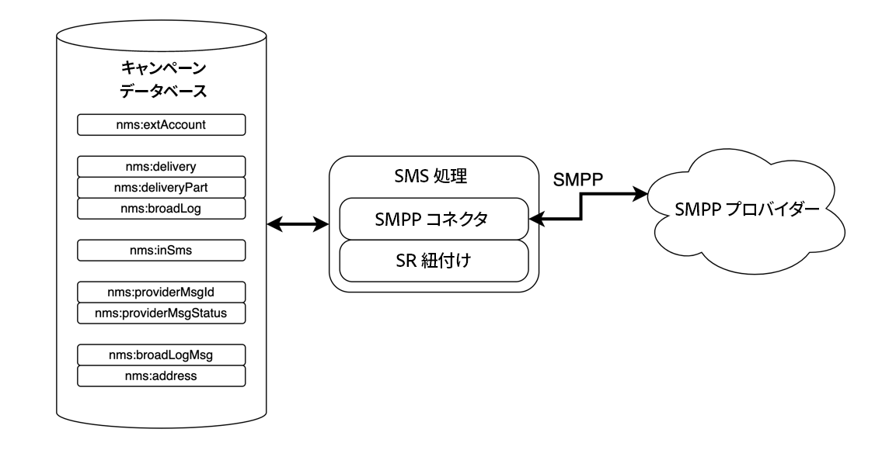
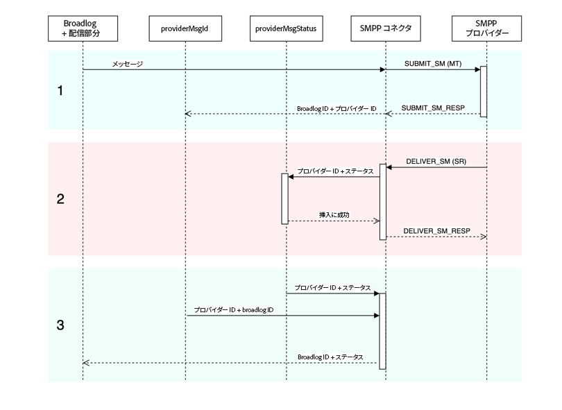

# SMPP コネクタの説明 {#smpp-connector-desc}

>[!IMPORTANT]
>
>Adobe Campaign v8.7.2 以降に適用されます。
>
>以前のバージョンについて詳しくは、[Campaign Classic v7 ドキュメント](https://experienceleague.adobe.com/ja/docs/campaign-classic/using/sending-messages/sending-messages-on-mobiles/sms-set-up/sms-set-up){target="_blank"}を参照してください。

## SMS コネクタのデータフロー {#sms-data-flow}

この節では、SMS プロセスによるデータの処理方法について説明します。

SMS プロセスと環境とのやり取りをまとめた、大まかなブロックダイアグラムを次に示します。

{zoomable="yes"}

SMS プロセスでは、SMPP プロバイダーとの通信を処理する SMPP コネクタ自体と、SR 紐付けのためのバックグラウンドタスクという 2 つの重要なコンポーネントをホストします。

### SMPP アカウントのデータフロー {#sms-data-flow-smpp-accounts}

SMS プロセスでは nms:extAccount をポーリングし、SMPP コネクタに新しい接続を生成して、各アカウントの設定を渡します。ポーリング頻度は、serverConf の *configRefreshMillis* 設定で調整できます。

アクティブな SMPP アカウントごとに、SMPP コネクタは常に接続をアクティブに維持しようとします。接続が失われた場合は、再接続します。

### メッセージの送信中のデータフロー {#sms-data-flow-sending-msg}

* SMS プロセスでは、nms:delivery をスキャンして、アクティブな配信を選択します。配信は、次の場合にアクティブになります。
   * メッセージを送信できる状態である
   * 有効期限が切れていない
   * 実際には配信である（例：テンプレートではなく、削除もされていない）
   * SMPP コネクタで、配信にリンクされた外部アカウントに対して 1 つ以上の接続を開くことができる
* 配信ごとに、SMS プロセスでは配信部分を読み込みます。配信部分が部分的に送信された場合、SMS プロセスでは、広範ログを確認して、既に送信されたメッセージを確認します。
* SMS プロセスでは、配信部分からのパーソナライゼーションデータを使用してテンプレートを展開します。
* SMPP コネクタは、コンテンツやその他の設定に一致する MT（SUBMIT_SM PDU）を生成します。
* SMPP コネクタは、トランスミッター（またはトランシーバ）接続を介して MT を送信します。
* プロバイダーは、この MT の ID を返します。nms:providerMsgId に挿入されます。
* SMS プロセスでは、広範ログを送信済みステータスに更新します。
* 最終的なエラーが発生した場合、SMS プロセスではそれに応じて広範ログを更新し、nms:broadLogMsg に新しい種類のエラーを作成する場合があります。

### SR の受信中のデータフロー {#sms-data-flow-sr}

* SMPP コネクタは、SR（DELIVER_SM PDU）を受信してデコードします。外部アカウントで定義された正規表現を使用して、メッセージ ID とステータスを取得します。
* メッセージ ID とステータスは nms:providerMsgStatus に挿入されます
* 挿入後、SMPP コネクタは DELIVER_SM_RESP PDU で応答します。
* プロセス中にエラーが発生した場合、SMPP コネクタは負の DELIVER_SM_RESP PDU を送信し、メッセージをログに記録します。

### MO の受信中のデータフロー {#sms-data-flow-mo}

* SMPP コネクタは、MO（DELIVER_SM PDU）を受信してデコードします。
* メッセージからキーワードが抽出されます。宣言されたキーワードと一致する場合、対応するアクションが実行されます。nms:address に強制隔離を更新するよう書き込む場合があります。
* カスタム TLV が宣言されている場合、それぞれの設定に従ってデコードされます。
* 完全にデコードおよび処理された MO は、nms:inSms テーブルに挿入されます。
* SMPP コネクタは DELIVER_SM_RESP PDU でを用いて応答します。エラーが検出された場合は、エラーコードがプロバイダーに返されます。

### MT と SR の紐付け中のデータフロー {#sms-reconciling-mt-sr}

* SR 紐付けコンポーネントは、nms:providerMsgId と nms:providerMsgStatus を定期的に読み取ります。両方のテーブルのデータが結合されます。
* 両方のテーブルにエントリがあるすべてのメッセージについて、一致する nms:broadLog エントリが更新されます。
* 新しい種類のエラーが検出された場合や、手動で選定されなかったエラーのカウンターを更新するために、nms:broadLogMsg テーブルがプロセスで更新される場合があります。

## MT、SR、broadLog エントリの照合 {#sms-matching-entries}

次のダイアグラムは、プロセス全体を表しています。

{zoomable="yes"}

**フェーズ 1**

* メッセージはスキャンされ、書式設定後に SMPP コネクタに送信されます。
* SMPP コネクタは、これを SUBMIT_SM MT PDU として書式設定します。
* MT は SMPP プロバイダーに送信されます。
* プロバイダーは SUBMIT_SM_RESP で応答します。SUBMIT_SM と SUBMIT_SM_RESP は、sequence_number によって一致します。
* SUBMIT_SM_RESP は、プロバイダーから受け取った ID を提供します。この ID は、広範ログ ID と共に nms:providerMsgId テーブルに挿入されます。

**フェーズ 2**

* プロバイダーは DELIVER_SM SR PDU を送信します。
* SR は解析され、プロバイダー ID、ステータスおよびエラーコードが抽出されます。このステップでは、抽出用正規表現を使用します。
* プロバイダー ID とそれに対応するステータスが nms:providerMsgStatus に挿入されます。
* すべてのデータがデータベースに安全に挿入されると、SMPP コネクタは DELIVER_SM_RESP で応答します。DELIVER_SM と DELIVER_SM_RESP は、sequence_number によって一致します。

**フェーズ 3**

* SMS プロセスの SR 紐付けコンポーネントは、nms:providerMsgId テーブルと nms:providerMsgStatus テーブルの両方を定期的にスキャンします。
* 両方のテーブルのいずれかの行に一致するプロバイダー ID がある場合、2 つのエントリは結合されます。これにより、広範ログ ID（providerMsgId に保存）とステータス（providerMsgStatus に保存）を一致させることができます。
* 広範ログは、対応するステータスに更新されます。

## アフィニティと専用プロセスコネクタ {#sms-affinities}

専用プロセスコネクタでは、アフィニティは無視され、SMS プロセス内でのみ実行されます。

## serverConf オプション {#sms-serverconf-options}

一部の設定は serverConf.xml で調整できます。このファイル内の他の設定と同様に、config-instance.xml ファイルで指定する必要があります。すべての設定は、&lt; mta2 > 要素内にあります。

次の表は、すべての設定をまとめたものです。最小／最大許容値では、ほとんどの場合に考慮する必要がある範囲を大まかに把握できます。デバッグ値は、パフォーマンスに関連しない問題を見つけようとする際に選択する値です。

| 設定 | 説明 | デフォルト | 最小許容値 | 最大許容値 | デバッグ値 |
|:-:|:-:|:-:|:-:|:-:|:-:|
| batchUpdateSize | 更新マイクロバッチのサイズ | 5000 | 100：非常に短い待ち時間 | maxWaitingMessages/updateThreads：この値を超えると、maxWaitingMessages によってバッファリングが制限されるので、役に立ちません。 | 1：マイクロバッチ処理を無効にし、メッセージを 1 つずつ更新します |
| configRefreshMillis | 設定の再読み込み期間（ミリ秒） | 10000 | pollPeriodMillis：短い待ち時間 | 600000：リロードに時間がかかりすぎてリソースを節約できません | 500：低い待ち時間により新しい設定をより早く試すことができます |
| deliveryPartRetryCount | 配信部分が再試行または延期される最大回数。注意：送信プロセスの再起動は再試行としてカウントされます。クラッシュも再試行としてカウントされる場合があります。 | 20 | 1：再試行を無効にします | 50：不安定なプロバイダーを回避するために、メッセージを永続的にします | 1：再試行を無効にします。1000：失敗したメッセージのフラッシュを回避します。 |
| deliveryPartRetryDelaySeconds | 配信部分を再試行するまでの最小遅延（クロスプロセスおよびクロスコンテナ）。遅延は秒単位です。 | 60 | 0：直ちに再試行します | 3600：非常に遅い再試行（各再試行の間に 1 時間） | 1：ビジー状態のログで再試行を簡単に実行できるようにします。 |
| logOutput | メインログ出力で監視およびプロファイルデータを送信します。 | true | false：スループットが少し向上する場合があります。お勧めしません。 | true：ログを有効にします。 | true |
| maxWaitingMessages | 一度に処理できるメッセージの最大数 | 50000 | 256：1 つの配信部分に十分 | 200000：SQL クエリの長さ（64k）によって制限されています | 1：メッセージを 1 つずつ処理します |
| pollPeriodMillis | 新規メッセージを確認するためのデータベースポーリング頻度（ミリ秒単位） | 2000 | 500：非常に低い待ち時間 | 10000：より大きなバッチ | 500：低い待ち時間によりデバッグが簡単になります。 |
| prepareThreads | メッセージ準備用のスレッド数 | 3 | 1：シングルスレッド | CPU の数。RAM の使用状況に注意してください。6 を超える値を増やすには、maxSMSMemoryMb、maxProcessMemoryAlertMb、maxProcessMemoryWarningMb を増やす必要がある場合があります | 1：シングルスレッドの場合は、よりクリーンなログが生成されます。 |
| profDeliveryStat | SMS プロセスの内部に関する様々な集計統計情報をログに記録します | true | false：スループットが少し向上する場合があります。お勧めしません。 | true：低い冗長ログ | true |
| profLogPerMessage | 各メッセージの各処理ステップをログに記録します | false | false：ログの冗長性を減らします。 | true：非常に高い冗長ログ。**絶対に必要な場合にのみ使用してください**。パフォーマンスに大きな影響があります。**十分なデータが収集されたらすぐにこの設定を無効にしてください**。 | true |
| providerIdScanPeriod | 新しいプロバイダー ID を紐付けるスキャン間隔（秒）。 | 10 | 1：低い待ち時間 | 60：より大きなバッチでスループットを向上します | 1：低い待ち時間は、メッセージ処理のデバッグに役立ちます。 |
| providerIdThreads | プロバイダー ID を紐付けるスレッド数。インスタンスごとに 1 スレッドで十分です。このコンテナで無効にするには、0 に設定します。 | 1 | 0：このコンテナでは無効にします | 1 | 1 |
| sendingThreads | 送信スレッド数 | 1 | 1：シングルスレッド | CPU の数。スレッドが多すぎると、通常はパフォーマンスが低下します。 | 1：シングルスレッドの場合は、よりクリーンなログが生成されます。 |
| updateThreads | データベースを更新するスレッド数 | 1 | 1：シングルスレッド | CPU の数。各スレッドでは、独自の DB 接続が作成されます。 | 1：シングルスレッドの場合は、よりクリーンなログが生成されます。 |
| verifyMode | メッセージの送信をシミュレートします。メッセージは実際には送信されません。デバッグに役立ちます | false | false | true | false：システムを通常どおり実行します。true：DB アクセスおよびメッセージ準備のみをテストします。 |
