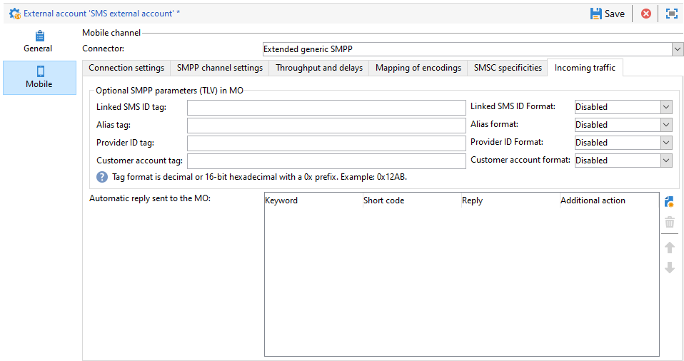

# SMPP 外部アカウント設定 {#smpp-external-account}

Adobe Campaign は、SMPP プロトコルを使用してサービスプロバイダーに SMS を送信します。

Adobe Campaign の SMS コネクタには、公式仕様と多少異なる傾向があるほとんどの SMPP プロバイダーとの互換性を保つことを目的に、その動作を調整できる多くのオプションが用意されています。

>[!IMPORTANT]
>
>* Adobe Campaign では、SMPP プロトコルバージョン 3.4 がサポートされています。
>
>* 新しいプロバイダーへの接続の設定には、技術的なスキル、TCP に関する知識、バイナリ、16 進表現、およびテキストエンコーディングが必要になる場合があります。プロバイダーとの積極的な協力も求められます。

SMS サービスプロバイダー側のネットワーク機器は、SMSC と呼ばれることが多いです。

## 接続設定 {#smpp-connection-settings}

{zoomable="yes"}

接続設定に必要なパラメーターとその役割は次のとおりです。

* **SMSC 実装名**：SMSC 実装の名前を設定します。プロバイダーの名前に設定する必要があります。このフィールドの役割は、SMPP エラー管理の節で説明しています。
* **サーバー**：接続先のサーバーの DNS 名または IP アドレス。
* **ポート**：接続先の TCP ポート。
* **アカウント**：接続のログイン。BIND PDU の system_id フィールドに渡されます。
* **パスワード**：SMPP 接続のパスワード。BIND PDU のパスワードフィールドに渡されます。
* **システムタイプ**：BIND PDU の system_type フィールドに渡される値。一部のプロバイダーでは、ここで特定の値が必要になります。
* **MTA 子接続の数**：送信スレッドごとに開く接続数を定義します。
接続の合計数は、次の数式を使用して計算できます。
  *合計接続数 = SMS プロセスの数 * 送信スレッドの数 * MTA 子接続の数*

   * 通常、SMS プロセスの数は 1 です。非常にパフォーマンスの高いインスタンスでは、複数の SMS プロセスが並行して開始されることがあります。
   * 送信スレッドの数は serverConf（sendingThreads 設定）で設定します。デフォルトは 1 です。
   * MTA 子接続の数は、外部アカウントのこの設定です。

  デフォルト値では、この設定によって接続数が直接設定されます。

**トランシーバモード**&#x200B;では、これは接続の合計数です。

**トランスミッター + レシーバーモード**では、トランスミッター + レシーバーのペアの数を定義します（1 つのペア = 1 つのトランスミッター + 1 つのレシーバー）。
トランスミッターとレシーバーのバランスを変える方法はありません。

* **専用プロセスを通じたメッセージの送信**：
Adobe Campaign v8.7.2 以降では、このオプションを常に有効にする必要があります。メッセージの処理方法に多くの影響があります。
* **SMPP 接続モード**：
接続をトランシーバモードまたは分離されたトランスミッター + レシーバーモードに設定します。
   * トランスミッター + レシーバー（または TX+RX）：メッセージの送受信には、2 つの異なる TCP 接続が使用されます。
   * トランシーバ（または TRX）：メッセージの送受信には、単一の TCP 接続が使用されます。
* **レシーバーに別のパラメーターを使用**：
トランスミッター + レシーバーモードでのみ使用できます。
このチェックボックスをオフにすると、トランスミッターとレシーバーに同じ設定が適用されます。チェックボックスをオンにすると、標準設定はトランスミッターにのみ適用され、レシーバー設定はレシーバーにのみ適用されます。
* **受信者サーバー、ポート、アカウント、パスワード、システムタイプ**
これらの設定は、トランスミッター + レシーバーモードの場合にレシーバーに適用されます。トランスミッター部分と同様に機能します。詳しくは、[上記](#smpp-connection-settings)を参照してください。
* **ログファイルの詳細 SMPP トレースを有効にする**
有効にすると、追加ログがログファイルに出力されます。これは、トラブルシューティングに非常に役立ちますが、トラブルシューティングが不要な場合、高スループットのインスタンスでは無効のままにする必要があります。

## SMPP チャネル設定 {#smpp-channel-settings}

{zoomable="yes"}

### 文字の表記変換を許可 {#smpp-transliteration}

文字の表記変換とは、不足している文字に相当する文字を見つける処理です。例えば、フランス語の「ê」（曲折アクセント記号付きの e）という文字は GSM エンコーディングには含まれていませんが、「e」に置き換えても可読性を過剰に損なうことはありません。

このチェックボックスをオフにすると、文字列をそのままエンコードできない場合、テキストエンコードは失敗します。

このチェックボックスをオンにすると、テキストエンコーディングは、失敗する代わりに、おおよそのバージョンに変換を試みます。ターゲットエンコーディングで相当する文字がない場合、テキストエンコーディングは失敗します。

エンコーディング処理の一般的な説明については、[エンコーディングの具体的なマッピングの定義設定](#mapping-encodings)を参照してください。

### ソース番号

メッセージのデフォルトのソースアドレスを定義します。この設定は、配信時にソース番号が空のままになっている場合にのみ適用されます。デフォルトでは、ソース番号フィールドは渡されないので、プロバイダーはショートコードの代わりにソース番号フィールドを使用します。

これにより、送信者アドレス／oADC 上書き機能が有効になります。

### ソース TON/NPI、宛先 TON/NPI

（SMPP 3.4 仕様の 5.2.5 節で説明されている）TON（番号のタイプ）と NPI（番号計画識別子）。これらの値は、プロバイダーのニーズに応じて設定する必要があります。

これらは、SUBMIT_SM PDU の source_addr_ton、source_addr_npi、dest_addr_ton、dest_addr_npi フィールドにそのまま送信されます。

### サービスタイプ

このフィールドは、SUBMIT_SM PDU の service_type フィールドにそのまま送信されます。プロバイダーの必要に応じてこれを設定します。

## スループットと遅延 {#smpp-delays}

{zoomable="yes"}

これらの設定は、SMPP チャネルのすべてのタイミングを制御します。一部のプロバイダーでは、メッセージレート、ウィンドウ、再試行タイミングを非常に正確に制御する必要があるので、これらの設定は、プロバイダーの処理能力と契約で示される条件に一致する値に設定する必要があります。

### 送信ウィンドウ

送信ウィンドウは、対応する SUBMIT_SM_RESP を待たずに送信できる SUBMIT_SM PDU の数です。

最大ウィンドウ数が 4 の送信例：

{zoomable="yes"}

送信ウィンドウは、ネットワークリンクの待ち時間が長い場合のスループットを向上させるのに役立ちます。ウィンドウの値は、SMS の数にリンクの待ち時間（秒単位）を掛けた値よりも大きくする必要があり、これによって、コネクタは SUBMIT_SM_RESP を待たずに次のメッセージを送信できるようになります。

ウィンドウが大きすぎると、接続に問題が発生した場合（まれなケース）に、より多くの重複メッセージが送信される可能性があります。また、ほとんどのプロバイダーは送信ウィンドウに対して非常に厳しい制限を適用しており、この制限を超えるメッセージを拒否します。

最適な送信ウィンドウ式の計算方法：

SUBMIT_SM と SUBMIT_SM_RESP の間の最大待ち時間を測定します。
この値（秒単位）を MT の最大スループットに掛けます。これにより、最適な送信ウィンドウの値が得られます。
例：MT の最大スループットに毎秒 300 個の SMS が設定されていて、SUBMIT_SM と SUBMIT_SM_RESP の間の平均待ち時間が 100 ミリ秒の場合、最適な値は 300×0.1 = 30 となります。

不明な点がある場合は、パフォーマンスの問題を回避するために、より大きなウィンドウを優先します。

### MT の最大スループット

1 秒あたりの最大 MT 数および 1 回の接続あたりの最大数。この設定は厳密に適用されるので、MTA はこの制限を超える速さでメッセージをプッシュすることはありません。この機能は、プロバイダーが精密なスロットルを必要とする場合に役立ちます。

総スループット制限を知るには、この数値に接続の総数を掛けます（上記の式を参照）。

0 は制限なしを意味し、MTA はできるだけ早く MT を送信します。

この制限を超えて正確なスループットを保証するには、最終的なアーキテクチャで適切にベンチマークテストを行い、特定の要件を満たす SMPP プロバイダーを持つ必要があるため、一般的にはこの設定を 1000 未満に保つことが推奨されます。ただし、接続数を 1000 MT 以上に増やした方が良い場合もあります。

### 再接続までの時間

TCP 接続が失われた場合、コネクタは、この秒数の間待機してから接続を試みます。

### MT の有効期間

これは、SUBMIT_SM と一致する SUBMIT_SM_RESP の間のタイムアウトです。RESP を時間どおりに受信しない場合、メッセージは失敗と見なされ、MTA のグローバル再試行ポリシーが適用されます。

### バインドのタイムアウト

TCP 接続試行と BIND_*_RESP 応答の間のタイムアウト。タイムアウトした場合、接続は Campaign コネクタによって閉じられ、再試行する前に、一定時間待機してから再接続を行います。

### enquire_link 期間

enquire_link は、接続を有効に保つために送信される特別な種類の PDU です。この期間は秒単位です。キャンペーンコネクタは、帯域幅を節約するために、接続がアイドル状態の場合にのみ enquire_link を送信します。この期間の 2 倍が経過しても RESP を受信しない場合、接続が切断したと見なされ、再接続プロセスがトリガーされます。

## エンコードのマッピング {#mapping-encodings}

テキストエンコーディングについて詳しくは、[SMS テキストエンコーディング](sms-channel.md#sms-text-encoding)の節を参照してください。

この設定により、仕様とは異なるカスタムエンコーディングマッピングを定義できます。エンコーディングのリストと data_coding 値を宣言できます。MTA は、リスト内の最初のエンコードを使用してエンコードを試みます。失敗した場合は、リスト上で次のエンコーディングを使用しようとします。メッセージのエンコードにエンコーディングを使用できない場合は、エラーが発生します。エンコーディングが見つかると、MTA はエンコードされたテキストと SUBMIT_SM PDU フィールドを作成し、テーブルで指定された値を使用して data_coding フィールドを設定します。

テーブル内の項目の順序は重要です。エンコーディングは上から下へ試行します。最も費用のかからないエンコーディング、または最も推奨されるエンコーディングをリストの上部に配置し、続けて高価な（またはあまり望ましくない）エンコーディングを配置する必要があります。

UCS-2 は、Campaign でサポートされるすべての文字をエンコードできるので、失敗しません。UCS-2 SMS の最大長は非常に短い（70 文字のみ）ことに注意してください。

また、マッピングテーブルで 1 行だけ宣言することで、この設定を使用すると、特定のエンコーディングを常に使用するように強制できます。

チェックボックスがオフの場合に使用されるデフォルトのマッピングは、次の表と同じです。

| data_coding | エンコード |
|:-:|:-:|
| 0 | GSM |
| 8 | UCS-2 |

つまり、MTA は GSM でメッセージのエンコードを試みますが、成功した場合は、data_coding を 0 に設定して送信します。

メッセージを GSM でエンコードできない場合、UCS-2 でエンコードされ、data_coding が 8 に設定されます。

## SMSC 特異性 {#smsc-specificities}

{zoomable="yes"}

### message_payload を有効化

このオプションをオフにすると、長い SMS は MTA によって分割され、UDH と共に複数の SUBMIT_SM PDU に送信されます。メッセージは、UDH データに従って携帯電話によって再構成されます。

このオプションをオンにすると、長い SMS が 1 つの SUBMIT_SM PDU に送信され、message_payload オプションフィールドにテキストが入力されます（詳しくは、SMPP 仕様を参照）。

この機能が有効になっている場合、Campaign は SMS パーツを個別にカウントできません。すべてのメッセージは、1 つのパーツで送信済みとしてカウントされます。

### 完全な電話番号を送信

このチェックボックスをオフにすると、電話番号の数字のみがプロバイダーに送信されます（SUBMIT_SM フィールドの destination_addr フィールド）。これは、国際番号インジケータ（通常は + 接頭辞）が SMPP の TON フィールドと NPI フィールドに置き換えられるので、デフォルトの動作です。

このチェックボックスをオンにすると、電話番号はそのまま送信され、前処理（および潜在的なスペース、+ 接頭辞またはシャープ／ハッシュ／スター記号）は含まれません。

この機能は、自動返信強制隔離機能の動作にも影響します。チェックボックスがオフの場合、強制隔離テーブルに挿入される電話番号に + 接頭辞が追加され、SMPP プロトコル自体によって電話番号から + 接頭辞が削除されるのを補正します。

### TON／NPI のバインド

（SMPP 3.4 仕様の 5.2.5 節で説明されている）TON（番号のタイプ）と NPI（番号計画識別子）。これらの値は、プロバイダーのニーズに応じて設定する必要があります。

これらは、BIND PDU の addr_ton フィールドと addr_npi フィールドにそのまま送信されます。

### アドレス範囲

BIND PDU の address_range フィールドにそのまま送信されます。この値は、プロバイダーのニーズに応じて設定する必要があります。

### 無効な ID 確認数

1 つの SR に対して送信できる「無効なメッセージ ID」DELIVER_SM_RESP の数を制限します。**これは、トラブルシューティングの目的で、回避策として使用し**、通常の状態では 0 に設定する必要があります。

詳細な説明：例えば、2 に設定する場合：

* プロバイダーは、ID が「1234」の SR（DELIVER_SM）を送信します。
* ID「1234」はデータベースで見つかりませんでした。
* コネクタは、その ID に対して「無効な ID」エラーを 1 にカウントするので、「メッセージ ID が無効です」エラーコード（通常の動作）と共に DELIVER_SM_RESP を送信します。
* プロバイダーは、ID が「1234」の同じ SR を再試行します。
* ID「1234」はやはりデータベースで見つかりませんでした。
* コネクタは、その ID に対して「無効な ID」エラーを 2 とカウントするので、正しく処理されなかった場合でも DELIVER_SM_RESP「OK」を送信します。

この機能は、無効な SR によって処理できない正当なメッセージがブロックされた場合に、プロバイダー側の SR バッファをフラッシュするために使用されます。

このフィールドを 0 に設定すると、「メッセージ ID が無効です」が常に返されるメカニズムが無効になります。これは通常の動作です。

このフィールドを 1 に設定すると、ID が無効であってもコネクタは常に「OK」を返します。これは、プロバイダー側の問題からの回復など、トラブルシューティングを行う場合に最小限の時間で、監視下で使用する場合にのみ 1 に設定する必要があります。

### SR に含まれている ID の抽出用正規表現

SR 形式は、SMPP プロトコル仕様に厳密には適用されません。これは、仕様書の付録 B で説明されている推奨事項にすぎません。このため、一部の SMPP 実装者は、このフィールドに異なる形式を使用するので、Campaign は、正しいフィールドを抽出する方法が必要です。

デフォルトでは、「id:」の後に最大 10 文字の英数字を取り込みます。

正規表現には、（括弧内に一部を含む）キャプチャグループが 1 つだけ必要です。ID に対応する部分は括弧で囲む必要があります。正規表現の形式は PCRE です。

この設定を調整する場合は、誤ったトリガーを避けるために、できる限り多くのコンテキストを含めてください。（標準に「id:」のような）特定の接頭辞がある場合は、正規表現に含めます。また、単語の途中でテキストが取り込まれないように、できる限り単語区切り文字（\b）を使用します。

正規表現に十分なコンテキストを含めないと、セキュリティ上の軽微な欠陥が生じる可能性があります。メッセージの実際の内容は、SR に含めることができるので、（UUID など）コンテキストのない特定の ID 形式のみが一致する場合、ID の代わりに、実際のテキストコンテンツ（テキストフィールドに埋め込まれた UUID など）が解析される可能性があります。

### SR に含まれているステータスの抽出用正規表現

この正規表現では、SR メッセージのテキストフィールドからステータスを取り込みます。

デフォルトでは、「stat:」の後の 5～15 文字を取り込みます。

正規表現には、（括弧内に一部を含む）**キャプチャグループが 1 つだけ**&#x200B;必要です。ステータスに対応する部分は括弧で囲む必要があります。正規表現の形式は PCRE です。

### 成功ステータスを判別するために適用された正規表現

この正規表現は、以前の正規表現（「ステータスの抽出用正規表現」）の結果に適用されます。正規表現が一致する場合、メッセージは成功と見なされます。

デフォルトでは、「DELIV」で始まるすべてに一致します。これは、標準値「DELIVRD」に一致します。

### エラーステータスを判別するために適用された正規表現

この正規表現は、以前の正規表現（「ステータスの抽出用正規表現」）の結果に適用されます。正規表現が一致する場合、メッセージはエラーと見なされます。

デフォルトでは、仕様に記載されている様々なエラーステータスすべてに一致します。

### SR に含まれているエラーコードの抽出用正規表現

この正規表現は、SR メッセージのテキストフィールドからエラーコードを取り込みます。

エラーコードは、配信ログの検証で検証できます。

デフォルトでは、「err:」の後の 3 文字を取り込みます。

### MT 受信確認の ID 形式

これは、SUBMIT_SM_RESP PDU の message_id フィールドに返される ID の形式を示します。

* **変更しない**：ID は、ASCII エンコードされたテキストとして、そのままデータベースに保存されます。前処理やフィルタリングはおこなわれません。
* **10 進数**：ID は、ASCII 形式の 10 進数である必要があります。この設定を使用すると、先頭と末尾の空白文字と先頭の 0 が削除されます。
* **16 進数**：ID は ASCII 形式の 16 進数です。先頭に 0x および末尾に h を付けません。その後、ID を 10 進数に変換してから、データベースに保存します。
* **16 進文字列**：ID は、ASCII エンコードされたテキストで、16 進数でエンコードされたバイト数の文字列である必要があります。例えば、PDU に 0x34 0x31 0x34 0x32 0x34 0x33 があるとします。これは ASCII「414243」に変換された後、この文字列が 16 進数のバイト文字列としてデコードされ、「ABC」が返されます。その結果、ID「ABC」をデータベースに格納します。

### SR の ID の形式

これは、SR で ID の抽出用正規表現によって取り込まれる、ID の形式を示します。値は同じ意味を持ち、上記の MT の形式と同じ動作をします。

### オプションフィールドの SR ID またはエラーコード

このオプションを選択すると、上記の正規表現で処理されるテキストにオプションフィールドのコンテンツが追加されます。テキストは「0xTAG:VALUE」の形式です。0xTAG は大文字のタグの 4 桁の 16 進値です（0x002E など）。

例えば、receipted_message_id フィールドに ID を取り込むとします。この場合、このチェックボックスを有効にすると、次のテキストがステータスに追加されます。

0x001E:05e3299e-8d37-49d0-97c6-8e4fe60c7739

この例では、0x001E がオプションのフィールドのタグで、UUID がフィールドの値です。

この値を取り込むために、SR フィールドの ID の抽出正規表現に次の正規表現を設定できます。

\b0x001E:([0-9a-f]{8}-[0-9a-f]{4}-[0-9a-f]{4}-[0-9a-f]{4}-[0-9a-f]{12})\b

>[!IMPORTANT]
>
>8 ビットテキスト（ASCII/UTF-8）値を持つオプションのフィールドのみ取得できます。特に、現在の正規表現システムでは、バイナリフィールドを確実に取り込むことはできません。

### テキストフィールドの SR ID またはエラーコード

このオプションを選択すると、テキストフィールドは、SR のステータステキストの処理中に保持されます。これは、プロバイダーが ID やステータスなど、重要なデータをこのフィールドに配置する場合に役立ちます。通常、このフィールドは ASCII 以外のエンコードのテキストが含まれて正規表現の処理に支障が生じる場合があるので、安全に破棄できます。

SR フィールドに含まれている ID の抽出正規表現が十分に具体的でない場合、このオプションを有効にすると、セキュリティ上の軽微な欠陥が生じる可能性があります。テキストフィールドの内容は ID として解析され、攻撃者が偽造 ID の挿入に使用する場合があります。これにより、部分的なサービス拒否状況が発生する可能性があります。

### サービス ID タグ

カスタム TLV を追加できます。このフィールドは、16 進値（**0x1234** の形式）で渡されるタグを設定します。

カスタム TLV の値は、配信の詳細パラメーターにある「サービスまたはプログラム ID」フィールドで配信に設定する必要があります。この値は、UTF-8 でエンコードされたテキストとして送信されます。

この設定では、メッセージごとに 1 つの TLV オプションのみを追加できます。

>[!NOTE]
>
>このオプションは、配信パラメーターで、より強力な&#x200B;**オプションの SMPP パラメーター（TLV）**&#x200B;設定に置き換えられます。これらの機能は、相互に排他的で、同時に使用できません。

### TLS over SMPP を有効にする

有効にすると、SMSC へのすべての接続が TLS を使用して暗号化されます。

### 証明書の検証

* **証明書の完全な検証**：接続時に TLS 証明書とリモートホスト名を確認します。この値は、最高レベルのセキュリティを提供します。
* **ホスト名の検証をスキップ**：リモート TLS 証明書を確認しますが、リモートホスト名が一致するかどうかは確認しません。セキュリティがわずかに低下します。
* **証明書の検証をスキップ**：TLS 証明書の確認は一切行いません。接続は引き続き暗号化されていますが、中間者攻撃に対して脆弱です。セキュリティが大幅に低下します。

## 受信トラフィック {#incoming-traffic}

{zoomable="yes"}

### MO のオプション SMPP パラメーター (TLV)

Campaign では、MO（nms:inSms テーブル）で 3 つの追加フィールド（リンクされた SMS、エイリアス、大規模アカウント）を受信できます。SMPP コネクタを使用すると、これらのフィールドには、任意のオプション SMPP パラメーター（TLV）から取得したデータを任意の共通形式で入力できます。

各フィールドに対して、関連するタグとその形式を設定できます。この情報について詳しくは、SMPP サービスプロバイダーにお問い合わせください。

* タグ：10 進数形式（例：12345）または 0x 接頭辞が付いた 16 進数形式（例: 0x12ab）のいずれかのタグの値。タグには 0～65535 の範囲を指定できます。
* 形式：値に使用される形式。バイナリ値はすべて、ビッグエンディアンの符号付きバイナリ値です。テキストフィールドの場合は、SMPP プロバイダーで使用されるエンコーディングを選択します。

>[!NOTE]
>
>**顧客アカウント** フィールドが空のままの場合は、ショートコードに置き換えられます。

### MO に送信された自動返信

この機能を使用すると、MO にすばやくテキストを返信し、ショートコードごとのブロックリストを処理できます。

*キーワード*&#x200B;列と&#x200B;*ショートコード*&#x200B;列は、自動応答をトリガーする条件を定義します。両方のフィールドが一致する場合、MO が送信され、追加のアクションがトリガーされます。ワイルドカードを指定するには、フィールドを空のままにします。キーワードは、MO テキストの最初の英数字の単語と照合します。句読点や先頭のスペースは無視します。つまり、キーワードフィールドにスペースを含めることはできず、1 つの単語である必要があります。

また、*キーワード*&#x200B;設定は接頭辞です。例えば、「AD」を指定した場合、「AD」、「ADAPT」および「ADOBE」と一致します。共通の接頭辞を持つ複数のキーワードがある場合は、キーワードは上から下に順に処理されるので、順序に注意してください。

*返信*&#x200B;列は返信するテキストです。このフィールドでは個人設定を使用できません。返信テキストは常に同じになります。このフィールドを空のままにすると、メッセージは返信されませんが、追加のアクションはトリガーされます。

*追加のアクション*&#x200B;列は、キーワードとショートコードの両方が一致した場合に、追加のアクションを提供します（空のショートコードはすべてのショートコードと一致します）。現在、強制隔離に送信したり、強制隔離から削除したりできます。追加のアクションを指定し、返信フィールドを空のままにした場合、アクションは実行されますが、返信は送信されません。強制隔離は、指定したショートコードに対してのみ、またはすべてのショートコード（フィールドが空の場合）に適用されます。

テーブル内のすべてのエントリは、1 つのルールが一致するまで、指定された順序で処理されます。複数のルールが 1 つの MO に一致する場合、最上位のルールのみが適用されます。

>[!NOTE]
>
>「**完全な電話番号を送信**」設定は、自動返信強制隔離メカニズムの動作に影響します。「完全な電話番号を送信」がオフの場合、強制隔離に入力した電話番号には、国際電話番号の形式と互換性を持たせるために、接頭辞としてプラス記号（「+」）が付きます。

>[!NOTE]
>
>ミッドソーシングアーキテクチャでは、拡張された SMPP コネクタに自動応答を適用するには、外部アカウントフォルダーで中間オペレーターの書き込みアクセス権を追加する必要があります。

>[!IMPORTANT]
>
>特にコピー＆ペーストする場合は、自動返信のエンコーディングに注意してください。ワードプロセッサソフトウェアでは、改行不可スペースを追加したり、引用符をアポストロフィに変更したりするなど、余分な書式設定を追加する傾向があります。
