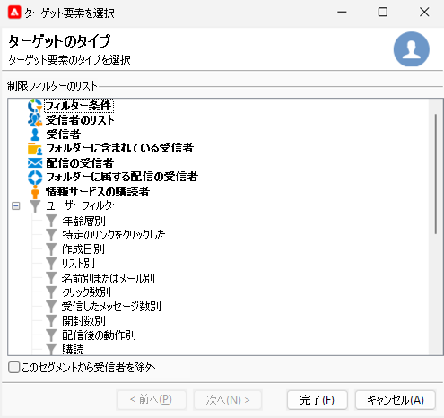
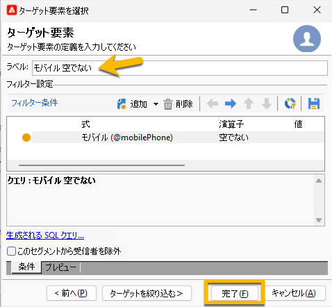
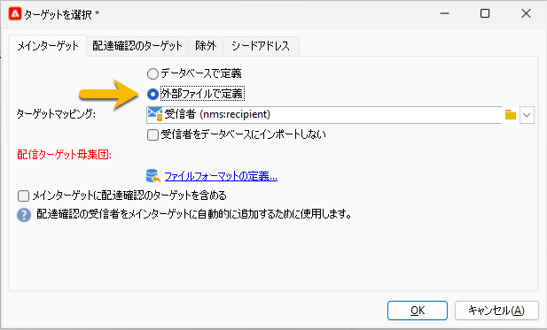

# SMS 配信のオーディエンスの選択 {#sms-audience}

オーディエンスを選択する前に、[オーディエンスについて詳しくは、こちらを参照してください](../../audiences/gs-audiences.md)。

ほとんどの場合、配信のメインターゲットは Adobe Campaign データベースから抽出されます（デフォルトモード）。ただし、オーディエンスは、外部ファイルに保存することもできます。[詳しくは、この節を参照してください](#external-audience)。

## Adobe Campaign のオーディエンス

配信のオーディエンスを選択するには、次の手順に従います。

1. 配信エディターで、**[!UICONTROL 宛先]**&#x200B;リンクをクリックします。**[!UICONTROL ターゲットを選択]**&#x200B;ウィンドウが開きます

1. オーディエンスは Adobe Campaign データベースに保存されるので、「**[!UICONTROL メインターゲット]**」タブで「**[!UICONTROL データベースで定義]**」オプションを選択します。

   {zoomable="yes"}

1. ドロップダウンリストで「**[!UICONTROL ターゲットマッピング]**」を選択します。Adobe Campaign のデフォルトターゲットマッピングは受信者で、**[!UICONTROL nms:recipient]** スキーマに基づきます。

   他のターゲットマッピングも使用でき、一部のターゲットマッピングは特定の設定に関連付けることができます。ターゲットマッピングについて詳しくは、[ターゲットマッピングの操作](../../audiences/target-mappings.md)を参照してください。

1. 「**[!UICONTROL 追加]**」ボタンをクリックし、制限フィルターを定義します。

   次に、適用するフィルターのタイプを選択します。

   {zoomable="yes"}

   使用するターゲットタイプを選択し、「**[!UICONTROL 次へ]**」ボタンをクリックします。

   次のターゲットタイプがデフォルトで用意されています。

   * **[!UICONTROL フィルター条件]**：クエリを定義して結果を表示できます。
   * **[!UICONTROL 受信者のリスト]**：オーディエンスを含む準備したリストを選択できます
   * **[!UICONTROL 受信者]**：テーブル内の受信者を直接選択できます。
   * **[!UICONTROL フォルダーに含まれている受信者]**：エクスプローラーのナビゲーションツリーでフォルダーを選択できます
   * **[!UICONTROL 配信の受信者]**：以前の配信のオーディエンスを選択できます
   * **[!UICONTROL フォルダーに属する配信の受信者]**：特定のフォルダー内のすべての配信のオーディエンスを選択できます
   * **[!UICONTROL 情報サービスの購読者]**：このオプションでは、作成する配信のターゲットとなる受信者が購読する必要のあるニュースレターを選択できます。
   * **[!UICONTROL ユーザーフィルター]**：定義済みフィルターを使用できます。

   「**[!UICONTROL このセグメントから受信者を除外]**」オプションを使用すると、定義したターゲット基準を満たさない受信者をターゲットにすることができます。これを使用するには、適切なボックスを選択し、事前に定義した、該当するプロファイルを除外するためのターゲティングを適用します。

1. ラベルフィールドにオーディエンスの名前を入力し、「**[!UICONTROL 終了]**」ボタンをクリックしてオーディエンスを検証します。

   {zoomable="yes"}

   「**[!UICONTROL 追加]**」ボタンをもう一度クリックすると、必要な数だけターゲット母集団を追加できます。また、ラベルの後にある「X」をクリックして、一部のラベルを削除することもできます。

## 外部ファイルのオーディエンス {#external-audience}

Adobe Campaign を使用すると、データベースではなく、外部ファイルに存在するオーディエンスに配信を送信できます。

その手順を次に示します。

1. 配信エディターで、**[!UICONTROL 宛先]**&#x200B;リンクをクリックします。**[!UICONTROL ターゲットを選択]**&#x200B;ウィンドウが開きます

1. 「**[!UICONTROL 外部ファイルで定義]**」オプションを選択します。

   {zoomable="yes"}

1. デフォルトでは、受信者はデータベースにインポートされます。この場合は、「**[!UICONTROL ターゲットマッピング]**」を選択する必要があります。ターゲットマッピングについて詳しくは、[ターゲットマッピングの操作](../../audiences/target-mappings.md)を参照してください。

   それ以外の場合は、「**[!UICONTROL 受信者をデータベースにインポートしない]**」を選択することもできます。

1. ファイルをインポートする場合は、**[!UICONTROL ファイルフォーマットの定義...]** リンクをクリックし、外部ファイルを選択して設定します。

1. 「**[!UICONTROL 終了]**」ボタンをクリックして、オーディエンスを検証します。
