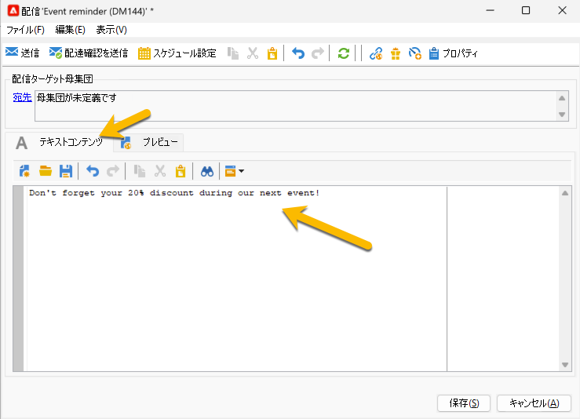
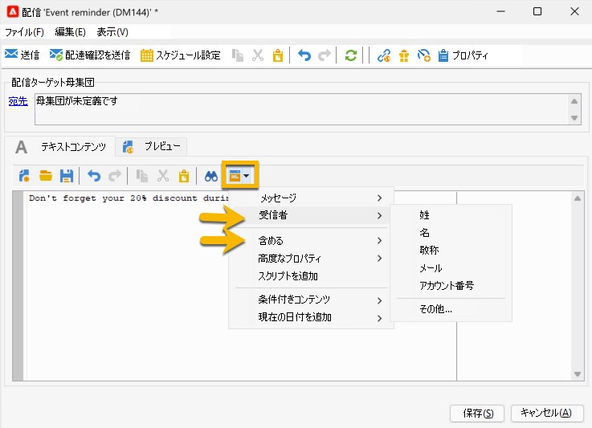
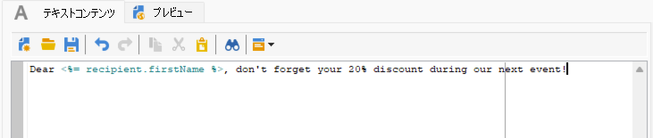
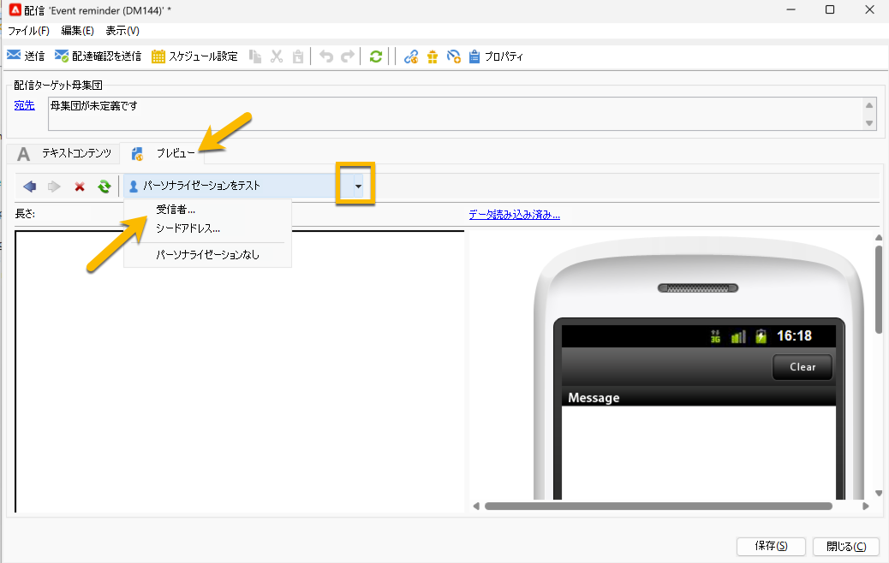
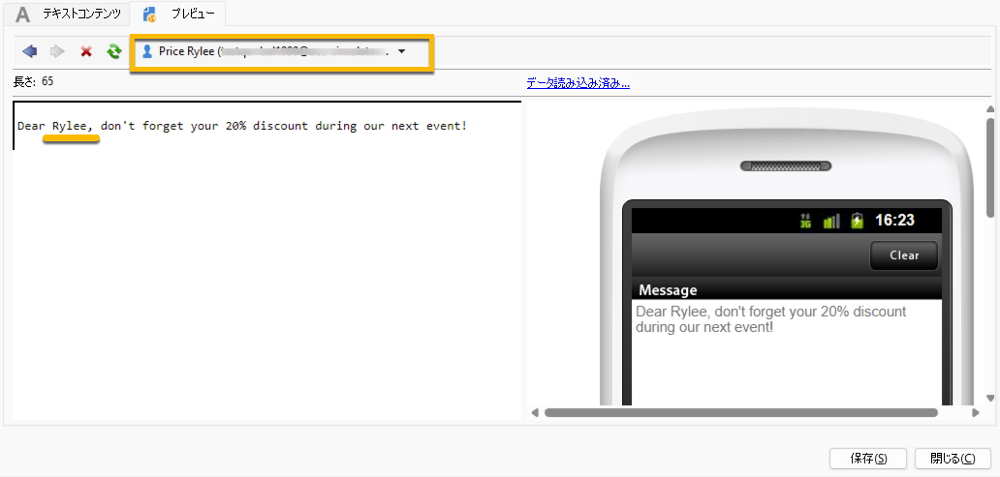

# SMS コンテンツ {#sms-content}

SMS 配信のコンテンツを設定するには：

1. **[!UICONTROL テキストコンテンツ]**&#x200B;ウィザードにメッセージのコンテンツを入力します

   {zoomable="yes"}

1. パーソナライゼーションフィールド（名の追加など）を挿入することや、定義済みのパーソナライゼーションブロック（挨拶の追加など）を挿入することで、メッセージをパーソナライズできます。パーソナライゼーションボタンをクリックすると、次の項目を追加できます。

   {zoomable="yes"}

   **[!UICONTROL 受信者]**／**[!UICONTROL 名]**&#x200B;をクリックすると、次のようなパーソナライゼーションが表示されます。

   {zoomable="yes"}

1. 「**[!UICONTROL プレビュー]**」タブに移動し、**[!UICONTROL パーソナライゼーションをテスト]**&#x200B;ドロップダウンリストをクリックして、**[!UICONTROL 受信者]**&#x200B;テーブルで受信者を選択することで、配信をプレビューできます。

   {zoomable="yes"}

   パーソナライゼーションを行った SMS の次のプレビューが表示されます。

   {zoomable="yes"}

>[!NOTE]
>
>* SMS メッセージの文字数には制限があり、Latin-1（ISO-8859-1）コードページを使用する場合は 160 字以内です。メッセージが Unicode で作成されている場合、上限は 70 文字です。また、使用する文字によってメッセージの長さ制限が変化することがあります。メッセージの長さについて詳しくは、[SMS 文字の表記変更について](smpp-external-account.md#smpp-channel-settings)の節を参照してください。
>
>* パーソナライゼーションフィールドまたは条件付きコンテンツが含まれる場合、メッセージのサイズは受信者によって異なります。メッセージの長さはパーソナライゼーションを適用した後の状態で評価する必要があります。
>
>*分析を開始すると、メッセージの長さがチェックされ、制限を超える場合は警告が表示されます。

配信のコンテンツを作成したら、[オーディエンスを選択](sms-audience.md)できます。
