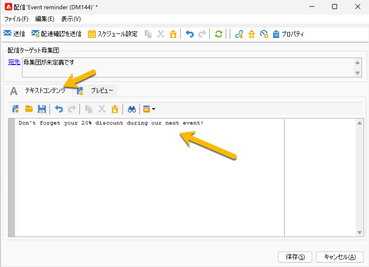
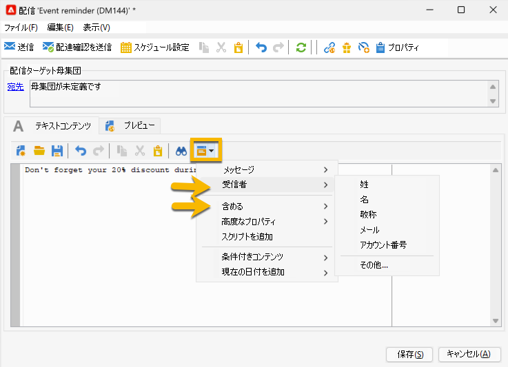
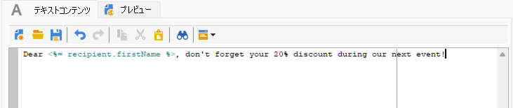
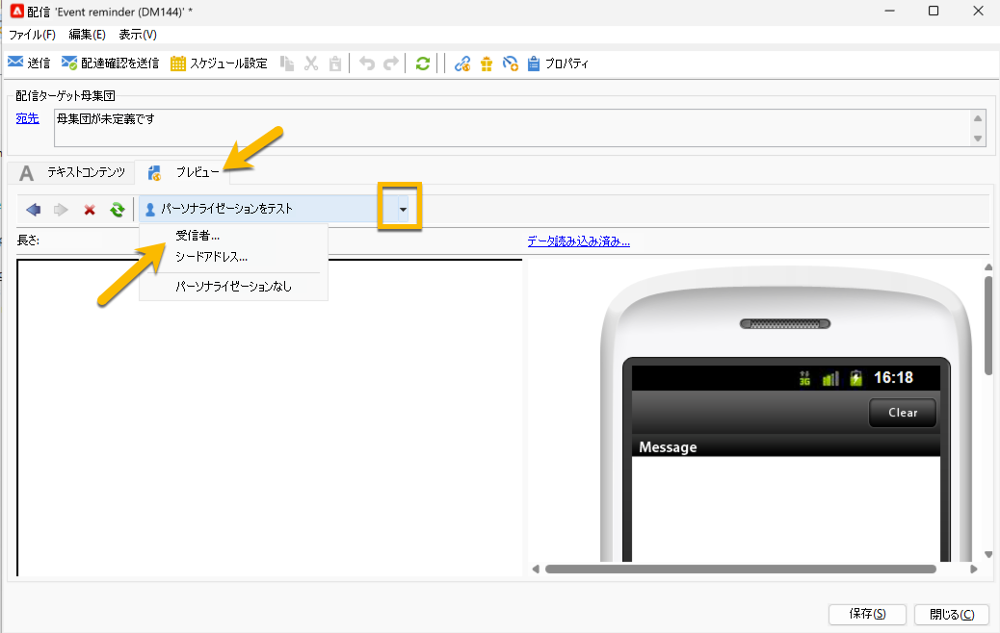
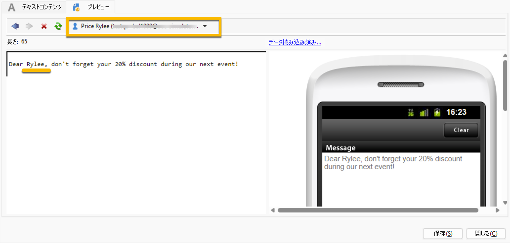

# SMS コンテンツの定義 {#sms-content}

SMS 配信のコンテンツを設定するには：

1. 「**[!UICONTROL テキストコンテンツ]**」タブにメッセージのコンテンツを入力します。

   {zoomable="yes"}

1. パーソナライゼーションフィールド（名の追加など）を挿入することや、定義済みのパーソナライゼーションブロック（挨拶の追加など）を挿入することで、メッセージをパーソナライズできます。 パーソナライゼーションボタンをクリックして、次の項目を追加します。

   {zoomable="yes"}

   例えば、**[!UICONTROL 受信者]**／**[!UICONTROL 名]**&#x200B;をクリックすると、SMS コンテンツが次のようにパーソナライゼーションフィールドで更新されます。

   {zoomable="yes"}

   Adobe Campaign のパーソナライゼーションについて詳しくは、[この節](../personalize.md)を参照してください。

1. 「**[!UICONTROL プレビュー]**」タブから配信コンテンツをプレビューできます。 パーソナライゼーション設定を確認するには、**[!UICONTROL パーソナライゼーションをテスト]**&#x200B;ドロップダウンリストをクリックし、受信者を選択します。

   {zoomable="yes"}

   パーソナライゼーションを行った SMS の次のプレビューを確認できます。

   {zoomable="yes"}

>[!NOTE]
>
>* SMS メッセージの文字数には制限があり、Latin-1（ISO-8859-1）コードページを使用する場合は 160 字以内です。 メッセージが Unicode で作成されている場合、上限は 70 文字です。 また、使用する文字によってメッセージの長さ制限が変化することがあります。 メッセージの長さについて詳しくは、[SMS 文字の表記変更について](smpp-external-account.md#smpp-channel-settings)の節を参照してください。
>
>* パーソナライゼーションフィールドまたは条件付きコンテンツが含まれる場合、メッセージのサイズは受信者によって異なります。 メッセージの長さはパーソナライゼーションを適用した後の状態で評価する必要があります。
>
>*分析を開始すると、メッセージの長さがチェックされ、制限を超える場合は警告が表示されます。

配信のコンテンツを作成したら、[オーディエンスを選択](sms-audience.md)できます。
