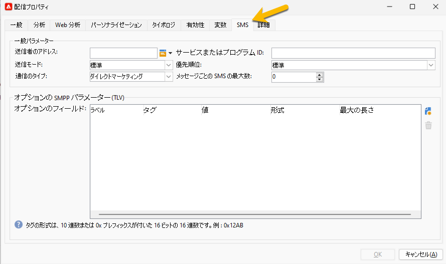

# SMS 配信設定 {#sms-settings}

>[!IMPORTANT]
>
>このドキュメントは、Adobe Campaign v8.7.2 以降を対象としています。
>
>以前のバージョンについて詳しくは、[Campaign Classic v7 ドキュメント](https://experienceleague.adobe.com/ja/docs/campaign-classic/using/sending-messages/sending-messages-on-mobiles/sms-set-up/sms-set-up)を参照してください。

SMS 配信に必要な技術的な設定を以下に示します。

* メッセージルーティング用の SMPP 外部アカウント。 [詳細情報](smpp-external-account.md#smpp-connection-settings)
* 「SMS」タブを設定します。 [詳細情報](#sms-tab)

これらすべてを配信テンプレートで設定すると、SMS 配信の作成ごとの設定を回避できます。

## 「SMS」タブの設定 {#sms-tab}

{zoomable="yes"}

このフォームに入力する必要がある情報を以下に示します。各フィールドについては、以下で説明します。

* **[!UICONTROL 送信者のアドレス]**

  このフィールドはオプションです。送信者アドレス（oADC）を上書きできます。このフィールドの内容は、SUBMIT_SM PDU の *source_addr* フィールドに配置されます。

  SMPP 仕様では、このフィールドの文字数が 21 文字に制限されていますが、プロバイダーによっては、これより長い値を使用できる場合があります。また、一部の国では、非常に厳しい制限（長さ、コンテンツ、許可される文字など）が適用される場合があるので、ここに配置したコンテンツが合法であることを再確認する必要があります。パーソナライズされたフィールドを使用する際は、特に注意する必要があります。

  このフィールドが空のままの場合は、代わりに外部アカウントで定義されたソース番号フィールドの値が使用されます。両方の値が空の場合、*source_addr* フィールドは空のままになります。

* **[!UICONTROL サービスまたはプログラム ID]**

  >[!NOTE]
  >
  >この機能の使用はお勧めしません。オプションの SMPP パラメーターにより、より柔軟な実装が可能になります。
  >
  >両方の機能を同時に使用することはできません。

  一致する外部アカウント設定と組み合わせることで、各 MT で 1 つのオプションパラメーターを送信できます。このフィールドは、TLV の値のパートを定義します。

* **[!UICONTROL 送信モード]**

  このフィールドは、送信する SMS の種類（携帯電話または SIM カードに保存されている通常または Flash メッセージ）を示します。この設定は、SUBMIT_SM PDU の dest_addr_subunit オプションフィールドに送信されます。

   * 「**Flash**」の場合、値を 1 に設定します。携帯電話上でポップアップ表示され、メモリには保存されない Flash メッセージを送信します。
   * 「**通常**」の場合、値を 0 に設定します。通常のメッセージを送信します。
   * 「**携帯電話に保存**」の場合、値を 2 に設定します。SMS を内部メモリに保存するよう電話に指示します。
   * 「**ターミナルに保存**」の場合、値を 3 に設定します。SIM カードに SMS を格納するよう電話に指示します。

* **[!UICONTROL 優先度、通信タイプ]**

  これらのフィールドは、拡張 SMPP コネクタでは無視されます。

* **[!UICONTROL メッセージあたりの SMS の最大数]**

  この設定は、メッセージペイロード設定が無効な場合にのみ機能します（詳しくは、外部アカウント設定を参照）。メッセージにこの値より多くの SMS が必要な場合は、エラーがトリガーされます。

  SMS プロトコルでは SMS は 255 のパーツに制限されていますが、携帯電話では 10 のパーツを超える長いメッセージを組み合わせるのに問題が生じる場合があります（この制限はモデルによって異なります）。安全を確保したい場合は、1 通のメッセージにつきパーツは 5 を超えないようにします。

  Adobe Campaign でのパーソナライズされたメッセージの仕組みにより、メッセージのサイズが異なる場合があります。そのため、非常に長いメッセージが多数あると、送信コストが大幅に増加する可能性があります。適切な値に設定すると、これらのコストを制御するのに役立ちます。

  0 を指定すると、制限が無効になります。

* **[!UICONTROL オプションの SMPP パラメーター（TLV）]**
オプションの SMPP パラメーター（TLV）として送信する追加のフィールドを指定できます。これらの追加フィールドは各 MT で送信され、パーソナライズされたフィールドにより各 MT に異なる値を設定できます。
表には、各メッセージで送信されるオプションのパラメーターが一覧表示されます。列には、次の情報が含まれます。
   * **ラベル**：これは、オプションの自由形式のラベルです。プロバイダーには送信されません。パラメーターの説明をテキストで指定できます。
   * **タグ**：10 進数形式（例：12345）または 0x プレフィックスが付いた 16 進数形式（例：0x12ab）のいずれかのタグの値。タグには 0～65535 の範囲を指定できます。サポートされているタグについて詳しくは、SMPP サービスプロバイダーにお問い合わせください。
   * **値**：オプションパラメーターで送信する値。これは、パーソナライズされたフィールドです。
   * **形式**：パラメーターに使用するエンコーディング。サポートされている任意のテキストエンコーディングまたは最も一般的なバイナリ形式を選択できます。必要な形式について詳しくは、SMPP サービスプロバイダーにお問い合わせください。
   * **最大長**：このパラメーターの最大バイト数。バイナリフィールドはサイズが固定されているので、無視されます。

* **[!UICONTROL TLV のバイナリ形式の使用]**

  Campaign では、バイナリ形式での TLV の送信をサポートしています。バイナリは、数値の送信に制限されます。

  パーソナライズされたフィールドは常にテキストを出力するので、パーソナライズされたフィールドには数値の 10 進表現を含める必要があります（数字のみを含む文字列であれば、どのような文字列でも問題ありません）。値は、符号付きまたは符号なしの両方に指定できます。パーソナライゼーションエンジンは、値を正しいバイナリ表現に変換するだけです。

  バイナリ形式を使用する場合、特殊な値 &#39;&#39;（空の文字列）、&#39;null&#39; および &#39;undefined&#39; はエラーをスローせずにフィールドを完全に無効にします。これら 3 つの特殊なケースでは、タグはまったく渡されません。これにより、パーソナライゼーションフィールドで慎重に作成された Javascript を使用する際に、一部のメッセージに対してのみ特定の TLV を渡すことができます。

  >[!NOTE]
  >
  >バイナリ形式は、常にビッグエンディアン形式にエンコードされます。

