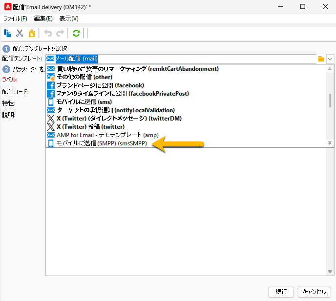
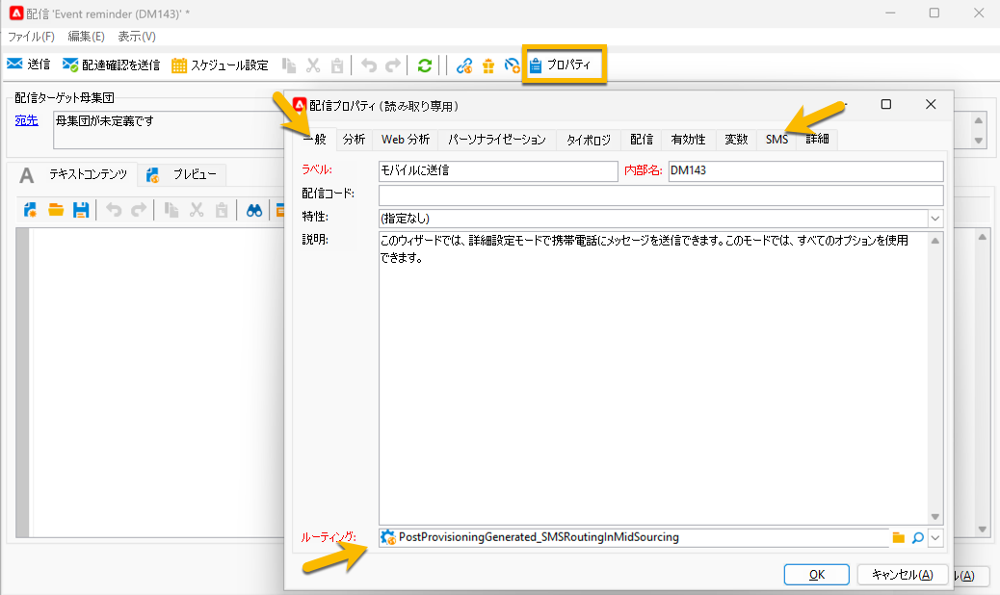

# SMS 配信設定 {#sms-settings}

>[!IMPORTANT]
>
>このドキュメントは、Adobe Campaign v8.7.2 以降を対象としています。
>
>古いバージョンについては、[Campaign Classic v7 ドキュメント ](https://experienceleague.adobe.com/en/docs/campaign-classic/using/sending-messages/sending-messages-on-mobiles/sms-set-up/sms-set-up) を参照してください。

SMS 配信に必要な技術的な設定は、次のとおりです。

* ルーティング：[SMPP 外部アカウント ](smpp-external-account.md#smpp-connection-settings)

* [null ](#sms-tab)

各 SMS 配信作成の設定を行う必要がないので、これらすべてを配信テンプレートで設定できます。

## 「**[!UICONTROL SMS]** の設定」タブ {#sms-tab}

{zoomable="yes"}

このフォームに入力する必要がある情報は次のとおりです。 各フィールドについては、以下で説明します。

* **[!UICONTROL 送信者のアドレス]**

  このフィールドはオプションです。送信者アドレス（oADC）を上書きできます。このフィールドの内容は、SUBMIT_SM PDU の *source_addr* フィールドに配置されます。

  SMPP 仕様では、このフィールドの文字数が 21 文字に制限されていますが、プロバイダーによっては、これより長い値を使用できる場合があります。また、一部の国では、非常に厳しい制限（長さ、コンテンツ、許可されている文字など）が適用される場合があるので、ここに配置するコンテンツが合法であることを再確認する必要があります。 パーソナライズされたフィールドを使用するときは、特に注意が必要です。

  このフィールドを空のままにすると、外部アカウントで定義されたSource番号フィールドの値が代わりに使用されます。 両方の値が空の場合、*source_addr* フィールドは空のままになります。

* **[!UICONTROL サービスまたはプログラム ID]**

  >[!NOTE]
  >
  >この機能の使用は推奨されません。 オプションの SMPP パラメーターを使用すると、より柔軟な実装が可能になります。
  >
  >両方の機能を同時に使用することはできません。

  一致する外部アカウント設定と組み合わせると、各 MT で 1 つのオプションパラメーターを送信できます。 このフィールドは、TLV の値部分を定義します。

* **[!UICONTROL 伝送モード]**

  このフィールドは、転送したい SMS の種類を示します。通常またはフラッシュメッセージ、モバイルまたは SIM カードに保存します。 この設定は、SUBMIT_SM PDU の dest_addr_subunit オプションフィールドに送信されます。

   * 「**Flash**」の場合、値を 1 に設定します。携帯電話上でポップアップ表示され、メモリには保存されない Flash メッセージを送信します。
   * 「**通常**」の場合、値を 0 に設定します。通常のメッセージを送信します。
   * 「**携帯電話に保存**」の場合、値を 2 に設定します。SMS を内部メモリに保存するよう電話に指示します。
   * 「**ターミナルに保存**」の場合、値を 3 に設定します。SIM カードに SMS を格納するよう電話に指示します。

* **[!UICONTROL 優先度、通信タイプ]**

  これらのフィールドは、拡張 SMPP コネクタでは無視されます。

* **[!UICONTROL メッセージあたりの SMS の最大数]**

  この設定は、メッセージペイロード設定が無効な場合にのみ機能します（詳しくは、外部アカウント設定のを参照してください）。 メッセージにこの値より多くの SMS が必要な場合は、エラーがトリガーされます。

  SMS プロトコルでは SMS を 255 個に制限していますが、一部の携帯電話では、10 個以上の長いメッセージをまとめるのが困難です（制限は正確なモデルによって異なります）。 安全を確保したい場合は、メッセージあたり 5 部を超えないようにします。

  Adobe Campaignでは、パーソナライズされたメッセージの仕組みにより、メッセージのサイズが異なる場合があります。そのため、非常に長いメッセージを大量に送信すると、送信コストが大幅に増加する可能性があります。これを適切な値に設定すると、これらのコストを抑えるのに役立ちます。

  0 を指定すると、制限が無効になります。

* **[!UICONTROL オプションの SMPP パラメーター（TLV）]**
オプションの SMPP パラメーター（TLV）として送信する追加のフィールドを指定できます。 これらの追加フィールドは各 MT で送信され、パーソナライズされたフィールドは各 MT に対して異なる値を持つことができます。
この表は、各メッセージで送信するオプションのパラメーターを示しています。 列には、次の情報が含まれます。
   * **ラベル**：これはオプションの自由形式ラベルです。 プロバイダーには送信されません。 パラメーターの説明をテキストで指定できます。
   * **タグ**：タグの値。10 進数形式（例：12345）または 0x のプレフィックスを持つ 16 進数（例：0x12ab）のいずれかです。 タグの範囲は 0 から 65535 までです。 SMPP サービスプロバイダーに、サポートするタグを問い合わせます。
   * **値**：オプションパラメーターで送信する値。 これはパーソナライズされたフィールドです。
   * **形式**: パラメーターに使用するエンコーディング。 サポートされているテキストエンコーディングまたは最も一般的なバイナリ形式を選択できます。 SMPP サービスプロバイダーに必要な形式を問い合わせます。
   * **最大長**：このパラメーターの最大バイト数。 バイナリフィールドはサイズが固定されているので、バイナリフィールドでは無視されます。

* **[!UICONTROL TLV のバイナリフォーマットの使用]**

  Campaign は、バイナリ形式での TLV の送信をサポートしています。 バイナリは送信番号に制限されています。

  パーソナライズされたフィールドは常にテキストを出力するので、パーソナライズされたフィールドには数値の 10 進表現を含める必要があります（数字のみが含まれていれば、文字列は問題ありません）。 値は、符号付きまたは符号なし両方にすることができます。パーソナライゼーションエンジンは、値を正しいバイナリ表現に変換するだけです。

  バイナリ形式を使用する場合、特殊値「（空の文字列）、「null」および「未定義」は、エラーをスローすることなくフィールドを完全に無効にします。 これらの 3 つの特殊なケースでは、タグはまったく渡されません。 これにより、パーソナライゼーションフィールドで慎重に作成された JavaScript を使用する際に、一部のメッセージに対してのみ特定の TLV を渡すことができます。

  >[!NOTE]
  >
  >バイナリ形式は常にビッグエンディアン形式にエンコードされます。

## SMS 配信を作成 {#sms-delivery}

新しい SMS 配信を作成するには、次の手順に従います。

1. 配信ダッシュボードや **[!UICONTROL エクスプローラー]** の配信フォルダーなど、新しい配信を作成します。  デフォルトでは、「メール配信」というラベルが付きます。

1. SMS 送信用に作成した配信テンプレートを選択します。 [詳しくは、こちらを参照してください](sms-mid-sourcing.md#sms-delivery-template)。

   {zoomable="yes"}

<!-- * For standalone instance,  [learn more here](sms-standalone-instance.md#sms-delivery-template).
* For mid-sourcing infrastructure, -->

1. 「**[!UICONTROL ラベル]**」フィールドで配信の名前を変更し、「**[!UICONTROL 配信コード]**」フィールドと「**[!UICONTROL 特性]**」リストに情報を追加します。 配信に **[!UICONTROL 説明]** を追加することもできます。

1. 「**[!UICONTROL 続行]**」ボタンをクリックします。 これで、配信でテンプレートのすべての設定が完了しました。

1. 「**[!UICONTROL プロパティ]**」ボタンをチェックすると、必要に応じてすべてが設定されていることを確認できます。 [ 「SMS」タブの詳細情報 ](#sms-tab)

{zoomable="yes"}

[SMS コンテンツ ](sms-content.md) を設定できるようになりました。
