# ミッドソーシングインフラストラクチャでの SMS {#sms-mid}

>[!IMPORTANT]
>
>このドキュメントは、Adobe Campaign v8.7.2 以降に適用されます。 従来の SMS コネクタから新しい SMS コネクタに切り替えるには、この [ テクニカルノート ](https://experienceleague.adobe.com/docs/campaign/technotes-ac/tn-new/sms-migration){target="_blank"} を参照してください
>
>以前のバージョンについて詳しくは、[Campaign Classic v7 ドキュメント](https://experienceleague.adobe.com/ja/docs/campaign-classic/using/sending-messages/sending-messages-on-mobiles/sms-set-up/sms-set-up){target="_blank"}を参照してください。

ミッドソーシングインフラストラクチャでの SMS 配信の送信には、以下が必要です。

1. ミッドサーバーでの SMS オペレーター。[詳しくは、作成方法を参照してください](#sms-operator-mid)
1. 以前に作成したオペレーターを使用するマーケティングサーバー上の SMS 外部アカウント。[詳しくは、作成方法を参照してください](#sms-external-account)
1. チャネルとミッドソーシング配信モードを指定する、ミッドサーバー上の SMPP 外部アカウント。[詳しくは、作成方法を参照してください](#smpp-external-account-mid)
1. 送信プロセスを効率化するために、外部アカウントを参照する配信テンプレート。[詳しくは、作成方法を参照してください](#sms-delivery-template)

## ミッドサーバーでの SMS オペレーターの作成 {#sms-operator-mid}

まず、マーケティングサーバー上の SMS 外部アカウントで使用される SMS オペレーターをミッドサーバー上に作成する必要があります。

SMS オペレーターを作成するには、次の手順に従います。

1. **[!UICONTROL 管理]**／**[!UICONTROL アクセス管理]**／**[!UICONTROL オペレーター]**&#x200B;で、「**[!UICONTROL 新規]**」をクリックし、開いた新しいウィンドウのフォームに入力します。

   * **[!UICONTROL 名前（ログイン）]**&#x200B;と&#x200B;**[!UICONTROL ラベル]**&#x200B;は必須です。
   * パスワードは必須ではありませんが、セキュリティを確保するために強くお勧めします。

   名前（ログイン）は、後からミッドサーバーで SMPP 外部アカウントに名前を付けるために使用します。

   {zoomable="yes"}

1. **[!UICONTROL グループとネームド権限]**&#x200B;パートで、「**[!UICONTROL 追加]**」ボタンをクリックします。
開いた新しいウィンドウで、**[!UICONTROL フォルダー]**&#x200B;リストで「**[!UICONTROL ネームド権限]**」を選択し、右側のリストで「**[!UICONTROL 管理]**」を選択します。

1. 「**[!UICONTROL OK]**」ボタンをクリックします。

   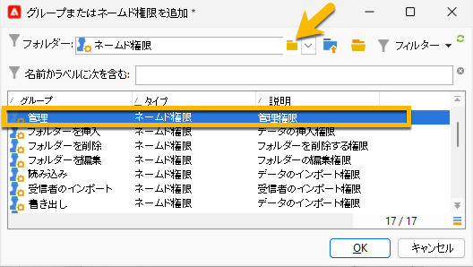{zoomable="yes"}

1. 「**[!UICONTROL 保存]**」ボタンをクリックして、SMS オペレーターの作成を完了します。

   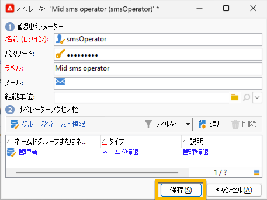{zoomable="yes"}

オペレーターリストで確認できるようになりました。

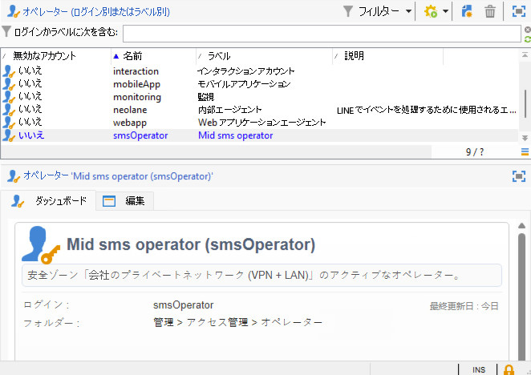{zoomable="yes"}

## マーケティングサーバーでの SMS 外部アカウントの作成 {#sms-external-account}

ミッドインフラストラクチャでは、以下のように、マーケティングサーバーに SMS 外部アカウントを作成する必要があります。

>[!IMPORTANT]
>
>複数の外部 SMS アカウントに同じアカウントとパスワードを使用すると、アカウント間で競合や重複が生じる可能性があります。詳しくは、[SMS のトラブルシューティングページ](smpp-connection.md#sms-troubleshooting)を参照してください。

1. **[!UICONTROL 管理]**／**[!UICONTROL プラットフォーム]**／**[!UICONTROL 外部アカウント]**&#x200B;で、**[!UICONTROL 新規]**&#x200B;アイコンをクリックします

   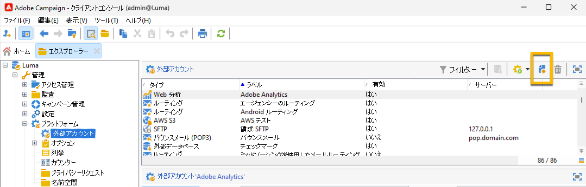{zoomable="yes"}

1. 外部アカウントの&#x200B;**[!UICONTROL ラベル]**&#x200B;と&#x200B;**[!UICONTROL 内部名]**&#x200B;を設定します。アカウントタイプを&#x200B;**[!UICONTROL ルーティング]**&#x200B;として定義し、「**[!UICONTROL 有効]**」ボックスをオンにして、チャネルに「**[!UICONTROL モバイル（SMS）]**」、配信モードに「**[!UICONTROL ミッドソーシング]**」を選択します。

   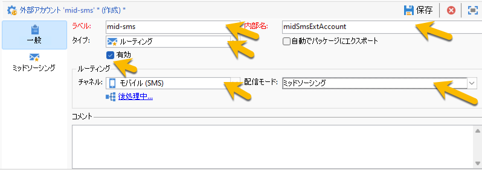{zoomable="yes"}

1. 「**[!UICONTROL ミッドソーシング]**」タブで、ミッドソーシングサーバーの URL と、ミッドサーバーで以前に作成した SMS オペレーターをフォームに入力します。

   「**[!UICONTROL 接続をテスト]**」ボタンをクリックして、接続を確認します。

   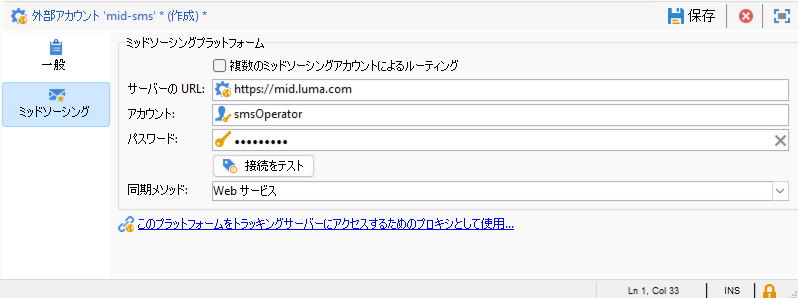{zoomable="yes"}

1. 「**[!UICONTROL 保存]**」をクリックします。

## ミッドサーバーでの SMPP 外部アカウントの作成 {#smpp-external-account-mid}

>[!IMPORTANT]
>
>複数の外部 SMS アカウントに同じアカウントとパスワードを使用すると、アカウント間で競合や重複が生じる可能性があります。[SMS のトラブルシューティングページ](smpp-connection.md#sms-troubleshooting)を参照してください。

目標は、ミッドサーバー上に SMPP 外部アカウントを確立することです。

これを行うには、次の手順に従います。

1. ミッドサーバーの&#x200B;**[!UICONTROL 管理]**／**[!UICONTROL プラットフォーム]**／**[!UICONTROL 外部アカウント]**&#x200B;で、**[!UICONTROL 新規]**&#x200B;アイコンをクリックします

1. 外部アカウントの&#x200B;**[!UICONTROL ラベル]**&#x200B;と&#x200B;**[!UICONTROL 内部名]**&#x200B;を設定します。

   >[!WARNING]
   >
   >内部名を割り当てる際は、指定された命名規則（`SMS Operator Name_Internal Name of the Marketing SMS external account`）に従ってください。
   >

   アカウントタイプを&#x200B;**[!UICONTROL ルーティング]**&#x200B;として定義し、「**[!UICONTROL 有効]**」ボックスをオンにして、チャネルに「**[!UICONTROL モバイル（SMS）]**」、配信モードに「**[!UICONTROL 一括配信]**」を選択します。
   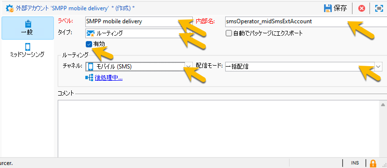{zoomable="yes"}

1. 「**[!UICONTROL モバイル]**」タブで、**[!UICONTROL コネクタ]**&#x200B;ドロップダウンリストにある&#x200B;**[!UICONTROL 拡張された汎用 SMPP]** をそのままにしておきます。

   デフォルトでは、「**[!UICONTROL 専用プロセスを通じてメッセージを送信]**」ボックスがオンになっています。

   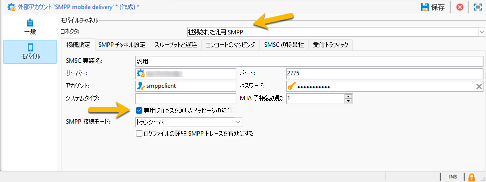{zoomable="yes"}

   接続を設定するには、このフォームのタブに入力する必要があります。詳しくは、[SMPP 外部アカウントの詳細情報](smpp-external-account.md#smpp-connection-settings)を参照してください。

## 配信テンプレートの設定 {#sms-delivery-template}

SMS 配信の作成を容易にするには、すべての設定が参照される SMS 配信テンプレートを作成します。

マーケティングサーバーの&#x200B;**[!UICONTROL リソース]**／**[!UICONTROL テンプレート]**／**[!UICONTROL 配信テンプレート]**&#x200B;で、既存のモバイル配信テンプレートを右クリックし、「**[!UICONTROL 複製]**」を選択します。

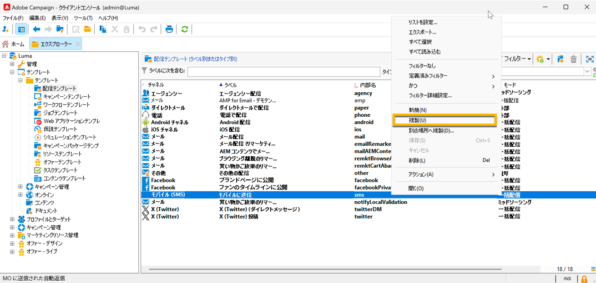{zoomable="yes"}

テンプレートの&#x200B;**[!UICONTROL ラベル]**&#x200B;と&#x200B;**[!UICONTROL 内部名]**&#x200B;を簡単に認識できるように変更し、「**[!UICONTROL プロパティ]**」ボタンをクリックします。

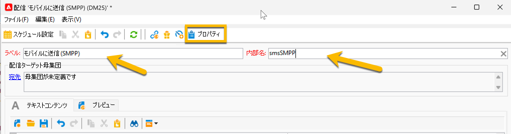{zoomable="yes"}

「**[!UICONTROL 一般]**」タブの&#x200B;**[!UICONTROL ルーティング]**&#x200B;で、SMPP 外部アカウントを選択します。

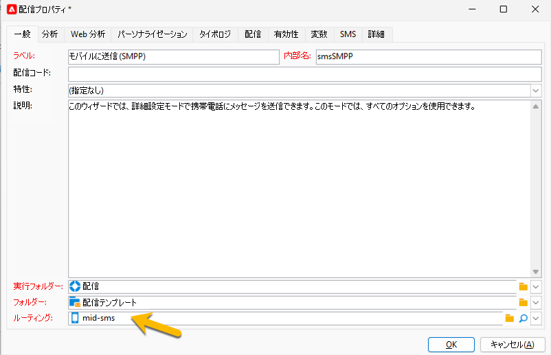{zoomable="yes"}

「**[!UICONTROL SMS]**」タブでは、テンプレートにオプションのパラメーターを追加できます。

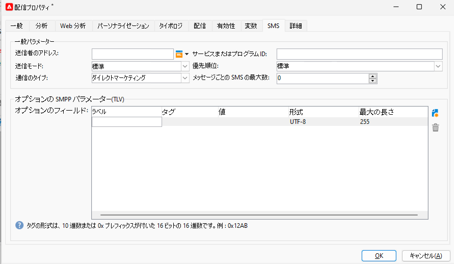{zoomable="yes"}

[詳しくは、この SMS タブの設定を参照してください](sms-delivery-settings.md)。
