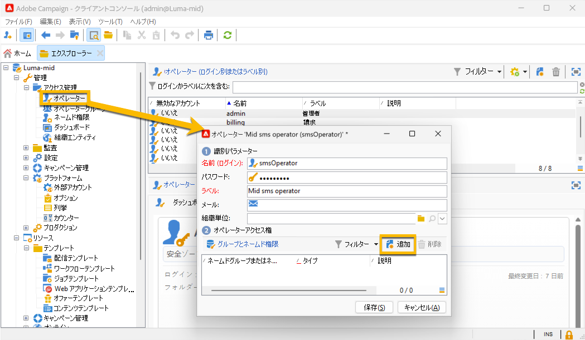

# ミッドソーシングインフラストラクチャにおける SMS {#sms-mid}

>[!IMPORTANT]
>
>このドキュメントは、Adobe Campaign v8.7.2 以降を対象としています。
>
>古いバージョンについては、[Campaign Classic v7 ドキュメント ](https://experienceleague.adobe.com/en/docs/campaign-classic/using/sending-messages/sending-messages-on-mobiles/sms-set-up/sms-set-up) を参照してください。

ミッドソーシングインフラストラクチャで SMS 配信を送信するには、次の操作が必要です。

1. ミッドサーバーの SMS オペレーター。 [ 作成方法については、こちらを参照してください ](#sms-operator-mid)
1. 以前に作成したオペレーターを使用する、マーケティングサーバー上の SMS 外部アカウント。 [ 作成方法については、こちらを参照してください ](#sms-external-account)
1. チャネルとミッドソーシング配信モードを指定する、ミッドサーバー上の SMPP 外部アカウント。 [ 作成方法については、こちらを参照してください ](#smpp-external-account-mid)
1. 送信プロセスを効率化するために外部アカウントを参照する配信テンプレート。 [ 作成方法については、こちらを参照してください ](#sms-delivery-template)

## ミッドサーバーでの SMS オペレーターの作成 {#sms-operator-mid}

まず、ミッドサーバー上に SMS オペレーターを作成する必要があります。このオペレーターは、マーケティングサーバー上の SMS 外部アカウントで使用されます。

SMS オペレーターを作成するには、次の手順に従います。

1. **[!UICONTROL 管理]**/**[!UICONTROL アクセス管理]**/**[!UICONTROL オペレーター]** で、**[!UICONTROL 新規]** をクリックし、開いた新しいウィンドウにフォームに入力します。

   * **[!UICONTROL 名前（ログイン）]** および **[!UICONTROL ラベル]** は必須です。
   * パスワードは必須ではありませんが、セキュリティのために強くお勧めします。

   名前（ログイン）は、後でミッドサーバーの SMPP 外部アカウントに名前を付けるために使用します。

   {zoomable="yes"}

1. **[!UICONTROL グループとネームド権限]** パートで、「**[!UICONTROL 追加]**」ボタンをクリックします。
新しく開いたウィンドウで、「**[!UICONTROL フォルダー]**」リストの **[!UICONTROL ネームド権限]** を選択し、右側のリストの **[!UICONTROL 管理]** を選択します。

1. 「**[!UICONTROL OK]**」ボタンをクリックします。

   {zoomable="yes"}

1. 「**[!UICONTROL 保存]**」ボタンをクリックして、SMS オペレーターの作成を完了します。

   {zoomable="yes"}

演算子リストに表示されるようになりました。

{zoomable="yes"}

## マーケティングサーバーでの SMS 外部アカウントの作成 {#sms-external-account}

ミッドインフラストラクチャでは、次のように、マーケティングサーバーに SMS 外部アカウントを作成する必要があります

>[!IMPORTANT]
>
>複数の外部 SMS アカウントに同じアカウントとパスワードを使用すると、アカウント間で競合や重複が生じる可能性があります。 詳しくは、[SMS のトラブルシューティングページ ](smpp-connection.md#sms-troubleshooting) を参照してください。

1. **[!UICONTROL 管理]**/**[!UICONTROL プラットフォーム]**/**[!UICONTROL 外部アカウント]** で、**[!UICONTROL 新規]** アイコンをクリックします

   {zoomable="yes"}

1. 外部アカウントの **[!UICONTROL ラベル]** と **[!UICONTROL 内部名]** を設定します。 アカウントタイプを **[!UICONTROL ルーティング]** として定義し、「**[!UICONTROL 有効]**」チェックボックスをオンにして、チャネルに **[!UICONTROL モバイル （SMS）]** を選択し、配信モードに **[!UICONTROL ミッドソーシング]** を選択します。

   {zoomable="yes"}

1. 「**[!UICONTROL ミッドソーシング]**」タブで、ミッドソーシングサーバー URL と、以前にミッドサーバー上で作成した SMS オペレーターをフォームに入力します。

   「**[!UICONTROL 接続をテスト]**」ボタンをクリックして、接続を確認します。

   {zoomable="yes"}

1. 「**[!UICONTROL 保存]**」をクリックします。

## ミッドサーバーでの SMPP 外部アカウントの作成 {#smpp-external-account-mid}

>[!IMPORTANT]
>
>複数の外部 SMS アカウントに同じアカウントとパスワードを使用すると、アカウント間で競合や重複が生じる可能性があります。 [SMS のトラブルシューティングページ](smpp-connection.md#sms-troubleshooting)を参照してください。

目標は、ミッドサーバーで SMPP 外部アカウントを確立することです。

これを行うには、次の手順に従います。

1. ミッドサーバーの **[!UICONTROL 管理]**/**[!UICONTROL プラットフォーム]**/**[!UICONTROL 外部アカウント]** で、**[!UICONTROL 新規]** アイコンをクリックします

1. 外部アカウントの **[!UICONTROL ラベル]** と **[!UICONTROL 内部名]** を設定します。

   >[!WARNING]
   >
   >内部名を割り当てる場合は、指定された命名規則（`SMS Operator Name_Internal Name of the Marketing SMS external account`）に従ってください。
   >

   アカウントタイプを **[!UICONTROL ルーティング]** として定義し、「**[!UICONTROL 有効]**」チェックボックスをオンにして、チャネルで **[!UICONTROL モバイル （SMS）]** を選択し、配信モードで **[!UICONTROL 一括配信]** を選択します。
   {zoomable="yes"}

1. 「**[!UICONTROL モバイル]**」タブで、「**[!UICONTROL コネクタ]**」ドロップダウンリストに **[!UICONTROL 拡張された汎用 SMPP]** を保持します。

   「**[!UICONTROL 専用のプロセスを使用してメッセージを送信]** ボックスは、デフォルトでオンになっています。

   {zoomable="yes"}

   接続を設定するには、このフォームのタブに入力する必要があります。 詳しくは、[SMPP 外部アカウントの詳細情報 ](smpp-external-account.md#smpp-connection-settings) を参照してください。

## 配信テンプレートの設定 {#sms-delivery-template}

SMS 配信の作成を容易にするために、すべての設定が参照される SMS 配信テンプレートを作成します。

**[!UICONTROL リソース]**/**[!UICONTROL テンプレート]**/**[!UICONTROL 配信テンプレート]** マーケティングサーバーで、既存のモバイル配信テンプレートを右クリックし、「**[!UICONTROL 複製]**」を選択します。

{zoomable="yes"}

テンプレートの **[!UICONTROL ラベル]** と **[!UICONTROL 内部名]** を変更して簡単に認識できるようにし、「**[!UICONTROL プロパティ]**」ボタンをクリックします。

{zoomable="yes"}

「**[!UICONTROL 一般]**」タブの **[!UICONTROL ルーティング]** で、SMPP 外部アカウントを選択します。

{zoomable="yes"}

「**[!UICONTROL SMS]**」タブで、テンプレートにオプションのパラメーターを追加できます。

{zoomable="yes"}

[ この SMS タブ設定の詳細を説明します ](sms-delivery-settings.md)。