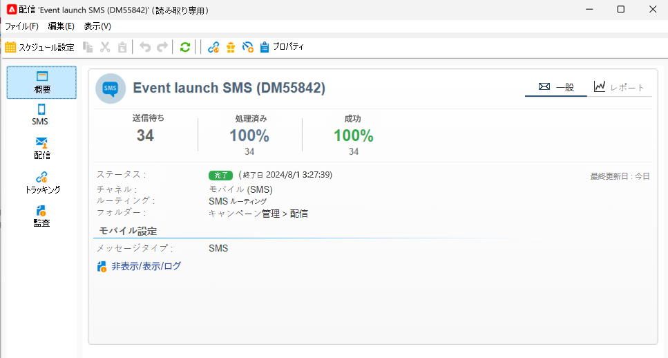
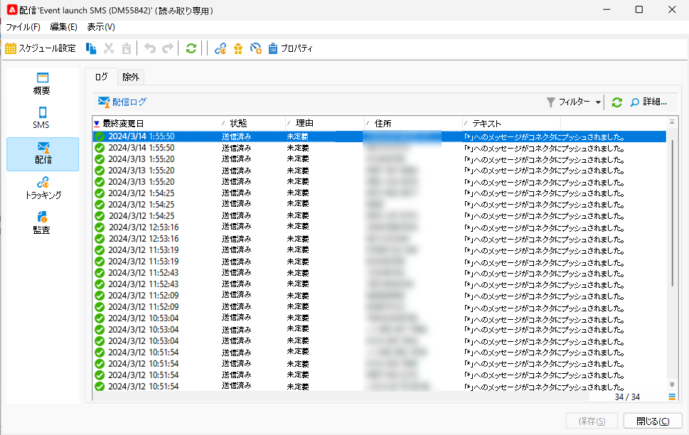
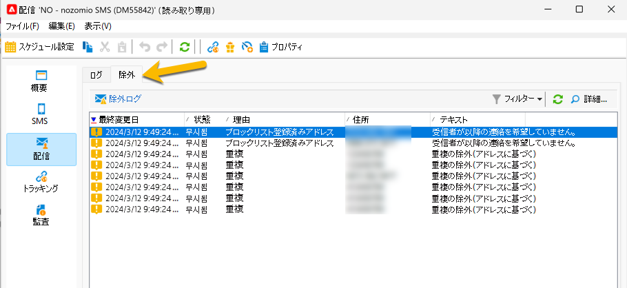
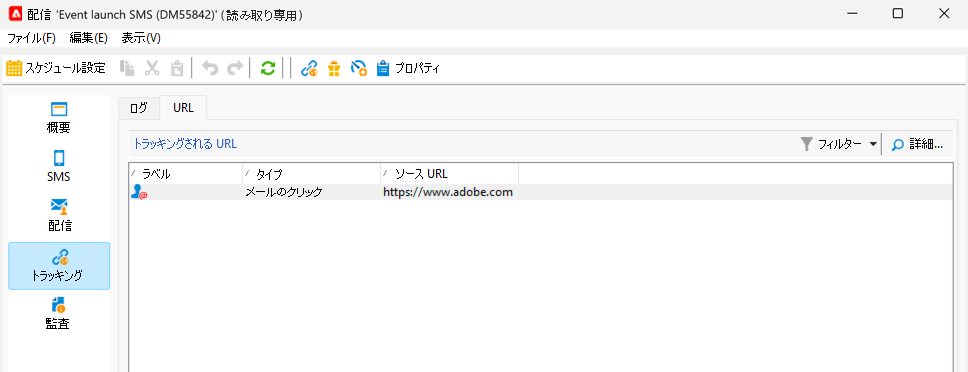
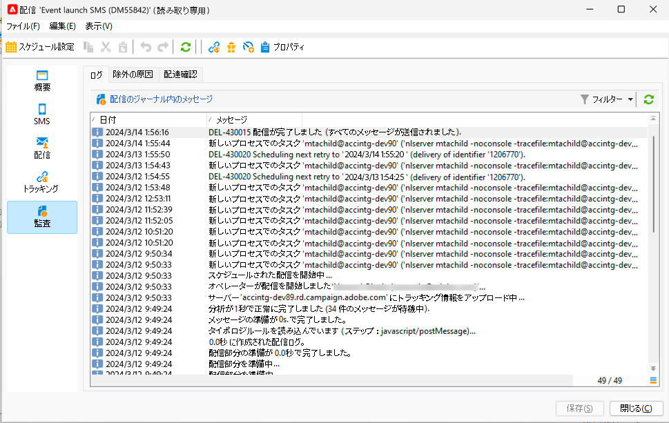

# SMS の監視とトラッキング

マーケティングキャンペーンの効率を確保するには、SMS 配信を監視することが重要です。

ここでは、配信を送信した後の動作を確認する必要があります

## SMS 配信ダッシュボードについて

配信ダッシュボードには、SMS に関する多くの情報が表示されます。

ダッシュボードにアクセスするには、配信リストで配信をダブルクリックします。

「**[!UICONTROL 概要]**」タブには、処理されたメッセージの数や成功の数などのメインデータがあります。

{zoomable="yes"}

SMS の送信後、配信のコンテンツに関する「**[!UICONTROL SMS]**」タブに変更をアクセスできなくなります。

「**[!UICONTROL 配信]**」タブには、配信ログに関する情報が表示されます。 連絡されたアドレスごとに、SMS が送信されたかどうかを確認できます

{zoomable="yes"}

一部のアドレスがターゲットから除外されている理由の詳細は、「**[!UICONTROL 除外]**」タブに表示されます。

{zoomable="yes"}

「**[!UICONTROL トラッキング]** タブは、トラッキングに関する項目です。 以下は、SMS コンテンツでトラッキングされる URL の例です。

{zoomable="yes"}

最後に、配信のローンチ中にすべての詳細が表示される **[!UICONTROL 監査]** タブ：

{zoomable="yes"}

## SMS エラーについて

SMS の失敗のタイプと理由は、メールの場合と同じです。

[ 配信エラー ](../delivery-failures.md)、特に [SMS 強制隔離 ](../delivery-failures.md#sms-quarantines) の詳細を説明します。

