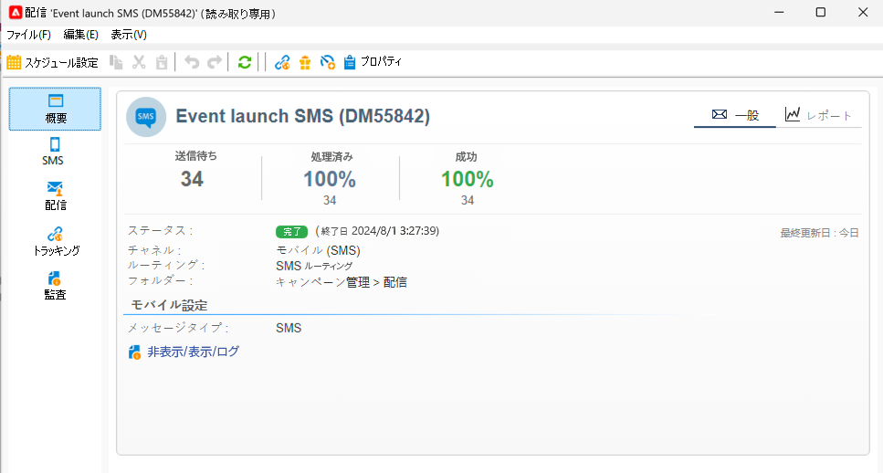
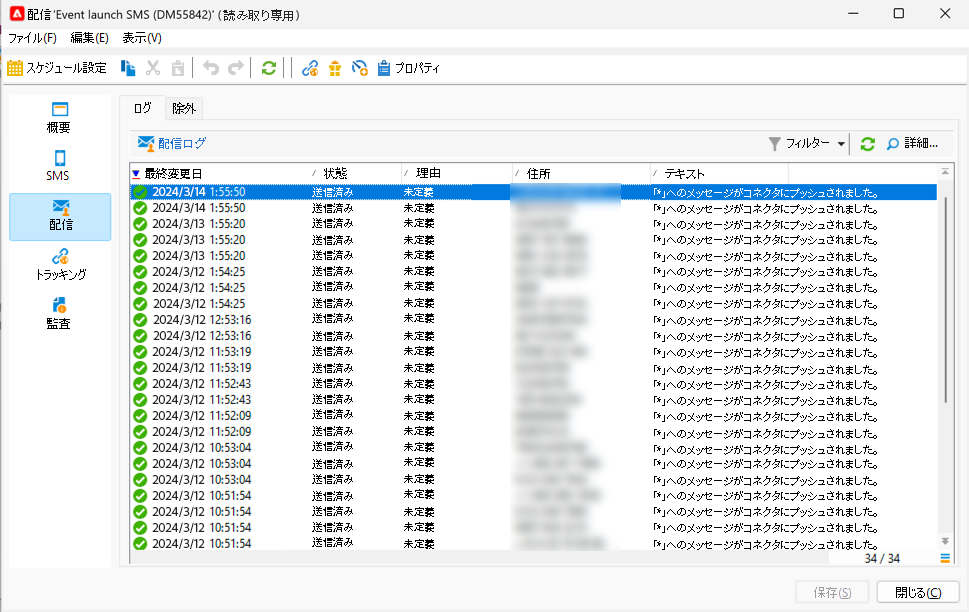
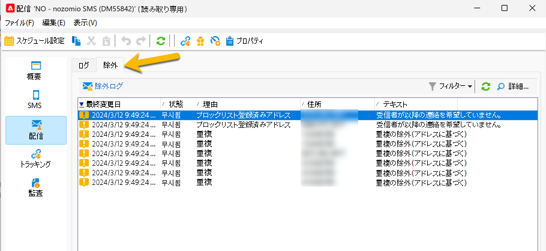
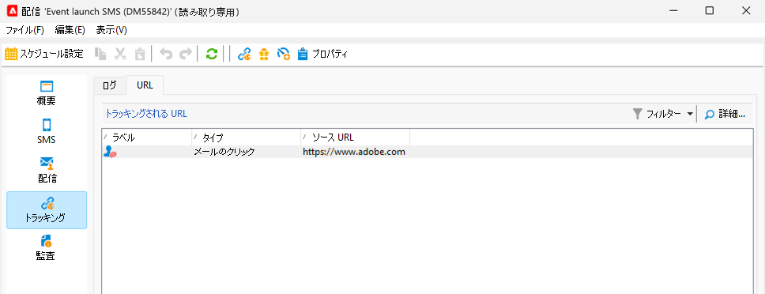
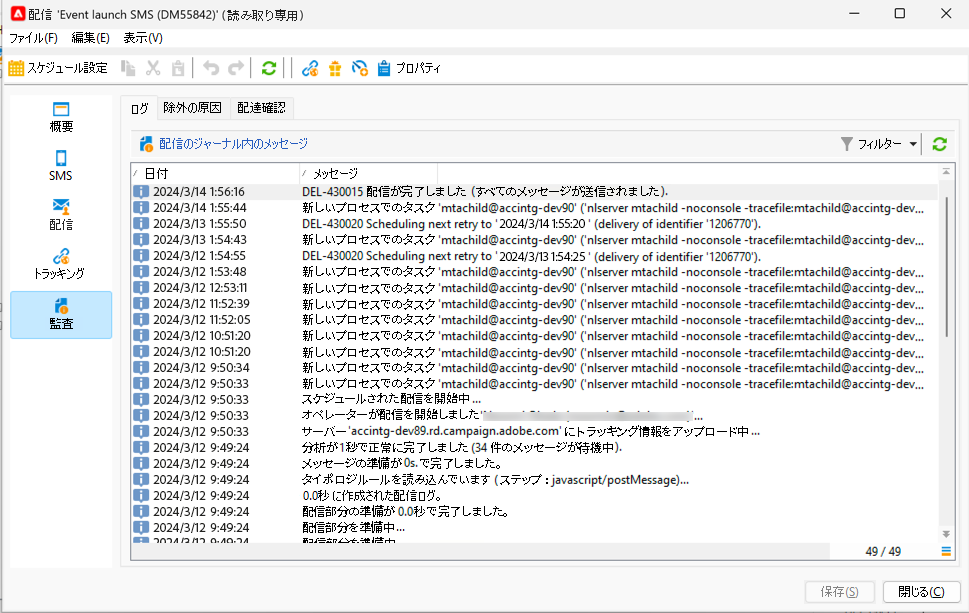

# SMS の監視と追跡

マーケティングキャンペーンが効率的であることを確認するには、SMS 配信を監視することが重要です。

配信を送信した後に確認する必要がある情報を以下に示します

## SMS 配信ダッシュボードについて

配信ダッシュボードには、SMS に関する多くの情報が表示されます。

ダッシュボードにアクセスするには、配信リストで配信をダブルクリックします。

「**[!UICONTROL 概要]**」タブには、処理されたメッセージの数や成功の数などの主なデータが表示されます。

{zoomable="yes"}

SMS の送信後は、配信のコンテンツに関する「**[!UICONTROL SMS]**」タブにアクセスして変更することはできなくなります。

「**[!UICONTROL 配信]**」タブには、配信ログに関する情報が表示されます。 連絡先アドレスごとに、SMS が送信されたかどうかを確認できます

{zoomable="yes"}

「**[!UICONTROL 除外]**」タブでは、一部のアドレスがターゲットから除外される理由の詳細を確認できます。

{zoomable="yes"}

「**[!UICONTROL トラッキング]**」タブには、トラッキングに関する情報が表示されます。 SMS コンテンツで追跡される URL の例を以下に示します。

{zoomable="yes"}

最後に、配信のローンチ中の詳細がすべて表示される「**[!UICONTROL 監査]**」タブを以下に示します。

{zoomable="yes"}

## SMS のエラーについて

SMS のエラーのタイプと理由はメールの場合と同じです。

詳しくは、[配信エラー](../delivery-failures.md)と、特に [SMS 強制隔離](../delivery-failures.md#sms-quarantines)を参照してください。
