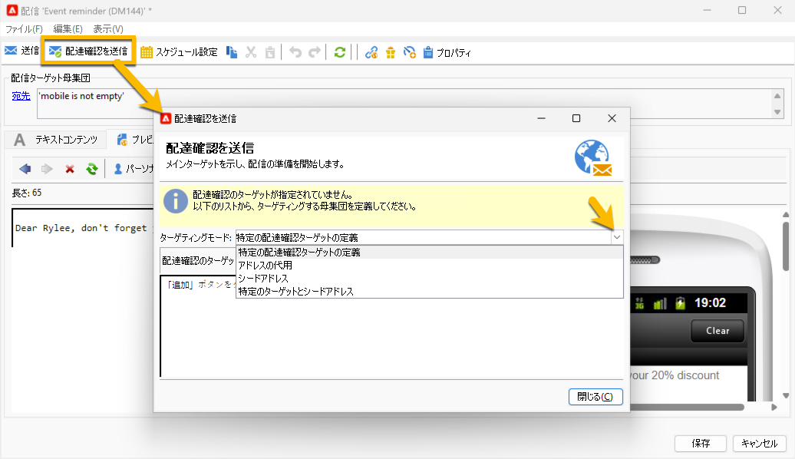
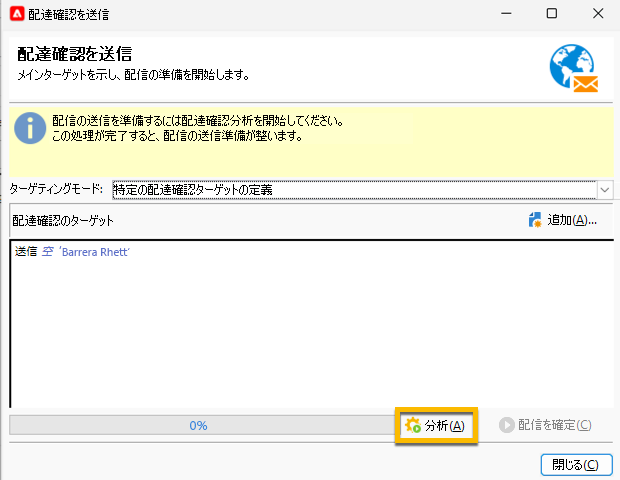
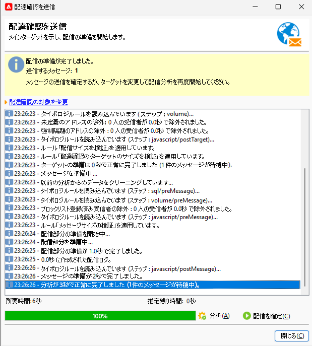

# SMS 配信の配達確認の送信 {#sms-proof}

アドビでは、配信の検証サイクルを設定することを強くお勧めします。 コンテンツをオーディエンスに送信する前に、必ず承認するようにしてください。

SMS 配信の配達確認を送信して、検証できます。

1. 「**[!UICONTROL 配達確認を送信]**」ボタンをクリックすると、ウィンドウが開きます

   {zoomable="yes"}

   配達確認を送信するには、次の複数のモードがあります。

   * **[!UICONTROL 特定の配達確認ターゲットの定義]**：配達確認ターゲットとして、データベース内のアドレスをフィルタリングしてクエリを実行できます
   * **[!UICONTROL アドレスの代用]**：テストアドレスを入力し、ターゲット受信者データを使用してコンテンツを検証できます。 代用アドレスは、手動で入力することも、ドロップダウンリストから選択することもできます。 関連する[列挙](../../config/enumerations.md)は&#x200B;**[!UICONTROL 代替アドレス （rcpAddress）]**&#x200B;です。
デフォルトでは、代用はランダムに実行されますが、「**[!UICONTROL 詳細]**」アイコンを使用して、メインターゲットから特定の受信者を選択することもできます。
   * **[!UICONTROL シードアドレス]**：配達確認のターゲットとなるシードアドレスにアクセスできます。 これらのアドレスは、ファイルからインポートするか、手動で入力できます。
   * **[!UICONTROL 特定のターゲットとシードアドレス]**：シードアドレスと受信者のアドレスを組み合わせることができます。

1. **[!UICONTROL ターゲティングモード]**&#x200B;を選択したら、それに応じて配達確認アドレスを追加します

   次の例では、「**[!UICONTROL 特定の配達確認ターゲットの定義]**」を選択し、受信者を追加します。

   {zoomable="yes"}

1. 「**[!UICONTROL 分析]**」ボタンをクリックします。
Adobe Campaign では、配達確認の送信を検証する前にすべてのコントロールを実行します。 分析の最後に表示される「**[!UICONTROL 配信を確定]**」ボタンがクリックできるようになります。

   {zoomable="yes"}

1. SMS 配信の配達確認を送信するには、「**[!UICONTROL 配信を確定]**」ボタンをクリックします。

このステージですべてが正常であれば、次に進んで [SMS 配信をオーディエンスに送信](sms-audience.md)できます。
