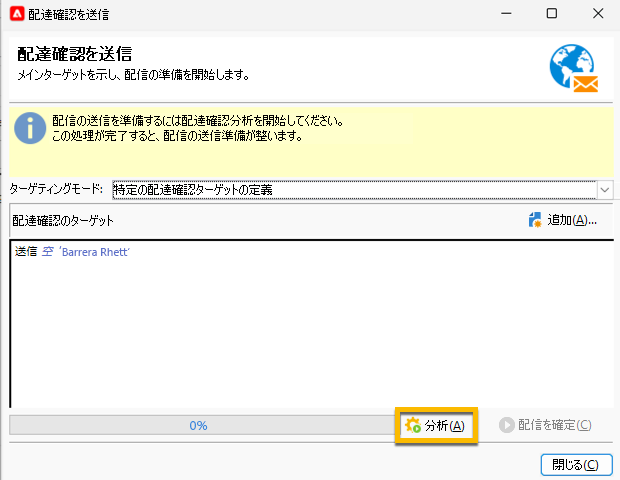

# SMS 配信の配達確認の送信 {#sms-proof}

Adobeでは、配信検証サイクルを設定することを強くお勧めします。 コンテンツをオーディエンスに送信する前に、コンテンツが承認されていることを確認します。

SMS 配信の配達確認を送信して、検証できます。

1. 「**[!UICONTROL 配達確認を送信]**」ボタンをクリックすると、ウィンドウが開きます

   {zoomable="yes"}

   配達確認を送信するには、次の複数のモードがあります。

   * **[!UICONTROL 特定の配達確認ターゲットの定義]**：配達確認ターゲットとしてデータベース内のアドレスをフィルターでクエリできます
   * **[!UICONTROL アドレスの代用]**：テストアドレスを入力し、ターゲット受信者データを使用してコンテンツを検証できます。 代用アドレスは、手動で入力することも、ドロップダウンリストから選択することもできます。関連する定義済みリストは **[!UICONTROL 代替アドレス（rcpAddress）]** です。
デフォルトでは、代用はランダムに実行されますが、「**[!UICONTROL 詳細]**」アイコンを使用して、メインターゲットから特定の受信者を選択することもできます。
   * **[!UICONTROL シードアドレス]**：配達確認ターゲットとなるシードアドレスにアクセスできます。 これらのアドレスは、ファイルからインポートするか、手動で入力できます。
   * **[!UICONTROL 特定のターゲットとシードアドレス]**：受信者のシードアドレスとアドレスを組み合わせることができます。

1. **[!UICONTROL ターゲティングモード]** を選択したら、それに応じて配達確認アドレスを追加します

   次の例では、「特定の配達確認ターゲットの定義 **[!UICONTROL を選択し、受信者を追加し]** す。

   {zoomable="yes"}

1. 「**[!UICONTROL 分析]**」ボタンをクリックします。
Adobe Campaignは、配達確認の送信を検証する前に、すべてのコントロールを実行します。 分析の最後に、「**[!UICONTROL 配信を確定]** ボタンがクリック可能になります。

   {zoomable="yes"}

1. SMS 配信の配達確認を送信するには、「**[!UICONTROL 配信を確認]**」ボタンをクリックします。

この段階で問題がなければ、先に進んで [SMS 配信をオーディエンスに送信 ](sms-audience.md) することができます。
