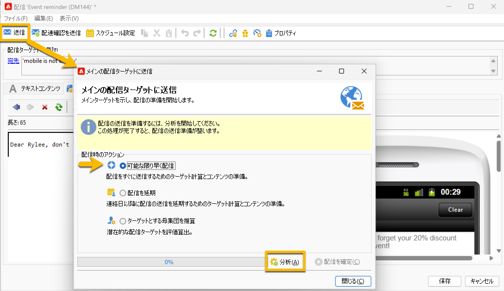
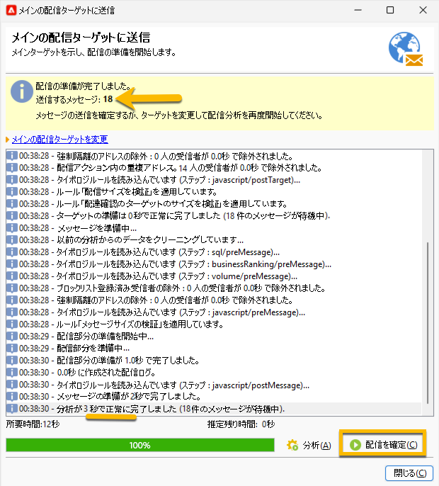

# オーディエンスへの SMS 配信の送信 {#sms-send-audience}

SMS が検証されると、オーディエンスに送信できるようになります。

1. 「**[!UICONTROL 送信]**」ボタンをクリックします。
開いたウィンドウで、自分に合った適切なアクションを選択します。

   以下の例では、「**[!UICONTROL 可能な限り早く配信]**」を選択すると、「**[!UICONTROL 分析]**」ボタンが表示されます。その「**[!UICONTROL 分析]**」ボタンをクリックします。

   {zoomable="yes"}

   Adobe Campaign では、配達確認の送信を検証する前にすべてのコントロールを実行します。実際のオーディエンスのボリュームがそこに表示されます。分析の最後に表示される「**[!UICONTROL 配信を確定]**」ボタンがクリックできるようになります。

   {zoomable="yes"}

1. オーディエンスに SMS 配信を送信するには、「**[!UICONTROL 配信を確定]**」ボタンをクリックします。
