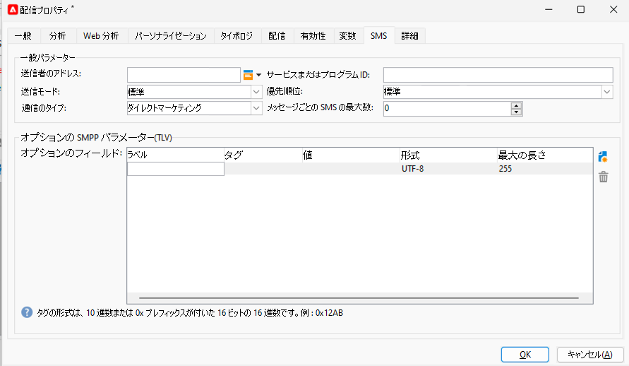

# スタンドアロンインスタンスでの SMS {#sms-standalone}

>[!IMPORTANT]
>
>このドキュメントは、Adobe Campaign v8.7.2 以降を対象としています。
>
>以前のバージョンについて詳しくは、[Campaign Classic v7 ドキュメント](https://experienceleague.adobe.com/ja/docs/campaign-classic/using/sending-messages/sending-messages-on-mobiles/sms-set-up/sms-set-up)を参照してください。

スタンドアロンインスタンスで SMS 配信を送信するには、次が必要です。

1. コネクタとメッセージのタイプを指定する&#x200B;**外部アカウント**。[詳しくは、こちらを参照してください](#external-account)

1. この外部アカウントの参照元となる&#x200B;**配信テンプレート**。[詳しくは、こちらを参照してください](#sms-delivery-template)

## 外部アカウントの作成 {#external-account}

>[!IMPORTANT]
>
>複数の外部 SMS アカウントに同じアカウントとパスワードを使用すると、アカウント間で競合や重複が生じる可能性があります。詳しくは、[SMS のトラブルシューティングページ](smpp-connection.md#sms-troubleshooting)を参照してください。

SMPP 外部アカウントを作成する手順は次のとおりです。

1. **[!UICONTROL 管理]**／**[!UICONTROL プラットフォーム]**／**[!UICONTROL 外部アカウント]**&#x200B;で、**[!UICONTROL 新規]**&#x200B;アイコンをクリックします

   {zoomable="yes"}

1. 外部アカウントの&#x200B;**[!UICONTROL ラベル]**&#x200B;と&#x200B;**[!UICONTROL 内部名]**&#x200B;を設定します。アカウントタイプを&#x200B;**[!UICONTROL ルーティング]**&#x200B;として定義し、「**[!UICONTROL 有効]**」ボックスをオンにして、チャネルに「**[!UICONTROL モバイル（SMS）]**」、配信モードに「**[!UICONTROL 一括配信]**」を選択します。

   {zoomable="yes"}

1. 「**[!UICONTROL モバイル]**」タブで、**[!UICONTROL コネクタ]**&#x200B;ドロップダウンリストにある&#x200B;**[!UICONTROL 拡張された汎用 SMPP]** をそのままにしておきます。
デフォルトでは、「**[!UICONTROL 専用プロセスを通じてメッセージを送信]**」ボックスがオンになっています。

   {zoomable="yes"}

   接続を設定するには、このフォームのタブに入力する必要があります。詳しくは、[SMPP 外部アカウントの詳細情報](smpp-external-account.md#smpp-connection-settings)を参照してください。

## 配信テンプレートの設定 {#sms-delivery-template}

SMS 配信の作成を容易にするには、SMPP 外部アカウントが参照される SMS 配信テンプレートを作成します。

**[!UICONTROL リソース]**／**[!UICONTROL テンプレート]**／**[!UICONTROL 配信テンプレート]**&#x200B;で、既存のモバイル配信テンプレートを右クリックし、「**[!UICONTROL 複製]**」を選択します。

{zoomable="yes"}

テンプレートの&#x200B;**[!UICONTROL ラベル]**&#x200B;と&#x200B;**[!UICONTROL 内部名]**&#x200B;を簡単に認識できるように変更し、「**[!UICONTROL プロパティ]**」ボタンをクリックします。

{zoomable="yes"}

「**[!UICONTROL 一般]**」タブの&#x200B;**[!UICONTROL ルーティング]**&#x200B;で、SMPP 外部アカウントを選択します。

{zoomable="yes"}

「**[!UICONTROL SMS]**」タブでは、テンプレートにオプションのパラメーターを追加できます。

{zoomable="yes"}

[詳しくは、この SMS タブの設定を参照してください](sms-delivery-settings.md)。
