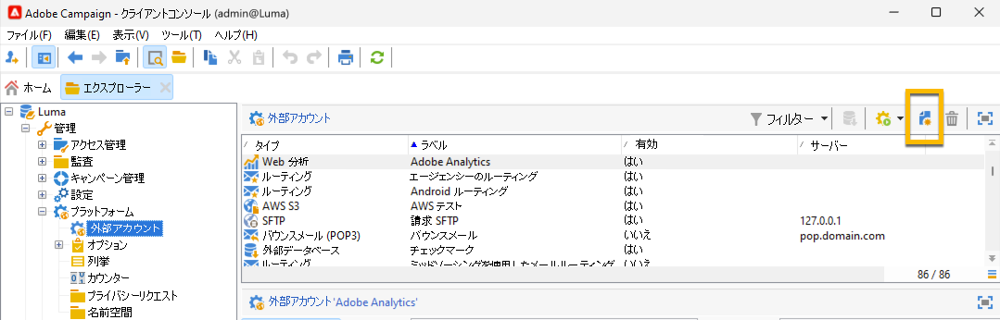
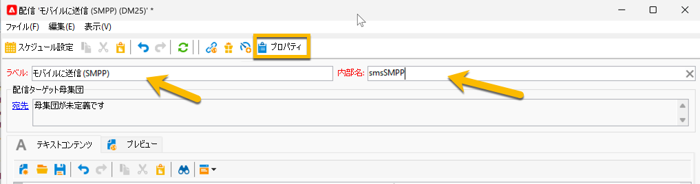

# スタンドアロンインスタンスの SMS {#sms-standalone}

>[!IMPORTANT]
>
>このドキュメントは、Adobe Campaign v8.7.2 以降を対象としています。
>
>古いバージョンについては、[Campaign Classic v7 ドキュメント ](https://experienceleague.adobe.com/en/docs/campaign-classic/using/sending-messages/sending-messages-on-mobiles/sms-set-up/sms-set-up) を参照してください。

スタンドアロンインスタンスで、SMS 配信を送信するには、次が必要です。

1. コネクタとメッセージのタイプを指定する **外部アカウント**[ 詳しくは、こちらを参照してください ](#external-account)

1. この外部アカウントが参照される **配信テンプレート**。詳しくは、こちらを参照してください 

## 外部アカウントの作成 {#external-account}

>[!IMPORTANT]
>
>複数の外部 SMS アカウントに同じアカウントとパスワードを使用すると、アカウント間で競合や重複が生じる可能性があります。 詳しくは、[SMS のトラブルシューティングページ ](smpp-connection.md#sms-troubleshooting) を参照してください。

SMPP 外部アカウントを作成する手順は次のとおりです。

1. **[!UICONTROL 管理]**/**[!UICONTROL プラットフォーム]**/**[!UICONTROL 外部アカウント]** で、**[!UICONTROL 新規]** アイコンをクリックします

   {zoomable="yes"}

1. 外部アカウントの **[!UICONTROL ラベル]** と **[!UICONTROL 内部名]** を設定します。 アカウントタイプを **[!UICONTROL ルーティング]** として定義し、「**[!UICONTROL 有効]**」チェックボックスをオンにして、チャネルで **[!UICONTROL モバイル （SMS）]** を選択し、配信モードで **[!UICONTROL 一括配信]** を選択します。

   {zoomable="yes"}

1. 「**[!UICONTROL モバイル]**」タブで、「**[!UICONTROL コネクタ]**」ドロップダウンリストに **[!UICONTROL 拡張された汎用 SMPP]** を保持します。
「**[!UICONTROL 専用のプロセスを使用してメッセージを送信]** ボックスは、デフォルトでオンになっています。

   {zoomable="yes"}

   接続を設定するには、このフォームのタブに入力する必要があります。 詳しくは、[SMPP 外部アカウントの詳細情報 ](smpp-external-account.md#smpp-connection-settings) を参照してください。

## 配信テンプレートの設定 {#sms-delivery-template}

SMS 配信の作成を容易にするには、SMPP 外部アカウントが参照される SMS 配信テンプレートを作成します。

**[!UICONTROL リソース]**/**[!UICONTROL テンプレート]**/**[!UICONTROL 配信テンプレート]** で、既存のモバイル配信テンプレートを右クリックし、「**[!UICONTROL 複製]**」を選択します。

{zoomable="yes"}

テンプレートの **[!UICONTROL ラベル]** と **[!UICONTROL 内部名]** を変更して簡単に認識できるようにし、「**[!UICONTROL プロパティ]**」ボタンをクリックします。

{zoomable="yes"}

「**[!UICONTROL 一般]**」タブの **[!UICONTROL ルーティング]** で、SMPP 外部アカウントを選択します。

{zoomable="yes"}

「**[!UICONTROL SMS]**」タブで、テンプレートにオプションのパラメーターを追加できます。

{zoomable="yes"}

[ この SMS タブ設定の詳細を説明します ](sms-delivery-settings.md)。
