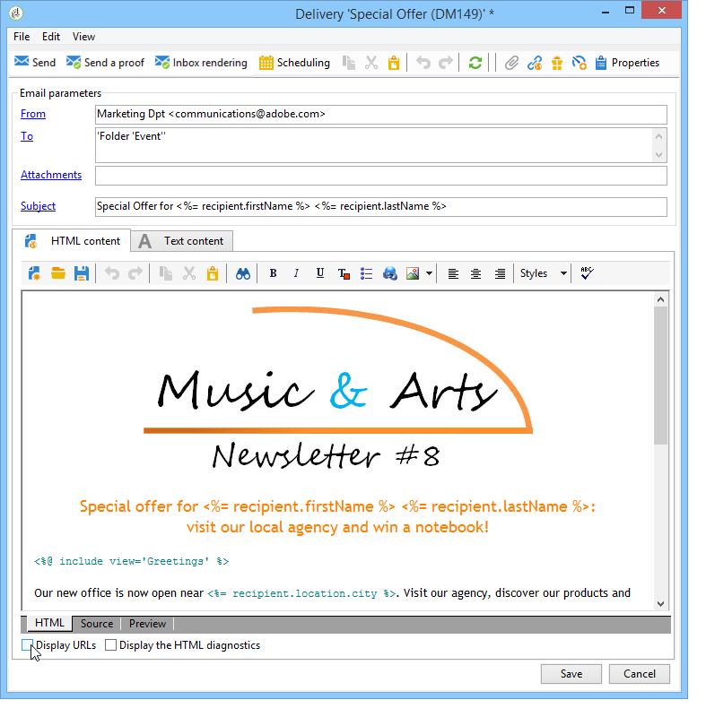

# トラッキング対象リンクの設定 {#how-to-configure-tracked-links}

配信ごとに、メッセージの受信と、メッセージコンテンツに挿入されたリンクの有効化をトラッキングできます。 これによって、ターゲットとした配信アクションに続く受信者の行動をトラッキングできます。

>[!NOTE]
>
>パーソナライゼーションを含む電子メールコンテンツ内のリンクは、特定の構文を追跡する必要があります。 パーソナライズ可能でトラッキングをサポートする電子メールにリンクを追加する方法について詳しくは、[この節](personalized-links.md)を参照してください。

メッセージトラッキングは、デフォルトで有効になっています。 URL のトラッキング方法をパーソナライズするには、以下の手順に従います。

1. 配信アシスタントの下部のセクションで、メッセージコンテンツの下にある「**[!UICONTROL URL を表示]**」オプションを選択します。

   

   トラッキングされる URL のリストから URL を選択すると、ミラーページ内のリンクとデフォルトで提供される購読解除リンクを除いて、配信コンテンツ内でその URL が強調表示されます。

   

1. メッセージの URL ごとに、トラッキングを有効化するかどうかを選択します。

   >[!IMPORTANT]
   >
   >リンクの URL がラベルとして使用されている場合は、トラッキングを無効にしてフィッシングが原因で却下されるリスクを回避することをお勧めします。
   >
   >例えば、www.adobe.com URL がメッセージに挿入され、トラッキングが有効化されている場合、ハイパーテキストリンクのコンテンツは https://nlt.adobe.net/r/?id=xxxxxx に変更されます。 これは、この URL が受信者のメッセージクライアントによって不正とみなされる可能性があることを意味します。

1. 必要に応じて、トラッキングラベルを変更します。それには、ラベルをダブルクリックして、新しいラベルを入力します。

   >[!NOTE]
   >
   >トラッキングされる URL のラベルとラベルを変更して、配信のトラッキング時に情報を見やすくすることができます。 クリック数の計算時には、同じ名前を持つ 2 つの URL または 2 つのラベルがまとめられます。

1. 必要に応じて、トラッキングモードを変更します。それには、次のように、ターゲットとするリンクに対応する&#x200B;**[!UICONTROL トラッキング]**&#x200B;列で新しいモードを選択します。

   

   URL ごとに、トラッキングモードを次のいずれかの値に設定できます。

   * **[!UICONTROL 有効]**：この URL のトラッキングを有効化します。
   * **[!UICONTROL トラッキングなし]**：このURLのトラッキングを無効にします。
   * **[!UICONTROL 常に有効]**：このURLの追跡を常に有効にします。 この情報は保存されるので、次回この URL が将来のメッセージコンテンツに再び表示された場合にそのトラッキングが自動的に有効化されます。
   * **[!UICONTROL トラッキングなし]**：このURLのトラッキングをアクティブにしません。 この情報は保存されるので、次回この URL が将来のメッセージに再び表示された場合にそのトラッキングが自動的に無効化されます。
   * **[!UICONTROL オプトアウト]**：この URL をオプトアウトまたは購読解除 URL とみなします。
   * **[!UICONTROL ミラーページ]**：この URL をミラーページの URL とみなします。

1. 加えて、**[!UICONTROL カテゴリ]**&#x200B;列のドロップダウンリストで、トラッキングする URL のそれぞれに対してカテゴリを選択できます。 これらのカテゴリは、例えば&#x200B;**[!UICONTROL URLとクリックストリーム]** レポートのように、レポートに表示できます（[このセクション ](../reporting/delivery-reports.md#urls-and-click-streams)を参照）。 カテゴリーは、特定の列挙で定義されています：**[!UICONTROL urlCategory]**。 列挙の使用方法について詳しくは、[この節](../config/enumerations.md)を参照してください。

## URL区切り文字のベストプラクティス {#url-delimiters}

トラッキング式を適用する前に、「**[!UICONTROL テキストコンテンツ]**」タブで URL を区切り文字で囲むことを強くお勧めします。 このタブに入力する URL 区切り文字は、Adobe Campaign で文字列内の URL を識別するために使用されます。 次の区切り文字のペアを使用できます。

* 括弧 ( )
* 角括弧 [ ]
* 中括弧 { }

この例では、URL https://www.adobe.com の後にセミコロンが続きます。 セミコロンは、受信者のメールクライアントで、URL の一部として解釈される場合があります。 その結果、リンク切れになる場合があります。 この問題を回避するには、次のいずれかの方法で URL を区切り文字で囲みます。

* (https://www.adobe.com/jp);
* [https://www.adobe.com/jp];
* {https://www.adobe.com/jp};
