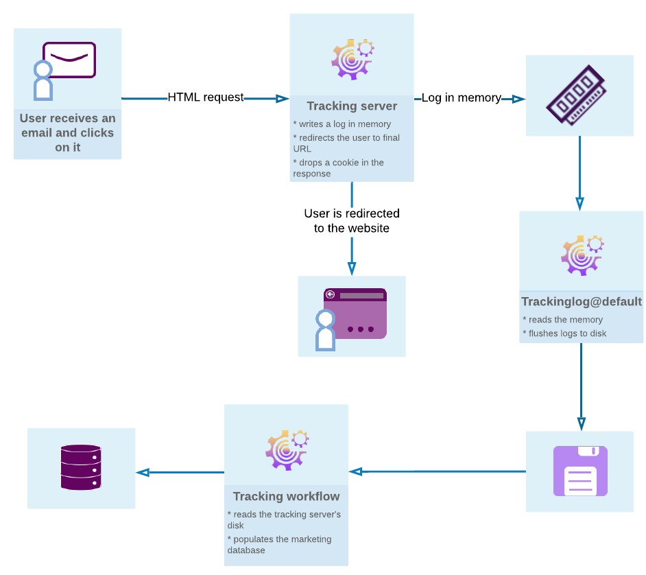

# メッセージトラッキングの基本を学ぶ {#get-started-tracking}

Adobe Campaignのトラッキング機能を使用すると、送信されたメッセージを追跡し、受信者の動作（開封、リンクのクリック、購読解除など）を確認できます。

この情報は、配信の各受信者のプロファイルの「**[!UICONTROL トラッキング]**」タブで取得されます。 このタブには、リストから選択した受信者がトラッキングおよびクリックしたすべての URL が表示されます。 これは、配信画面に現在も表示されている配信内でトラッキングされたすべての URL の累積です。 このリストは設定可能で、一般的には、クリックされた URL、クリックの日時、URL が含まれていたドキュメントが表示されます。

**配信ダッシュボード**&#x200B;は、メッセージの送信中に配信と潜在的な問題を監視するための重要なツールでもあります。

次の図に、ユーザーと様々なサーバー間のダイアログのステージを示します。

>[!NOTE]
>
>トラッキング設定は、Managed Cloud Servicesのデプロイメントに対してAdobeによって実行されます。

## メッセージトラッキング {#message-tracking}

**トラッキングされたリンク**

メッセージの受信とメッセージコンテンツに挿入されたリンクのアクティベーションをトラッキングし、受信者の動作を詳しく把握できます。

[トラッキングリンクについて詳しく見る](tracked-links.md)

**URL トラッキング**

トラッキングオプションは、トラッキングされる URL をアクティブ化または非アクティブ化することで設定できます。

[URL トラッキングオプションについて詳しく見る](url-tracking.md)

**トラッキングされたリンクのパーソナライゼーション**

Campaign のトラッキング機能を使用すると、パーソナライズ可能なメールにリンクを追加し、それによってトラッキングをサポートできます。

[パーソナライズされたリンクトラッキングについて詳しく見る](personalized-links.md)

**トラッキングログ**

配信が送信され、トラッキングがアクティブ化されると、**トラッキング**&#x200B;テクニカルワークフローがトラッキングデータを取得します。 このデータは、配信の「トラッキング」タブに表示されます。

[トラッキングログについて詳しく見る](tracking-logs.md)

**トラッキングのテスト**

トラッキングが有効なメッセージを送信する前に、ミラーページ、メールログ、およびリンクでトラッキングをテストできます。

[テストトラッキングについて詳しく見る](testing-tracking.md)

## トラッキングレポート {#tracking-reports}

**トラッキング統計**

このレポートを使用すると、開封数、クリック数、トランザクション数などに関する統計が得られ、配信のマーケティング効果をトラッキングできます。

[レポートの追跡について詳しく見る](../reporting/delivery-reports.md#tracking-indicators)

**URL とクリックストリーム**

このレポートでは、配信後に訪問されたページのリストを表示します。

[URLとクリックストリームについて詳しく見る](../reporting/delivery-reports.md#urls-and-click-streams)

**「人」と「受信者」**

Adobe Campaign における「人」と「受信者」のトラッキングの違いについて、この例でより深く理解します。

[ターゲットとなるユーザーと受信者について詳しく見る](../reporting/metrics-calculation.md#targeted-persons---recipients)

**トラッキング指標**

このレポートでは、開封率、クリックスルー率、クリックストリームなど、配信を受け取ったときの受信者の行動をトラッキングする主要な指標を組み合わせます。

[トラッキング指標について詳しく見る](../reporting/delivery-reports.md#tracking-indicators)

**指標の計算**

各テーブルでは、様々なレポートで使用する指標のリストと、配信タイプに応じた計算式を示しています。

[インジケーターの計算について詳しく見る](../reporting/metrics-calculation.md)

