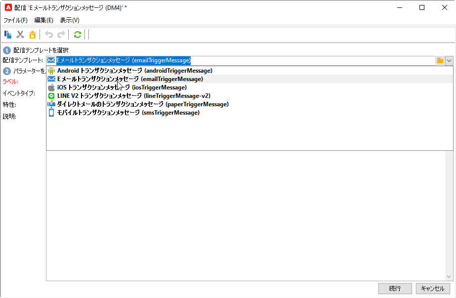
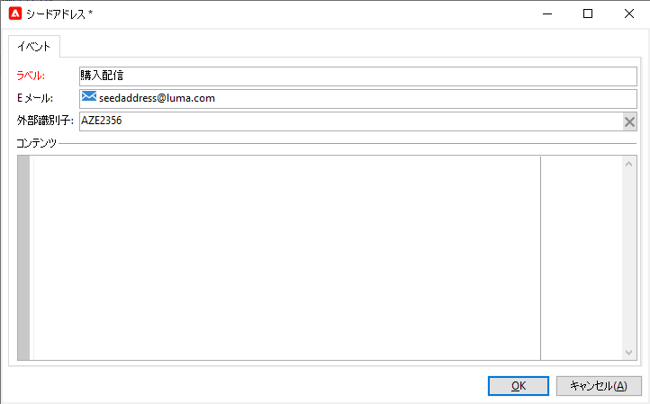
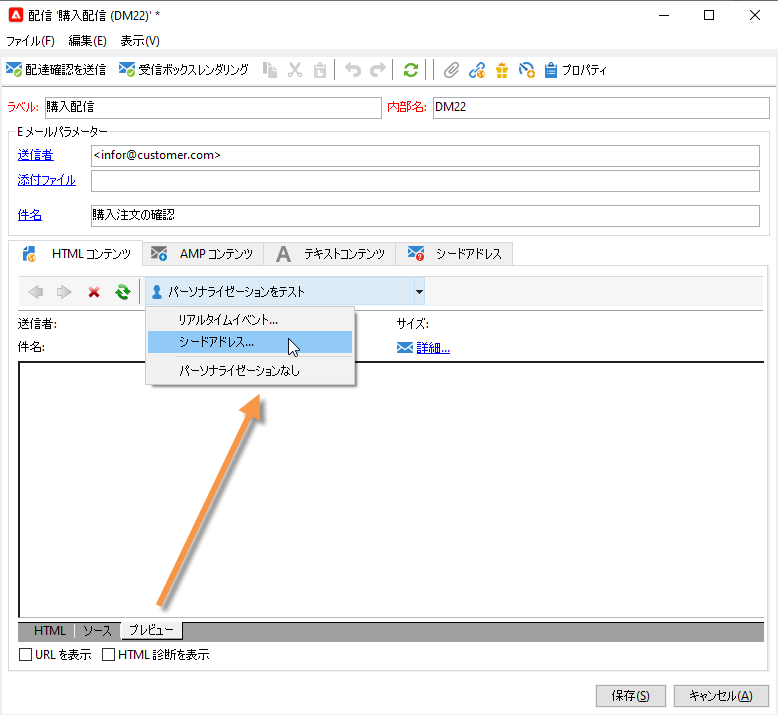
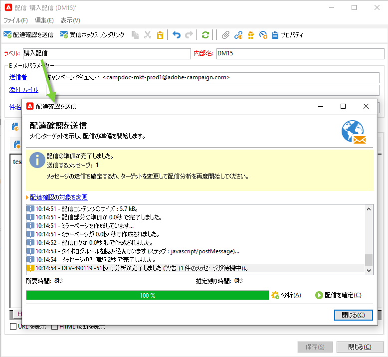
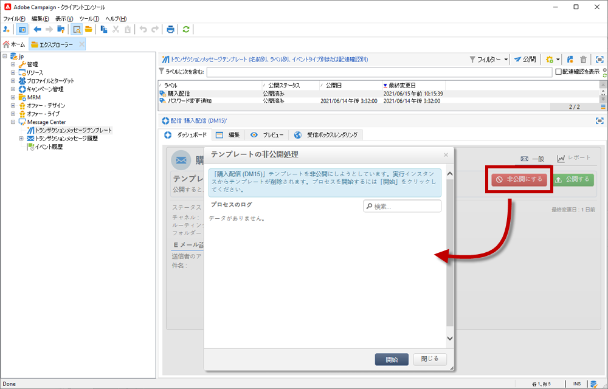

# トランザクションメッセージ用のテンプレートの作成と公開{#template-transactional-messages}

各イベントは、パーソナライズされたメッセージをトリガーにすることができます。 そのためには、各イベントタイプと一致するメッセージのテンプレートを作成する必要があります。テンプレートには、トランザクションメッセージをパーソナライズするのに必要な情報が含まれています。また、テンプレートを使用すると、メッセージのプレビューを検証したり、最終ターゲットへ配信する前にシードアドレスを使用した配達確認を送信することもできます。

## テンプレートの作成{#create-message-template}

メッセージテンプレートを作成するには、次の手順に従います。

1. Adobe Campaign のツリーにて、**[!UICONTROL Message Center／トランザクションメッセージテンプレート]**&#x200B;フォルダーに移動します。
1. トランザクションメッセージテンプレートのリスト内を右クリックし、ドロップダウンメニューで「**[!UICONTROL 新規]**」を選択するか、トランザクションメッセージテンプレートのリストの上部にある「**[!UICONTROL 新規]**」ボタンをクリックします。

   

1. 配信ウィンドウで、使用したいチャネルに適した配信テンプレートを選択します。

   

1. 必要に応じて、ラベルを変更します。
1. 送信したいメッセージに合うイベントのタイプを選択します。Adobe Campaign が処理するイベントのタイプは、事前に作成する必要があります。[詳細情報](#create-event-types)

   

   >[!CAUTION]
   >
   >1 つのイベントタイプを複数のテンプレートにリンクすることはできません。

1. 特性と説明を入力したら、「**[!UICONTROL 続行]**」をクリックしてメッセージの本文を作成します。

## コンテンツの作成{#create-message-content}

トランザクションメッセージのコンテンツの定義、Adobe Campaign のすべての配信と同様です。例えば、メール配信では、HTML やテキスト形式でコンテンツを作成、添付ファイルを追加、または配信オブジェクトをパーソナライズできます。[詳細情報](../start/create-message.md)。

>[!CAUTION]
>
>メッセージに含まれる画像は、公的にアクセス可能でなければなりません。Adobe Campaign には、トランザクションメッセージ用の画像アップロードのメカニズムがありません。\
>JSSP や web アプリとは異なり、`<%=` にはデフォルトのエスケープ機能がありません。
>
>イベントから取得する各データを適切にエスケープする必要があります。このエスケープ方法は、このフィールドの使用方法によって異なります。例えば、URL 内では、encodeURIComponent を使用します。HTML に表示する場合は、escapeXMLString を使用できます。

メッセージのコンテンツを定義したら、メッセージ本文にイベントの情報を取り入れ、パーソナライズすることができます。イベントの情報は、パーソナライゼーションタグを使用してテキスト本文に挿入します。

* すべてのパーソナライゼーションフィールドはペイロードから取得されます。
* トランザクションメッセージ内では、1 つまたは複数のパーソナライゼーションブロックを参照できます。<!--The block content will be added to the delivery content during the publication to the execution instance.-->

パーソナライゼーションタグをメールメッセージの本文に挿入するには、次の手順に従います。

1. メッセージのテンプレートで、メールフォーマットに合うタブをクリックします（HTML またはテキスト）。
1. メッセージの本文を入力します。
1. テキスト本文に&#x200B;**[!UICONTROL リアルタイムイベント／イベント XML]** メニューを使用してタグを挿入します。

   

1. 下記に示すように、タグの入力には次の構文を利用します。**要素名**.@**属性名**

   

## トランザクションメッセージテンプレートのテスト {#test-message-template}

### シードアドレスの追加{#add-seeds}

シードアドレスを使用すると、メッセージを送信する前に、メッセージのプレビューを表示したり、配達確認を送信したり、メッセージのパーソナライズ機能を検証したりできます。シードアドレスはこの配信に関連付けられており、その他の配信に利用することはできません。

1. トランザクションメッセージテンプレートで「**[!UICONTROL シードアドレス]**」タブをクリックし、「**[!UICONTROL 追加]**」ボタンをクリックします。

   

1. 後で簡単に選択できるようにラベルを割り当て、シードアドレス（通信チャネルに応じてメールまたは携帯電話）を入力します。

1. 外部識別子を入力します。このオプションのフィールドには、web サイト上のすべてのアプリケーションに共通し、プロファイルを識別するのに利用できるビジネスキー（一意の識別子、名前 +メールなど）を入力することができます。Adobe Campaign マーケティングデータベースにもこのフィールドが存在する場合、データベース内のプロファイルとイベントを紐付けることができます。

   

1. テストデータを挿入します。[この節](#personalization-data)を参照してください。

   

1. 「**[!UICONTROL OK]**」をクリックして、シードアドレスの作成を確定します。

1. この手順を繰り返して、必要な数のアドレスを作成します。

   

アドレスを作成したら、プレビューとパーソナライズ機能を利用できます。

<!--

### Add personalization data{#personalization-data}

You can add data in the message template to test transactional message personalization. This will allow you to generate a preview or send a proof. If you install the **Deliverability** module, this data allows you to display a rendering of the messages for various desktop, web or mobile clients.

The purpose of this data is to test your messages before their final delivery. These messages do not coincide with actual data to be processed by Message Center.

However, the XML structure must be identical to that of the event stored in the execution instance, as shown below. 

This information enables you to personalize message content using personalization tags.

1. In the message template, click the **[!UICONTROL Seed addresses]** tab.
1. In the event content, enter the test information in XML format.

   
-->

### トランザクションメッセージのプレビュー{#transactional-message-preview}

1 つまたは複数のシードアドレスとメッセージ本文を作成したら、メッセージをプレビューして、パーソナライゼーションを確認することができます。

1. メッセージテンプレートで「**[!UICONTROL プレビュー]**」タブをクリックし、ドロップダウンリストで「**[!UICONTROL シードアドレス]**」を選択します。

   

1. 作成済みのシードアドレスを選択してパーソナライズされたメッセージを表示します。

   

### 配達確認の送信 {#send-proof}

作成済みのシードアドレスへ配達確認を送信することで、メッセージ配信をテストできます。

配達確認の送信は、配信の場合と同じプロセスでおこないます。

配達確認について詳しくは、[この節](../send/preview-and-proof.md#proofs-send)を参照してください。

ただし、トランザクションメッセージの配達確認を送信するためには、次の操作が必要です。

* パーソナライズ機能のテストデータを使用して 1 つまたは複数の[シードアドレス](#add-seeds)を作成します
* メッセージコンテンツの作成

配達確認を送信するには：

1. 配信ウィンドウで、「**[!UICONTROL 配達確認を送信]**」ボタンをクリックします。
1. 配信を分析します。
1. エラーを修正し、配信を確認します。

   

1. シードアドレスにメッセージが配信されたこと、およびそのコンテンツが設定どおりであることを確認します。

   

配達確認は、各テンプレートの「**[!UICONTROL 監査]**」タブからアクセスできます。

#### [!DNL Campaign Classic] v7 からの移行 {#transition-from-v7}

[Campaign Classic v7 から移行](../start/v7-to-v8.md)する場合は、すべての配信がミッドソーシングサーバーを経由します。

ただし、トランザクションメッセージテンプレートを作成する場合、テンプレートを正常に使用するために必要なルーティングは、**内部メール配信**&#x200B;です。このルーティングにより、配達確認を送信できなくなります。

したがって、トランザクションメッセージテンプレートに配達確認を送信するには、ルーティングを内部メール配信から&#x200B;**ミッドソーシングルーティングアカウント**&#x200B;に変更する必要があります。

配達確認を送信したら、トランザクションメッセージテンプレートを公開する前に、ルーティングを内部メール配信に戻す必要があります。

## テンプレートの公開 {#publish-message-template}

メッセージテンプレートの作成<!-- on the control instance-->が完了したら公開できます。これにより、リアルタイムイベントとバッチイベントにリンクされたメッセージを送信できます。

<!--This process will also publish it on all execution instances.

NOTE: When publishing transactional message templates, typology rules are also automatically published on the execution instances.

Publication lets you automatically create two message templates on the execution instances, which will allow you to send messages linked to real-time and batch events.-->

>[!CAUTION]
>
>テンプレートに変更を加えた場合は、トランザクションメッセージの配信中に変更が有効になるように、必ず再度公開します。

1. ツリーの **[!UICONTROL Message Center／トランザクションメッセージテンプレート]**&#x200B;フォルダーに移動します。
1. 公開するテンプレートを選択します。<!--on your execution instances-->
1. 「**[!UICONTROL 公開]**」をクリックします。

   

公開が完了すると、**[!UICONTROL 管理／実稼働環境／Message Center の実行／デフォルト／トランザクションメッセージテンプレート]**&#x200B;フォルダー内に、バッチおよびリアルタイムタイプのイベントに適用されるメッセージテンプレートの両方が作成されます。

テンプレートが公開され、対応するイベントがトリガーされた場合、Adobe Campaign<!--execution instance--> はイベントを受け取り、トランザクションテンプレートにリンクし、対応するトランザクションメッセージを各受信者に送信します。

<!--
>[!NOTE]
>
>If you replace an existing field of the transactional message template, such as the sender address, with an empty value, the corresponding field on the execution instance(s) will not be updated once the transactional message is published again. It will still contain the previous value.
>
>However, if you add a non-empty value, the corresponding field will be updated as usual after the next publication.
-->

## テンプレートの非公開

メッセージテンプレートが公開された後 <!--on the execution instances-->、非公開にすることができます。

* 実際、対応するイベントがトリガーされた場合、公開済みのテンプレートは引き続き呼び出すことができます。メッセージテンプレートを使用しなくなった場合は、非公開にすることをお勧めします。これは、不要なトランザクションメッセージを誤って送信するのを避けるためです。

  例えば、クリスマスキャンペーンにのみ使用するメッセージテンプレートを公開したとします。クリスマス期間が終わったらテンプレートを非公開にして、来年の同時期に再度パブリッシュすることができます。

* また、ステータスが「**[!UICONTROL パブリッシュ済み]**」のトランザクションメッセージテンプレートは削除できません。最初にテンプレートを非公開にする必要があります。

トランザクションメッセージテンプレートを非公開にするには、次の手順に従います。

1. **[!UICONTROL Message Center／トランザクションメッセージテンプレート]**&#x200B;フォルダーを参照します。
1. 非公開にするテンプレートを選択します。
1. 「**[!UICONTROL 非公開にする]**」をクリックします。
1. 「**[!UICONTROL 開始]**」をクリックします。

トランザクションメッセージテンプレートのステータスが「**[!UICONTROL パブリッシュ済み]**」から「**[!UICONTROL 編集中]**」に変わります。

非公開にした後は、以下のようになります。

* 両方のメッセージテンプレート（バッチイベントとリアルタイムタイプのイベントに適用）が削除されます<!-- from each execution instance-->。

  これらのテンプレートが、**[!UICONTROL 管理／プロダクション／Message Center の実行／デフォルト／トランザクションメッセージテンプレート]**&#x200B;フォルダーに表示されなくなりました。

* テンプレートを非公開にした後は、削除できます<!-- from the control instance-->。

  これを行うには、リストからテンプレートを選択し、画面の右上にある「**[!UICONTROL 削除]**」ボタンをクリックします。
