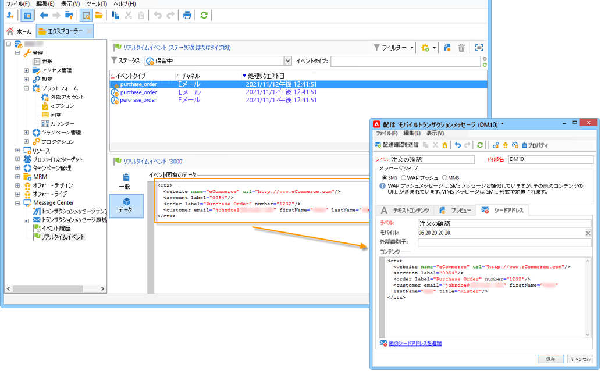

# トランザクションメッセージの概要{#send-transactional-messages}

トランザクションメッセージ（Message Center）は、トリガーメッセージを管理するために設計されたキャンペーンモジュールです。これらの通知は、情報システムからトリガーされるイベントから生成され、次のことができます。請求書、注文確認、配送確認、パスワード変更、製品の不在通知、取引明細書、web サイトアカウントの作成など

  管理対象Cloud Servicesユーザーとして、 [連絡先Adobe](../start/campaign-faq.md#support){target=&quot;_blank&quot;} ：お使いの環境でキャンペーントランザクションメッセージを設定します。

トランザクションメッセージは、次の送信に使用します。

* 通知（注文確認やパスワードのリセットなど）
* 個々の顧客のアクションに対するリアルタイムでの応答
* 宣伝以外のコンテンツ

 トランザクションメッセージの設定について詳しくは、[この節](../config/transactional-msg-settings.md)を参照してください。

 に関するトランザクションメッセージアーキテクチャを理解する [このページ](../architecture/architecture.md#transac-msg-archi).

## トランザクションメッセージの動作原理 {#transactional-messaging-operating-principle}

Adobe Campaign のトランザクションメッセージモジュールは情報システムに組み込まれ、システムはパーソナライズされたトランザクションメッセージに変換するイベントを返します。これらのメッセージはメール、SMS、プッシュ通知などを介して、個別に送信することも、まとめて送信することもできます。

例えば、顧客が製品を購入できる ｗeb サイトを持つ会社の例で考えてみます。

Adobe Campaign を使用すると、買い物かごに製品を追加した顧客に通知メールを送信できます。Web サイトを訪れた人が購入せずにサイトを離れると（キャンペーンイベントをトリガーする外部イベント）、買い物かごの放棄に伴うメールを自動的に送信できます（トランザクションメッセージ配信）。

これをおこなう主な手順を次に示します。

1. [イベントタイプの作成](#create-event-types)。
1. [メッセージテンプレートの作成とデザイン](#create-message-template)。この手順で、イベントをメッセージにリンクします。
1. [メッセージのテスト](#test-message-template)。
1. [メッセージテンプレートのパブリッシュ](#publish-message-template)。

トランザクションメッセージテンプレートを設計して公開すると、対応するイベントがトリガーされた場合、関連するデータは PushEvent および PushEvents を介して Campaign に送信されます [SOAP メソッド](https://experienceleague.adobe.com/docs/campaign-classic/using/transactional-messaging/processing/event-description.html?lang=ja){target=&quot;_blank&quot;} の場合は、ターゲットの受信者に配信が送信されます。

## イベントタイプの作成 {#create-event-types}

各イベントをパーソナライズされたメッセージに変更するには、まず&#x200B;**イベントタイプ**&#x200B;を作成します。

[メッセージテンプレートを作成](#create-message-template)する際、送信するメッセージに一致するイベントのタイプを選択します。

>[!CAUTION]
>
>イベントタイプをメッセージテンプレートで使用するには、事前に作成しておく必要があります。

Adobe Campaign で処理されるイベントタイプを作成するには、次の手順に従います。

1. ツリーの&#x200B;**[!UICONTROL 管理／プラットフォーム／列挙]**&#x200B;フォルダーに移動します。

1. リストから&#x200B;**[!UICONTROL イベントタイプ]**&#x200B;を選択します。

1. 「**[!UICONTROL 追加]**」をクリックして、列挙の値を作成します。注文の確認、パスワードの変更、注文の配送変更などがイベントタイプとして考えられます。

   

   >[!CAUTION]
   >
   >各イベントタイプは、**[!UICONTROL イベントタイプ]**&#x200B;の列挙の値と一致する必要があります。

1. 項目別リストの値を作成した後、作成事項を反映させるためには、一旦インスタンスからログオフし再度ログオンします。

>[!NOTE]
>
>項目別リストの詳細については、 [Campaign Classicv7 ドキュメント](https://experienceleague.adobe.com/docs/campaign-classic/using/getting-started/administration-basics/managing-enumerations.html?lang=ja){target=&quot;_blank&quot;}。

## トランザクションメッセージテンプレートの定義 {#create-message-template}

各イベントをトリガーにして、パーソナライズされたメッセージを送信することができます。そのためには、各イベントタイプと一致するメッセージのテンプレートを作成する必要があります。テンプレートには、トランザクションメッセージをパーソナライズするのに必要な情報が含まれています。また、テンプレートを使用すると、メッセージのプレビューを検証したり、最終ターゲットへ配信する前にシードアドレスを使用した配達確認を送信することもできます。

### テンプレートの作成

メッセージテンプレートを作成するには、次の手順に従います。

1. Adobe Campaign のツリーにて、**[!UICONTROL Message Center／トランザクションメッセージテンプレート]**&#x200B;フォルダーに移動します。
1. トランザクションメッセージテンプレートのリスト内を右クリックし、ドロップダウンメニューで「**[!UICONTROL 新規]**」を選択するか、トランザクションメッセージテンプレートのリストの上部にある「**[!UICONTROL 新規]**」ボタンをクリックします。

   

1. 配信ウィンドウで、使用したいチャネルに適した配信テンプレートを選択します。

   

1. 必要に応じて、ラベルを変更します。
1. 送信したいメッセージに合うイベントのタイプを選択します。Adobe Campaignが処理する予定のイベントタイプは、事前に作成しておく必要があります。 [詳細情報](#create-event-types)

   

   >[!CAUTION]
   >
   >1 つのイベントタイプを複数のテンプレートにリンクすることはできません。

1. 特性と説明を入力したら、「**[!UICONTROL 続行]**」をクリックしてメッセージの本文を作成します。

### コンテンツの作成{#create-message-content}

トランザクションメッセージのコンテンツの定義、Adobe Campaign のすべての配信と同様です。例えば、メール配信では、HTML やテキスト形式でコンテンツを作成、添付ファイルを追加、または配信オブジェクトをパーソナライズできます。[詳細情報](../start/create-message.md)。

>[!CAUTION]
>
>メッセージに含まれる画像は、公的にアクセス可能でなければなりません。Adobe Campaign には、トランザクションメッセージ用の画像アップロードのメカニズムがありません。\
>JSSP や Web アプリとは異なり、`<%=` にはデフォルトのエスケープ機能がありません。
>
>イベントから取得する各データを適切にエスケープする必要があります。このエスケープ方法は、このフィールドの使用方法によって異なります。例えば、URL 内では、encodeURIComponent を使用します。HTML に表示する場合は、escapeXMLString を使用できます。

メッセージのコンテンツを定義したら、メッセージ本文にイベントの情報を取り入れ、パーソナライズすることができます。イベントの情報は、パーソナライゼーションタグを使用してテキスト本文に挿入します。

* すべてのパーソナライゼーションフィールドはペイロードから取得されます。
* トランザクションメッセージ内では、1 つまたは複数のパーソナライゼーションブロックを参照できます。<!--The block content will be added to the delivery content during the publication to the execution instance.-->

パーソナライゼーションタグを E メールメッセージの本文に挿入するには、次の手順に従います。

1. メッセージのテンプレートで、E メールのフォーマットに合うタブをクリックします（HTML またはテキスト）。
1. メッセージの本文を入力します。
1. テキスト本文に&#x200B;**[!UICONTROL リアルタイムイベント／イベント XML]** メニューを使用してタグを挿入します。

   

1. 下記に示すように、タグの入力には次の構文を利用します。**要素名**.@**属性名**

   

## トランザクションメッセージテンプレートのテスト {#test-message-template}

### シードアドレスの追加{#add-seeds}

シードアドレスを使用すると、メッセージを送信する前に、メッセージのプレビューを表示したり、配達確認を送信したり、メッセージのパーソナライズ機能を検証したりできます。シードアドレスはこの配信に関連付けられており、その他の配信に利用することはできません。

1. トランザクションメッセージテンプレートで「**[!UICONTROL シードアドレス]**」タブをクリックし、「**[!UICONTROL 追加]**」ボタンをクリックします。

   

1. 後で簡単に選択できるようにラベルを割り当て、シードアドレス（通信チャネルに応じてメールまたは携帯電話）を入力します。

1. 外部識別子を入力します。このオプションのフィールドには、web サイト上のすべてのアプリケーションに共通し、プロファイルを識別するのに利用できるビジネスキー（一意の識別子、名前 + E メールなど）を入力することができます。Adobe Campaign マーケティングデータベースにもこのフィールドが存在する場合、データベース内のプロファイルとイベントとを照合することができます。

   

1. テストデータを挿入します。 [この節](#personalization-data)を参照してください。

   

1. 「**[!UICONTROL OK]**」をクリックして、シードアドレスの作成を確定します。

1. この手順を繰り返して、必要な数のアドレスを作成します。

   

アドレスを作成したら、プレビューとパーソナライズ機能を利用できます。

<!--

### Add personalization data{#personalization-data}

You can add data in the message template to test transactional message personalization. This will allow you to generate a preview or send a proof. If you install the **Deliverability** module, this data allows you to display a rendering of the messages for various desktop, web or mobile clients.

The purpose of this data is to test your messages before their final delivery. These messages do not coincide with actual data to be processed by Message Center.

However, the XML structure must be identical to that of the event stored in the execution instance, as shown below. 

This information enables you to personalize message content using personalization tags.

1. In the message template, click the **[!UICONTROL Seed addresses]** tab.
1. In the event content, enter the test information in XML format.

   
-->

### トランザクションメッセージのプレビュー{#transactional-message-preview}

1 つまたは複数のシードアドレスとメッセージ本文を作成したら、メッセージをプレビューして、パーソナライゼーションを確認することができます。

1. メッセージテンプレートで「**[!UICONTROL プレビュー]**」タブをクリックし、ドロップダウンリストで「**[!UICONTROL シードアドレス]**」を選択します。

   

1. 作成済みのシードアドレスを選択してパーソナライズされたメッセージを表示します。

   

### 配達確認の送信

作成済みのシードアドレスへ配達確認を送信することで、メッセージ配信をテストできます。

配達確認の送信は、配信の場合と同じプロセスでおこないます。

 配達証明の詳細については、[Campaign Classic v7 ドキュメント](https://experienceleague.adobe.com/docs/campaign-classic/using/sending-messages/key-steps-when-creating-a-delivery/steps-validating-the-delivery.html#sending-a-proof){target=&quot;_blank&quot;}を参照してください

ただし、トランザクションメッセージの配達確認を送信するためには、次の操作が必要です。

* パーソナライズ機能のテストデータを使用して 1 つまたは複数の[シードアドレス](#add-seeds)を作成します
* メッセージコンテンツの作成

配達確認を送信するには：

1. 配信ウィンドウで、「**[!UICONTROL 配達確認を送信]**」ボタンをクリックします。
1. 配信を分析します。
1. エラーを修正し、配信を確認します。

   

1. シードアドレスにメッセージが配信されたこと、およびそのコンテンツが設定どおりであることを確認します。

   

配達確認は、各テンプレートの「**[!UICONTROL 監査]**」タブからアクセスできます。

## テンプレートの公開 {#publish-message-template}

メッセージテンプレートが作成されたとき<!-- on the control instance--> が完了したら、パブリッシュできます。これにより、リアルタイムイベントとバッチイベントにリンクされたメッセージを送信できます。

<!--This process will also publish it on all execution instances.

NOTE: When publishing transactional message templates, typology rules are also automatically published on the execution instances.

Publication lets you automatically create two message templates on the execution instances, which will allow you to send messages linked to real-time and batch events.-->

>[!CAUTION]
>
>テンプレートに変更を加えた場合は、トランザクションメッセージの配信中に変更が有効になるように、必ず再度パブリッシュします。

1. 次に移動： **[!UICONTROL Message Center/トランザクションメッセージテンプレート]** ツリーのフォルダー。
1. 公開するテンプレートを選択します<!--on your execution instances-->.
1. 「**[!UICONTROL パブリッシュ]**」をクリックします。

   

公開が完了すると、バッチイベントとリアルタイムタイプイベントに適用されるメッセージテンプレートが両方とも **[!UICONTROL 管理/プロダクション/Message Center の実行/デフォルト/トランザクションメッセージテンプレート]** フォルダー。

テンプレートが公開されると、対応するイベントがトリガーされる場合、Adobe Campaign<!--execution instance--> がイベントを受け取り、トランザクションテンプレートにリンクして、対応するトランザクションメッセージを各受信者に送信します。

<!--
>[!NOTE]
>
>If you replace an existing field of the transactional message template, such as the sender address, with an empty value, the corresponding field on the execution instance(s) will not be updated once the transactional message is published again. It will still contain the previous value.
>
>However, if you add a non-empty value, the corresponding field will be updated as usual after the next publication.
-->

## テンプレートの非公開

メッセージテンプレートが公開された後 <!--on the execution instances-->非公開にすることができます。

* 実際、対応するイベントがトリガーされた場合、公開済みのテンプレートは引き続き呼び出すことができます。メッセージテンプレートを使用しなくなった場合は、非公開にすることをお勧めします。 これは、不要なトランザクションメッセージを誤って送信するのを避けるためです。

   例えば、クリスマスキャンペーンにのみ使用するメッセージテンプレートを公開したとします。クリスマス期間が終わったらテンプレートを非公開にして、来年の同時期に再度パブリッシュすることができます。

* また、ステータスが「**[!UICONTROL パブリッシュ済み]**」のトランザクションメッセージテンプレートは削除できません。最初にテンプレートを非公開にする必要があります。

トランザクションメッセージテンプレートを非公開にするには、次の手順に従います。

1. 次を参照： **[!UICONTROL Message Center/トランザクションメッセージテンプレート]** フォルダー。
1. 非公開にするテンプレートを選択します。
1. 「**[!UICONTROL 非公開にする]**」をクリックします。
1. 「**[!UICONTROL 開始]**」をクリックします。

トランザクションメッセージテンプレートのステータスが「**[!UICONTROL パブリッシュ済み]**」から「**[!UICONTROL 編集中]**」に変わります。

非公開にした後は、以下のようになります。

* 両方のメッセージテンプレート（バッチイベントとリアルタイムタイプイベントに適用）が削除されます<!-- from each execution instance-->.

   これらのテンプレートは、**[!UICONTROL 管理／プロダクション／Message Center の実行／デフォルト／トランザクションメッセージテンプレート]**&#x200B;フォルダーに表示されなくなりました。

* テンプレートを非公開にした後は、削除できます<!-- from the control instance-->.

   これをおこなうには、リストからテンプレートを選択し、画面の右上にある「**[!UICONTROL 削除]**」ボタンをクリックします。
