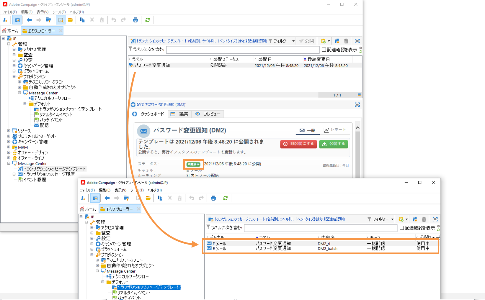

# トランザクションメッセージを使用する前に{#send-transactional-messages}

トランザクションメッセージ（Message Center）は、トリガーメッセージを管理するために設計されたキャンペーンモジュールです。これらのメッセージは、情報システムからトリガーされたイベントから生成されます。例えば、請求書、オーダー確認、出荷確認、パスワード変更、製品入手不可通知、アカウントステートメント、Web サイトアカウント作成などのメッセージがあります。

:speech_balloon:管理対象Cloud Servicesのユーザーとして、[Adobe](../start/support.md#support)に連絡して、キャンペーントランザクションメッセージを環境にインストールして設定します。

トランザクションメッセージは、次の送信に使用されます。

* 通知（注文の確認やパスワードのリセットなど）
* 顧客行動に対する個々のリアルタイム対応
* 宣伝以外の内容

:bulb:トランザクションメッセージングの設定については、[このセクション](../config/transactional-msg-settings.md)で詳しく説明します。

:bulb:[このページ](../dev/architecture.md)のトランザクションメッセージングのアーキテクチャを理解します。

>[!CAUTION]
>
>トランザクションメッセージを利用するには特定のライセンスが必要です。使用許諾契約書を確認してください。

## トランザクションメッセージテンプレートの定義

各イベントは、パーソナライズされたメッセージをトリガーできます。 これを行うには、各イベントタイプに一致するメッセージテンプレートを作成する必要があります。 テンプレートには、トランザクションメッセージをパーソナライズするのに必要な情報が含まれています。また、テンプレートを使用すると、メッセージのプレビューを検証したり、最終ターゲットへ配信する前にシードアドレスを使用した配達確認を送信することもできます。

### テンプレートの作成

メッセージテンプレートを作成するには、次の手順に従います。

1. Adobe Campaign のツリーにて、**[!UICONTROL Message Center／トランザクションメッセージテンプレート]**&#x200B;フォルダーに移動します。
1. トランザクションメッセージテンプレートのリスト内を右クリックし、ドロップダウンメニューで「**[!UICONTROL 新規]**」を選択するか、トランザクションメッセージテンプレートのリストの上部にある「**[!UICONTROL 新規]**」ボタンをクリックします。

   

1. 配信ウィンドウで、使用したいチャネルに適した配信テンプレートを選択します。

   

1. 必要に応じて、ラベルを変更します。
1. 送信したいメッセージに合うイベントのタイプを選択します。

   

   Adobe Campaignで処理されるイベントタイプは、コントロールインスタンス内でAdobe別に作成する必要があります。

   >[!NOTE]
   >
   >イベントタイプを複数のテンプレートにリンクしないでください。

1. 特性と説明を入力し、「**[!UICONTROL 続行]**」をクリックしてメッセージ本文を作成します。 「[メッセージ内容の作成](#create-message-content)」を参照してください。

   

### コンテンツを作成{#create-message-content}

トランザクションメッセージコンテンツの定義は、Adobe Campaign内のすべての配信の定義と同じです。 例えば、E メール配信では、HTML またはテキストフォーマットでコンテンツを作成したり、添付ファイルを追加したり、配信オブジェクトをパーソナライズすることができます。詳しくは、[この節](../start/create-message.md)を参照してください。

>[!CAUTION]
>
>メッセージに含まれる画像は、公的にアクセス可能でなければなりません。Adobe Campaign には、トランザクションメッセージ用の画像アップロードのメカニズムがありません。\
>JSSP や Web アプリとは異なり、`<%=` にはデフォルトのエスケープ機能がありません。
>
>イベントからの各データを適切にエスケープする必要があります。 このエスケープ方法は、このフィールドの使用方法によって異なります。例えば、URL 内では、encodeURIComponent を使用します。HTML に表示する場合は、escapeXMLString を使用できます。

メッセージのコンテンツを定義したら、メッセージ本文にイベントの情報を取り入れ、パーソナライズすることができます。イベントの情報は、パーソナライゼーションタグを使用してテキスト本文に挿入します。

* すべてのパーソナライゼーションフィールドはペイロードから取得されます。
* トランザクションメッセージ内では、1 つまたは複数のパーソナライゼーションブロックを参照できます。ブロックコンテンツは、実行インスタンスへのパブリッシュ中に配信コンテンツに追加されます。

パーソナライゼーションタグを E メールメッセージの本文に挿入するには、次の手順に従います。

1. メッセージのテンプレートで、E メールのフォーマットに合うタブをクリックします（HTML またはテキスト）。
1. メッセージの本文を入力します。
1. テキスト本文に&#x200B;**[!UICONTROL リアルタイムイベント／イベント XML]** メニューを使用してタグを挿入します。

   

1. 下記に示すように、タグの入力には次の構文を利用します。**要素名**.@**属性名**

   

### シードアドレスの追加{#add-seeds}

シードアドレスを使用すると、メッセージを送信する前に、メッセージのプレビューの表示、配達確認の送信、メッセージのパーソナライゼーションのテストを行うことができます。 シードアドレスは配信に関連付けられ、その他の配信に利用することはできません。

1. トランザクションメッセージテンプレートで、「**[!UICONTROL シードアドレス]**」タブをクリックします。

   

1. 後で容易に選択できるよう、ラベルを割り当てます。

   

1. シードアドレス（通信チャネルにより E メールまたは携帯電話）を入力します。

   

1. 外部識別子を入力します。このオプションのフィールドには、web サイト上のすべてのアプリケーションに共通し、プロファイルを識別するのに利用できるビジネスキー（一意の識別子、名前 + E メールなど）を入力することができます。Adobe Campaign マーケティングデータベースにもこのフィールドが存在する場合、データベース内のプロファイルとイベントとを照合することができます。

   

1. テストデータを挿入します。 [こちらの節](#personalization-data)を参照してください。

   

1. 「**[!UICONTROL 他のシードアドレスを追加]**」リンクをクリックし、「**[!UICONTROL 追加]**」ボタンをクリックします。

   

1. この手順を繰り返して、必要な数のアドレスを作成します。

   

アドレスを作成すると、そのユーザーのプレビューとパーソナライズにアクセスできます。

### 追加パーソナライゼーションデータ{#personalization-data}

トランザクションメッセージのパーソナライゼーションをテストするために、メッセージテンプレートにデータを追加できます。 これにより、プレビューを生成したり、配達確認を送信したりできます。 **配信品質**&#x200B;モジュールをインストールすると、このデータを使用して、様々なデスクトップ、Web、モバイルクライアント向けのメッセージのレンダリングを表示できます。

このデータの目的は、最終配信の前にメッセージを検証することです。このメッセージは、Message Center が処理する実際のデータとは一致しません。ただし以下に示すように、XML 構造は、実行インスタンスに保存されているイベントの構造と同一でなければなりません。

この情報により、パーソナライゼーションタグを使用してメッセージコンテンツをパーソナライズできます。

1. メッセージテンプレートで「**[!UICONTROL シードアドレス]**」タブをクリックします。
1. イベントコンテンツに、XML フォーマットでテスト情報を入力します。

   

### トランザクションメッセージのプレビュー{#transactional-message-preview}

1 つまたは複数のシードアドレスとメッセージ本文を作成したら、メッセージをプレビューして、パーソナライゼーションを確認することができます。

1. メッセージテンプレートで、「**[!UICONTROL プレビュー]**」タブをクリックします。

   

1. ドロップダウンリストから「**[!UICONTROL シードアドレス]**」を選択します。

   

1. 作成済みのシードアドレスを選択してパーソナライズされたメッセージを表示します。

   

### 配達確認の送信

作成済みのシードアドレスへ配達確認を送信することで、メッセージ配信をテストできます。

配達確認の送信は、配信の場合と同じプロセスで行います。

:arrow_upper_right:[Campaign Classicドキュメント]((https://experienceleague.adobe.com/docs/campaign-classic/using/sending-messages/key-steps-when-creating-a-delivery/steps-validating-the-delivery.html))の配達確認の詳細

ただし、トランザクションメッセージの配達確認を送信するには、次の操作を実行する必要があります。

* パーソナライゼーションテストデータを使用して1つ以上の[シードアドレス](#add-seeds)を作成
* メッセージの内容の作成

配達確認を送信するには：

1. 配信ウィンドウで、「**[!UICONTROL 配達確認を送信]**」ボタンをクリックします。
1. 配信を分析します。
1. エラーを修正し、配信を確認します。

   

1. シードアドレスにメッセージが配信されたこと、およびそのコンテンツが設定どおりであることを確認します。

   

配達確認は、各テンプレートの「**[!UICONTROL 監査]**」タブからアクセスできます。

### テンプレートの公開

コントロールインスタンス上に作成されたメッセージテンプレートが完成したら、それを公開できます。 このプロセスは、すべての実行インスタンスでも公開されます。

>[!NOTE]
>
>トランザクションメッセージテンプレートをパブリッシュすると、タイポロジルールが実行インスタンスに自動的にパブリッシュされます。

パブリッシュすると、自動的に実行インスタンスで 2 つのメッセージテンプレートが作成され、リアルタイムイベントとバッチイベントにリンクされたメッセージを送信できるようになります。

>[!CAUTION]
>
>テンプレートに変更を加えた場合は、トランザクションメッセージの配信中に変更が有効になるように、必ず再度パブリッシュします。

1. コントロールインスタンス内で、ツリーの **[!UICONTROL Message Center／トランザクションメッセージテンプレート]**&#x200B;フォルダーに移動します。
1. 実行インスタンスにパブリッシュするテンプレートを選択します。
1. 「**[!UICONTROL パブリッシュ]**」をクリックします。

   

パブリッシュが完了すると、本番インスタンスのツリーの&#x200B;**[!UICONTROL 管理／プロダクション／Message Center　の実行／デフォルト／トランザクションメッセージテンプレート]**&#x200B;フォルダー内に、バッチイベントに適用されるメッセージテンプレートとリアルタイムイベントに適用されるメッセージテンプレートの両方が作成されます。

テンプレートが公開されると、対応するイベントがトリガーされた場合、実行インスタンスはイベントを受け取り、トランザクションテンプレートにリンクし、対応するトランザクションメッセージを各受信者に送信します。

>[!NOTE]
>
>トランザクションメッセージテンプレートの既存のフィールド（送信者のアドレスなど）を空の値と置き換えた場合、トランザクションメッセージをもう一度パブリッシュすると、既存のインスタンス上にある対応するフィールドは更新されません。引き続き以前の値が含まれます。
>
>ただし、空でない値を追加すると、次回のパブリッシュ後に、対応するフィールドが通常どおり更新されます。

### テンプレートの非公開

メッセージテンプレートは、実行インスタンスで公開した後に非公開にできます。

* 実際、対応するイベントがトリガーされた場合、公開済みのテンプレートは引き続き呼び出すことができます。メッセージテンプレートを使用しなくなった場合は、非公開にすることをお勧めします。 これは、不要なトランザクションメッセージを誤って送信するのを避けるためです。

   例えば、クリスマスキャンペーンにのみ使用するメッセージテンプレートを公開したとします。クリスマス期間が終わったらテンプレートを非公開にして、来年の同時期に再度パブリッシュすることができます。

* また、ステータスが「**[!UICONTROL パブリッシュ済み]**」のトランザクションメッセージテンプレートは削除できません。最初にテンプレートを非公開にする必要があります。

トランザクションメッセージテンプレートを非公開にするには、次の手順に従います。

1. コントロールインスタンス内で、ツリーの **[!UICONTROL Message Center／トランザクションメッセージテンプレート]**&#x200B;フォルダーに移動します。
1. 非公開にするテンプレートを選択します。
1. 「**[!UICONTROL 非公開にする]**」をクリックします。
1. 「**[!UICONTROL 開始]**」をクリックします。

トランザクションメッセージテンプレートのステータスが「**[!UICONTROL パブリッシュ済み]**」から「**[!UICONTROL 編集中]**」に変わります。

非公開にした後は、以下のようになります。

* 両方のメッセージテンプレート（バッチイベントおよびリアルタイムイベントに適用）が各実行インスタンスから削除されます。

   これらのテンプレートは、**[!UICONTROL 管理／プロダクション／Message Center の実行／デフォルト／トランザクションメッセージテンプレート]**&#x200B;フォルダーに表示されなくなります。

* テンプレートを非公開にした後は、コントロールインスタンスから削除できます。

   これをおこなうには、リストからテンプレートを選択し、画面の右上にある「**[!UICONTROL 削除]**」ボタンをクリックします。
